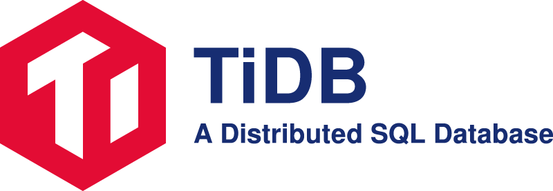
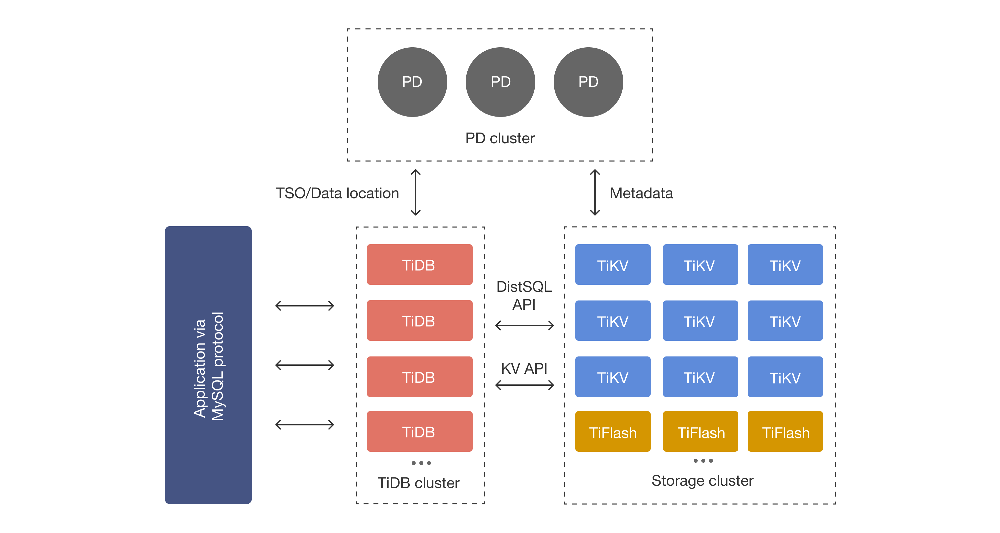

<a href='https://www.pingcap.com/?utm_source=github&utm_medium=tidb'>
</img>
</a>
  

  
  
[?style=for-the-badge>)](https://www.pingcap.com/?utm_source=github&utm_medium=tidb_readme)
[?style=for-the-badge>)](https://play.tidbcloud.com/?utm_source=github&utm_medium=tidb_readme)

---

    
    &nbsp;
    
    &nbsp;
    
    &nbsp;
    
    &nbsp;
    

 

 

## What is TiDB?

TiDB (/’taɪdiːbi:/, "Ti" stands for Titanium) is an open-source distributed SQL database that supports Hybrid Transactional and Analytical Processing (HTAP) workloads. It is MySQL compatible and features horizontal scalability, strong consistency, and high availability.

- [Key features](https://docs.pingcap.com/tidb/stable/overview#key-features)
- [Architecture](#architecture)
- [MySQL compatibility](https://docs.pingcap.com/tidb/stable/mysql-compatibility)

See what TiDB is capable of ONLINE at the [TiDB Playground](https://play.tidbcloud.com/?utm_source=github&utm_medium=tidb_readme).

For more details and the latest updates, see the [TiDB documentation](https://docs.pingcap.com/tidb/stable) and [release notes](https://docs.pingcap.com/tidb/dev/release-notes).

For future plans, see the [TiDB roadmap](roadmap.md).

## Quick start

### Start with TiDB Cloud

TiDB Cloud is the fully-managed service of TiDB, currently available on AWS and GCP.

Quickly check out TiDB Cloud with [a free trial](https://tidbcloud.com/free-trial).

See the [TiDB Cloud Quick Start Guide](https://docs.pingcap.com/tidbcloud/tidb-cloud-quickstart).

### Start with TiDB

See [TiDB Quick Start Guide](https://docs.pingcap.com/tidb/stable/quick-start-with-tidb).

### Start developing with TiDB

See [TiDB Developer Guide](https://docs.pingcap.com/tidb/stable/dev-guide-overview) and [TiDB Cloud Developer Guide](https://docs.pingcap.com/tidbcloud/dev-guide-overview).

## Community

You can join the following groups or channels to discuss or ask questions about TiDB, and to keep yourself informed of the latest TiDB updates:

- Seek help when you use TiDB
  - TiDB Forum: [English](https://ask.pingcap.com/), [Chinese](https://asktug.com)
  - [Discord](https://discord.gg/KVRZBR2DrG?utm_source=github)
  - Slack channels: [#everyone](https://slack.tidb.io/invite?team=tidb-community&channel=everyone&ref=pingcap-tidb) (English), [#tidb-japan](https://slack.tidb.io/invite?team=tidb-community&channel=tidb-japan&ref=github-tidb) (Japanese)
  - [Stack Overflow](https://stackoverflow.com/questions/tagged/tidb) (questions tagged with #tidb)
- Discuss TiDB's implementation and design
  - [TiDB Internals forum](https://internals.tidb.io/)
- Get the latest TiDB news or updates
    - Follow [@PingCAP](https://twitter.com/PingCAP) on Twitter
    - Read the PingCAP [English Blog](https://www.pingcap.com/blog/?from=en) or [Chinese Blog](https://cn.pingcap.com/blog/)

For support, please contact [PingCAP](http://bit.ly/contact_us_via_github).

## Contributing

The [community repository](https://github.com/pingcap/community) hosts all information about the TiDB community, including [how to contribute](https://github.com/pingcap/community/blob/master/contributors/README.md) to TiDB, how the TiDB community is governed, how [teams](https://github.com/pingcap/community/blob/master/teams/README.md) are organized.

Contributions are welcomed and greatly appreciated. You can get started with one of the [good first issues](https://github.com/pingcap/tidb/issues?q=is%3Aopen+is%3Aissue+label%3A%22good+first+issue%22) or [help wanted issues](https://github.com/pingcap/tidb/issues?q=is%3Aopen+is%3Aissue+label%3A%22help+wanted%22). For more details on typical contribution workflows, see [Contribute to TiDB](https://pingcap.github.io/tidb-dev-guide/contribute-to-tidb/introduction.html). For more contributing information about where to start, click the contributor icon below.

Every contributor is welcome to claim their contribution swag by filling in and submitting this [form](https://forms.pingcap.com/f/tidb-contribution-swag).

<a href="https://next.ossinsight.io/widgets/official/compose-activity-trends?repo_id=41986369" target="_blank" style="display: block" align="center">
  <picture>
    <source media="(prefers-color-scheme: dark)" srcset="https://next.ossinsight.io/widgets/official/compose-activity-trends/thumbnail.png?repo_id=41986369&image_size=auto&color_scheme=dark" width="822" height="auto">
    
  </picture>
</a>

## Case studies

- [Case studies in English](https://www.pingcap.com/customers/)
- [中文用户案例](https://cn.pingcap.com/case/)

## Architecture

## License

TiDB is under the Apache 2.0 license. See the [LICENSE](./LICENSE) file for details.

## Acknowledgments

- Thanks [cznic](https://github.com/cznic) for providing some great open source tools.
- Thanks [GolevelDB](https://github.com/syndtr/goleveldb), [BoltDB](https://github.com/boltdb/bolt), and [RocksDB](https://github.com/facebook/rocksdb) for their powerful storage engines.
