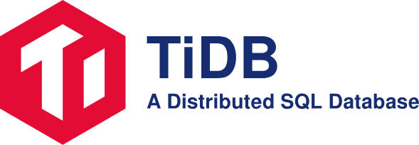
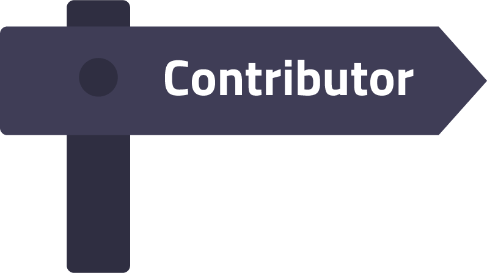
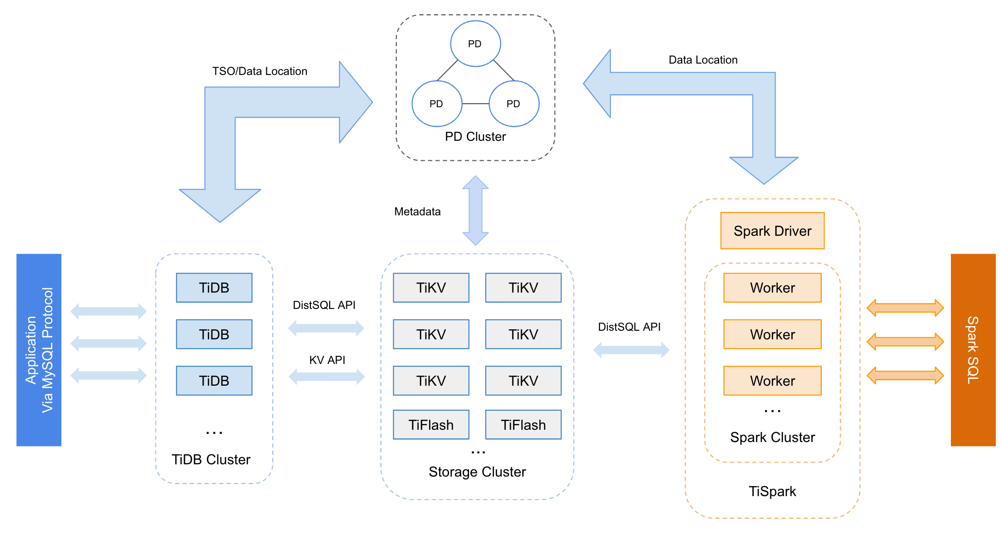

## What is TiDB?

TiDB ("Ti" stands for Titanium) is an open-source NewSQL database that supports Hybrid Transactional and Analytical Processing (HTAP) workloads. It is MySQL compatible and features horizontal scalability, strong consistency, and high availability.

- [Key features](https://docs.pingcap.com/tidb/stable/overview#key-features)
- [Architecture](#architecture)
- [MySQL Compatibility](https://docs.pingcap.com/tidb/stable/mysql-compatibility)

For more details and latest updates, see [TiDB docs](https://docs.pingcap.com/tidb/stable) and [release notes](https://docs.pingcap.com/tidb/dev/release-notes).

## Quick start

### Start with TiDB Cloud

TiDB Cloud is the fully-managed service of TiDB, currently available on AWS and GCP.

Quickly check out TiDB Cloud with [a free trial](https://tidbcloud.com/signup).

See [TiDB Cloud Quick Start Guide](https://docs.pingcap.com/tidbcloud/tidb-cloud-quickstart).

### Start with TiDB

See [TiDB Quick Start Guide](https://docs.pingcap.com/tidb/stable/quick-start-with-tidb).

### Start developing TiDB

See [Get Started](https://pingcap.github.io/tidb-dev-guide/get-started/introduction.html) chapter of [TiDB Dev Guide](https://pingcap.github.io/tidb-dev-guide/index.html).

## Community

You can join these groups and chats to discuss and ask TiDB related questions:

- [TiDB Internals Forum](https://internals.tidb.io/)
- [Slack Channel](https://slack.tidb.io/invite?team=tidb-community&channel=everyone&ref=pingcap-tidb)
- [TiDB User Group Forum (Chinese)](https://asktug.com)

In addition, you may enjoy following:

- [@PingCAP](https://twitter.com/PingCAP) on Twitter
- Question tagged [#tidb on StackOverflow](https://stackoverflow.com/questions/tagged/tidb)
- The PingCAP Team [English Blog](https://en.pingcap.com/blog) and [Chinese Blog](https://pingcap.com/blog-cn/)

For support, please contact [PingCAP](http://bit.ly/contact_us_via_github).

## Contributing

The [community repository](https://github.com/pingcap/community) hosts all information about the TiDB community, including how to contribute to TiDB, how TiDB community is governed, how special interest groups are organized, etc.

Contributions are welcomed and greatly appreciated. See [Contribution to TiDB](https://pingcap.github.io/tidb-dev-guide/contribute-to-tidb/introduction.html) for details on typical contribution workflows. For more contributing information, click on the contributor icon above.

## Adopters

View the current list of in-production TiDB adopters [here](https://docs.pingcap.com/tidb/stable/adopters).

## Case studies

- [English](https://pingcap.com/case-studies)
- [简体中文](https://pingcap.com/cases-cn/)

## Architecture

## License

TiDB is under the Apache 2.0 license. See the [LICENSE](./LICENSE) file for details.

## Acknowledgments

- Thanks [cznic](https://github.com/cznic) for providing some great open source tools.
- Thanks [GolevelDB](https://github.com/syndtr/goleveldb), [BoltDB](https://github.com/boltdb/bolt), and [RocksDB](https://github.com/facebook/rocksdb) for their powerful storage engines.
