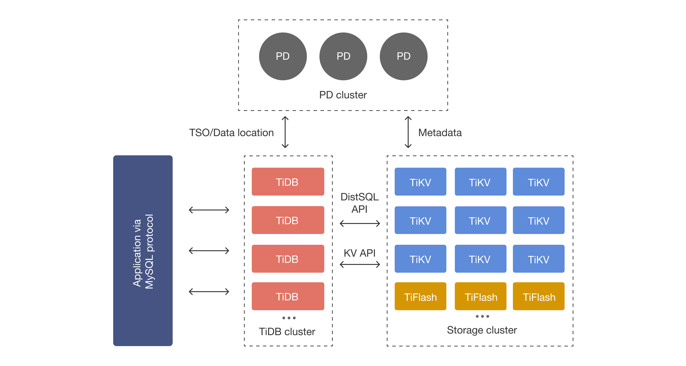

<div align="center">
<a href='https://www.pingcap.com/?utm_source=github&utm_medium=tidb'>
</img>
</a>

---

[](https://github.com/pingcap/tidb/blob/master/LICENSE)
[](https://golang.org/)

[](https://prow.tidb.net/?repo=pingcap%2Ftidb&type=postsubmit&job=merged-tidb-build)
[](https://goreportcard.com/report/github.com/pingcap/tidb)
[](https://github.com/pingcap/tidb/releases)
</div>

# TiDB

TiDB (/’taɪdiːbi:/, "Ti" stands for Titanium) is an open-source, cloud-native, distributed SQL database designed for high availability, horizontal and vertical scalability, strong consistency, and high performance.

- [Key Features](#key-features)
- [Rust SQL Runtime Validation (Draft)](#rust-sql-runtime-validation-draft)
- [Quick Start](#quick-start)
- [Need Help?](#need-help)
- [Architecture](#architecture)
- [Contributing](#contributing)
- [License](#license)
- [See Also](#see-also)
- [Acknowledgments](#acknowledgments)

## Rust SQL Runtime Validation (Draft)

This branch tracks the Rust SQL runtime parity effort that keeps PD, TiProxy,
and TiKV on nightly builds and treats Go TiDB as the planner and executor
oracle. The hard gate is plan parity first, then benchmark acceptance. Current
evidence is split accordingly:

| Evidence | Matched | Mismatched | Errors | Coverage |
| --- | ---: | ---: | ---: | --- |
| TPCC prepare plans | 1,037 | 0 | 0 | complete |
| TPCC run plans | 63 | 0 | 0 | complete |
| TPCC check plans | 12 | 0 | 0 | complete |
| Sysbench prepare plans | 32 | 0 | 0 | complete |
| Sysbench run plans | 13,952 | 0 | 0 | complete |

The plan gate and its SQL inventory are documented in
[`rust/TPCC_SYSBENCH_PLAN_PARITY_EXEC_PLAN.md`](rust/TPCC_SYSBENCH_PLAN_PARITY_EXEC_PLAN.md).
Reproduce the gate from the repository root with:

```bash
python3 -m py_compile rust/scripts/plan-parity.py \
  rust/scripts/generate-plan-manifest.py \
  rust/scripts/test-plan-parity.py
python3 rust/scripts/generate-plan-manifest.py --check
python3 rust/scripts/test-plan-parity.py
```

### TPCC status versus the frozen baseline

The only accepted throughput evidence currently retained for this branch was
captured before the latest rebase onto `hparser-integration`. It used one
nightly PD, one nightly TiProxy, three nightly TiKV stores, three Rust SQL
runtime instances, three replicas, 100 warehouses, and 16 clients. The frozen
three-store nightly TPCC baseline used 32 clients, so the comparison below is
directional only and is not a formal acceptance result.

| Metric | Current retained evidence | Frozen baseline | Relative to baseline |
| --- | ---: | ---: | ---: |
| Topology | 3 Rust SQL + 3 TiKV + PD + TiProxy | 3 Go TiDB + 3 TiKV + PD + TiProxy | same process layout |
| Clients | 16 | 32 | thread mismatch |
| Measurement tpmC | 5,766.0 | 41,011.5 | 0.141x |
| Delivery P99 | 335.5 ms | 121.6 ms | 2.759x higher |
| New Order P99 | 159.4 ms | 37.7 ms | 4.228x higher |
| Payment P99 | 58.7 ms | 30.4 ms | 1.931x higher |
| Order Status P99 | 65.0 ms | 19.9 ms | 3.266x higher |
| Stock Level P99 | 159.4 ms | 23.1 ms | 6.900x higher |

A longer 180-second stability rerun on the same pre-rebase binary sustained
5,886.6 tpmC with zero workload error lines in the retained log. This branch
therefore has execution-plan parity, but it does not yet have benchmark parity
with the frozen baseline.

### Sysbench status versus the frozen baseline

The frozen Sysbench baseline remains the nightly `3 TiDB + 3 TiKV` topology on
32 tables with 10,000,000 rows per table, a 300-second warm-up, and a
600-second measurement. The current branch has complete plan parity for both
prepare and run SQL, but it does not yet have a fresh post-rebase throughput
matrix to compare against these baseline numbers:

| Workload | Baseline TPS at 16 threads | Baseline P99 | Current branch status |
| --- | ---: | ---: | --- |
| `oltp_read_write.lua` | 764.82 | 28.67 ms | plan parity complete; throughput not rerun after rebase |
| `oltp_read_only.lua` | 1,205.83 | 18.61 ms | plan parity complete; throughput not rerun after rebase |
| `oltp_write_only.lua` | 2,394.87 | 10.84 ms | plan parity complete; throughput not rerun after rebase |
| `oltp_point_select.lua` | 22,532.20 | 0.94 ms | plan parity complete; throughput not rerun after rebase |
| `select_random_points.lua` | 9,353.30 | 3.13 ms | plan parity complete; throughput not rerun after rebase |
| `select_random_ranges.lua` | 10,095.54 | 2.30 ms | plan parity complete; throughput not rerun after rebase |
| `oltp_insert.lua` | 5,909.70 | 4.25 ms | plan parity complete; throughput not rerun after rebase |
| `oltp_update_index.lua` | 4,897.50 | 5.09 ms | plan parity complete; throughput not rerun after rebase |
| `oltp_update_non_index.lua` | 7,366.31 | 3.02 ms | plan parity complete; throughput not rerun after rebase |
| `bulk_insert.lua` | 105,491.26 | 0.00 ms | plan parity complete; throughput not rerun after rebase |

For the 32-table, 10-million-row prepare path, the frozen nightly baseline
completed in 3,296.03 seconds. The rebased Rust branch has plan parity for the
prepare SQL, but no fresh post-rebase prepare timing is checked in yet.

The latest rebased source head is `e8acf3a34732976a3d882cf42c34f8a19191e044`.
Its rebased tree has passed the plan gate and formatting checks, but the
throughput evidence above still belongs to the pre-rebase binary retained in
the benchmark archive. A fresh TPCC and Sysbench benchmark cycle is still
required before claiming performance alignment with the nightly baseline.

## Key Features

- **[Distributed Transactions](https://www.pingcap.com/blog/distributed-transactions-tidb?utm_source=github&utm_medium=tidb)**: TiDB uses a two-phase commit protocol to ensure ACID compliance, providing strong consistency. Transactions span multiple nodes, and TiDB's distributed nature ensures data correctness even in the presence of network partitions or node failures.

- **[Horizontal and Vertical Scalability](https://docs.pingcap.com/tidb/stable/scale-tidb-using-tiup?utm_source=github&utm_medium=tidb)**: TiDB can be scaled horizontally by adding more nodes or vertically by increasing resources of existing nodes, all without downtime. TiDB's architecture separates computing from storage, enabling you to adjust both independently as needed for flexibility and growth.

- **[High Availability](https://docs.pingcap.com/tidbcloud/high-availability-with-multi-az?utm_source=github&utm_medium=tidb)**: Built-in Raft consensus protocol ensures reliability and automated failover. Data is stored in multiple replicas, and transactions are committed only after writing to the majority of replicas, guaranteeing strong consistency and availability, even if some replicas fail. Geographic placement of replicas can be configured for different disaster tolerance levels.

- **[Hybrid Transactional/Analytical Processing (HTAP)](https://www.pingcap.com/blog/htap-demystified-defining-modern-data-architecture-tidb?utm_source=github&utm_medium=tidb)**: TiDB provides two storage engines: TiKV, a row-based storage engine, and TiFlash, a columnar storage engine. TiFlash uses the Multi-Raft Learner protocol to replicate data from TiKV in real time, ensuring consistent data between the TiKV row-based storage engine and the TiFlash columnar storage engine. The TiDB Server coordinates query execution across both TiKV and TiFlash to optimize performance.

- **[Cloud-Native](https://www.pingcap.com/cloud-native?utm_source=github&utm_medium=tidb)**: TiDB can be deployed in public clouds, on-premises, or natively in Kubernetes. [TiDB Operator](https://docs.pingcap.com/tidb-in-kubernetes/stable/tidb-operator-overview/?utm_source=github&utm_medium=tidb) helps manage TiDB on Kubernetes, automating cluster operations, while [TiDB Cloud](https://tidbcloud.com/?utm_source=github&utm_medium=tidb) provides a fully-managed service for easy and economical deployment, allowing users to set up clusters with just a few clicks.

- **[MySQL Compatibility](https://docs.pingcap.com/tidb/stable/mysql-compatibility?utm_source=github&utm_medium=tidb)**: TiDB is compatible with MySQL 8.0, allowing you to use familiar protocols, frameworks and tools. You can migrate applications to TiDB without changing any code, or with minimal modifications. Additionally, TiDB provides a suite of [data migration tools](https://docs.pingcap.com/tidb/stable/ecosystem-tool-user-guide?utm_source=github&utm_medium=tidb) to help easily migrate application data into TiDB.

- **[Open Source Commitment](https://www.pingcap.com/blog/open-source-is-in-our-dna-reaffirming-tidb-commitment?utm_source=github&utm_medium=tidb)**: Open source is at the core of TiDB's identity. All source code is available on GitHub under the Apache 2.0 license, including enterprise-grade features. TiDB is built with the belief that open source enables transparency, innovation, and collaboration. We actively encourage contributions from the community to help build a vibrant and inclusive ecosystem, reaffirming our commitment to open development and accessibility for everyone.

## Quick Start

1. Start a TiDB cluster.

    - **On local playground**. To start a local test cluster, refer to the [TiDB quick start guide](https://docs.pingcap.com/tidb/stable/quick-start-with-tidb#deploy-a-local-test-cluster?utm_source=github&utm_medium=tidb).

    - **On Kubernetes**. TiDB can be easily deployed in a self-managed Kubernetes environment or Kubernetes services on public clouds using TiDB Operator. For more details, refer to the [TiDB on Kubernetes quick start guide](https://docs.pingcap.com/tidb-in-kubernetes/stable/get-started?utm_source=github&utm_medium=tidb).

    - **Using TiDB Cloud (recommended)**. TiDB Cloud offers a fully managed version of TiDB with a free plan, no credit card required, so you can get a free cluster in seconds and start easily: [Sign up for TiDB Cloud](https://tidbcloud.com/free-trial?utm_source=github&utm_medium=tidb).

2. Learn about TiDB SQL: To explore the SQL capabilities of TiDB, refer to the [TiDB SQL documentation](https://docs.pingcap.com/tidb/stable/sql-statement-overview?utm_source=github&utm_medium=tidb).

3. Use a MySQL driver or an ORM to [Build an App with TiDB](https://docs.pingcap.com/tidbcloud/dev-guide-overview?utm_source=github&utm_medium=tidb).

4. Explore key features, such as [data migration](https://docs.pingcap.com/tidbcloud/tidb-cloud-migration-overview?utm_source=github&utm_medium=tidb), [changefeed](https://docs.pingcap.com/tidbcloud/changefeed-overview?utm_source=github&utm_medium=tidb), [vector search](https://docs.pingcap.com/tidbcloud/vector-search-overview?utm_source=github&utm_medium=tidb), [HTAP](https://docs.pingcap.com/tidbcloud/tidb-cloud-htap-quickstart?utm_source=github&utm_medium=tidb), [disaster recovery](https://docs.pingcap.com/tidb/stable/dr-solution-introduction?utm_source=github&utm_medium=tidb), etc.


## Need Help?

- You can connect with TiDB users, ask questions, find answers, and help others on our community platforms: [Discord](https://discord.gg/KVRZBR2DrG?utm_source=github), Slack ([English](https://slack.tidb.io/invite?team=tidb-community&channel=everyone&ref=pingcap-tidb), [Japanese](https://slack.tidb.io/invite?team=tidb-community&channel=tidb-japan&ref=github-tidb)), [Stack Overflow](https://stackoverflow.com/questions/tagged/tidb), [TiDB Chinese Forum](https://asktug.com), X [@PingCAP](https://twitter.com/PingCAP)

- For filing bugs, suggesting improvements, or requesting new features, use [Github Issues](https://github.com/pingcap/tidb/issues) or join discussions on [Github Discussions](https://github.com/orgs/pingcap/discussions).

- To troubleshoot TiDB, refer to [Troubleshooting documentation](https://docs.pingcap.com/tidb/stable/tidb-troubleshooting-map?utm_source=github&utm_medium=tidb).

## Architecture



Learn more details about TiDB architecture in our [Docs](https://docs.pingcap.com/tidb/stable/tidb-architecture?utm_source=github&utm_medium=tidb).

## Contributing

TiDB is built on a commitment to open source, and we welcome contributions from everyone. Whether you are interested in improving documentation, fixing bugs, or developing new features, we invite you to shape the future of TiDB.

- See our [Contributor Guide](https://github.com/pingcap/community/blob/master/contributors/README.md#how-to-contribute) and [TiDB Development Guide](https://pingcap.github.io/tidb-dev-guide/index.html) to get started.

- If you're looking for issues to work on, try looking at the [good first issues](https://github.com/pingcap/tidb/issues?q=is%3Aopen+is%3Aissue+label%3A%22good+first+issue%22) or [help wanted issues](https://github.com/pingcap/tidb/issues?q=is%3Aopen+is%3Aissue+label%3A%22help+wanted%22).

- The [contribution map](https://github.com/pingcap/tidb-map/blob/master/maps/contribution-map.md#a-map-that-guides-what-and-how-contributors-can-contribute) lists everything you can contribute.

- The [community repository](https://github.com/pingcap/community) contains everything else you need.

- Don't forget to claim your contribution swag by filling in and submitting this [form](https://forms.pingcap.com/f/tidb-contribution-swag).


<a href="https://next.ossinsight.io/widgets/official/compose-recent-active-contributors?repo_id=41986369&limit=30" target="_blank" style="display: block" align="center">
  <picture>
    <source media="(prefers-color-scheme: dark)" srcset="https://next.ossinsight.io/widgets/official/compose-recent-active-contributors/thumbnail.png?repo_id=41986369&limit=30&image_size=auto&color_scheme=dark" width="655" height="auto">
    
  </picture>
</a>

## License

TiDB is under the Apache 2.0 license. See the [LICENSE](./LICENSE) file for details.

## See Also

- [TiDB Online Playground](https://play.tidbcloud.com/?utm_source=github&utm_medium=tidb_readme)
- TiDB Case Studies: [TiDB Customers](https://www.pingcap.com/customers/?utm_source=github&utm_medium=tidb), [TiDB 事例記事](https://pingcap.co.jp/case-study/?utm_source=github&utm_medium=tidb), [TiDB 中文用户案例](https://cn.pingcap.com/case/?utm_source=github&utm_medium=tidb)
- [TiDB User Documentation](https://docs.pingcap.com/tidb/stable?utm_source=github&utm_medium=tidb)
- [TiDB Design Docs](/docs/design)
- [TiDB Release Notes](https://docs.pingcap.com/tidb/dev/release-notes?utm_source=github&utm_medium=tidb)
- [TiDB Blog](https://www.pingcap.com/blog/?utm_source=github&utm_medium=tidb)
- [TiDB Roadmap](roadmap.md)

## Acknowledgments

- Thanks [cznic](https://github.com/cznic) for providing some great open source tools.
- Thanks [GolevelDB](https://github.com/syndtr/goleveldb), [BoltDB](https://github.com/boltdb/bolt), and [RocksDB](https://github.com/facebook/rocksdb) for their powerful storage engines.
