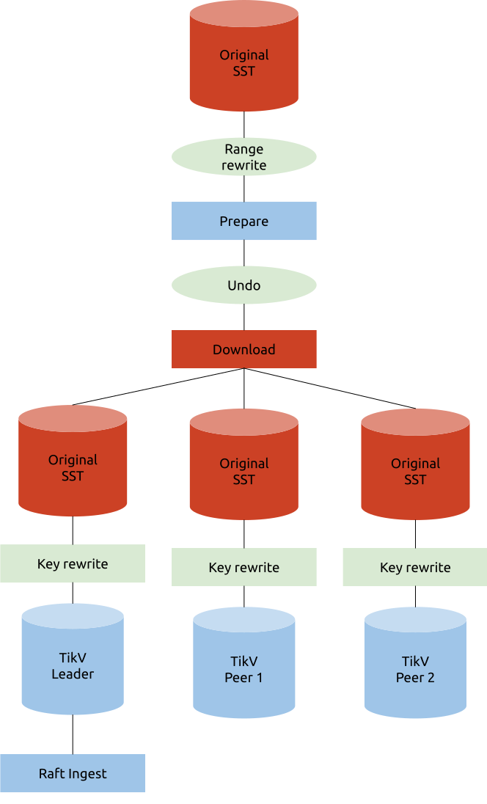

Last updated: 2019-09-12

## BR 关于 Key rewrite 的讨论

### Key rewirte 结构

Key Rewrite 的目的有二：

1. 为 BR 提供修改 Table ID 的功能，以支持恢复到 Schema Version 不同的集群
2. 为 Lightning 提供添加前缀的功能，省略 Lightning <-> Importer 之间重复的数据传输

一个 BR 的 SST 可能包含多个 Tables，所以要支持多条 Rewrite Rules 同时生效。SST 可能来自非 TiDB 系统，所以 Importer 不应该有 Key 编码格式的假设（不一定是 t«tid»_ 开头）。

给 Importer / TiKV 参考的 Key Rewrite 数据结构建议如下：

```protobuf
message RewriteRule {
	bytes old_prefix = 1;  // this can be empty for universal prefix insertion!
	bytes new_prefix = 2;  // these are _not_ just an integer!
}

message RestoreRequest {
	...
	repeated RewriteRule rewrite_rules = N;
	...
}
```

正向替代一个 Key：

```rust
fn rewrite_key(rules: &[RewriteRule], key: &[u8]) -> Cow<[u8]> {
    for rule in rules {
        if key.starts_with(rule.old_prefix) {
            return Cow::Owned(rule.new_prefix + key[rule.old_prefix.len()..])
        }
    }
    Cow::Borrowed(key)
}
```

反向还原一个 Key：

```rust
fn undo_rewrite_key(rules: &[RewriteRule], key: &[u8]) -> Cow<[u8]> {
    for rule in rules {
        if key.starts_with(rule.new_prefix) {
            return Cow::Owned(rule.old_prefix + key[rule.new_prefix.len()..])
        }
    }
    Cow::Borrowed(key)
}
```

### Key Rewrite 对现在导入流程的影响

现在 BR 的导入流程如下：
1. 把 **KV 对**写入到 RocksDB 实例（“**SST File**”）来排序
2. (Prepare) 在 client 侧遍历此 SST file，
   1. (Pre-split) 找到所有 *Range* 的 EndKey 和 rewrite rule 的 NewPrefix，依照这些 Key 执行 BatchSplit，如下。
   2. (GetRegion) 执行 *PD* 的 *get_region_info* 取得这些 Key 对应的 *Region* 信息。
   3. (Split) 把这个 *Region* 从这些 Key 处使用 *batch_split_region* 分裂若干部分。如果出 EpochNotMatch 或 NotLeader 的错会由 Split 重试若干次（这里是因为 batch 的缘故，如果直接交给 GetRegion 重试，我们必须得要重试整个 batch），如果还是不成功，则会交由 GetRegion 开始重试。
   4. (Scatter) 使用 *scatter_region* 将分裂后 *Range* 对应的 *Region* 打散。
3. (Import) 按 Prepare 步获得的 *Ranges* 并行导入
   1. (GetRegion) 重新取得这个 *Range* 对应的 *Region*。如果现在横跨了多个 Regions，会按 *PD* 返回的信息分割 *Range* 之后重试。
   2. (Encode) 读取 **Engine file** 在这个 **Range** 的 **KV pairs**，然后编码成 *SST* 格式。
   3. (Upload) 把 *SST* 分别上传到 Peers (Leader + Followers)。
   4. (Ingest) 对 Leader (或第一个 Follower) 发送 ingest_sst 命令。

> 因为 markdown 的缘故，我们在这里用**粗体**来表示 Rewrite 之前的，用*斜体*来表示 Rewrite 之后的。

当执行了 Key Rewrite，上下游的 Key Range 就会不一致。我们使用**红色**来标示使用 Rewrite 前的 Keys 的对象、用*蓝色*标示 Rewrite 后的对象。其中不变的是：

1. 源数据必然是 Rewrite 前的
2. PD 和 Ingest 后的结果必然是 Rewrite 后的。

我们看到 Rewrite 前后的 Keys 在各步骤交叉被使用。这里的问题是怎么选一个合适的位置去 Rewrite Keys 来为 BR 提取最大性能。

### 解决方案：Key rewrite before ingest in every replica



每个 Peer 独自在 ingest 之前进行 Key Rewrite。
* 源数据读盘：(R+1)**N** (Split 前 in Importer、Key rewrite 前 in TiKV)
* Importer 写盘：0
* Importer 读盘：0
* TiKV 写盘：R**N** (Key rewrite 后暂存记录新数据到 SST 文件 (?))
* 网络传输：0
* Key Rewrite 次数：R+1 (Pre-split + Raft-Ingest 前)
