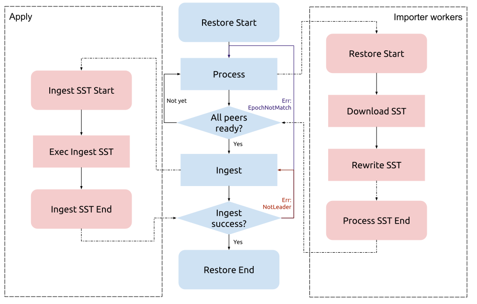

Last updated: 2019-11-05

## TiKV 整合 import SST 的设计

### 目标

通过该设计将 tikv-importer 的部分功能下推到在 TiKV 中，在 TiKV 运行 IO/CPU 密集型的导入/恢复任务，最大化地利用集群资源。

### 背景

目前导入/恢复任务都有 tikv-importer 的参与。

针对 BR 来说，存在以下问题：存在多余步骤，增加额外的复杂度部署不方便，增加了额外的运维负担。

我们经过讨论，决定将 tikv-importer 的部分功能放到 TiKV 中。

tikv-importer 的部分功能指 key rewrite，在恢复时将备份出来的 sst 的 key 重写一遍。

### 具体设计

目前的想法是尽量复用现有的代码，将 key rewrite 放到 TiKV 的 sst-importer 工作线程中执行。此外我们还会将 tikv-importer 上传 sst 的功能变为 TiKV 主动下载 sst。流程如下：



上图，红色部分为 TiKV，蓝色部分为外部客户端，整个恢复流程由客户端驱动。

大体过程如下：

1. Process
   1. 客户端向 region peers 所处的 TiKV 发起 Process 请求
   2. TiKV 中的 importer worker 根据请求下载 SST，并 Rewrite SST。
2. Ingest
   1. 当客户端发现所有的 TiKV 准备好后，向 region leader 发起 ingest 请求
   2. Leader 通过 Raft 复制给 follower，各个 TiKV 执行 ingest sst，导入结束。

### 错误处理

上述流程和现有的导入流程基本相同，不同的点在于多了 Download SST 和 Rewrite SST。由于这两步不会对集群数据进行修改，所以当它们发生错误时，我们只要让客户端重试即可。

真正会对集群数据产生修改的地方是 Ingest 部分，目前它的错误处理如下：

1. 可恢复错误：
   1. NotLeader，重试
   2. IngestEpochNotMatch，重试
   3. Process
2. 不可恢复错误：
   1. Ingest 执行失败，Panic

### Rewrite SST

> 以下的部分摘自于一次[讨论](./2019-09-09-BR-key-rewrite-disscussion.md)，因此其中的信息仅仅用做理解设计上的参考。

Key Rewrite 的目的有二：

1. 为 BR 提供修改 Table ID 的功能，以支持恢复到 Schema Version 不同的集群
2. 为 Lightning 提供添加前缀的功能，省略 Lightning <-> Importer 之间重复的数据传输

一个 BR 的 SST 可能包含多个 Tables，所以要支持多条 Rewrite Rules 同时生效。SST 可能来自非 TiDB 系统，所以 Importer 不应该有 Key 编码格式的假设（不一定是 t«tid»_ 开头）。

给 Importer / TiKV 参考的 Key Rewrite 数据结构建议如下：

```protobuf
message RewriteRule {
	bytes old_prefix = 1;  // this can be empty for universal prefix insertion!
	bytes new_prefix = 2;  // these are _not_ just an integer!
}

message RestoreRequest {
	...
	repeated RewriteRule rewrite_rules = N;
	...
}
```

正向替代一个 Key：
```rust
fn rewrite_key(rules: &[RewriteRule], key: &[u8]) -> Cow<[u8]> {
    for rule in rules {
        if key.starts_with(rule.old_prefix) {
            return Cow::Owned(rule.new_prefix + key[rule.old_prefix.len()..])
        }
    }
    Cow::Borrowed(key)
}
```

反向还原一个 Key：
```rust
fn undo_rewrite_key(rules: &[RewriteRule], key: &[u8]) -> Cow<[u8]> {
    for rule in rules {
        if key.starts_with(rule.new_prefix) {
            return Cow::Owned(rule.old_prefix + key[rule.new_prefix.len()..])
        }
    }
    Cow::Borrowed(key)
}
```

### Download SST
TiKV 下载的 SST 来自 ExternalStorage，针对不同的使用场景，会使用不同的 ExternalStorage。

对于 BR， ExternalStorage 就是 backup 期间使用的那个。

### 部署

该方案对于 BR 来说，组件上省去了 tikv-importer。

### 兼容性

考虑到现在的 lightning + importer 只用在离线导入中，所以风险可控，兼容性问题不大。