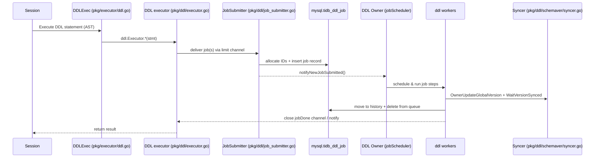

# DDL Execution: Read-First Index

TiDB DDL is **job-based** and **owner-driven**: a SQL DDL statement is converted into a persistent DDL *job*, then the **DDL owner** schedules and runs the job on workers, gradually changing schema states and waiting for schema version synchronization across TiDB nodes.

The most common mistake is to implement “DDL behavior” directly in `pkg/executor/` (SQL executor layer). That usually bypasses:

- Job persistence / owner failover (resumability).
- Schema state machine (`delete only` → `write only` → `reorg` → `public`).
- Schema version + diff update, and cluster-wide schema sync.
- MDL / lease based safety mechanisms.

This doc set is meant to be **the first thing to read** before touching DDL-related code.

## Caveat (debugging and drift)

- Debugging: You may use these docs as a starting point, but you **MUST** validate conclusions against code/tests. Treat unverified statements as hypotheses (avoid hallucination/outdated assumptions).
- Drift: If implementation and `docs/ddl/*` diverge during design/development, you **MUST** update the docs to match reality and call it out in the PR/issue.

## Agent preflight (questions)

Before touching `pkg/ddl/`, answer these explicitly (write them down in the PR/issue if possible):

1. Is it **job-based** (persist/resume/failover) or a **metadata-only fast path**?
2. Does it require **schema state transitions** (and which ones), or can it stay `public` throughout?
3. Does it require a **reorg/backfill scan** (read/write workload), and what is the checkpoint/persistence point?
4. What are the **cancel/rollback** semantics? Which step(s) are reversible, and which need delete-range GC?
5. How does it affect **schema version + schema diff** and follower schema sync?
6. What are the **system tables** / durable metadata involved (`mysql.tidb_ddl_job`, `mysql.tidb_ddl_reorg`, ...)? Which fields must be backward compatible?
7. What is the **expected online behavior** (MDL / blocking, write conflicts, phase boundaries)?
8. What is the **minimal regression test** (unit/integration), and which failpoints can make it deterministic?

## Index (by task)

- Understand end-to-end call chain: `docs/ddl/01-execution-flow.md`
- Job state machine / schema state machine / schema sync: `docs/ddl/02-job-lifecycle.md`
- Any reorg/backfill (ingest, checkpoint, distributed backfill): `docs/ddl/03-reorg-backfill.md`
- Add-index behavior (fast reorg, ingest, backfill-merge): `docs/ddl/06-add-index.md`
- Modify-column behavior (reorg types, null/not-null, type change): `docs/ddl/07-modify-column.md`
- Partition DDL (add/drop/truncate/reorganize/exchange): `docs/ddl/08-partition-ddl.md`
- Where-to-change + test patterns: `docs/ddl/04-dev-checklist.md`
- “Where is this implemented?” file map: `docs/ddl/05-file-map.md`

## Operation index (jump table)

### Column DDL

- Modify column / change column: `model.ActionModifyColumn` → `docs/ddl/07-modify-column.md`

### Index DDL

- Add index / add primary key: `model.ActionAddIndex`, `model.ActionAddPrimaryKey` → `docs/ddl/06-add-index.md`

### Partition DDL

- Add/drop/truncate partition: `model.ActionAddTablePartition`, `model.ActionDropTablePartition`, `model.ActionTruncateTablePartition` → `docs/ddl/08-partition-ddl.md`
- Reorganize / exchange partition: `model.ActionReorganizePartition`, `model.ActionExchangeTablePartition` → `docs/ddl/08-partition-ddl.md`

## Mental model (60 seconds)

1. `pkg/executor/ddl.go` (`DDLExec`) receives a DDL AST node and calls into the DDL module.
2. `pkg/ddl/executor.go` converts the statement to a `model.Job` (or multiple jobs), then **submits** it via `JobSubmitter`.
3. `JobSubmitter` allocates IDs, writes the job into `mysql.tidb_ddl_job`, and notifies the owner-side scheduler.
4. Only the **DDL owner** runs `jobScheduler`, which dispatches jobs into worker pools.
5. Workers run the job **step-by-step** (meta changes + schema state transitions), update global schema version, then wait for followers to sync.
6. When done, the job is moved to history; the submitting session is unblocked and returns success/failure.

## Execution flow diagram

## Code map (where to look first)

### Front-end (SQL executor layer)

- `pkg/executor/ddl.go`: `type DDLExec`, `(*DDLExec).Next` dispatches AST → DDL module; handles transaction boundary and converts schema-outdated errors.

### DDL module (job-based execution)

- `pkg/ddl/ddl.go`: `NewDDL` wires everything; `(*ddl).Start` starts submit loop and campaigns owner.
- `pkg/ddl/executor.go`: `type Executor` (called by SQL layer); converts statements → jobs; `DoDDLJobWrapper` waits for job completion.
- `pkg/ddl/job_submitter.go`: `type JobSubmitter` batches submission, allocates IDs, inserts into job table, and notifies scheduler.
- `pkg/ddl/job_scheduler.go`: owner-only scheduler; `ownerListener.OnBecomeOwner` starts `jobScheduler` and worker pools.
- `pkg/ddl/job_worker.go`: worker logic; `transitOneJobStep` / `runOneJobStep` drive state transitions and meta updates.
- `pkg/ddl/schema_version.go` + `pkg/ddl/job_worker.go:updateGlobalVersionAndWaitSynced`: global schema version update + `WaitVersionSynced`.
- `pkg/ddl/schemaver/syncer.go`: `type Syncer` implements schema version synchronization (etcd-based).
- `pkg/ddl/systable/manager.go`: storage access for job/MDL related system tables.

### Cluster integration

- `pkg/domain/domain.go`: creates DDL via `ddl.NewDDL(...)`; initializes infosync + schema syncer, and orchestrates startup order.

## Reading order

1. `docs/ddl/01-execution-flow.md` — end-to-end call chain and responsibilities.
2. `docs/ddl/02-job-lifecycle.md` — job/version/state machines, schema sync, owner/failover.
3. `docs/ddl/03-reorg-backfill.md` — reorg/backfill and distributed backfill overview.
4. `docs/ddl/06-add-index.md` — add-index deep dive (fast reorg, ingest, backfill-merge).
5. `docs/ddl/07-modify-column.md` — modify-column deep dive (reorg types, state machine).
6. `docs/ddl/08-partition-ddl.md` — partition DDL deep dive (state machine, reorg, GC).
7. `docs/ddl/04-dev-checklist.md` — where-to-change, testing, and common pitfalls.
8. `docs/ddl/05-file-map.md` — quick “where is this implemented?” map inside `pkg/ddl/`.

## Related design docs (deep dives)

- Distributed DDL reorg: `docs/design/2022-09-19-distributed-ddl-reorg.md`
- Add index acceleration / ingest: `docs/design/2022-06-07-adding-index-acceleration.md`
- Multi-schema change: `docs/design/2022-04-15-multi-schema-change.md`
- Pause/Resume DDL: `docs/design/2023-04-15-ddl-pause-resume.md`
- Pause user DDL while upgrading: `docs/design/2023-04-11-pause-user-ddl-when-upgrading.md`
- Dist task framework: `docs/design/2023-04-11-dist-task.md`
