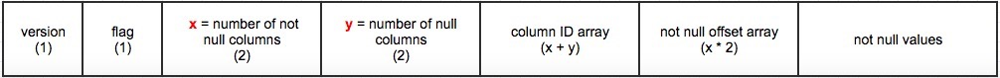

# Proposal: A new storage row format for efficient decoding

- Author(s):     Yuxing ZHOU
- Last updated:  2018-07-19

## Abstract

This proposal proposes a new row format for efficient decoding.

## Background

In the current row format, each column is encoded with the column ID followed by the column value and multiple columns are concatenated together. In order to find a specific column in the row, we need to start from the beginning and decode each column ID and the length of each value until we find the matched column. This decoding method is inefficient especially when the number of columns in a row is not small and the complexity is O(N).

## Proposal

The new format is defined as follows:

* 1 byte codec version

    Its value starts from 128, so we can upgrade TiDB in a compatible way.

* 1 byte row type flag containing the following attribute:

	- 1 bit IsBig

        A row is big if the max column ID is greater than 255 or the total size of the values is greater than 65535. We can add more types in this byte later if needed, for example storing 2 bytes column ID.

* 2-byte number of not-null columns

* 2-byte number of null columns

    We can store 65536 columns in a row and this number is much larger than the upper limit in TiDB.

* not-null column ID array

    If the row is big, each column ID takes 4 bytes, otherwise the column ID takes 1 byte. The IDs array is sorted in an ascending order.

* null column ID array

    This array stores the IDs of all the columns with value `null`. The IDs array is sorted in an ascending order.

* offset array

     Specifies the end offset of each not-null column value, relative to the start of the first column value. If the row is big, one offset takes 4 bytes, otherwise it takes 2 bytes.

* column values

    For integer values, we store {byte, uint16, uint32, uint64} instead of varint for fast decoding. The type can be inferred by the column value size.
The string value is stored as it is. Other types are encoded in the old way without the first type flag byte.

To find a column in a row, we can perform a binary search on the not-null column ID array. If it’s not found, then we perform a binary search on the null column ID array.
The complexity is O(logN).

If the column ID can not be found in the row, we use the column default value in the schema.

## Rationale

The new format has better read performance but we need to consider the space efficiency.

In most of the cases, column IDs are less than 255 and the total length of the values is less than 64KB, so we only compare the small row type with the old format.

In the current row format, a string type column takes 1 (varint flag) + 1(colID) + 1 (bytes flag) + 1(varint len) + len(val). In the new row format, a string type column takes 1(colID) + 2(offset) + len(val), one byte less compared with the old row format. So the string type is more space efficient and varint is more space efficient.

But for the decoding performance, I choose the dynamic size of 1, 2, 4, 8 to store the integers. The space efficiency depends on the value of the integer. It is more space efficient in most of the cases and it’s less space efficient in rare cases, for example if the value is slightly greater than MaxInt32.

The null column IDs array is separated from not-null column IDs, so we don’t need to store offsets to null columns. It saves a lot of space when most of the columns are `null`.

And we can not omit the null column ID because if the column ID is not found in the row, we will use the default value in the schema which may not be `null`.

## Compatibility

We can make the new row format compatible with the old row format. Because every row starts with the same varint flag byte for the column ID, with the first byte codec version that is different from the varint flag, we can support both the new row and the old row at the same time. Later in compaction process, we can rewrite the old row to the new row. After full compaction, all rows will be stored in the new format.

In order to maintain the compatibility in the old cluster, we need 2 phase upgrade. The first upgrade makes the TiDB cluster able to read the new row format, but TiDB will not write data in the new row format. When all components in the cluster are upgraded in the first phase, we can do a second upgrade and after that, TiDB will write data in the new row format.

TiDB tools projects need to be upgraded to support the new row format.

## Implementation

I implemented the new row format benchmark that decodes an encoded row into a Chunk. As a result, the performance of decoding one integer column from a row is improved up to 77x when there are 255 columns in a row. When a row has only two columns, the performance of decoding the two columns is improved 2x.
The prototype decodes the row into a chunk instead of Datum because it is more efficient, but the chunk execution is not implemented in TiKV yet, so we can do it in mockTiKV first. When chunk execution is implemented in TiKV, we can then implement it in TiKV. An alternative approach is to change the row format before chunk execution in TiKV, then some of the work will be discarded when chunk execution is implemented.

