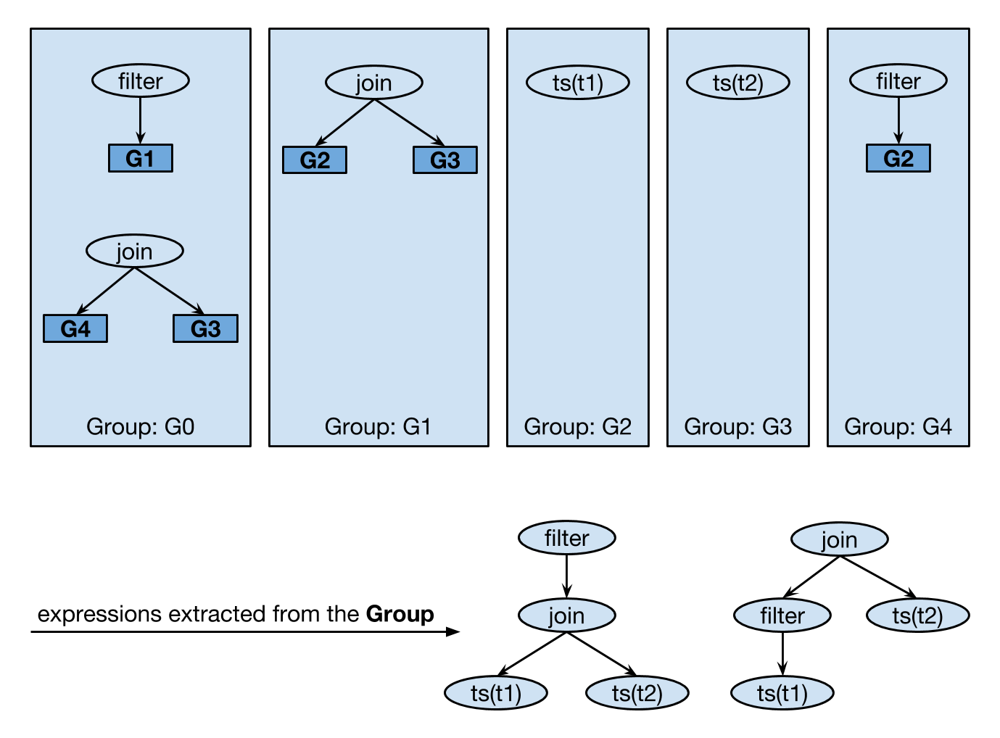

# Proposal: A SQL Planner based on the Volcano/Cascades model

- Author(s):     [zz-jason](https://github.com/zz-jason)
- Last updated:  2018-08-29
- Discussion at:

## Abstract

The proposed new planner enlarges the plan search space, takes transformation
rules into the cost model, and finds the best execution plan among all the
equivalent expressions. There might be some performance regression on the
QPS/TPS in some OLTP scenarios because the optimization phase takes a longer
time than before.

## Background

At present, the optimization procedure of the planner is separated into two
phases. The first phase, namely the "Logical Optimization", only applies the
rules which are always beneficial. The second phase, which is called the
"Physical Optimization", takes the cost of different physical operator
implementations into consideration and chooses the best physical plan with the
lowest cost.

However, there are some other transformations which are not always beneficial
for all the scenarios. For example, aggregate push down, aggregate pull up, in
subquery unfold, etc.

Another drawback of the current planner is the poor extensibility. It's hard to
add a new rule even if it's beneficial for all the scenarios, because we have to
consider the order of different optimization rules carefully.

The physical optimization for the operators on the storage layer also suffers
from the poor extensibility. In the present planner, we use "root" and "cop"
tasks to distinguish the operators executed on TiDB and the storage layer, which
is TiKV at present. "cop" task is highly tied with the "root" task. It's very
hard to push-down another operator to TiKV or support another storage engine in
the future.

## Glossary

- **Expression**

  In this proposal, **expression** is used to specify a logical plan. Expression
  can be expressed to a tree-like structure and the child of an expression is
  also an expression.

- **Expression Group** (or **Group**)

  Expression group is used to store all the logically equivalent expressions.
  It's a set of **Group Expressions**.

- **Group Expression**

  Group expression is used to store all the logically equivalent expressions
  which have the same root operator. Different from a normal expression, the
  children of a group expression are expression **Groups**, not expressions.
  Another property of group expression is that the child group references will
  never be changed once the group expression is created.

  With the concept of **Group** and **Group Expression**, all the logically
  equivalent expressions can be stored in a root Group.

  

- **Transformation Rule**

  The transformation rule is used to transform a logical plan to another
  equivalent logical plan. It is used to explore all the logically equivalent
  query plans belonging to an expression group.

- **Implementation Rule**

  The implementation rule is used to implement a logical expression operator to
  a physical operator. For example, with implementation rules, a logical `Join`
  operator can be implemented to `HashJoin`/`MergeJoin`/`IndexJoin`, etc.

- **Enforcing Rule**

  Rule to construct an enforcer to satisfy the required physical properties.

- **Pattern**

  Pattern describes a piece of a logical expression. It's a tree-like structure
  and each node in the tree represents a logical expression operator in the
  logical expression. The node, or the logical expression operator, is called
  **Operand**. Different from expression, only the type of the expression node
  is concerned in the pattern.

- **Operand**

  As discussed above, the operand represents a logical expression operator. It
  can be some concrete operator types, for example, `Join`/`Project`/`Filter`.

  The expression node holds the full information about an expression operator,
  while the pattern node only holds the operator type information.

- **Logical Property**

  Logical properties can be derived from the logical algebra expression, for
  example: the schema of the expression, the constraints and statistics of the
  columns in the schema, etc. All the group expressions in the same group share
  the same logical property.

- **Physical Property**

  Physical properties depend on the implementation algorithms, or physical
  operators. Typical physical properties include **order** and **distribution**.

## Proposal

The new planner is composed of 2 phases: exploration and implementation. The
basic idea comes from the volcano optimizer generator and the optimizations
mentioned in the cascades project.

### Optimization phase: exploration

A typical lifecycle of a SQL Query before this phase is:

```
SQL Query -> AST -> Logical Plan -> Expression Group
```

After building the expression group from the input logical plan, the exploration
optimization phase begins. The target of this phase is to explore all the
logically equivalent expressions by:

1. Exploring all the equivalent group expressions of each group.
2. Exploring all the potential groups.

The group and group expression can be defined as:

```go
type StringSet = map[string]struct{}

type Group struct {
	equivalents  []*GroupExpr
	fingerprints StringSet
	explored     bool
    ...
}

type GroupExpr struct {
	exprNode LogicalPlan
	children []*Group
	explored bool
    ...
}
```

The difficult and complex part is how we continually apply some push-down and
pull-up rules. A simple idea is to traverse the groups and group expressions
twice: a top-down traverse and a bottom-up traverse. The push-down rules are
applied during the top-down traverse and the pull-up rules are applied in the
bottom-up traverse.

But there might be some scenarios where a certain push-down rule can also be
triggered after the second bottom-up traverse. In order to explore all
optimization possibilities, the traverse on the groups should not be stopped
until there is no rule can be matched:

Some limitations can be added to reduce the total exploration time or ensure
that the expression exploration is convergent. For example, certain rules can
not be applied multiply times on the same group or group expression or limit the
number of total transformation moves in a group or group expression.

```go
func OnPhaseExploration(rootGroup *Group) error {
	for !rootGroup.explored {
		err := exploreGroup(rootGroup)
	}
}
```

The `explored` field in the `Group` and `GroupExpr` is used to avoid unnecessary
traverse on the sub-tree of the groups and the group expressions. If a new group
expression is inserted into a group, the new group expression and the group it
belongs to will be marked as un-explored, to enable further exploration on the
new group expression and all the antecedent groups. The pseudo code to explore
an expression group is:

```go
func exploreGroup(g *Group) {
	if g.explored { return }

	g.explored = true
	for _, curExpr := range g.equivalents {
		if curExpr.explored { continue }

		// Explore child groups firstly.
		curExpr.explored = true
		for _, childGroup := range curExpr.children {
			exploreGroup(childGroup)
			curExpr.explored = curExpr.explored && childGroup.explored
		}

		eraseCur := findMoreEquiv(curExpr, g)
		if eraseCur {
			curGroup.erase(cur)
		} else {
			g.explored = g.explored && curExpr.explored
		}
	}
}
```

The child of `GroupExpr` is `Group`. There are many candidate child expressions
for a group expression. All the possible expressions have to be enumerated to
check whether a group expression matches a transformation rule and apply the
rule on that expression once matched.

To conveniently enumerate all the equivalent expressions for a group expression,
the `ExprIter` is introduced:

```go
// ExprIter enumerates all the equivalent expressions in the group according to
// the expression pattern.
type ExprIter struct {
	// The group and ordinal field solely identify a group expression.
	group   *Group
	ordinal int

	// operand is the node of the pattern tree. The operand type of the group
	// expression must be matched with it, otherwise the group expression is
	// ignored during the iteration.
	operand int

	// children is used to iterate the child expressions.
	children *ExprIter
}
```

To simplify and reduce the work of enumeration, we only consider the pattern
that matches a rule. The pattern is a tree-like data structure which identifies
the operator type for every node in the expression tree:

```go
type Pattern struct {
	operand  int
	children []*Pattern
}
```

The `ExprIter` should be created with a `GroupExpr` and the `Pattern` of a rule:

```go
func NewExprIter(g *GroupExpr, p *Pattern) *ExprIter
```

With the help of the above components, the pseudo code of the function
`findMoreEquiv` is:

```go
// Find and apply the matched transformation rules.
func findMoreEquiv(cur *GroupExpr, curGroup *Group) (eraseCur bool) {
	for _, rule := range GetTransformationRules(cur.exprNode) {
		// Create a binding of the current group expression and the pattern of
		// the transformation rule to enumerate all the possible expressions.
		exprIter := NewExprIter(cur, rule.getPattern())
		for exprIter.Next() {
			if !rule.match(exprIter) {
				continue
			}

			newExpr, erase, err := rule.onTransform(exprIter)
			eraseCur = eraseCur || erase
			if !curGroup.insert(newExpr) {
				continue
			}

			// If the new group expression is successfully inserted into the
			// current group, we mark the group expression and the group as
			// unexplored to enable the exploration on the new group expression
			// and all the antecedent groups.
			newExpr.explored = false
			curGroup.explored = false
		}
	}
	return eraseCur
}
```

According to the former discussion, the interface of the transformation rule can
be defined as:

```go
type transformation interface {
	getpattern() *Pattern
	match(expr *ExprIter) (matched bool, err error)
	onTransform(old *ExprIter) (new *GroupExpr, eraseOld bool, err error)
}
```

At the very beginning, there is only one group expression in a `Group`. After
applying some transformation rules on certain expressions of the `Group`, all
the equivalent expressions are found and stored in the `Group`. This procedure
can be regarded as searching for a weak connected component in a directed graph,
where nodes are expressions and directed edges are the transformation rules.

### Optimization phase: implementation

The target of this phase is searching the best physical plan for a `Group` which
satisfies the physical property that the parent operator requires.

In this phase, we need to enumerate all the applicable implementation rules for
each expression in each group under the required physical property. A memo
structure is used for a group to reduce the repeated search on the same required
physical property. The search engine used in the new planner can be expressed to
the pseudo code:

```go
func implGroup(g *Group, reqPhysProp *PhysicalProperty, costLimit float64) (groupImpl PhysicalPlan) {
	if g.implemented(reqPhysProp) {
		return g.getImplementation(reqPhysProp)
	}

	// Handle implementation rules for each equivalent expression.
    ...

	// Handle enforcing rules for the required physical property.
    ...

	g.insertImpl(reqPhysProp, groupImpl)
	return groupImpl
}
```

In order to find the best physical implementation for the group, we need to
enumerate all the possible implementations for each group expression under the
required physical property. The procedure to handle the implementation rules for
each equivalent expression is:

```go
// Handle implementation rules for each equivalent expression.
for _, curExpr := range g.equivalents {
	for _, impl := range implGroupExpr(curExpr) {
		impl.setCumCost(impl.getSelfCost())
		for i, childGroup := range curExpr.children {
			childImpl := implGroup(childGroup, impl.getChildReqProp(i), costLimit-impl.getCumCost())
			if childImpl == nil {
				cumCost = math.MaxFloat64
				break
			}
			impl.setChild(i, childImpl)
			impl.setCumCost(impl.getCumCost() + childImpl.getCumCost())
		}
		if groupImpl.getCumCost() > impl.getCumCost() {
			groupImpl = impl
		}
	}
}
```

To enumerate all the implementations for an expression, we have to enumerate all
the applicable implementation rules on that expression, and calculate the
self-cost for physical implementation:

```go
func implGroupExpr(cur *GroupExpr, reqPhysProp *PhysicalProperty) (impls []PhysicalPlan) {
	for _, rule := range GetImplementationRules(cur.exprNode) {
		if !rule.match(cur, reqPhysProp) {
			continue
		}
		impl := rule.onImplement(cur)
		impl.calcSelfCost(cur.children)
		impls = append(impls, impl)
	}
	return impls
}
```

Also, the enforcing rules should be considered:

```go
// Handle enforcing rules for the required physical property.
for _, rule := range getEnforcerRules(reqPhysProp) {
	impl, newReqPhysProp := rule.onEnforce(reqPhysProp)
	impl.calcSelfCost(g)
	impl.setCumCost(impl.getSelfCost())
	childImpl := implGroup(g, newReqPhysProp, costLimit-impl.getCumCost())
	impl.setChild(0, childImpl)
	impl.setCumCost(impl.getCumCost() + childImpl.getCumCost())
	if groupImpl.getCumCost() > impl.getCumCost() {
		groupImpl = impl
	}
}
```

## Rationale

## Compatibility

No

## Implementation

1. Adding a session variable named `tidb_enable_volcano_planner` to control
   whether to use the new planner. Once this variable is set, all the
   optimization steps are handed to the new planner. The procedure of converting
   the abstract syntax tree to a logical plan is remained unchanged.  The
   constructed physical plan is also compatible with the existing physical plan.
   It only affects the optimization algorithm.

2. Implementing the framework of the new planner, including the conceptions
   described above: `Group`/`GroupExpr`/`ExprIter`/`Pattern`, the interfaces
   like `transformation`/`implementation`/`enforcing`, and the functions like
   `exploreGroup`/`findMoreEquiv`/`implGroup`/`implGroupExpr`.

3. Adding some simple transformation/implementation/enforcing rules and tests to
   make the new planner framework basically available.

4. Adopting the "Adaptor" conception to rewrite the operator push-down logical
   for different storages.

5. Adding some rules which are not easy or can not be added in the old planner
   to improve the performance in certain scenarios.

## Open issues (if applicable)

- https://github.com/pingcap/tidb/issues/7205
- https://github.com/pingcap/tidb/issues/7395
- https://github.com/pingcap/tidb/issues/6895
- https://github.com/pingcap/tidb/issues/6933
