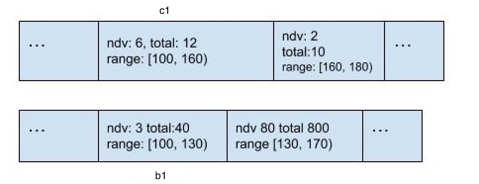
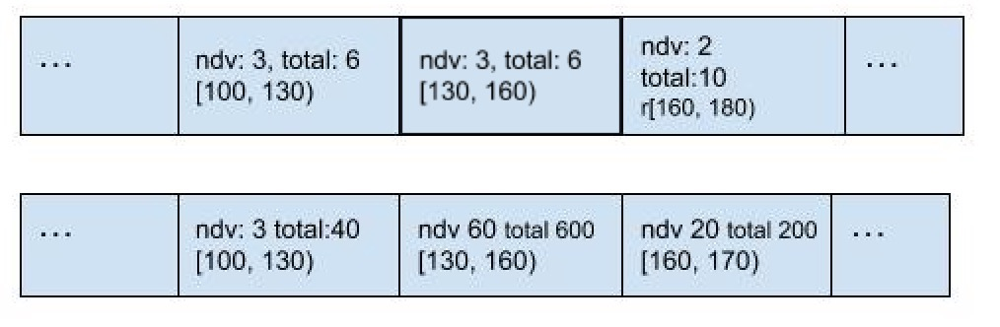
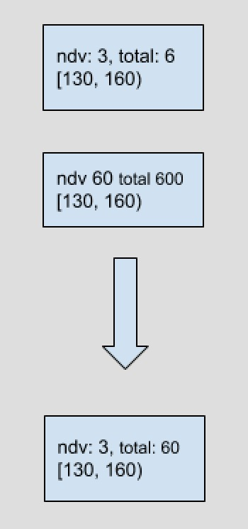

# Proposal: Maintain statistics in `Plan`

- Author:     [Yiding CUI](https://github.com/winoros)
- Last updated:  2018-09-04

## Abstract

This proposal proposes to maintain the histogram in `Plan`’s statistics information.


## Background

Currently, TiDB only uses statistics when deciding which physical scan method a table should use. And TiDB only stores simple statistics in the plan structure. But when deciding the join order and considering some other optimization rules, we need more detailed statistics.

So we need to maintain the statistics in the plan structure to get sufficient statistics information to do optimizations.

## Proposal

The new `statsInfo` of `plan` should be something like the following structure:

```go
type statsInfo struct {
	// This two attributes are already used in current statsInfo.
	count float64
	// The number of distinct value of each column.
	ndv []float64

	// HistColl collects histograms of columns.
	histColl statistics.HistColl
}
```

This struct will be maintained when we call `deriveStats`.

### How to maintain it.

We maintain the histogram in `Projection`, `Selection`, `Join`, `Aggregation`, `Sort`, `Limit` and `DataSource` operators.

#### `Selection`
Just use it to calculate the selectivity.

And we can get the range information of each column and index involved in filters. Then we can use the range information to cut the histogram bucket of these columns.

For column/index not matched in the filter. The `NDV` and `totalCnt` of each bucket can just multiply the total selectivity of filters(based on independent assumption).

#### `Projection`
Change the reflection of the map we maintained.

#### `Join`
There're several kinds of joins.

##### Inner join
Use histograms to do the row count estimation with the join key condition. It can be described as the following procedures:

- Align the histogram buckets so that each bucket boundary in one histogram can be matched in the other histogram. For example(the following figure), bucket `b1` and `c1`'s left boundary is the same. But the right boundary is different. So we can split `c1` into two buckets. The first one's boundary is totally the same with `b1`. The second one starts from where the first one ends.
- Since the boundary of the bucket have been aligned. Then we can estimate the join's size bucket by bucket by the well-know way.

Original:



Step 1:



Step 2:

<div style="text-align: center">

</div>

The calculation inside the bucket can be calculated as this formula 

Where .

The `ndvAfterJoin` can be  or a more detailed one if we can calculate it.


Since it won’t have one side filter, we only need to consider the composite filters after considering the join key. We can simply multiply `selectionFactor` if there are other composite filters since `Selectivity` cannot calculate selectivity of an expression containing multiple columns.

##### One side outer join
It's almost the same as inner join's behavior. But we need to consider two more thing:

- The unmatched row will be filled as `NULL`. This should be calculated in the new histogram. The null count can be calculated when we estimate the matched count bucket by bucket.
- There will be one side filters of the outer table. If the filter is about join key and can be converted to range information, it's can be easily involved when we do the calculation bucket by bucket. Otherwise it's a little hard to deal with it. Don't consider this case currently.

##### Semi join
It’s something similar to inner join. But no data expanding occurs. So the `total` can be adjusted easily.

##### Anti semi join
Same with semi join.

#### `Aggregate`
Just read the NDV information from the `statsInfo` to decide the row count after aggregate. If there's index can fully match the group-by items, we will just use its NDV. Otherwise we will multiply the ndv of each column(or index that can match part of the group-by item).

If some of the group-by items are also in the select field, we will create new histograms by modifying the `totalCnt` of each bucket(set it the same with `NDV`).

#### `Sort`
We can just copy children's `statsInfo` without doing any change, since the data distribution is not changed.

#### `Limit`
Currently we won't maintain histogram information for it. But it can be considered in the future.

#### `DataSource`
Our `DataSource` is actually `source of data` + `select`. So if it’s a non-partitioned table, we just maintain the map and do what `Select` does. If it’s a partitioned table, we now only store the statistics of each partition. So we need to merge them into one histogram so the upper plan can use it. We need a cache or something else to ensure that we won’t merge them each time we need it.

#### Others
For other plan operators or `DataSource` which do not contain any histogram, we just use the original way to maintain `statsInfo`. We won’t maintain histograms for them.

## Rationale

### How other systems solve the same issue?

I’ve looked into Spark. They only maintain the max and min values, won't create new histogram after `Select`/`Join`/`Aggregate`. And they don’t have the index, so maintaining the column’s max/min value is much easier to solve comparing with us.

As for Orca and Calcite, I haven’t discovered where they maintain this information. But there’s something about statistics in Orca’s paper. According to the paper, I think they construct new histograms during planning and cache it to avoid building too many times.

### What is the disadvantage of this design?

This may have side effects on OLTP performance. (Currently totally changing a histogram whose number of bucket is 256 and content is int value costs 7000ns. So we can create 143 histograms at 1ms currently)
 
For now, only join reorder and the position `after logical optimize before physical optimize` will trigger this mechanism and it’s controlled by `tidb_optimizer_selectivity_level` which is disabled by default. It will opened by default after we test it carefully.

After we switch to the cascade-like planner, the rule that needs cost to make decision is still a small set of all. And the existence of `Group` can also help us. If we lazily construct the `statsInfo`, this may not be the bottleneck.

And thanks to `predicate push down` and some other optimization rules. The single column(column directly from the DataSource not one the generated by `Project`'s complex `Expr`) filters(Only this type of expression can be calculated to range information) can be all pushed down to the `DataSource` or the `Selection` on the `DataSource`. So simple querys won't create many new histograms.

### What is the impact of not doing this?

Many cases reported by our customer already prove that we need more accurate statistics to choose a better join order and a proper join algorithm. Only maintaining a number about row count and a slice about NDV is not enough for making that decision.

If we don’t do this, we cannot fix some cases except we use hints.

## Compatibility

There’s no compatibility issue.

## Implementation

First, maintain the histogram in `DataSource`. In this step, there will be some changes in the `statistics` package to make it work. It may take a little long time to do this. [PR#7385](https://github.com/pingcap/tidb/pull/7385)

Then, all changes will be things inside `statsInfo`, which won’t affect other parts. It may not take too much time to implement this part. Like [PR#7595](https://github.com/pingcap/tidb/pull/7595)

The future work will depend on the benchmark result of the join reorder algorithm.
