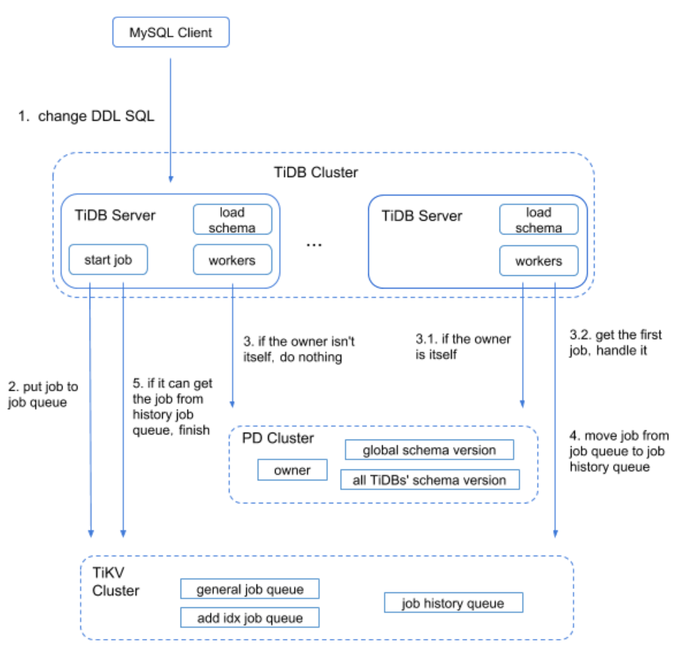

# TiDB DDL architecture
- Author(s):     [zimuxia](https://github.com/zimulala) (Xia Li)
- Last updated:  2018-10-08
## Overview 
This article will describe the architecture of the Online DDL implemented in TiDB.
## Background
Many databases lock tables when performing DDL operations. During this time, many transactions involved in this table are blocked (some databases support reading operations, but at the expense of consuming a large amount of memory). The larger the table is, the longer it affects the transactions.

To simplify the design, the entire system allows only one node to make schema changes at the same time.
* **TiDB server**: It contains TiDB's MySQL Protocol layer and TiDB SQL layer. Figure 1 mainly describes the basic modules involved in asynchronous schema changes at the TiDB SQL layer.
* **load schema**: Creating a goroutine at the start of each node is in order to load the schema after each interval reached or a schema version update being found. The load failure here includes a load timeout.
* **job**: Every DDL operation can be considered a job. At the beginning of a DDL operation, the operation is categorized into two types (general job and add index job) and encapsulated into one job to be stored into the general job queue or add index job queue. When this operation is completed, the job will be deleted from the corresponding job queue and stored in the history job queue, which is convenient for viewing historical jobs. By the way, all jobs except the add index job are the general job.
* **general job queue**: It is a queue to store general jobs, staying at the KV layer. Logically, there is only one such queue for the entire system.
* **add idx job queue**: It is a queue to store add index jobs, staying at the KV layer. Logically, there is only one such queue for the entire system.
* **job history queue**: It is a queue to store the jobs that have been processed, staying at the KV layer. Logically, there is only one such queue for the entire system.
* **start job**: It assigns an ID to the job after the TiDB SQL layer receives the request. The jobs are divided into two types. Then it stores the job to the KV layer's general job queue or add index job queue based on the job type. After that, wait for the job processing to complete and return the processing result.
* **owner**: You can take it as a role. The information (including information of the node currently elected for this role) is stored in the Placement Driver (PD). Only one node in the entire system can be elected as the owner role. Each node can be elected to be this role, and workers will have the right to process jobs only when they are elected as the owner.
* **workers**: Each node has 2 workers to process jobs. They will take the job from the corresponding job queue and process it. Workers will periodically check whether there are tasks that need to be processed. If the server receives the request while the owner role is on the same server, the start job module also tells the corresponding worker to process the job.
* **meta data**: To simplify the design, we bring in system databases and system tables to record some metadatas in the process of asynchronous schema changes.
* **state**: According to the change process of asynchronous schema, some states are introduced in this process, which are bound to column, index, table, and database. These states includes none, delete only, write only, write reorganization, and public. The former order is generally the order in which the operations are created. The state of the delete operation is the reverse of the creating order. Change the write reorganization to delete reorganization. Although they are all reorganization states, the visible level is different. So they are divided into two status flags.
* **lease**: At the same time, there are at most two different versions of the schema on the same table for all nodes of the system. That is, there are at most two different states. As a result, every normal node in a lease will automatically load schema information. If this node cannot be loaded normally during the lease, SQL cannot be processed normally.
## Rationale
To dive deep into DDL processing, you need to understand the overall architecture of the DDL module. This module is operated on the TiDB Server, but it also involves the use of two other components of the TiDB cluster (PD Server and TiKV Server).
### Preparation
#### Concept overview
DDL jobs have multiple state changes during processing. All TiDB servers in a cluster have at most two states at the same time. Then the cluster is in this scenario when the owner just modified the state to TiKV. So before entering the next state change, we should make sure that all currently available TiDB servers are synchronized to the current state.
So you can simply think that each TiDB server needs two modules to ensure that this condition is met. 
* One is the load schema module. In order to process SQL normally, each TiDB server needs to be loaded into the latest schema within a lease. 
* The other one is the handle DDL job module. This module is executed only after the current TiDB server is elected to the owner. Process the job and change the schema. After the owner writes the currently changed schema state to TiKV, we can assume that all TiDB servers in the cluster that can handle SQL after waiting for 2*lease have been updated to this schema.

Figure 1: Structure flow chart

#### Initial configuration
The TiDB server which starts first establishes the latest version of information path in PD, which contains the latest schema version number.
All TiDB servers need to do the following when starting up:
* Register your DDL ID (which ensures a unique ID) and the initial self version number to PD.
* Perform a load schema operation and update the self version number after successful execution.
* Monitor for the latest version information.
### Process introduction
1. The MySQL Client sends a DDL operation request to the TiDB server.
2. When a TiDB server receives a request (the MySQL Protocol layer receives a request for parsing optimization), it will reach the TiDB SQL layer for execution. This step is mainly after the TiDB SQL layer receives the request. The module that starts the start job module encapsulates it into a specific DDL job according to the request, and then classifies the jobs according to the statement type and stores them into the corresponding DDL job queue of the KV layer. This module also notifies the corresponding worker that there is a job to be processed.
3. The worker that receives the job notification will judge whether itself is the owner role. If it is the owner role, it will process the job directly. If it is not in this role, it will exit without doing any processing. Assuming this TiDB server is not this role, then one of the other nodes must be the owner. The worker at the owner role node will check for a job to be executed by a periodic detection mechanism. If a job is found, the worker will handle it.
4. When the owner worker finishes processing the job, it will remove the job from the job queue corresponding to the KV layer and puts it into the job history queue. The start job module which previously packaged the job will periodically check the job history queue to see whether there is a job with the same ID as the job placed in the job queue in step 2. If so, the entire DDL operation ends.
5. The TiDB server returns the response to the MySQL Client.
## Detailed steps
### State change process
Each DDL job requires multiple state changes, such as create table: none -> public, add index: none -> delete only -> write only -> write reorg -> public. The schema version is modified after each state change, and each schema version needs to wait for other TiDB servers to synchronize the schema. The process of this process on the owner is shown in the opt section of Figure 2.
The main logic of this part can be divided into two parts:
* All TiDB servers will watch the latest schema version at current, which is the global schema version of the cluster. When a TiDB receives a notification of the latest schema version update, it loads the latest schema and updates its corresponding schema version to the PD. If it does not receive a notification, it will also load the schema periodically to prevent the watch message from delay or lost.
* After the owner updates a state, it updates the latest schema version to PD and waits for 10 milliseconds to confirm that all TiDB servers are updated to the latest schema information. Then it uses the PD to check if all TiDB servers are updated the corresponding schema. If all TiDB servers are updated successfully, then go directly to the next process. Otherwise, the owner will continue to probe until it exceeds 2 * lease.
### Flow of deleting data
There are many operations in DDL that need to delete data, such as drop table requests. The table may have hundreds of millions of rows, at this time, this operation needs to be processed for a long time. Then we need to do some optimizations for this type of DDL operations. The current optimizations in TiDB include Drop Index, Drop Table, Drop Database, and Truncate Table. In implementation, these operations will have one more logic than other DDL operations. That is, after a normal schema change, we store the information we need to delete the data into the gc_delete_range table, and then process them until the GC stage. This logic can be divided into two parts:
1. State transitions are the same as normal DDL logic. To clean up the data, only clean up the metadata (no metadata, can not access this table, and the table ID is guaranteed to be globally unique, so it will not be accessed), and store this meta information in the gc_delete_range table, and then enter the next process.
2. After the GC Worker reaches the GC time, it will get the data key corresponding to the data to be deleted from the table gc_delete_range, and then send a request to the TiKV server to perform the delete operation.
### Parallel flow
Currently, only the add index operation in TiDB takes a long time to execute, so an add index operation may block other DDL operations. In order to solve this problem preliminarily and steadily, we have implemented the parallel operation between the general operation and the add index operation between the tables. That is, between different tables, the general operation and the add index operation can be performed in parallel.

Figure 2: Owner detailed flow chart

## Optimization function
### General DDL operation
#### Add column operation
In order to speed up this operation, we actually did not populate this column data. This operation does not care about the number of data rows in the table, and only needs to change 5 states throughout the process. The specific implementation is as follows: save the default value of the newly added column to a field named original default value; in the following reading operation, we read the data in this column, and if TiKV reads that the value of this column is null and the value in the field is not empty, then the value in this field is filled to the response and returns from TiKV.
#### Modify column operation
In order to reduce the execution time of this operation and facilitate the operation, only the modification between integer types is supported at present, and only the length of the original type can be lengthened. In addition, there are restrictions on modifying the type definition and other aspects. For details, please refer to the compatibility section. The implementation is to directly change the column field type. If there is an index, the corresponding index field type should also be modified, but the original data does not need to be modified. This method only supports the same type conversion of the codec format because the format of the codec is different.
#### Add index operation
This operation requires writing the corresponding column data in the table to the new index records. This function is actually divided into two parts, the first part is to read data from the corresponding column. The second part is to backfill the data into the index. In order to speed up this operation, we handle this operation in batches concurrently. The simple steps are as follows:
* Acquire the range of handles corresponding to this table, namely start handle and end handle.
* Split the range into multiple small ranges by the Region (the basic unit of data actually stored).
* Each goroutine sweeps the data within the corresponding small range and then writes the data to the index. If a goroutine fails to process a small range, the previous small range will be recorded. The last successful end handle is the start handle for the next backfill of the data. By default, there are 16 goroutines to handle this step concurrently.

To reduce the impact on other read and write operations, its default priority is low.

## Compatibility
About specific compatibility, you can view [MySQL’s compatibility](https://github.com/pingcap/docs/blob/master/mysql-compatibility.md#ddl).
