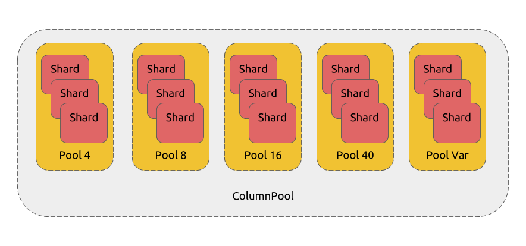

# Proposal: Support a Global Column Pool

- Author(s):     [zz-jason](https://github.com/zz-jason)
- Last updated:  2018-10-22
- Discussion at:

## Abstract

This proposal is aimed to enable a fine-grained buffer reuse strategy. With the
help of the proposed column pool, we can:

1. Reduce the total memory consumption during the execution phase.
2. Support column-oriented expression evaluation and leverage the power of
   vectorized expression execution.

## Background

At present, the buffer reuse is in the granularity of Chunk. The disadvantages
of this **Chunk**-oriented reuse strategy are:

1. This buffer reuse strategy isn't effective in some scenarios. Some memory
   hold by the operators which are inactive can also be reused to reduce total
   memory consumption when executing a query.

2. In order to reuse a Chunk, we have to design the resource recycling strategy
   for every operator which uses multiple goroutines to exploit the
   thread-level parallelism. For example, hash join. It makes the code more
   complicated and harder to be maintained.

3. The memory used in the current query can not be reused in the next query
   within the same session. Thus the golang GC pressure is increased and the
   OLTP performance on a TiDB server is impacted.

## Proposal

The main idea of this proposal is to change the **Chunk**-oriented buffer reuse
strategy to **Column**-oriented and use a session-level column pool to achieve
that.

### The column pool

Considering that the current TiDB only supports a limited number of types, we
only need to consider 5 kinds of columns:

- 4 fixed length columns: 4/8/16/40
- 1 variable length column

The column pool can be accessed by multiple goroutines concurrently, and to
reduce the lock conflict, we can split the pool into shards and randomize the
target shard in each Put/Get operation. Each shard of a column pool is
implemented as a last in first out stack, which helps to release the unused
column in the pool. And in most cases, the required length of a new column is
equal to the previous column put into the column pool.

## Rationale

No

## Compatibility

No

## Implementation

1. Implement the column pool firstly.
2. Remove the complicated, error-prone resource recycling strategy for each
   operator.
3. Replace each **NewChunkWithCapacity**() with **pool.GetChunk**().

## Open issues (if applicable)

No
