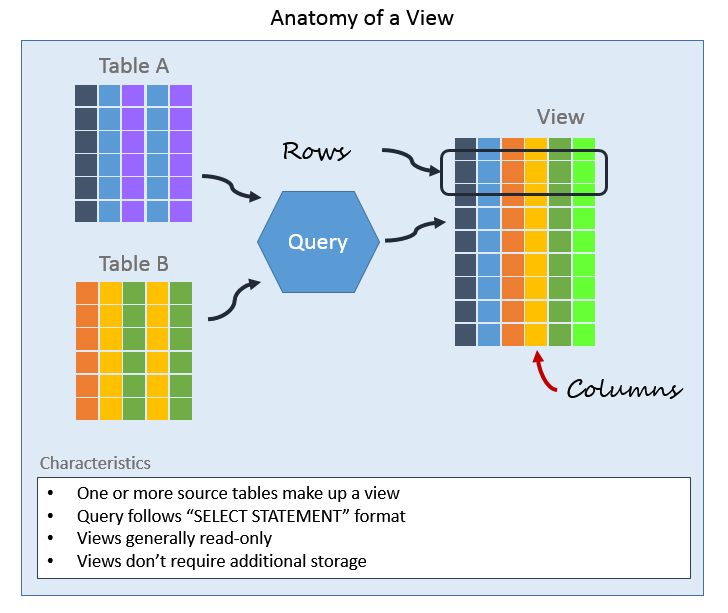

# Proposal: Implement View Feature

- Author(s):     AndrewDi
- Last updated:  2018-12-03
- Discussion at: https://github.com/pingcap/tidb/issues/7974

## Abstract
This proposal proposes to implement basic VIEW feature in TiDB, aimed to make SQL easier to write. VIEW's advanced feature would be considered later.

## Background
A database view is a searchable object in a database that is defined by a query. Though a view doesn’t store data, some refer to a VIEW as "virtual tables", and you can query a view like you can query a table. A view can combine data from two or more tables, using joins, and also just contain a subset of information. This makes them convenient to abstract, or hide, complicated queries.

Below is a visual depiction of a view:
     
  reference from https://www.essentialsql.com/what-is-a-relational-database-view/
  
A view is created from a query using the "`CREATE OR REPLACE VIEW`" command. In the example below we are creating a PopularBooks view based on a query which selects all Books that have the IsPopular field checked. Following is the query:
```sql
CREATE OR replace VIEW popularbooks 
AS 
  SELECT isbn, 
         title, 
         author, 
         publishdate 
  FROM   books 
  WHERE  ispopular = 1 
```  

Once a view is created, you can use it as you query any table in a `SELECT` statement. For example, to list all the popular book titles ordered by an author, you could write:  
```sql
SELECT Author, Title FROM PopularBooks ORDER BY Author
```

In general you can use any of the SELECT clauses, such as GROUP BY, in a select statement containing a view.

## Proposal
This proposal is prepared to implement the basic VIEW feature, which contains following ddl operations:
* `CREATE OR REPLACE VIEW`
* `SELECT FROM VIEW`
* `DROP VIEW`
* `SHOW TABLE STATUS`  

All other unimplemented features will be listed for compatibility and discussed later. And we introduce `ViewInfo` to store the metadata for view and add an attribute `*ViewInfo` which named `View` to TableInfo. If `TableInfo.View` != nil, then this `TableInfo` is a view, otherwise this `TableInfo` is a base table:
```
type ViewInfo struct {
	Algorithm   ViewAlgorithm    `json:"view_algorithm"`
	Definer     UserIdentity     `json:"view_definer"`  
	Security    ViewSecurity     `json:"view_security"`
	SelectStmt  string           `json:"view_select"`
	CheckOption ViewCheckOption  `json:"view_checkoption"`
	Cols        []model.CIStr    `json:"view_cols"`
}
```
* [Algorithm](https://dev.mysql.com/doc/refman/5.7/en/view-algorithms.html)  
    The view SQL `AlGORITHM` characteristic. The value should be one of `UNDEFINED`, `MERGE` OR `TEMPTABLE`. If no `ALGORITHM` clause is present, `UNDEFINED` is the default algorithm.
    Currently, we will only implement the `MERGE` algorithm.
* [Definer](https://dev.mysql.com/doc/refman/5.7/en/create-view.html)  
    The account of the user who created the view, in `'user_name'@'host_name'` format.
* [Security](https://dev.mysql.com/doc/refman/5.7/en/create-view.html)  
    The view SQL `SECURITY` characteristic. The value is one of `DEFINER` or `INVOKER`.
* [CheckOption](https://dev.mysql.com/doc/refman/5.7/en/view-check-option.html)  
    The `WITH CHECK OPTION` clause can be given to an updatable view to prevent inserts to rows for which the `WHERE` clause in the select_statement is not true. It also prevents updates to rows for which the `WHERE` clause is true but the update would cause it to be not true (in other words, it prevents visible rows from being updated to nonvisible rows).  
    In a `WITH CHECK OPTION` clause for an updatable view, the `LOCAL` and `CASCADED` keywords determine the scope of check testing when the view is defined in terms of another view. When neither keyword is given, the default is `CASCADED`.
* SelectStmt  
    This string is the origin `SELECT` SQL statement.
* Cols  
    This `model.CIStr` array stores view's column alias names.
* TableInfo.Columns  
    `TableInfo.Columns` only stores view's column origin names.
 
## Rationale
1. Create VIEW  
   This proposal only supports the following grammar to create view:
   ```sql
    CREATE
        [OR REPLACE]
        [ALGORITHM = {UNDEFINED | MERGE | TEMPTABLE}]
        [DEFINER = { user | CURRENT_USER }]
        [SQL SECURITY { DEFINER | INVOKER }]
        VIEW view_name [(column_list)]
        AS select_statement
        [WITH [CASCADED | LOCAL] CHECK OPTION]
    ```
    1. Parse the create view statement and build a logical plan for select clause part. If any grammar error occurs, return errors to parser.   
    2. Examine view definer's privileges. Definer should own both `CREATE_VIEW_PRIV` privilege and base table's `SELECT` privilege. We will reuse `CREATE_PRIV` privilege when implement `CREATE VIEW` feature and will support `CREATE_VIEW_PRIV` check later.  
    3. Examine create view statement. If the `ViewFieldList` clause part is empty, then we should generate view column names from SelectStmt clause. Otherwise check len(ViewFieldList) == len(Columns from SelectStmt). And then we save column names to `TableInfo.Columns`.
2. DROP VIEW  
  Implement `DROP VIEW` grammar, and delete the existing view tableinfo object. This function should reuse `DROP TABLE` code logic.
3. SELECT FROM VIEW  
    In function `func (b *PlanBuilder) buildDataSource(tn *ast.TableName) (LogicalPlan, error)`, if `tn *ast.TableName` is a view, then we build a select `LogicalPlan` from view's `SelectStmt` string. But this solution meets a problem, and here is the example:  
    ```sql
       create table t(a int,b int);
       create view v like select * from t;
       select * from t;
    ```
    Once we query from view `v`, database will rewrite view's `SelectStmt` from `select * from t` into **`select a as a,b as b from t`**.
    But, if we alter the schema of t like this:
    ```sql
       drop table t;
       create table t(c int,d int);
    ```
    Executing `select * from v` now is equivalent to **`select c as c, d as d from t`**. The result of this query will be incompatible with the character of VIEW that a VIEW should be "frozen" after being defined.
    In order to solve the problem described above, we must build a `Projection` at the top of original select's `LogicalPlan`, just like we rewrite view's `SelectStmt` from `select * from t` into **`select a as a,b as b from (select * from t)`**.  
    This is a temporary fix and we will implement TiDB to rewrite SQL with replacing all wildcard finally.  
4. Show table status  
  Modify `SHOW TABLE STATUS` function to support show view status, and we use this command to check if `CREATE VIEW` and `DROP VIEW` operation is successful. To reuse `SHOW TABLE STATUS` code logic is preferred.

## Compatibility
Support the basic VIEW feature without affecting other existing functions, and make TiDB more compatible with MySQL.

## Implementation
Here is the work items list:  

|Action  |Priority|Deadline|Notes|
| ------ | ------ | ------ |-----|
|Extract ViewAlgorithm\ViewDefiner\ViewSQLSecurity\CheckOption to CreateViewStmt struct|P1|2019/01/15|--|
|Add ViewInfo attribute to TableInfo and add ActionCreateView to ddl actionMap|P1|2019/01/15|--|
|CREATE [OR REPLACE] VIEW view_name [ALGORITHM = {UNDEFINED \| MERGE \| TEMPTABLE}] [(column_list)] AS select_statement|P1|2019/01/15|This task must be done before any other tasks.|
|SHOW TABLE STATUS|P1|2019/01/30|--|
|DROP VIEW View|P1|2019/01/30|--|
|SELECT … FROM VIEW|P1|2019/03/10|--|
|Add some test cases for CreateView and Select … From View|P1|2019/03/30|Port from MySQL test case|
|Support CREATE_VIEW_PRIV check|P2| | |
|UPDATE VIEW|P2| |Difficult|
|INSERT VIEW|P2| |Difficult, dependent on UPDATE VIEW|
|SHOW CREATE [VIEW \| TABLE]|P2| | |
|ALTER VIEW|P2| | |
|ALTER \| DROP TABLE|P2| |Check if table is a View|
|Add test cases for UPDATE \| INSERT INTO View|P2| | |
|Add INFORMATION_SCHEMA.VIEWS view|P3| | |
|CREATE [OR REPLACE] VIEW [DEFINER = { user \| CURRENT_USER }] [SQL SECURITY { DEFINER \| INVOKER }] AS SELECT_STATEMENT|P3| | |
|CREATE [OR REPLACE] VIEW [ALGORITHM = {TEMPTABLE}] AS select_statement|P3| | |
|CREATE [OR REPLACE] VIEW AS select_statement [WITH [CASCADED \| LOCAL] CHECK OPTION]|P3| | |
|Support global sql_mode system variable|P3| | |

## Open issues (if applicable)
https://github.com/pingcap/tidb/issues/7974
