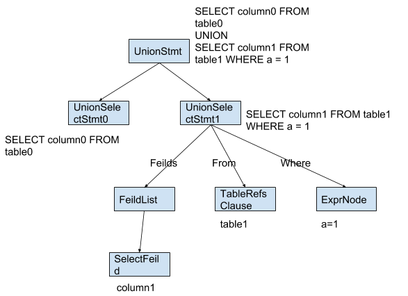

# Proposal: Support restoring SQL text from an AST tree.

- Author(s):     [Yilin Zhao](https://github.com/leoppro)
- Last updated:  2018-12-05
- Discussion at: https://github.com/pingcap/tidb/issues/8532

## Abstract

This proposal aims to support restoring SQL text from any `ast.Node`.

## Background

Some new features in TiDB need all the `ast.Node` to be restorable to SQL text. 
For example, we parse the `create view v as select * from t;` SQL statement to an AST, 
and then expand `select` of the AST to `select test.t.col0, test.t.col1 from test.t;`.

The structure of an `ast.Node` is shown in the following picture (taking `ast.CreateUserStmt` as an example).


We know there is a `Text()` method of `ast.Node`, 
in which the parser calls the `SetText()` method during the parsing process, 
and then we can call `Text()` to get the original input SQL statement. 
But the `Text()` method is incomplete, and only `Text()` of root nodes can work well. 
We should not use it when implementing this proposal.

## Proposal

I recommend adding a `Restore()` method to ast.Node. This is the function defined:

```go
type Node interface {
	// Restore AST to SQL text and append them to `ctx`.
	// return error when the AST is invalid.
	Restore(ctx *RestoreCtx) error
	
	...
}
```

In order to output the SQL text in different formats, I introduced nine flags. There are mutually exclusive groups of `RestoreFlags`:  

[RestoreStringSingleQuotes, RestoreStringDoubleQuotes]  
[RestoreStringEscapeBackslash]  
[RestoreKeyWordUppercase, RestoreKeyWordLowercase]  
[RestoreNameUppercase, RestoreNameLowercase]  
[RestoreNameDoubleQuotes, RestoreNameBackQuotes]  
The flag in the left position in each group has a higher priority.  

This is `RestoreCtx` struct and `DefaultRestoreFlags` definition: 

```go
// RestoreCtx is Restore context to hold flags and writer
type RestoreCtx struct {
	Flags RestoreFlags
	In    io.Writer
}

const DefaultRestoreFlags = RestoreStringSingleQuotes | RestoreKeyWordUppercase | RestoreNameBackQuotes
```

## Rationale

We know the AST is a kind of tree whose child node is corresponding to SQL text. 
So we can walk through the AST layer by layer, call `Restore()` of each child node recursively and 
splice SQL text according to AST node. 
There is the AST parsed from `SELECT column0 FROM table0 UNION SELECT column1 FROM table1 WHERE a = 1`. 
We can splice SQL text as the picture shows.



## Compatibility

The AST and SQL text are in a one-to-many relationship, so we can't restore completely equal SQL text. 
We only need to ensure that the ASTs parsed from the input SQL statement and the restored SQL statement are equal.

## Implementation

### Stage

Considering that some ast.Node depends on another ast.Node, we divide sub-tasks into four stages.  
Detailed list at [pingcap/tidb#8532](https://github.com/pingcap/tidb/issues/8532).

### Example

I implemented the `Restore` function of [ast.CreateDatabasesStmt](https://github.com/pingcap/parser/blob/ce5a9247faef2b6876054935a0b0ed3771edf86d/ast/ddl.go#L67) 
and [ast.DropDatabaseStmt](https://github.com/pingcap/parser/blob/ce5a9247faef2b6876054935a0b0ed3771edf86d/ast/ddl.go#L130) for examples.

```go
// Restore implements Node interface.
func (n *DatabaseOption) Restore(ctx *RestoreCtx) error {
	switch n.Tp {
	case DatabaseOptionCharset:
		ctx.WriteKeyWord("CHARACTER SET")
		ctx.WritePlain(" = ")
		ctx.WritePlain(n.Value)
	case DatabaseOptionCollate:
		ctx.WriteKeyWord("COLLATE")
		ctx.WritePlain(" = ")
		ctx.WritePlain(n.Value)
	default:
		return errors.Errorf("invalid DatabaseOptionType: %d", n.Tp)
	}
	return nil
}
```

```go
// Restore implements Node interface.
func (n *DropDatabaseStmt) Restore(ctx *RestoreCtx) error {
	ctx.WriteKeyWord("DROP DATABASE ")
	if n.IfExists {
		ctx.WriteKeyWord("IF EXISTS ")
	}
	ctx.WriteName(n.Name)
	return nil
}
```

**There is another example which includes complete implementation and test:  
[parser#71](https://github.com/pingcap/parser/pull/71)**

### Note

* Don't depend on `exprNode.Format()`

* Don't depend on `node.Text()`

## Open issues

https://github.com/pingcap/tidb/issues/8532
