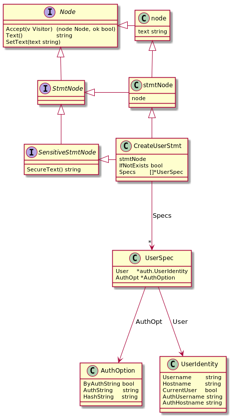

# Proposal: Support to restore SQL text from an AST tree.

- Author(s):     [Yilin Zhao](https://github.com/leoppro)
- Last updated:  2018-12-05
- Discussion at: https://github.com/pingcap/tidb/issues/8532

## Abstract

This proposal aims to support to restore SQL text from any `ast.Node`.

## Background

Some new features in TiDB need all the `ast.Node` to be restorable to SQL text, 
for example, we parse this sql `create view v as select * from t;` to an AST, 
then expand the `select` of the AST to `select test.t.col0, test.t.col1 from test.t;`.

The structure of an `ast.Node` as the picture shows(Take `ast.CreateUserStmt` as an example).



We know there is a `Text()` method of `ast.Node`, 
the parser calls the `SetText()` method during the parsing process, 
then we can call `Text()` to get original input sql. 
But the `Text()` method is incomplete, only the `Text()` of root nodes can work well. 
We should not use it when implementing this proposal.

## Proposal

I recommend adding a `Restore()` method to ast.Node, this is the function defined:

```go
type Node interface {
	// Restore AST to SQL text and append them to `sb`.
	// return error when the AST is invalid.
	Restore(sb *strings.Builder) error
	
	...
}
```

## Rationale

We know the AST is a kind of tree whose child node is correspond to SQL text. 
So we can walk through the AST layer by layer, recursive `Restore()` of each child node and 
splice SQL text according to AST node. 
There is the AST parsed from `SELECT column0 FROM table0 UNION SELECT column1 FROM table1 WHERE a = 1`, 
we can splice SQL text as the picture shows.


## Compatibility

The AST and SQL text are one-to-many relationships, so we can't restore completely equal SQL text, 
we only need to ensure that the ASTs parsed by input SQL and restored SQL are equal.

## Implementation

### Stage

Considering that some ast.Node depend on another ast.Node, we divide sub-tasks into four stages.  
Detailed list at [pingcap/tidb#8532](https://github.com/pingcap/tidb/issues/8532).

### Example

I implemented the `Restore` function of [ast.CreateDatabasesStmt](https://github.com/pingcap/parser/blob/ce4d755a8937ee6bc0e851fafdcd042ab5b1a1c1/ast/ddl.go#L69) 
and [ast.DropDatabaseStmt](https://github.com/pingcap/parser/blob/ce4d755a8937ee6bc0e851fafdcd042ab5b1a1c1/ast/ddl.go#L130) for examples.

```go
// Restore implements Recoverable interface.
func (n *DatabaseOption) Restore(sb *strings.Builder) error {
	switch n.Tp {
	case DatabaseOptionCharset:
		sb.WriteString("CHARACTER SET = ")
		sb.WriteString(n.Value)
	case DatabaseOptionCollate:
		sb.WriteString("COLLATE = ")
		sb.WriteString(n.Value)
	default:
		return errors.Errorf("invalid DatabaseOptionType: %d", n.Tp)
	}
	return nil
}
```

```go
// Restore implements Recoverable interface.
func (n *DropDatabaseStmt) Restore(sb *strings.Builder) error {
	sb.WriteString("DROP DATABASE ")
	if n.IfExists {
		sb.WriteString("IF EXISTS ")
	}
	WriteName(sb, n.Name)
	return nil
}
```

**There are another examples which is including complete implement and test:
[parser#62](https://github.com/pingcap/parser/pull/62) [parser#63](https://github.com/pingcap/parser/pull/63)**

### Test

#### For `ast.StmtNode`:

```go
func (s *testParserSuite) RunRestoreTest(c *C, sourceSQLs, expectSQLs string) {
	var sb strings.Builder
	parser := New()
	comment := Commentf("source %v", sourceSQLs)
	stmts, err := parser.Parse(sourceSQLs, "", "")
	c.Assert(err, IsNil, comment)
	restoreSQLs := ""
	for _, stmt := range stmts {
		err = stmt.Restore(&sb)
		c.Assert(err, IsNil, comment)
		restoreSQL := sb.String()
		comment = Commentf("source %v; restore %v", sourceSQLs, restoreSQL)
		restoreStmt, err := parser.ParseOneStmt(restoreSQL, "", "")
		c.Assert(err, IsNil, comment)
		CleanNodeText(stmt)
		CleanNodeText(restoreStmt)
		c.Assert(restoreStmt, DeepEquals, stmt, comment)
		if restoreSQLs != "" {
			restoreSQLs += "; "
		}
		restoreSQLs += restoreSQL
	}
	comment = Commentf("restore %v; expect %v", restoreSQLs, expectSQLs)
	c.Assert(restoreSQLs, Equals, expectSQLs, comment)
}
```

We believe that a `Restore()` function is correct when the SQL text it outputs can be parsed successfully 
and the generated AST equals with the original AST.

See: [RunTest](https://github.com/pingcap/parser/blob/ce4d755a8937ee6bc0e851fafdcd042ab5b1a1c1/parser_test.go#L255)
and [RunRestoreTest](https://github.com/pingcap/parser/blob/ce4d755a8937ee6bc0e851fafdcd042ab5b1a1c1/parser_test.go#L273)

#### For other `ast.Node`:

Some `ast.Node` can't be restored to a complete SQL text, such as an `ast.ExprNode`.  
To test them, we can construct a complete SQL text.

```go
func (tc *testExpressionsSuite) createTestCase4UnaryOperationExpr() []exprTestCase {
	return []exprTestCase{
		{"select ++1", "SELECT ++1"},
		{"select --1", "SELECT --1"},
		{"select -+1", "SELECT -+1"},
		{"select -1", "SELECT -1"},
	}
}

func (tc *testExpressionsSuite) TestExpresionsRestore(c *C) {
	parser := parser.New()
	var testNodes []exprTestCase
	testNodes = append(testNodes, tc.createTestCase4UnaryOperationExpr()...)

	for _, node := range testNodes {
		stmt, err := parser.ParseOneStmt(node.sourceSQL, "", "")
		comment := Commentf("source %#v", node)
		c.Assert(err, IsNil, comment)
		var sb strings.Builder
		sb.WriteString("SELECT ")
		err = stmt.(*SelectStmt).Fields.Fields[0].Expr.Restore(&sb)
		c.Assert(err, IsNil, comment)
		restoreSql := sb.String()
		comment = Commentf("source %#v; restore %v", node, restoreSql)
		c.Assert(restoreSql, Equals, node.expectSQL, comment)
		stmt2, err := parser.ParseOneStmt(restoreSql, "", "")
		c.Assert(err, IsNil, comment)
		CleanNodeText(stmt)
		CleanNodeText(stmt2)
		c.Assert(stmt2, DeepEquals, stmt, comment)
	}
}
```

See: [expressions_test.go](https://github.com/pingcap/parser/blob/ce4d755a8937ee6bc0e851fafdcd042ab5b1a1c1/ast/expressions_test.go#L122)

### Note

* Table name, column name, etc... use back quotes to wrap

We can use `WriteName(sb, n.Name)` to append name to strings.Builder

* Don't depend on `node.Text()`

## Open issues

https://github.com/pingcap/tidb/issues/8532
