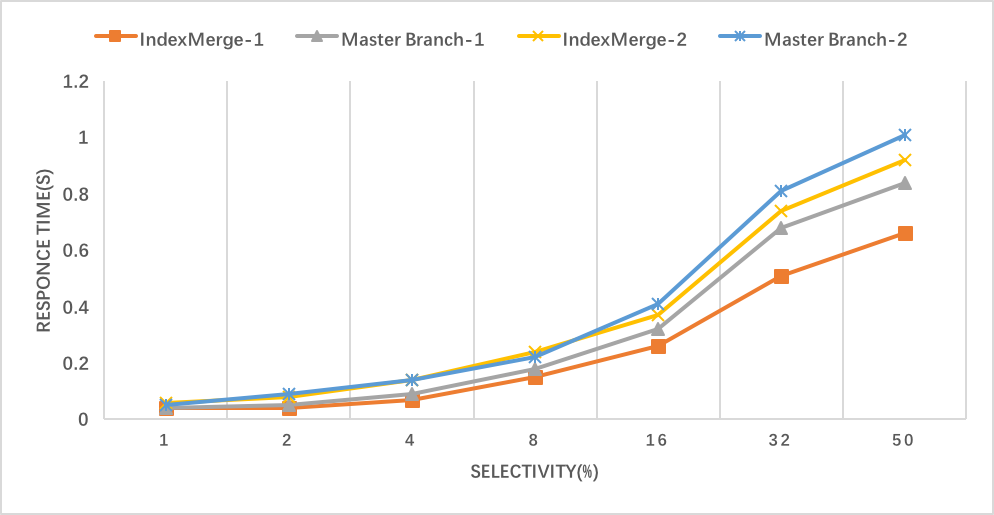
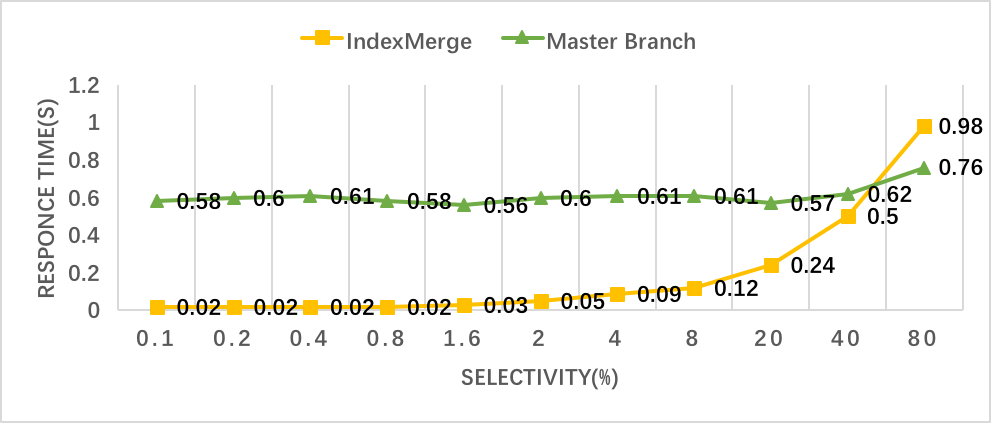
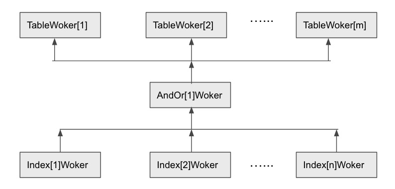
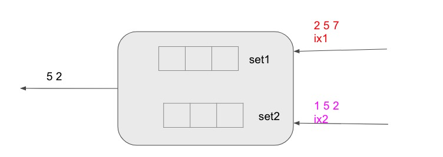

# Proposal: Access a table using multiple indexes
- Author(s) : WHU
- Last updated : May 10
- Discussion at :


## Abstract

The document proposes using multiple indexes to scan a table when possible, which, in some cases, will improve performance.

## Background

In the present TiDB, a SQL statement with conditions that involve multiple indexed attributes only uses one of the conditions as the index filter to build the access condition, while regarding others as table filters. TiDB firstly uses index scan (one index at most) to get handles (rowid in TiDB), which are then used to get rows and check whether the rows satisfy the conditions of table filters. Some relational databases implement a table access path using multiple indexes to improve performance in some cases.

Here is an example to explain it. The table schema is defined as:

```
CREATE TABLE t1 (a int, b int, c int);
CREATE INDEX t1a on t1(a);
CREATE INDEX t1b on t1(b);
CREATE INDEX t1c on t1(c);
```

A test SQL statement `SELECT * FROM t1 where a < 2 or b > 50` is used in the example. Currently, TiDB does a table scan and puts `a < 2 or b > 50` as a Selection on top of it. If the selectivity of `a < 2 ` and `b > 50` is low, a better approach would be using indexes on columns `a` and `b` to retrieve rows respectively, and applying a union operation on the result sets.


## Proposal

In short, we can implement access paths using multiple indexes.

### Planner

We propose to add the following operators:

- `IndexMergeReader / PhysicalIndexMergeReader` 
- `IndexMergeLookUpReader / PhysicalIndexMergeLookUpReader`.

Now consider the following types of queries: 

（1）Conditions in conjunctive normal form (CNF), e.g, `select * from t1 where c1 and c2 and c3 and …`

In this form, each CNF item can be covered by a single index respectively. For example, if we have single column indexes for `t1.a`, `t1.b` and `t1.c` respectively, for SQL `select * from t1 where (a < 10 or a > 100) and b < 10 and c > 1000`, we can use all the three indexes to read the table handles. The result plan for it is:

```
PhysicalIndexMergeLookUpReader(IndexMergeIntersect)
	IndexScan(t1a)
	IndexScan(t1b)
	IndexScan(t1c)
	TableScan
```

For the CNF items not covered by any index, we take them as table filters and convert them to selections on top of the scan node. For SQL `select * from t1 where (a < 10 or c >100) and b < 10`, only item `b < 10` can function as an index access condition, so we will use a single index lookup reader.

To compare our demo implementation against the master branch, we set up an experiment for the CNF form. The schema and test SQL form we defined are as below:

```
Table Schema:
	CREATE TABLE T200M(c1 int, c2 int, c3 int, c4 int, c5 int, c6 int, c7 int, c8 int);
	CREATE INDEX T200Ma on T200M(a);
	CREATE INDEX T200Mb on T200M(b);

Test SQL Form:	
	CNF-1
		SELECT * FROM T200M WHERE C1 < $1 AND C2 > $2;
	CNF-2 
		SELECT * FROM T200M WHERE C1 < $3 AND C2 < $4;
```

In the experiment, we load two million rows into table `T200M` with one to two million sequence for all columns. `$1-$4` is altered to obtain equal selectivity on `C1` and `C2`, while the difference between `CNF-1` and `CNF-2` is that `CNF-1` has no final results. The result can be seen in the following graph:



**Note:** `SELECTIVITY`is for the single column.

（2） Conditions in disjunctive normal form (DNF), e.g, `select * from t1 where c1 or c2 or c3 or …` 

In this form, every DNF item must be covered by a single index. If not, IndexMerge scan cannot be used. For example, SQL `select * from t1 where a > 1 or ( b >1 and b <10)` will generate a possible plan like:
	
```
PhysicalIndexMergeLookUpReader(IndexMergeUnion)
	IndexScan(t1a)
	IndexScan(t1b)
	TableScan
```

To compare our demo implementation against the master branch, we set up an experiment for the DNF form. The schema and test SQL form we defined are as below:

```
Table Schema:
	CREATE TABLE T200(a int, b int, c int); 
	CREATE INDEX T200a on T2OO(a);
	CREATE INDEX T200b on T200(b);

Test SQL Form:
	SELECT * FROM T200 WHERE a < $1 OR b > $2;
```  
We load two million rows into table `T200` with one to two million sequence for all columns. The value of `$1` and `$2` in the test SQL form is altered to obtain the accurate selectivities. The result can be seen in the following graph:




The structure of `PhysicalIndexMergeLookUpReader` is designed as:
	
```
// PhysicalIndexMergeLookUpReader
type PhysicalIndexMergeLookUpReader struct {
	physicalSchemaProducer

	//Follow two plans flat to construct executor pb.
	IndexPlans []PhysicalPlan
	TablePlans []PhysicalPlan

	indexPlans []PhysicalPlan
	tablePlan PhysicalPlan
		
	IndexMergeType int
}
```


- Field `IndexMergeType` indicates the operations on the results of multiple index scans. Possible values are:

  - 0: not an IndexMerge scan;
  - 1: intersection operation on result sets, with a table scan;
  - 2: intersection operation on result sets, without the table scan;
  - 3: union operation on result sets; must have a table scan;

In the first version, `PhysicalIndexMergeLookUpReader` and `PhysicalIndexMergeReader` will be implemented as one operator.


### IndexMergePath Generate

For table paths, we first generate all possible IndexMergeOr paths, then possible IndexMergeIntersection paths. 

```
type IndexMergePath struct {
	IndexPath[]
	tableFilters
	IndexMergeType
}
```


```
GetIndexMergeUnionPaths(IndexInfos, PushdownConditions){
	var results = nil
	foreach cond in PushdownConditions {
		if !isOrCondition(cond) {
			continue
		}
		args = flatten(cond,'or')
		foreach arg in args {
			var indexAccessPaths, imPaths
                       // Common index paths will be merged later in `CreateIndexMergeUnionPath`
			if isAndCondition(arg) {
				andArgs = flatten(arg,'and')
				indexAccessPaths = buildAccessPath(andArgs, IndexInfos)
			} else {
				tempArgs = []{arg}
				indexAccessPaths = buildAccessPath(tempArgs, IndexInfos)
			}
			if indexAccessPaths == nil {
				imPaths = nil
				break
			}
			imPartialPath = GetIndexMergePartialPath(IndexInfos, indexAccessPaths)
			imPaths = append(imPaths, imPartialPath)
		}
		if imPaths != nil {
			possiblePath = CreateIndexMergeUnionPath(imPaths,PushdownConditions,con,IndexInfos)
			results = append(results, possiblePath)
		}
	}
	return results
}	


buildAccessPath(Conditions, IndexInfos){
	var results
	for index in IndexInfos {
		res = detachCNFCondAndBuildRangeForIndex(Conditions, index, considerDNF = true)
		if res.accessCondition = nil {
			continue 
		}
		indexPath = CreateIndexAccessPath(index, res)
		results = append(results, indexPath)
	}
	return results
}

// This function will get a best indexPath for a condition from some alternative paths.
// Now we just take the index which has more columns.
// For exmple: 
// (1)
// index1(a,b,c) index2(a,b) index3(a)
// condition: a = 1 will choose index1; a = 1 and b = 2 will also choose index1
// (2)
// index1(a) index2(b)
// condition: a = 1 and b = 1
// random choose???
GetIndexMergePartialPath(IndexInfos, indexAccessPaths) {
}

// (1) Maybe we will merge some indexPaths
//    for example: index1(a) index2(b)
//    condition : a < 1 or a > 2 or b < 1 or b > 10 
//    imPaths will be [a<1,a>2,b<1,b>10] and we can merge it and get [a<1 or a >2 , b < 1 or b > 10] 
// (2)IndexMergePath.tableFilters: 
//    <1> Remove a condition from PushdownConditions and the rest will be added to tableFitler.
//    <2> After the merge operation, if any indexPath's tableFilter is not nil, we should add it into tableFilters
	
CreateIndexMergeUnionPath(imPaths,PushdownConditions,cond,IndexInfos) {
}

```


```
GetIndexMergeIntersectionPaths(pushDownConditions, usedConditionsInOr, indexInfos) {
	var partialPaths

	if len(pushDownConditions) - len(usedConditionsInOr) < 2 {
		return nil
	}
	tableFilters := append(tableFilters, usedConditionsInOr...)
	newConsiderConditions := remove(pushDownConditions, usedConditionsInOr)
	for cond in newConsiderConditions {
		indexPaths = buildAccessPath([]{cond}, indexInfos)
		if indexPaths == nil {
			tableFiltes = append(tableFilters,cond)
			continue
		}
		indexPath := GetIndexMergePartialPath(indexPaths,indexInfos)
		partialPaths = append(partialPaths, indexPath)
	}
	if len(partialPaths) < 2 {
		return nil
	}
	return CreateIndexMergeIntersectionPath(partialPaths, tableFilters)
}

// Now, we just use all paths in partialPaths to generate a IndexMergeIntersection.
// We also need to merge possible paths. 
// For example: 
//   index:  ix1(a)
//   condition： a > 1 and a < 10
//   we will get two partial paths and they all use index ix1. 
// IndexMergePath.tableFilters: 
//   <1> tableFilters
//   <2> after merge operation, if any indexPath's tableFilter is not nil, we 
//       should add indexPath’s tableFilter into IndexMergePath.tableFilters
CreateIndexMergeIntersectionPath(partialPaths, tableFilters) {
}

```
	
### Executor

The graph below illustrates an execution of IndexMerge scan.



Every index plan in `PhysicalIndexMergeLookUpReader` will start an `IndexWorker` to execute the IndexScan plan and send handles to AndOrWorker. AndOrWorker is responsible for performing set operations (and, or) to getting final handles. Then `AndOrWoker` sends final handles to `TableWokers` to get rows from TiKV.

Here are some designs for index plans in pipeline mode to be executed without considering the order.

(1) IndexMergeIntersection

 

Take this example: Use set1 to record row IDs returned by ix1 but not sent to tableWorker. Use set2 to record the same thing for ix2.

If new row IDs comes from ix1, first we check if it is in set2. If yes, we delete it from set2 and send it to tableWorker. Otherwise, we add it into set1. For the above figure, we use the following table to show the processing.

| new rowid | set1 | set2 | sent to TableWorker |
| :------:| :------: | :------: | :------: |
| 2(ix1) | [2] | [ ] | [ ] |
| 1(ix2) | [2] | [1] | [ ] |
| 5(ix1) | [2,5] |[1] | [ ] |
| 5(ix2) | [2] | [1] | [5] |
| 7(ix1) | [2,7] |[1] | [ ] |
| 2(ix2) | [7] | [1] | [2] |


(2) IndexMergeUnion


We have a structure (set) to record which row IDs are accessed. If a new row ID is returned by IndexScan, check if it is in the set. If yes, we just skip it. Otherwise, we add it into the set and send it to tableWorker. 

### Cost Model

There are three factors to be considered for the cost model: IO, CPU, and Network, as shown below:

- `IndexMergeType` = 1

	IO Cost = (totalRowCount + mergedRowCount) * scanFactor
	
	Network Cost = (totalRowCount + mergedRowCount) * networkFactor
	
	Cpu Memory Cost = totalRowCount * cpuFactor + totalRowCount * memoryFactor
	
- `IndexMergeType` = 2

	IO Cost = (totalRowCount) * scanFactor
	
	Network Cost = totalRowCount * networkFactor
	
	Cpu Memory Cost = totalRowCount * cpuFactor + totalRowCount * memoryFactor
	
- `IndexMergeType` = 3

	IO Cost = (totalRowCount + mergedRowCount) * scanFactor
	
	Network Cost = (totalRowCount + mergedRowCount) * networkFactor
	
	Cpu Memory Cost = totalRowCount * cpuFactor + mergedRowCount * memoryFactor
	

**Note**:

- totalRowCount: sum of handles collected from every index scan.
	
- mergedRowCount: number of handles after set operating.

## Compatibility

This proposal has no effect on the compatibility.

## Implementation Procedure

1. Implement planner operators
1. Enhance `explain` to display the plan
3. Implement executor operators
4. Testing
