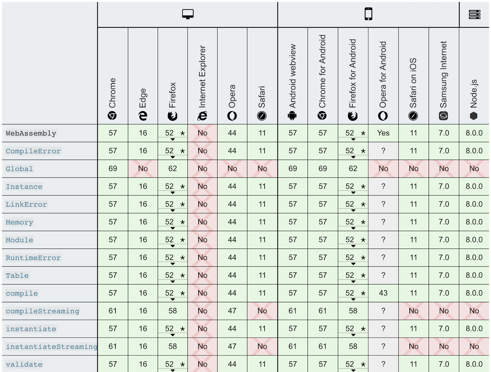
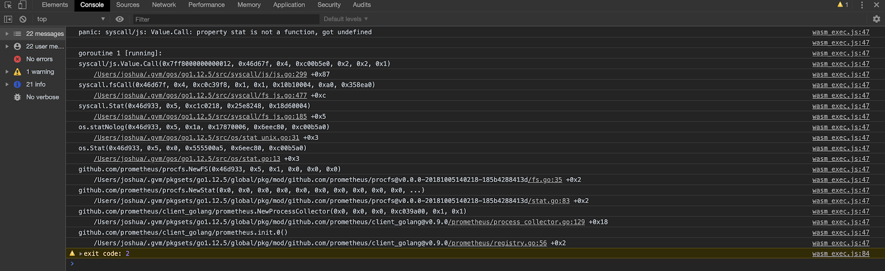
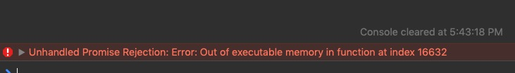
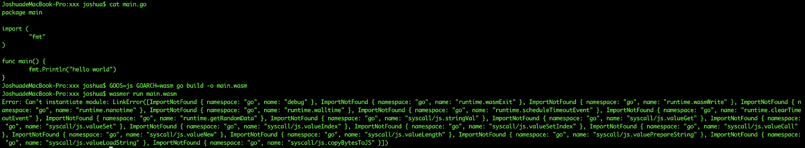

# Proposal:

- Author(s):     Joshua
- Last updated:  November 19
- Discussion at: https://github.com/pingcap/tidb/issues/13364

## Abstract

This proposal proposes a way to build a bridge between TiDB ecosystem and WebAssembly ecosystem.

## Background

As WebAssembly technology matures, more and more applications can be running in browsers, so that 
users no longer have to endure cumbersome downloads and installation processes, which greatly reduces 
the cost of promoting these applications. Obviously users who are using TiDB for the first time are 
facing these problems. Using WebAssembly technology, we can reduce the barriers to user engagement 
with TiDB, and we can also expand the TiDB audience with the help of the WebAssembly community.

## Proposal

This proposal proposes to compile TiDB on various runtimes of WebAssembly and build TiDB applications 
in the WebAssembly ecosystem:

- TiDB can work properly in browsers such as Chrome/Firefox on PC (done)
- tour.tidb.io and play.tidb.io can be used as the TiDB playground (done)
- Support community projects such as [tidb-wasm-markdown](https://github.com/imiskolee/tidb-wasm-markdown)
- TiDB can work properly in browsers on phones
- TiDB can run in wasmer and can be deployed to [WebAssembly Shell](https://webassembly.sh/)

## Rationale

WebAssembly is an open standard that defines a portable binary code format for executable programs, 
a corresponding assembly language, and an interface to interact with the hosting environment. Its 
main goal is to enable applications with high performance requirements to run on web pages. Of course, 
its instruction format is also designed to be able to run on other platforms.

The WebAssembly virtual machine has better performance than JavaScript because WebAsembly's binary 
format file has a more compact instruction structure, similar to ELF files (the most commonly used 
binary instruction format on Unix systems, which is parsed by the loader and loaded into memory for 
execution). WebAssembly is compiled into memory for execution by a specific runtime. The most common 
runtimes include mainstream browsers, nodejs, and a generic implementation specifically designed for 
WebAssembly - Wasmer. Even someone gives the Linux kernel a feature patch to integrate the WebAssembly 
runtime into the kernel so that the user-written program can easily run in kernel mode.

Currently, all mainstream browsers support WebAssembly, so you don't have to worry about its compatibility 
with browsers. The support for WebAssembly on various browsers is as follows:


Running in a non-browser environment involves interacting with the host system, which can be resolved by 
WASI. We know that WebAssembly is an assembly language designed for abstract virtual machines, so it requires 
a system interface to manipulate the abstracted operating system, which is defined by WASI. With WASI, the 
application can be compiled once, run anywhere.

Go 1.11 experimentally added the support for WebAssembly and optimized it in Go 1.12. TiDB is written in 
pure Golang. In theory, it can be compiled directly into WebAssembly according to Golang's official 
[document](https://github.com/golang/go/wiki/WebAssembly#getting-started), allowing TiDB to run anywhere.

## Implementation

Our implementation will be divided into several stages:
1. Compile TiDB code into Wasm, regardless of whether it can run normally. We should solve the following problem:
  - TiDB itself or some dependent third-party libraries may not be compatible with Wasm, so the compilation will 
    fail. They need to be modified accordingly.
2. Migrate the result of stage 1 into PC browsers and wrap the page into the TiDB playground and TiDB tour. Possible 
  problems are:
  - Golang compatibility with the browser environment.
  - Due to the browser's security policy, we can't listen to a port using TiDB's original working mode. We need 
    to integrate a SQL terminal to TiDB instead of connecting via MySQL. At the same time, because the browser 
    prohibits the application from directly accessing local files, when the user runs SQL statements related to 
    file operations, we need to convert the semantics to the upload/download operations in the browser.
  - TiDB running in a browser cannot execute SQL in batches due to restraints of the browser, but this feature is 
    useful for users who want to verify TiDB’s compatibility with MySQL or other SQL database. We need to support 
    it in the browser.
3. Migrate the result of stage 1 into phone browsers. Possible problems are:
  - The webkit has a [limit](https://trac.webkit.org/browser/webkit/branches/safari-604.1-branch/Source/JavaScriptCore/jit/ExecutableAllocator.cpp#L90) 
    on executable memory, typically it's 64 MB. However, the current Wasm compilation of TiDB is 76 MB, which requires 
    some downsizing.
  - The browser in the phone has a different interaction model than that in PC, so the SQL terminal must be compatible 
    with both.
4. Migrate the result of stage 1 into Wasmer, and publish it to [WAPM](https://wapm.io/), so that it can run in any 
  platform easily with WAPM, even can run on [WebAssembly shell](https://webassembly.sh/). To achieve this, we should 
  solve:
  - Golang doesn’t support WASI now, so we need to use a [fork branch](https://github.com/neelance/go/tree/wasi) 
    of Golang and recompile the toolchain.
  - The result of stage 1 is too large and should be shrinked.

### Solution of compilation problem

In the case of the problem of stage 1, incompatibility with WASM can be divided into the following cases:

1. TiDB's own code has platform-dependent code.
2. TiDB has platform-dependent code in a library that is directly or indirectly imported. This dependent library is controlled by PingCAP.
3. TiDB has platform-dependent code in a library that is directly imported. This dependent library is not controlled by PingCAP.
4. TiDB has platform-dependent code in a library that is indirectly imported. This dependent library is not controlled by PingCAP.

For case 1, we add the Wasm implementation for TiDB directly, according to Golang's platform-related file [naming rules](https://golang.org/pkg/go/build/), 
the file name format is:

- *_GOOS
- *_GOARCH
- *_GOOS_GOARCH

So the only thing we need do is to add *_wasm.go, and mock an implemention based on the implemention for other platforms.

For case 2, the solution is same as case 1, because we can modify the third-party code directly.

For case 3 and case 4, we can’t modify the code directly. There are 3 solutions:

- Open issues for these repos, and ask their owners to support WebAseembly
  - Advantage: we don’t need to do it ourselves, and we can keep up with upstream
  - Disadvantage: some repos have been archived, and some are no longer maintained, nobody will reply our issue
- Clone these repos to pingcap org and modify their code, then switch the reference of TiDB to the new repos.
  - Advantage: we can control these code, and modify them any time
  - Disadvantage: if the dependency chain is long, we should clone many repos, and we will detach from upstream.
- If TiDB only uses a few functions or symbols of these repos, we can:
  - Create a new package in TiDB
  - In this package, implement the functions required by Wasm platforms
  - In this package, re-export the third party dependencies for non-Wasm platforms
  - Modify the TiDB’s reference of the library to the new package, and all code except the new package shouldn’t reference 
    the third-party library.

In summary, when a third-party package does not support WebAssembly, we need to look at  it in different situations. 
The priority can be set as follows:

- If the third-party package is active, file an issue; if the author is busy, then create a PR
- If a third-party package has been archived or is no longer maintained, there are two cases:
  - We rely heavily on it, then clone it and change it ourselves.
  - We only rely slightly on it, then we use solution 3 to walk around it.

### Solution of PC browser

We found that some specific system functions in Golang will crash if we try to run them in browser:


As shown in the figure above, when we execute the `os.stat` function, the runtime found that there 
was no such a function in the environment. This situation occurs because Golang does not currently 
support WASI, so it mocks the host interface using the wasm_exec.js file. However, only a few system 
functions are mocked in this file, and `os.stat` is not among them. The solution is to mount the 
functions we need to the `fs` object on the global object before we execute Wasm.  For example:

```js
function unimplemented(callback) {
    const err = new Error("not implemented");
    err.code = "ENOSYS";
    callback(err);
}
function unimplemented1(_1, callback) { unimplemented(callback); }
function unimplemented2(_1, _2, callback) { unimplemented(callback); }

fs.stat = unimplemented1;
fs.lstat = unimplemented1;
fs.unlink = unimplemented1;
fs.rmdir = unimplemented1;
fs.mkdir = unimplemented2;
go.run(result.instance);
```

Another problem for browser is that TiDB requires to listen to a port to provide service normally, which 
is prohibited by the browser. Therefore, we need to change the way TiDB provides services — embedding a 
SQL terminal. SQL terminal in the front-end field is very common, and we can find a ready-made one. The 
only problem we need to deal with is the interface between the SQL terminal and the TiDB kernel. There 
is such a method in TiDB:

```go
// Exec executes a sql statement.
func (tk *TestKit) Exec(sql string, args ...interface{}) (sqlexec.RecordSet, error) {
    var err error
    if tk.Se == nil {
        tk.Se, err = session.CreateSession4Test(tk.store)
        tk.c.Assert(err, check.IsNil)
        id := atomic.AddUint64(&connectionID, 1)
        tk.Se.SetConnectionID(id)
    }
    ctx := context.Background()
    if len(args) == 0 {
        var rss []sqlexec.RecordSet
        rss, err = tk.Se.Execute(ctx, sql)
        if err == nil && len(rss) > 0 {
            return rss[0], nil
        }
        return nil, errors.Trace(err)
    }
    stmtID, _, _, err := tk.Se.PrepareStmt(sql)
    if err != nil {
        return nil, errors.Trace(err)
    }
    params := make([]types.Datum, len(args))
    for i := 0; i < len(params); i++ {
        params[i] = types.NewDatum(args[i])
    }
    rs, err := tk.Se.ExecutePreparedStmt(ctx, stmtID, params)
    if err != nil {
        return nil, errors.Trace(err)
    }
    err = tk.Se.DropPreparedStmt(stmtID)
    if err != nil {
        return nil, errors.Trace(err)
    }
    return rs, nil
}
```

This Exec function is exactly what we need. We can modify it slightly and use it in browsers.

The last two problems are that we need to access files and  support SQL operations in batches. These 
two problems can be combined into one problem, because the user executes  SQL in batches in the form 
of files. The only way for a  browser to access a file is to upload and download, so our file access 
must be converted to file upload/download in the browser. The solution is: detecting the SQL statements 
executed by the user, and requesting the browser to pop the upload window when the user needs to access 
files. Then the user selects a file to upload, and the data of the file is submitted to TiDB for processing.

### The solution to mobile browser adaptation

Since the webkit has restrictions on the executable size in mobile browsers (usually 64 MB), and our TiDB-WASM 
size is about 76 MB. An exception will occur when we run it in a mobile browser:


There are two options to reduce the size of the compiled file:
- Tailor the functionality of TiDB and remove features that are not useful in the browser (such as grpc)
- Looking for a better compilation solution. We may need to find the answer from the Golang compiler.

In addition to the browser's size limit on the Wasm binary file, we also need to solve the SQL terminal 
input problem on the mobile phone. At present, the SQL terminal on  PC browsers has been implemented, 
but it cannot be used normally on mobile browsers, which process events differently as PC does. We need to 
adapt the front end for mobile phones.


### Compile to WASI 

To run TiDB across platforms, we need to compile TiDB to WASI. The current version of Golang does 
not support WASI, so running with wasmer after compilation will result in an error:


The above picture is the Hello world program compiled by Golang.

Golang does not plan to support WASI till v1.14, but this won’t stop us from compiling TiDB to WASI because 
we already have this feature in a Golang fork.  We can use this version to get TiDB running in all WASI-enabled 
environments before Golang 1.14.
