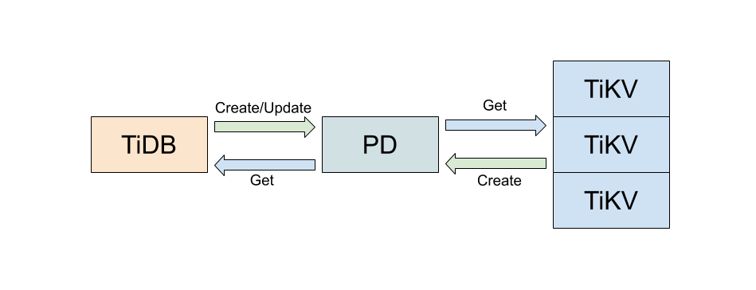

# Proposal: Dynamic Configuration Change

- Author(s):     [Yutong Liang](https://github.com/rleungx)
- Last updated:  2019-11-21
- Discussion at:

## Abstract

This proposal proposes a unified way to manage the configuration options of TiDB
, TiKV and PD by storing them in PD. So that we change the configuration options
dynamically through SQL or `pd-ctl`.

## Background

Although some configuration options of TiDB, TiKV, and PD support modification,
the way to change them is different in different components, which increases the
burden of maintenance for users and DBAs, resulting in poor usability.
Currently, the way to change the configuration of each component is as follows:

- PD: via HTTP interface
- TiKV: debug service through gRPC
- TiDB: modify configuration table through SQL

For better usability, we need a unified way to manage the configuration options.

## Proposal

Since PD integrates etcd itself, and etcd is good at managing cluster
configuration, we propose centralized management which the configuration of
the whole cluster, including TiDB, TiKV, and PD components, can be handed over to
PD leader. The main things the PD should do are as follows:

- Persistence of configuration
- Configuration updates
- Distribution of configuration

## Rationale

The new way of managing configuration has better usability. The configuration
files of those components can be removed and don't need to learn how those
tools works. It reduces administrative costs. For configuration options that
cannot be modified dynamically, we still can change it using this unified way,
but we need to wait for the next restart after modification to take effect.

## Implemetation

### Interface

The communication related to the configuration among components will use gRPC.
The following interfaces need to be added:

```proto
service Config {
    rpc Create(CreateRequest) returns (CreateResponse) {}
    rpc Get(GetRequest) returns (GetResponse) {}
    rpc Update(UpdateRequest) returns (UpdateResponse) {}
}
```

The functions of each interface are as follows:

*Create* is used to register a configuration to PD when the components start.
*Get* is used to get the complete configuration of the component periodically
from PD and decide if the component configuration need to update. *Update* is
used to update some configuration of some components in PD.

### WorkfLow

Before TiDB and TiKV start, the first thing need to do is sending a *Create*
request to register themselves in PD. And then the response of *Create* will
carry all configuration options which the component needs to start the process.
Later, TiDB and TiKV need to create an independent thread to call *Get*
periodically to get configuration from PD and decide whether to update after
comparing it with the local configuration. TiDB can update the configuration of
each component on PD through SQL at any time by calling *Update*.



For the users who only use TiKV, the *Update* method can be added to the
implementation of existing clients, such as rust client or go client.

### Configuration Item

The protocol definition of a specific configuration option is as follows:

```proto
message ConfigEntry {
    Oneof type {
        Local local = 1;
        Global global = 2;
    }
    string name = 3;
    string value = 4;
}


Each *ConfigEntry* represents a configuration option. The *name* represents a
specific configuration item name. All configuration items use a unified naming
standard. For example, for the following configuration item, the name should be
*readpool.storage.high-concurrency*.

```toml
[readpool.storage]
high-concurrency = 4
```

There are two types for a configuration item: local and global. It is defined
as follows:

```proto
message Local {
    bytes component_id = 1;
}

message Global {
    Component component = 1;
}

These two types are used to distinguish whether the configuration is shared by
components. For example, the label configuration of TiKV is individual for each
TiKV instance. So the type should be local. Each instance here is uniquely identified
by the *component_id*, which can be obtained by hashing *IP: port*.
Another example is the *raft-base-tick-interval* which is the configuration
shared by all TiKV instances, so the type should be global. The definition of
component type is as follows:

```proto
enum Component {
    UNKNOWN = 0;
    PD = 1;
    TiKV = 2;
    TiDB = 3;
}
```

### Version Control

To determine whether the corresponding component needs to update the
configuration, the version field needs to be added to the request and response.
The protocol definition is as follows:

```proto
message Version {
    uint64 local = 1;
    uint64 global = 2;
}
```

For global configuration items, PD only maintains a set of global configuration
items and a version variable, while for local, it needs to maintain a mapping
from component ID to a set of local configuration items, and each set of local
configuration items need to have an independent version variable.

The following lists how version works In common scenarios:

- New cluster. Both TiDB and TiKV use the default configuration and send it to
PD to complete the registration. The registration needs to establish the mapping
relationship between the component ID, version and local configuration. For
customized requirements, such as modifying the size of block cache. It needs
external tools to help modify them. After that, the global and local versions
also need to be modified by adding one respectively according to the
configuration option type. TiDB or TiKV obtains the configuration and version
through *Get* method and decides whether to modify them by comparing with the
local version. If the local version is smaller than the version carried by the
response, the corresponding configuration options will be overwritten or merged
and the version will be updated at the same time.

- Add a new component or restart the component. The initialization of
configuration calls the *Create* method. After receiving the request, PD first
registers or queries the component ID. By comparing the version carried by the
request with the version stored in PD, it determines whether to return the
configuration of the component in the response. After receiving the reply, TiDB
or TiKV decides whether to update the configuration or not after comparing with
the version stored in the component.

- Delete the node. PD can directly delete the corresponding component ID, the
associated set of local configuration items and the version.

### Appendix

The entire agreement is as follows:

```proto
service Config {
    rpc Create(CreateRequest) returns (CreateResponse) {}
    rpc Get(GetRequest) returns (GetResponse) {}
    rpc Update(UpdateRequest) returns (UpdateResponse) {}
}

message Status {
    enum StatusCode {
        UNKNOWN = 0;
        FAILED = 1;
        STALE_VERSION = 3;
    }
    StatusCode code = 1;
    string message = 2;
    Version version = 3;
}

message Version {
    uint64 local = 1;
    uint64 global = 2;
}

enum Component {
    UNKNOWN = 0;
    PD = 1;
    TiKV = 2;
    TiDB = 3;
}

message Local {
    bytes component_id = 1;
}

message Global {
    Component component = 1;
}

message ConfigEntry {
    oneof type {
        Local local = 1;
        Global global = 2;
    }

    string name = 3;
    string value = 4;
}

message CreateRequest {
    uint64 cluster_id = 1;
    Version version = 2;
    bytes component_id = 3;
    string config = 4;
}

message CreateResponse {
    uint64 cluster_id = 1;
    Status status = 2;
    Version version = 3;
    string config = 4;
}

message GetRequest {
    uint64 cluster_id = 1;
    Version version = 2;
    Component component = 3;
    bytes component_id = 4;
 }

message GetResponse {
    uint64 cluster_id = 1;
    Status status = 2;
    Version version = 3;
    string config = 4;
}

message UpdateRequest {
    uint64 cluster_id = 1;
    Version version = 2;
    repeated ConfigEntry entries = 3;
}

message UpdateResponse {
    uint64 cluster_id = 1;
    Status status = 2;
    Version version = 3;
    string config = 4;
}
```
