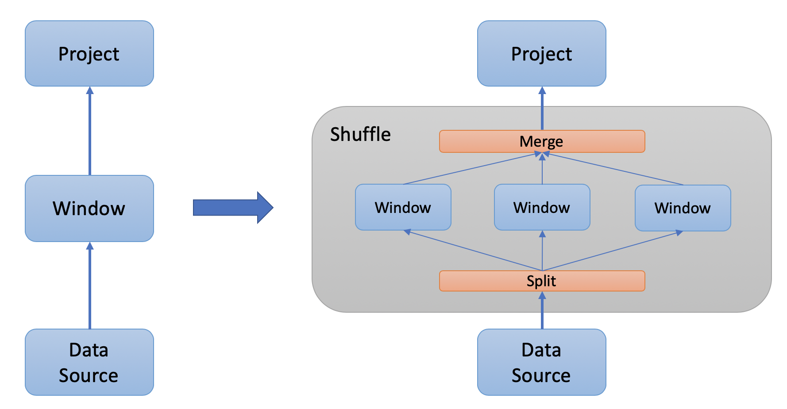

# Shuffle Executor

- Author(s):         [pingyu](https://github.com/pingyu)  (Ping Yu)
- Last updated:  2020-01-11

## Abstract
This article will describe the design of Shuffle Executor in TiDB.

## Background
As described in [#12966](https://github.com/pingcap/tidb/issues/12966), the performance of Window operator in TiDB has much space to improve.

So we designed a Shuffle Executor, which is proposed [here](https://github.com/pingcap/tidb/pull/14238#issuecomment-569880893) by [SunRunAway](https://github.com/SunRunAway) (Feng Liyuan) , using multi-thread hash grouping, to run each Window partition in parallel.

Furthmore, the Shuffle Executor is designed to be a general purpose executor, which can also be used for other scenario, such as Parallel Sort-Merge Join, in the future.


## Rationale
[Window operator](https://dev.mysql.com/doc/refman/8.0/en/window-functions.html) separates data into independent groups by `PARTITION BY` clause, and the independency makes parallel executing possible.

The rationale of Shuffle Exector is simple: It splits and shuffles data into partitions by columns in `PARTITION BY` clause, executes Window functions on partitions in a parallel manner, and finally merges the results.



## Implementation

The implementation consists of 3 parts:
1. Planning.
2. Building Executors.
3. Executing.

### Planning

We find the very position and very moment in Planning, to be specific, in CBO (_cost based optimization_) procedure.

The very position is on top of the operator which can be "shuffled", i.e. Window operator so far.

The very moment, means all of the following conditions should be met:

- The corresponding parallelism switch variable is on. As to Window operator, the value of variable `tidb_window_concurreny` should be more than 1.
- The NDV (Number of Dinstict Values) of `PARTITION BY` columns should be more than 1.
- The parallelism should be effective enough. As to Window operator, when the child of Window operator meets the sorted property requirement (i.e. enforced sorting is not necessary), the parallelism is not effective enough. See "Benchmarks" section for detail.

(_Notice that Window operator implements grouping in a "streaming" manner. So if data source is not sorted on the `PARTITION BY` columns, a Sorting would be enforced. Moreover, `SORT BY` clause in Window operator requires sorted property of data source too._)

When the very position and very moment is found, we inserts a new physical plan `PhysicalShuffle`, which represents the executing plan of Shuffle Executor.

```go
type PhysicalShuffle struct {
	basePhysicalPlan

	Concurrency int
	Tail        PhysicalPlan
	DataSource  PhysicalPlan

	SplitterType PartitionSplitterType
	HashByItems  []expression.Expression
}
```

For example, when table `t` was created as `create table t (i int, j int)`, the plan of `select j, sum(i) over w from t window w as (partition by j)` would be:
```
mysql> explain select j, sum(i) over w from t window w as (partition by j);
+--------------------------+----------+-----------+------------------------------------------------------------+
| id                       | count    | task      | operator info                                              |
+--------------------------+----------+-----------+------------------------------------------------------------+
| Projection_7             | 10000.00 | root      | test.t.j, Column#5                                         |
| └─Window_8               | 10000.00 | root      | sum(cast(test.t.i))->Column#5 over(partition by test.t.j)  |
|   └─Sort_11              | 10000.00 | root      | test.t.j:asc                                               |
|     └─TableReader_10     | 10000.00 | root      | data:TableScan_9                                           |
|       └─TableScan_9      | 10000.00 | cop[tikv] | table:t, range:[-inf,+inf], keep order:false, stats:pseudo |
+--------------------------+----------+-----------+------------------------------------------------------------+
```
To "shuffle" the Window operator, the plan would changed to:
```
mysql> explain select j, sum(i) over w from t window w as (partition by j);
+----------------------------+----------+-----------+------------------------------------------------------------+
| id                         | count    | task      | operator info                                              |
+----------------------------+----------+-----------+------------------------------------------------------------+
| Projection_7               | 10000.00 | root      | test.t.j, Column#5                                         |
| └─Shuffle_12               | 10000.00 | root      | execution info: concurrency:4, data source:TableReader_10  |
|   └─Window_8               | 10000.00 | root      | sum(cast(test.t.i))->Column#5 over(partition by test.t.j)  |
|     └─Sort_11              | 10000.00 | root      | test.t.j:asc                                               |
|       └─TableReader_10     | 10000.00 | root      | data:TableScan_9                                           |
|         └─TableScan_9      | 10000.00 | cop[tikv] | table:t, range:[-inf,+inf], keep order:false, stats:pseudo |
+----------------------------+----------+-----------+------------------------------------------------------------+
```
At the same time, imporant information is collected for later steps:

- Data source to be spited on. Saves reference to Physical Plan of data source in `PhysicalShuffle.DataSource`.
- Children plans to execute in parallel manner. Saves reference to tail of children plans chain in `PhysicalShuffle.Tail`. (_Head of children plans chain can be retrieved from child of `PhysicalShuffle`_.)
- Splitter type and arguments, which will be saved to `PhysicalShuffle.SplitterType` and `PhysicalShuffle.HashByItems`.


### Building Executors

Using the information saved in `PhysicalShuffle`, we build the executors and members (e.g. the Splitter) of `ShuffleExec`.

The original executors chain `-> Shuffle -> Window -> Sort -> DataSource`, will be separated into 3 parts for multi-threading executing:

- `-> Shuffle`: for main thread

- `-> Window -> Sort -> shuffleWorker`: for worker threads

- `-> DataSource`: for `fetchDataAndSplit` thread

(_The `shuffleWorker` is the multi-thread worker itself, which also acts as the child of `Sort`, fetching tuples from `fetchDataAndSplit` thread, and feeding to Window and Sort executor in the same partition_).


### Executing

The steps of Shuffle Executor `ShuffleExec`:

1. It fetches chunks from `DataSource`.
2. It splits tuples from `DataSource` into N partitions (only "split by hash" is implemented so far).
3. It invokes N workers in parallel, assign each partition as input to each worker and execute child executors.
4. It collects outputs from each worker, then sends outputs to its parent.
```
                                +-------------+
                        +-------| Main Thread |
                        |       +------+------+
                        |              ^
                        |              |
                        |              +
                        v             +++
                 outputHolderCh       | | outputCh (1 x Concurrency)
                        v             +++
                        |              ^
                        |              |
                        |      +-------+-------+
                        v      |               |
                 +--------------+             +--------------+
          +----- |    worker    |   .......   |    worker    |  workers (N Concurrency)
          |      +------------+-+             +-+------------+   eg. WindowExec (+SortExec)
          |                 ^                 ^
          |                 |                 |
          |                +-+  +-+  ......  +-+
          |                | |  | |          | |
          |                ...  ...          ...  inputCh (Concurrency x 1)
          v                | |  | |          | |
    inputHolderCh          +++  +++          +++
          v                 ^    ^            ^
          |                 |    |            |
          |          +------o----+            |
          |          |      +-----------------+-----+
          |          |                              |
          |      +---+------------+------------+----+-----------+
          |      |              Partition Splitter              |
          |      +--------------+-+------------+-+--------------+
          |                             ^
          |                             |
          |             +---------------v-----------------+
          +---------->  |    fetch data from DataSource   |
                        +---------------------------------+
```


## Benchmarks

#### Window On Unsorted Data
It gets faster about __57%__ in 4 threads. QPS increases nearly linearly with number of threads.

_bit_xor(...) over window as (... rows between unbounded preceding and current row)._

_100000 rows, 1000 ndv, MacBook Pro with 6 cores CPU, 16GB memory._


```
$ go test -v -benchmem -bench=BenchmarkWindowFunctionsWithFrame -run=BenchmarkWindowFunctionsWithFrame
goos: darwin
goarch: amd64
pkg: github.com/pingcap/tidb/executor
BenchmarkWindowFunctionsWithFrame/(func:avg,_ndv:1000,_rows:100000,_concurrency:1)-12         	      12	  89765393 ns/op	27571204 B/op	   21393 allocs/op
BenchmarkWindowFunctionsWithFrame/(func:avg,_ndv:1000,_rows:100000,_concurrency:2)-12         	      14	  73684980 ns/op	46587139 B/op	   32056 allocs/op
BenchmarkWindowFunctionsWithFrame/(func:avg,_ndv:1000,_rows:100000,_concurrency:3)-12         	      18	  72007548 ns/op	46585014 B/op	   32289 allocs/op
BenchmarkWindowFunctionsWithFrame/(func:avg,_ndv:1000,_rows:100000,_concurrency:4)-12         	      14	  73698047 ns/op	46588729 B/op	   32418 allocs/op
BenchmarkWindowFunctionsWithFrame/(func:avg,_ndv:1000,_rows:100000,_concurrency:5)-12         	      18	  65804165 ns/op	46547966 B/op	   32672 allocs/op
BenchmarkWindowFunctionsWithFrame/(func:avg,_ndv:1000,_rows:100000,_concurrency:6)-12         	      19	  59964004 ns/op	46580966 B/op	   32849 allocs/op
BenchmarkWindowFunctionsWithFrame/(func:bit_xor,_ndv:1000,_rows:100000,_concurrency:1)-12     	      20	  55602304 ns/op	27571153 B/op	   21392 allocs/op
BenchmarkWindowFunctionsWithFrame/(func:bit_xor,_ndv:1000,_rows:100000,_concurrency:2)-12     	      28	  39742133 ns/op	46545054 B/op	   32173 allocs/op
BenchmarkWindowFunctionsWithFrame/(func:bit_xor,_ndv:1000,_rows:100000,_concurrency:3)-12     	      36	  30434658 ns/op	46578722 B/op	   32280 allocs/op
BenchmarkWindowFunctionsWithFrame/(func:bit_xor,_ndv:1000,_rows:100000,_concurrency:4)-12     	      42	  26426068 ns/op	46612195 B/op	   32415 allocs/op
BenchmarkWindowFunctionsWithFrame/(func:bit_xor,_ndv:1000,_rows:100000,_concurrency:5)-12     	      46	  24762677 ns/op	46759923 B/op	   32552 allocs/op
BenchmarkWindowFunctionsWithFrame/(func:bit_xor,_ndv:1000,_rows:100000,_concurrency:6)-12     	      44	  23740103 ns/op	46619587 B/op	   32762 allocs/op
PASS
ok  	github.com/pingcap/tidb/executor	15.996s
```

#### Window On Sorted Data
It is not effective enough. QPS is not increasing linearly by concurrency.

_bit_xor(...) over window as (... rows between unbounded preceding and current row)._

_100000 rows, 1000 ndv, MacBook Pro with 6 cores CPU, 16GB memory._


```
$ time go test -v -benchmem -bench=BenchmarkWindowFunctionsWithFrame -run=BenchmarkWindowFunctionsWithFrame 
goos: darwin
goarch: amd64
pkg: github.com/pingcap/tidb/executor
BenchmarkWindowFunctionsWithFrame/(func:bit_xor,_numFunc:1,_ndv:1000,_rows:100000,_sorted:true,_concurrency:1)-12         	      28	  42998545 ns/op	 7914505 B/op	   13224 allocs/op
BenchmarkWindowFunctionsWithFrame/(func:bit_xor,_numFunc:1,_ndv:1000,_rows:100000,_sorted:true,_concurrency:2)-12         	      18	  57540749 ns/op	26744734 B/op	   22107 allocs/op
BenchmarkWindowFunctionsWithFrame/(func:bit_xor,_numFunc:1,_ndv:1000,_rows:100000,_sorted:true,_concurrency:3)-12         	      20	  60392774 ns/op	26767097 B/op	   22262 allocs/op
BenchmarkWindowFunctionsWithFrame/(func:bit_xor,_numFunc:1,_ndv:1000,_rows:100000,_sorted:true,_concurrency:4)-12         	      18	  57350569 ns/op	26736829 B/op	   22391 allocs/op
```

Performance profiling shows that the low performance is due to multi-thread overhead.

_72.81% of cpu time was consumed by `pthread_cond_signal` and `pthread_cond_wait`._

Top 10 of 4 concurrency:
```
(pprof) top
Showing nodes accounting for 31.31s, 95.43% of 32.81s total
Dropped 149 nodes (cum <= 0.16s)
Showing top 10 nodes out of 46
      flat  flat%   sum%        cum   cum%
    14.09s 42.94% 42.94%     14.09s 42.94%  runtime.pthread_cond_signal
     9.80s 29.87% 72.81%      9.80s 29.87%  runtime.pthread_cond_wait
     4.69s 14.29% 87.11%      6.28s 19.14%  github.com/pingcap/tidb/executor/aggfuncs.(*bitXorUint64).UpdatePartialResult
     1.11s  3.38% 90.49%      1.11s  3.38%  runtime.usleep
     0.57s  1.74% 92.23%      1.59s  4.85%  github.com/pingcap/tidb/expression.(*Column).EvalInt
     0.55s  1.68% 93.90%      0.55s  1.68%  github.com/pingcap/tidb/util/chunk.(*Column).IsNull
     0.26s  0.79% 94.70%      0.26s  0.79%  github.com/pingcap/parser/types.(*FieldType).Hybrid
     0.11s  0.34% 95.03%      6.62s 20.18%  github.com/pingcap/tidb/executor.(*rowFrameWindowProcessor).appendResult2Chunk
     0.07s  0.21% 95.25%      0.21s  0.64%  github.com/pingcap/tidb/executor/aggfuncs.(*baseBitAggFunc).AppendFinalResult2Chunk
     0.06s  0.18% 95.43%      0.61s  1.86%  github.com/pingcap/tidb/util/chunk.Row.IsNull
```

Top 10 of serial executing:
```
(pprof) top
Showing nodes accounting for 6420ms, 75.18% of 8540ms total
Dropped 88 nodes (cum <= 42.70ms)
Showing top 10 nodes out of 95
      flat  flat%   sum%        cum   cum%
    1900ms 22.25% 22.25%     5510ms 64.52%  github.com/pingcap/tidb/executor/aggfuncs.(*bitXorUint64).UpdatePartialResult
    1490ms 17.45% 39.70%     1490ms 17.45%  github.com/pingcap/tidb/util/chunk.(*Column).IsNull
     950ms 11.12% 50.82%     3610ms 42.27%  github.com/pingcap/tidb/expression.(*Column).EvalInt
     480ms  5.62% 56.44%      480ms  5.62%  github.com/pingcap/parser/types.(*FieldType).Hybrid
     430ms  5.04% 61.48%      430ms  5.04%  github.com/pingcap/tidb/util/chunk.(*Column).GetInt64
     300ms  3.51% 64.99%      300ms  3.51%  runtime.pthread_cond_wait
     230ms  2.69% 67.68%     6170ms 72.25%  github.com/pingcap/tidb/executor.(*rowFrameWindowProcessor).appendResult2Chunk
     230ms  2.69% 70.37%      230ms  2.69%  runtime.procyield
     210ms  2.46% 72.83%      210ms  2.46%  runtime.pthread_cond_signal
     200ms  2.34% 75.18%      200ms  2.34%  runtime.kevent
```
