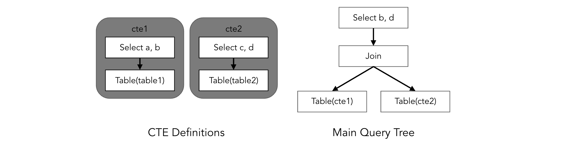

# Proposal: Non-Recursive Common Table Expression

- Author(s):     [Pingyu](https://github.com/pingyu) (Ping Yu)
- Last updated:  2020-09-14
- Discussion at: https://github.com/pingcap/tidb/issues/17472

## Abstract

This proposal proposes to support the __Non-recursive Common Table Expression (CTE)__.

## Background

A common table expression (CTE) is a named temporary result set that exists within the scope of a single statement and that can be referred to later within that statement, possibly multiple times [6].

E.g.
```sql
WITH
  cte1 AS (SELECT a, b FROM table1),
  cte2 AS (SELECT c, d FROM table2)
SELECT b, d FROM cte1 JOIN cte2
WHERE cte1.a = cte2.c;
```

Using CTE can achieve these goals [4][7]:
* Simplifying the query, making it more readable
* Allowing a recursive entity to be enumerated without the need for recursive-stored procedures (proposed in another [document](https://github.com/pingyu/tidb/blob/executor_recursive_cte/docs/design/2020-08-08-recursive-common-table-expression.md)), to deal with tree or graph data [8].
* Improve performance in some scenario by evaluating a complex expression only once.

Related issues:
* [#6824](https://github.com/pingcap/tidb/issues/6824) request to support recursive common table expression
* [#17916](https://github.com/pingcap/tidb/issues/17916) request to support common table expression to run TPC-DS and other analytic workloads
* [pingcap/parser#289](https://github.com/pingcap/parser/issues/289) request to support common table expression to be compatible with MySQL 8.0
* [#18752](https://github.com/pingcap/tidb/issues/18752) request CTE to deal with graph data

## Proposal

We design two strategies for CTE: __Inline__ & __Materialization__:

#### Inline
The CTE is expanded on where it's referenced:
```sql
WITH cte(k, v) AS (SELECT i, j FROM t1)
SELECT v FROM cte WHERE k > 10
UNION DISTINCT
SELECT v FROM cte WHERE k < 100
```
After "inline":
```sql
SELECT v FROM (SELECT i AS k, j AS v FROM t1) WHERE k > 10
UNION DISTINCT
SELECT v FROM (SELECT i AS k, j AS v FROM t1) WHERE k < 100
```

We will add some rules to rewrite the plan trees, similar to `subquery optimization` [2].

#### Materialization
A CTE is executed first, and the result is stored temporarily during the statement execution.

And on each point the CTE is referenced, the tuples of CTE is read from the temporary storage.

To improve performance, the temporary result is stored in memory first, then spill to disk if out of memory quota, similar to disk-based executors [3].

Besides, [4] introduces a `Producer-Consumer` model. We can utilize this model to make writing and reading of CTE parallel.



#### Optimization
For `Inline` strategy, most existed rules for subquery can be reused.

For `Materialization` strategy, disjunction of all predicates on top can be push down to CTE [4].

Finally, the costs should be estimated, to determine which strategy is better for each CTE.

## Rationale

Mainstream database systems utilize `Inline` and `Materialization` to implement CTE.

* MySQL using two strategies: 1) Inline the derived table into the outer query block, and 2) Materialize the derived table to an internal temporary table [1].

* MariaDB using `Materialization` as basic algorithm. To optimize performance, MariaDB using `Inline` strategy, and utilizes "Condition Pushdown" [5].

* Greenplum also using `Inline` and `Materialization`, and utilize rules and cost-bases algorithm to optimize execution plan. Moreover, Greenplum introduces a producer-consumer model to implement `Materialization` [4].

* Postgresql have always used `Materialization` strategy, and introduced `Inline` in a recent commit [9][10].

* CockroachDB uses `Materialization` strategy by default, but chooses `Inline` strategy when 1) see `NO MATERIALIZED` hint, or 2) the CTE has no side-effect and is referenced only once [11][12].


## Implementation

1. Stage 1: `Inline` should be not difficult. A rewrite rule is enough, similar to rewriting subquery[2].
2. Stage 2: Implement `Materialization`, by storing chunks temporarily in memory or disk.
3. Stage 3: `Predicate Push-down` for `Materialization`, and cost estimate for both strategies.


## Open issues
[TiDB#17472: support common table expression](https://github.com/pingcap/tidb/issues/17472)

## References
1. [MySQL 8.0 Reference Manual, 8.2.2.4 Optimizing Derived Tables, View References, and Common Table Expressions with Merging or Materialization](https://dev.mysql.com/doc/refman/8.0/en/derived-table-optimization.html)
2. [Subquery Optimization in TiDB](https://pingcap.com/blog/2016-12-07-Subquery-Optimization-in-TiDB/)
3. [Consider using a disk-based hash table for hash join avoiding OOM](https://github.com/pingcap/tidb/issues/11607)
4. [Optimization of Common Table Expressions in MPP Database Systems](http://www.vldb.org/pvldb/vol8/p1704-elhelw.pdf)
5. [Implementing Common Table Expressions for MariaDB](https://seim-conf.org/media/materials/2017/proceedings/SEIM-2017_Full_Papers.pdf#page=13)
6. [MySQL 8.0 Reference Manual, 13.2.15 WITH (Common Table Expressions)](https://dev.mysql.com/doc/refman/8.0/en/with.html)
7. [Common Table Expression - WITH Statement](https://www.researchgate.net/publication/242270488_Common_Table_Expression_-_WITH_Statement)
8. [Introduction to MySQL 8.0 Recursive Common Table Expression, Part 2](https://www.percona.com/blog/2020/02/13/introduction-to-mysql-8-0-recursive-common-table-expression-part-2/)
9. [Allow user control of CTE materialization, and change the default behavior.
](https://git.postgresql.org/gitweb/?p=postgresql.git;a=commitdiff;h=608b167f9f9c4553c35bb1ec0eab9ddae643989b)
10. [WITH Queries: Present & Future](https://info.crunchydata.com/blog/with-queries-present-future-common-table-expressions)
11. [Cockroach codes, with_funcs.go:CanInlineWith](https://github.com/cockroachdb/cockroach/blob/master/pkg/sql/opt/norm/with_funcs.go#L18)
12. [Cockroachdb: opt: Support AS MATERIALIZED option in CTEs](https://github.com/cockroachdb/cockroach/issues/45863)
