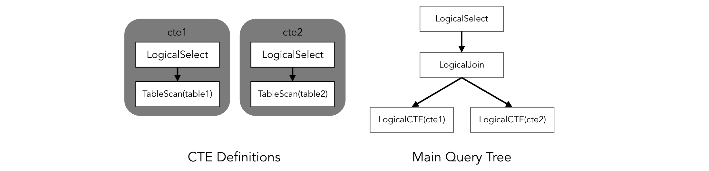

# Proposal: Non-Recursive Common Table Expression

- Author(s):     [Pingyu](https://github.com/pingyu) (Ping Yu)
- Last updated:  2020-10-18
- Discussion at: https://github.com/pingcap/tidb/issues/17472


## Abstract

This proposal proposes to support the __Non-recursive Common Table Expression (CTE)__.


## Background

A common table expression (CTE) is a named temporary result set. It is similar to subroutines in programming languages: they can be referenced from multiple places in a query and may refer to themselves, providing recursive queries [[5]](http://ceur-ws.org/Vol-1864/paper_6.pdf)[[6]](https://dev.mysql.com/doc/refman/8.0/en/with.html).

E.g.
```sql
WITH
  cte1 AS (SELECT a, b FROM table1),
  cte2 AS (SELECT c, d FROM table2)
SELECT b, d FROM cte1 JOIN cte2
WHERE cte1.a = cte2.c;
```

Using CTE can achieve these goals [[4]](http://www.vldb.org/pvldb/vol8/p1704-elhelw.pdf)[[7]](https://www.researchgate.net/publication/242270488_Common_Table_Expression_-_WITH_Statement):
* Simplifying the query, making it more readable
* Allowing a recursive entity to be enumerated without the need for recursive-stored procedures (proposed in another [document](https://github.com/pingyu/tidb/blob/executor_recursive_cte/docs/design/2020-08-08-recursive-common-table-expression.md)), to deal with tree or graph data [[8]](https://www.percona.com/blog/2020/02/13/introduction-to-mysql-8-0-recursive-common-table-expression-part-2/).
* Improve performance in some scenario by evaluating a complex expression only once.

Related issues:
* [#6824](https://github.com/pingcap/tidb/issues/6824) request to support recursive common table expression
* [#17916](https://github.com/pingcap/tidb/issues/17916) request to support common table expression to run TPC-DS and other analytic workloads
* [pingcap/parser#289](https://github.com/pingcap/parser/issues/289) request to support common table expression to be compatible with MySQL 8.0
* [#18752](https://github.com/pingcap/tidb/issues/18752) request CTE to deal with graph data


## Proposal

### Parsing Phase
In AST, CTE definitions are represented as trees, stored as metadata in query scope. While CTE references are represented as virtual tables.


### Optimization Phase
First of all, we build physical plan from AST.



Then, we design two strategies for CTE: __Merge__ & __Materialization__:

#### A. Merge
_(`Merge` is also called `Inline` is some other DBMS [[4]](http://www.vldb.org/pvldb/vol8/p1704-elhelw.pdf)[[11]](https://github.com/cockroachdb/cockroach/blob/fef86947262bd1691ec771193535d62b892d007a/pkg/sql/opt/norm/with_funcs.go#L18))_

The CTE is expanded on where it's referenced:

```sql
WITH
  cte1 AS (SELECT a, b FROM table1),
  cte2 AS (SELECT c, d FROM table2)
SELECT b, d FROM cte1 JOIN cte2
WHERE cte1.a = cte2.c;
```

After "merged":

```sql
SELECT b, d FROM (SELECT a, b FROM table1) s_cte1
JOIN (SELECT c, d FROM table2) s_cte2
WHERE s_cte1.a = s_cte2.c;
```


We will add a `rule_merge_cte` as the first rule of logical optimizer. `rule_merge_cte` replaces `LogicalCTE` nodes by logical plan tree of corresponding CTE, similar to `subquery optimization` [[2]](https://pingcap.com/blog/2016-12-07-Subquery-Optimization-in-TiDB/).

After the replacement, following procedure are just the same as other statements.

#### B. Materialization
A CTE is first executed and stored result temporarily during the statement execution. Then, on each point the CTE is referenced, the tuples of CTE is read from the temporary storage.

To improve performance, the temporary result is stored in memory first, then spill to disk if out of memory quota, similar to disk-based executors [[3]](https://github.com/pingcap/tidb/issues/11607). _(So `Materialization` is independent to temporary table now. But implementation of temporary table can be reused by CTE, view, and subquery. When we have a good implementation of temporary table, `Materialization` of CTE can migrate to it)_

Moreover, we introduces a `Producer-Consumer` model. We utilize this model to implement multiple references of a CTE, and enable producing and consuming CTE tuples in a parallel manner [[4]](http://www.vldb.org/pvldb/vol8/p1704-elhelw.pdf).

Finally, other optimization should be inspected later to further improve performance, e.g., pushing down disjunction of all predicates [[4]](http://www.vldb.org/pvldb/vol8/p1704-elhelw.pdf).


#### C. Choose Better Strategy
We choose `Merge` or `Materialization` by heuristic rules. As the `Merge` must be done in logical optimization phase, it is infeasible to make the choice by cost.

A CTE is not mergeable when:
* It is not constant (having user-defined variable assignment).
* It is referenced by many (e.g. more than 5) times.
* Optimizer hints say that it should not be merge. See __"Optimizer Hints"__

If a CTE is mergeable, we will merge it. Otherwise, we will materialize it.


### Optimizer Hints
To be compatible to MySQL [[1]](https://dev.mysql.com/doc/refman/8.0/en/derived-table-optimization.html), we propose these hints:
* __MERGE__: indicates the CTE should be merged.
* __NO_MERGE__: indicates the CTE should be materialized.

E.g.
```sql
WITH
  cte1 AS (SELECT a, b FROM table1),
  cte2 AS (SELECT c, d FROM table2)
SELECT /*+ MERGE(cte1) NO_MERGE(cte2) */ cte1.b, cte2.d
FROM cte1 JOIN cte2
WHERE cte1.a = cte2.c;
```
_(cte1 should be merged and cte2 should be materialized)_


## Rationale

Mainstream database systems utilize `Merge` and `Materialization` to implement CTE.

In these DBMS, `Merge` is preferred when the CTE has no side-effect, and is referenced in a very few times. `Materialization` should be avoid if possible.

If `Materialization` is necessary, these optimizations can be applied:
1. Materialized in memory [[13]](https://dev.mysql.com/doc/refman/8.0/en/subquery-materialization.html).
2. Postpones until its contents are needed [[1]](https://dev.mysql.com/doc/refman/8.0/en/derived-table-optimization.html).
3. Add index(es) according to access method [[1]](https://dev.mysql.com/doc/refman/8.0/en/derived-table-optimization.html).
4. Pushdown predicates, and pushdown disjunction of all predicates if referenced multiple times [[4]](http://www.vldb.org/pvldb/vol8/p1704-elhelw.pdf)[[5]](http://ceur-ws.org/Vol-1864/paper_6.pdf).

#### MySQL
MySQL using these two strategies: 1) Merge the derived table into the outer query block, or 2) Materialize the derived table to an internal temporary table [[1]](https://dev.mysql.com/doc/refman/8.0/en/derived-table-optimization.html). The optimizer most often merge, except that [[14]](https://dev.mysql.com/worklog/task/?id=883)[[15]](https://github.com/mysql/mysql-server/blob/f8cdce86448a211511e8a039c62580ae16cb96f5/sql/sql_resolver.cc#L3358):
* Optimizer hints specifies [NO_MERGE](https://dev.mysql.com/doc/refman/8.0/en/optimizer-hints.html#optimizer-hints-table-level), or [optimizer_switch](https://dev.mysql.com/doc/refman/8.0/en/server-system-variables.html#sysvar_optimizer_switch)'s `derived_merge` is __OFF__.
* CTE is not mergeable because having the following structure [[16]](https://github.com/mysql/mysql-server/blob/f8cdce86448a211511e8a039c62580ae16cb96f5/sql/sql_lex.cc#L3727):
  *  Union (implementation restriction) _(TODO: why?)_
  *  Aggregation/Having/Distinct (A general aggregation cannot be merged with a non-aggregated one)
  *  Limit
  *  Window _(TODO: why?)_
* Heuristic does not suggest merge [[16]](https://github.com/mysql/mysql-server/blob/f8cdce86448a211511e8a039c62580ae16cb96f5/sql/sql_lex.cc#L3751):
  * CTE is not constant (having user-defined variable assignment).
  * Contains subqueries in the SELECT list that depend on columns from itself, because MySQL assumes that user wants subquery to be materialized.

#### MariaDB
MariaDB using `Materialization` as basic algorithm. Similar to MySQL, to optimize performance, MariaDB will always try to use `Merge` strategy, and fall back to materialization due to side-effect [[18]](https://github.com/MariaDB/server/blob/5b8ab1934a10966336e66751bc13fc66923b02f6/sql/table.cc#L9224).

Besides, MariaDB supports "Condition Pushdown" [[5]](http://ceur-ws.org/Vol-1864/paper_6.pdf) and "Lateral Derived Optimization" [[18]](https://www.slideshare.net/SergeyPetrunya/mariadb-103-optimizer-where-does-it-stand)[[19]](https://mariadb.com/kb/en/lateral-derived-optimization/)

#### Greenplum
Greenplum also using `Merge` and `Materialization`, and utilize rules and cost-bases algorithm to optimize execution plan. Moreover, Greenplum introduces a producer-consumer model to implement `Materialization` [[4]](http://www.vldb.org/pvldb/vol8/p1704-elhelw.pdf).

#### Postgresql
Postgresql have always used `Materialization` strategy, and introduced `Merge` in a recent commit [[9]](https://git.postgresql.org/gitweb/?p=postgresql.git;a=commitdiff;h=608b167f9f9c4553c35bb1ec0eab9ddae643989b)[[10]](https://info.crunchydata.com/blog/with-queries-present-future-common-table-expressions).

#### CockroachDB
CockroachDB uses `Materialization` strategy by default, but chooses `Merge` strategy when 1) see `NO MATERIALIZED` hint, or 2) the CTE has no side-effect and is referenced only once [[11]](https://github.com/cockroachdb/cockroach/blob/master/pkg/sql/opt/norm/with_funcs.go#L18)[[12]](https://github.com/cockroachdb/cockroach/issues/45863).


## Implementation

1. Stage 1: `Merge` should be not difficult. A rewrite rule is enough, similar to rewriting subquery [[2]](https://pingcap.com/blog/2016-12-07-Subquery-Optimization-in-TiDB/).
2. Stage 2: Implement `Materialization`, by storing chunks temporarily in memory or disk.
3. Stage 3: `Predicate Push-down` for `Materialization`, and estimate cost for both strategies.


## Open issues
[TiDB#17472: support common table expression](https://github.com/pingcap/tidb/issues/17472)


## References
1. [MySQL 8.0 Reference Manual, 8.2.2.4 Optimizing Derived Tables, View References, and Common Table Expressions with Merging or Materialization](https://dev.mysql.com/doc/refman/8.0/en/derived-table-optimization.html)
2. [Subquery Optimization in TiDB](https://pingcap.com/blog/2016-12-07-Subquery-Optimization-in-TiDB/)
3. [Consider using a disk-based hash table for hash join avoiding OOM](https://github.com/pingcap/tidb/issues/11607)
4. [Optimization of Common Table Expressions in MPP Database Systems](http://www.vldb.org/pvldb/vol8/p1704-elhelw.pdf)
5. [Implementing Common Table Expressions for MariaDB](http://ceur-ws.org/Vol-1864/paper_6.pdf)
6. [MySQL 8.0 Reference Manual, 13.2.15 WITH (Common Table Expressions)](https://dev.mysql.com/doc/refman/8.0/en/with.html)
7. [Common Table Expression - WITH Statement](https://www.researchgate.net/publication/242270488_Common_Table_Expression_-_WITH_Statement)
8. [Introduction to MySQL 8.0 Recursive Common Table Expression, Part 2](https://www.percona.com/blog/2020/02/13/introduction-to-mysql-8-0-recursive-common-table-expression-part-2/)
9. [Postgresql: Allow user control of CTE materialization, and change the default behavior](https://git.postgresql.org/gitweb/?p=postgresql.git;a=commitdiff;h=608b167f9f9c4553c35bb1ec0eab9ddae643989b)
10. [WITH Queries: Present & Future](https://info.crunchydata.com/blog/with-queries-present-future-common-table-expressions)
11. [CockroachDB codes, with_funcs.go:CanInlineWith](https://github.com/cockroachdb/cockroach/blob/fef86947262bd1691ec771193535d62b892d007a/pkg/sql/opt/norm/with_funcs.go#L18)
12. [CockroachDB: opt: Support AS MATERIALIZED option in CTEs](https://github.com/cockroachdb/cockroach/issues/45863)
13. [MySQL 8.0 Reference Manual, 8.2.2.2 Optimizing Subqueries with Materialization](https://dev.mysql.com/doc/refman/8.0/en/subquery-materialization.html)
14. [MySQL WL#883: Non-recursive WITH clause (Common Table Expression)](https://dev.mysql.com/worklog/task/?id=883)
15. [MySQL codes, sql_resolver.cc](https://github.com/mysql/mysql-server/blob/f8cdce86448a211511e8a039c62580ae16cb96f5/sql/sql_resolver.cc)
16. [MySQL codes, sql_lex.cc](https://github.com/mysql/mysql-server/blob/f8cdce86448a211511e8a039c62580ae16cb96f5/sql/sql_lex.cc)
17. [MariaDB codes, table.cc](https://github.com/MariaDB/server/blob/5b8ab1934a10966336e66751bc13fc66923b02f6/sql/table.cc)
18. [MariaDB 10.3 Optimizer - where does it stand](https://www.slideshare.net/SergeyPetrunya/mariadb-103-optimizer-where-does-it-stand)
19. [MariaDB Knowledge Base - Lateral Derived Optimization](https://mariadb.com/kb/en/lateral-derived-optimization/)
