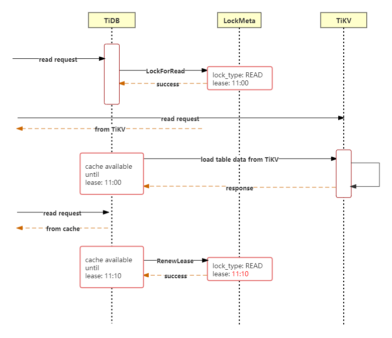
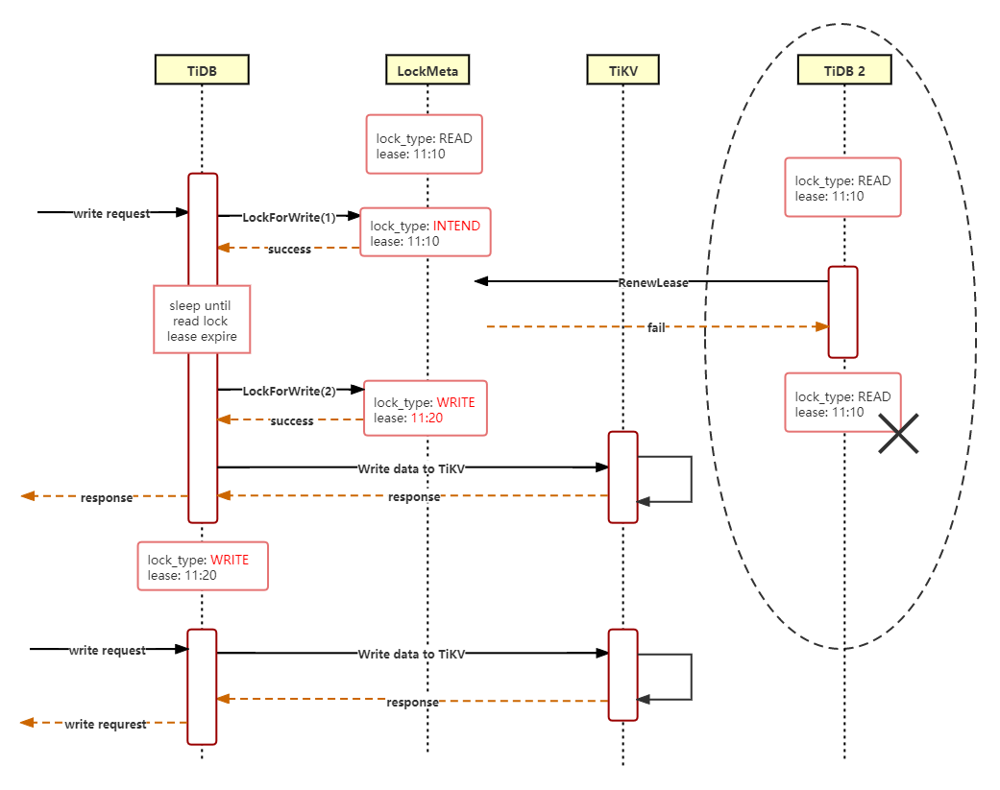

# Proposal: Caching a table in memory

- Author(@tiancaiamao)
- Discussion PR: https://github.com/pingcap/tidb/pull/23673
- Tracking Issue: https://github.com/pingcap/tidb/issues/25293

## Introduction

For a small, frequently visited, and rarely changed table, caching the whole table in memory in the TiDB server can improve performance.

## Motivation or Background

For tables that are too small, they are located in just one region, that region would become a hotspot, and such hotspots would cause a performance bottleneck. By directly caching the small table data in the TiDB layer, such hotspot issues can be solved.

We are caching tables for some scenarios already, in a way we're not realized. For example, our handling of global variables. To prevent row-at-a-time loading of each system variable from TiKV, we needed to implement the [sysvar cache](https://github.com/pingcap/tidb/pull/24359). This helps reduce `show variables like ..` latency, but the data set is small and the problem is very generic. It also doesn't help in cases where system variables read from `mysql.tidb` instead, which does not have a cache. The data of privilege related tables are also cached.

It can also be used to improve the performance of join. The cached table could be used as the inner table, cutting down the network cost of loading data to TiDB. An example is the TPC-C test, there is an ITEM table. It stores the information of all the goods sold by the sales company, including the name and price of the goods. During the execution of the "order creation" transaction, the data in this table is used to determine the price of the order. Such a table is also a typical scenario that can be optimized.

Last but not least, this feature is a voice from our customers. They meet the hotspot region problem, but they think it's too risky to enable follower read or coprocessor cache which may affect the whole cluster (according to their business model, they provide storage service to their customers, and the cluster is shared, they try to avoid a single change affecting the entire users).

## Detailed Design

If the update operation is not supported at all, the use case would be too limited. So even if we trade writing ability for reading performance, we should at least support updating.

### Key algorithm

There is a conceptual "read-write" lock to implement the caching operation.

Before caching the data, the table needs to hold a "read lock", so that the data will not be modified afterward. This "read lock" is a record providing some meta-information. All modifications must check the lock meta-information first. If the record is in the read-locked state, modifications are forbidden.

The "read" lock needs to maintain a lease for a while, and the lease should be renewed continuously. The underlying data will be safe as long as the read lock lease hold.

When performing a modification, the meta-information should be checked first. If there is a "read" lock, the "read" lock needs to be upgraded to a "write intend" lock. This step prevents the read lock from renewing the lease. After the lease expires, the meta status is change to "write" lock, write operation can be performed afterward. And after the write operation finishes, the "write" lock should be cleared, so that the subsequent "read" lock can be added and the data can be cached again.

The "write" lock also needs a TTL(time to live) to handle abnormal situations. For example, if the TiDB server crashes after the write lock succeeds, TTL gives us a hint of how to clean the orphan write lock.

Put all things together, we have this interface:

```
type StateRemote interface {
    Load()
    LockForRead()
    LockForWrite()
    RenewLease()
    WriteAndUnlock()
}
```

### Management of lock meta information

What’s the granularity of the lock? One option is to implement the meta lock at the key-value level. The advantage is that the granularity is finer and the updating performance is better. If we cache the key-value record, modifying one key would not affect the cache of the other keys. The disadvantage is that this will invade the current transaction layer implementation, and make our transaction more complex. Considering the current implementation of the transaction is very complex already, it is not wise to do so.

The other option is to implement the meta lock at the table level. Each table corresponds to one meta lock record. As long as any key of the table is modified, the table cache becomes invalid. Assuming that we only deal with small tables, and this table is updated infrequently, this option should be acceptable.

For updating operation, the `StateRemote` interface needs to be implemented. The following part of this section describes the management of lock meta information, where it should be stored, and how it is used.

Such a table could be used to store the meta-information:

```
CREATE TABLE mysql.table_cache_meta (
   tid int primary key,
   lock_type enum('NONE','READ','INTEND','WRITE'),
   lease uint64,
   oldReadLease uint64,
);
```

This table contains the `tid`, `lock_type` and `lease` information.

- `tid` records the ID of the table being cached
- `lock_type` decides whether the current state is read locked or write locked etc
- `lease` is used for the read locks lease renewal, and also for cleanup the write locks
- `oldReadLease` is necessary when the `lock_type` is 'INTEND', it stores the old read lease

LockForRead() corresponds to this operation:

```
update table_cache_meta set lock ='READ', lease = %? where  tid = %? and lock !='WRITE'
```

RenewLease() corresponds to this operation:

```
update table_cache_meta set lease = %? where tid = %? and lock ='READ'
```

LockForWrite() corresponds to this operation:

```
update table_cache_meta set lock ='INTEND' and oldLease = %? and lease = %?' where tid = %?
sleep() // wait read lease gone
update table_cache_meta set lock ='WRITE' and lease = %?' where tid = %?
```

### Caching and writing process

The way to store the in-memory cached of the table data is the same with the [temporary table](2021-04-20-temporary-table.md).
In short, the KV data of the table is loaded from TiKV, and is stored in a MemBuffer. To read that data, an extra UnionScan executor is used.


A `CachedTable` struct will be introduced. It inherits and overloads the `Table` interface. `loadSchema` will periodically load the table information on schema change. For a cached table, the `CachedTable` will be reconstructed.

`CachedTable` implements the `Table` interface, and overloads the `AddRecord` method. When `AddRecord` is called, the lock meta information needs to be checked first. This operation needs to acquire the "write" lock, that is to say, make the `lock_type` field of the meta table to 'WRITE'. After confirming that the lease time of the previous 'READ' lock has expired, the operation can be executed.

The read operation flow diagram:




The write operation flow diagram:




### How to enable this feature

The syntax of OceanBase's replicated table is to add the `DUPLICATE_SCOPE` option after the CREATE TABLE statement.

I propose to use "ALTER TABLE t [CACHE|NOCACHE]" for the syntax. This is a switch that can be turned on or off. A user can decide to use it by themself. The write performance will become very bad after caching.

"ALTER TABLE t CACHE" is a DDL operation. Assuming that all the TiDB instances know that a table is not cached, there is no correctness problem; Assuming that all tidb instances make a consensus that a table is cached, the correctness is guaranteed by the locking algorithm mentioned before. However, during the DDL operation, if some TiDB instances think that the cache is enabled, while some other instances think that the cache is not enabled, there would be a correctness issue. 

To address that problem, an intermediate `Switching` state is introduced, the schema change process is similar to the LOCK TABLE statement's implementation:

> Disabled => Switching => Enabled

- In the Disabled state, all TiDB instances know that there is no cache for the table, it can be read and written normally.
- In the Enabled state, all TiDB instances know that the table is cached, and the "lock" meta information should be checked before reading and writing.
- In the switching state, all read operation goes to the original table; and write operation needs to check the "write lock" first.

The cluster may have Disabled and Switching, or Switching and Enabled on different TiDB instances at the same time, but Disabled and Enabled will not coexist at the same time.

### Compatibility

The entry of the feature is the 'ALTER TABLE' statement. If the user does not explicitly call it, there will be no impact.

Metadata management will introduce persistent data. The old version TiDB does not access or use the meta-data, so there should not be any problem when upgrading or downgrading.

It is unsafe to mix the old and new versions of TiDB when using cached tables. Rolling updates are safe, but there is a risk that if an old version of a TiDB server re-joins after a table is in cached 'Enabled' state it could modify the contents in an unsafe manner. Currently _downgrade_ is not technically supported by TiDB, but there is no technical mechanism which prevents an older versioned binary joining a newer versioned cluster. We need to solve this issue to perform meta-data upgrades, but it is currently blocked in the requirements phase, because we have not decided from which versions upgrade/downgrade will be supported.

## Investigation & Alternatives

### OceanBase's replicated table

> "In order to cope with the high and low frequency of application access and the low-frequency access to small tables that can always access the latest data, and at the same time to ensure data consistency, currently we can only choose the solution of strong consistent read access to Leader data. However, due to the high access frequency, Leader is easy to become a performance bottleneck. In order to solve the problem of "small table broadcast" demand scenario, OceanBase 2.x version combines its own architecture to provide a copy table function, copying the copy of the related small table to all the OBServers of the tenant of the table. The table says to replicate the table, these copies are called replicas. The update transaction of the replicated table guarantees that the data is synchronized to all full-function replicas and replicas when committing, ensuring that the update transaction can be read on any OBServer of the tenant after the successful commit of the update transaction. Transaction modified data." 

Refer to https://zhuanlan.zhihu.com/p/78402011

The biggest challenge of copying data to multiple machines is that the modification of data must take effect on all machines in real time, otherwise some machines read the new data and the other part reads the old data. This must be a function that does not meet the needs of users. OceanBase uses a special broadcast protocol to ensure the copy consistency of the replicated table. When the replicated table is modified, all the copies will be modified at the same time. Moreover, the modification operation will only take effect when the copies on all machines are modified successfully.

In a distributed system, another thorny problem will arise again. If a machine fails during the process of modifying the replicated table, and the replica of the replicated table on the failed machine cannot be modified, then the replicated table can no longer be modified? If this problem is not solved, the replication table will drag down the user's operation in the event of a machine failure. Ocean Base uses a lease mechanism to solve this problem. The valid copy of the replicated table on each machine will get a lease. When the replicated table is modified, the modification must be synchronized to all leased replicas. In the event of a machine failure, the lease of the replicated table copy on the failed machine becomes invalid, and the invalidated copy will not be synchronized with new modifications, so subsequent modification operations of the replicated table will not be blocked. The invalid copy will also refuse the read operation to ensure that the old data will not be read. When the invalid copy is restored, the missing data can be chased up, and the lease will be re-granted after it catches up to the latest state."
Reference https://developer.aliyun.com/article/750271

They are optimized for join's small table broadcast. The agreement was successfully made from the majority to all copies, and write performance was sacrificed in exchange for read performance and consistency. At the implementation level, if you look at it from another perspective, OB is a table-level synchronization, which is equivalent to adding a learner role to the raft layer as a copy table.

### Reference Tables of SingleStore (formerly MemSQL)

> "Reference tables are relatively small tables that do not need to be distributed and are present on every node in the cluster. Reference tables are implemented via primary-secondary replication to every node in the cluster from the master aggregator."

Reference https://docs.singlestore.com/v7.3/key-concepts-and-features/physical-schema-design/other-schema-concepts/reference-tables/

### Collocated tables of YugaByteDB

They put related tables on the same node, which facilitates operations such as joins to reduce network-level overhead. These tables can be cut to multiple tablets, but Colocated tables are deliberately not cut. It is not a concept of caching, but it is also a scenario where the broadcast of join small tables can be optimized.

> "The assumptions behind tables that are collocated is that their data need not be automatically shared and distributed across nodes"

Reference https://docs.yugabyte.com/latest/architecture/docdb-sharding/colocated-tables/
https://github.com/yugabyte/yugabyte-db/blob/master/architecture/design/ysql-colocated-tables.md

### Oracle also has a similar feature

https://logicalread.com/oracle-11g-caching-table-in-memory-mc02/#.YFvijK_7QuU

