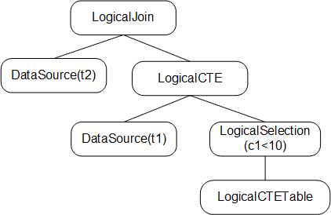
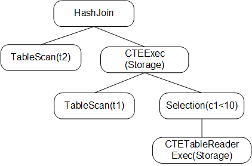

<!--
This is a template for TiDB's change proposal process, documented [here](./README.md).
-->

# Proposal: Support Common Table Expression

- Author(s):     [@wjhuang2016](https://github.com/wjhuang2016) [@guo-shaoge](https://github.com/guo-shaoge)
- Last updated:  2021-04-18
- Discussion at: https://github.com/pingcap/tidb/issues/17472 <!-- https://github.com/pingcap/tidb/issues/XXX -->

## Table of Contents

* [Introduction](#introduction)
* [Motivation or Background](#motivation-or-background)
* [Detailed Design](#detailed-design)
* [Test Design](#test-design)
    * [Functional Tests](#functional-tests)
    * [Scenario Tests](#scenario-tests)
    * [Compatibility Tests](#compatibility-tests)
    * [Benchmark Tests](#benchmark-tests)
* [Impacts & Risks](#impacts--risks)
* [Investigation & Alternatives](#investigation--alternatives)
* [Unresolved Questions](#unresolved-questions)
* [Future Work](#future-work)

## Introduction

This proposal describes the design of Common Table Expression.

## Motivation or Background

The Common Table Expression(CTE) is a temporary result set which exists within a statement. You can reference it later in the statement.
It's similar to derived tables in some way. But CTE has extra advantages over derived tables.

1. CTE can be referenced multiple times.
2. CTE is easier to read.
3. You can use CTE to do hierarchical queries.

There are two kinds of CTE:
1. non-recursive CTE.

    ```
    WITH
        cte1 AS (SELECT c1 FROM t1)
        cte2 AS (SELECT c2 FROM t2)
    SELECT cte1.c1, cte2.c2 FROM cte1, cte2 WHERE cte1.c1 = cte2.c2 AND cte1.c1 = 100;
    ```
2. recursive CTE, which can be used to do hierarchical queries. Recursive CTE normally consists of seed part and recursive part.
   Seed part will generate the origin data, the remaining computation will be done by recursive part.

    ```
    WITH RECURSIVE cte1 AS (
        SELECT part, sub_part FROM t WHERE part = 'human'
        UNION ALL
        SELECT t.part, t.sub_part FROM t, cte1 WHERE cte1.sub_part = t.part
    )
    SELECT * FROM cte1;
    ```

## Detailed Design
### Overview
There are two ways to implement CTE:
1. Merge: just like view, CTE is expanded on where it's used.
2. Materialization: use temporary storage to store the result of CTE, and read the temporary storage when use CTE.

`Merge` is normally a better way to implement CTE, because optimizer can pushdown predicates from outer query to inner query.
But when CTE is referenced multiple times, `Materialization` will be better. And recursive CTE can only be implemented by `Materialization`.

For simpilicity, this design doc only use `Materializatoin` to implement both non-recursive and recursive CTE.
So there is no need to consider how to choose between these two methods, so as to reduce the chance of bugs.
And in the near future, `Merge` will be definitely supported to implement non-recursive CTE.

`RowContainer` will be used to store the materialized result.
The result will first reside in memory, and when the memory usage exceeds `tidb_mem_quota_query`, intermediate results will be spilled to disk.

For recursive CTE, the optimizer has no way to accurately know the number of iteration. So we use seed part's cost as CTE's cost.
Also we will add a system variable `cte_max_recursion_depth` to control the max iteration number.
If the maximum iteration number is reached, an error will be returned.

A major advantage of `Materialization` is that data will only be materialized once even if there are many references to the same CTE.
So we will add a map to record all CTE's subplan, these subplans will only be optimized and executed once.

### New Data Structures
#### Logical Operator
```Go
type LogicalCTE struct {
	logicalSchemaProducer
	isDistinct bool
	seedPartPlanID int
	recursivePartPlanID int
}
```

`LogicalCTE` is logical operator for CTE:
1. `isDistinct` is true if CTE is recursive and `UNION [DISTINCT]` is used to connected seed part and recursive part.
2. `seedPartPlanID` is the plan id of seed part's logical plan. We will add a map[PlanID]Plan in stmt ctx to record plans used by CTE.
    Different reference of the same CTE will use same seed/recursive part's plan.
3. `recursivePartPlanID` is the plan id of recursive part's logical plan.

```Go
type DataSource struct {
    ...
    refCTEID int
}
```
`refCTEID` will be add as a member of DataSource. This DataSource will be used to read result of each iteration during the execution of recursive CTE.

#### Physical Operator
`PhysicalCTE` and `PhysicalTempTableReader` will be added corresponding to `LogicalCTE` and `DataSource`.

#### Executor
`CTEExec` and `TempTableReaderExec` will be added corresponding to `PhysicalCTE` and `PhysicalTempTableReader`.

#### CTEStorage
```Go
type CTEStorage interface {
    OpenAndRef() bool
    DerefAndClose() (is_closed bool, err error)
    Add(chk *Chunk, iter int) error
    GetIterChunkIds(iter int) ([]int, error)
    GetChunk(chkId int) (*Chunk, error)
}
```
`CTEStorage` will be added as a member of `CTEExec` and `TempTableReaderExec`.
`TempTableReaderExec` reads data of a specific iteration and returns to its parent operator for calculation.
Then `CTEExec` reads the calculation result and writes to `CTEStorage`.

Since there will be multiple executors using one `CTEStorage`, we use a ref count to record how many users currently there are.
When the last user calls Close(), the `CTEStorage` will really be closed.

1. `OpenAndRef()`: Open this `CTEStorage`, if already opend, add ref count by one.
2. `DerefAndClose()`: Dref and check if ref count is zero, if ture, the underlying storage will be truly closed.
3. `Add()`: Add chunk into storage.
4. `GetIterChunkIds()`: Get all chunk ids for specific iteration.
5. `GetChunk()`: Get chunk by chunk id.

### Life of a CTE
#### Parsing
The syntax will be compatible with [MySQL](https://dev.mysql.com/doc/refman/8.0/en/with.html).

In parsing phase, definition of CTE will be parsed as a subtree of the outermost select stmt.

#### Logical Plan
The parsing phase will generate a AST tree, which will be used to generate `LogicalCTE`. This stage will complete the following steps:
1. Build logical plans of seed part and recursive part and store their plan id. The plans will be stored to a map in stmt ctx.
2. Do some validation check.

    2.1 mutual recursive(cte1 -> cte2 -> cte1) is not supported.

    2.2 column num of seed part and recursive part are same.
    
    2.3 all seed parts should follows recursive parts.

    2.4 recursive query blocks with UNION DISTINCT then UNION ALL are not supported.

    2.5 recursive parts cannot include: `ORDER BY`, `Aggregate Function`, `Window Function`, `DISTINCT`.

3. Recognize same CTE. If there are multiple references to the same CTE, `seedPartPlanID` and `recursivePartPlanID` of these references should be same.
   These plans will only be optimized only once.

We use the following SQL to illustrate:
```SQL
WITH RECURSIVE cte1 AS (SELECT c1 FROM t1 UNION ALL SELECT c1 FROM cte1 WHERE cte1.c1 < 10) SELECT * FROM t2 JOIN cte1;
```

The logical plan of above SQL will be like:



#### Physical Plan
In this stage, the `LogicalCTE` will be converted to `PhysicalCTE`. We just convert logical plans of seed part and recursive part to its physical plan.
Also DataSource will be converted to `PhysicalTempTableReader`.

The Physical Plan will be like:


#### Build Executor
Three structures will be constructed:
1. `CTEExec`: Evaluate seed part and recursive part iteratively.
2. `TempTableReaderExec`: Read result of previous iteration and return result to parent operator.
3. `CTEStorage`: This is where the materialized results stored. `CTEExec` will write it and `TempTableReaderExec` will read it.

The executor tree will be like:



#### Execution
The implementation of `CTEExec` is as follows. It first checks whether `CTEStorage` is filled, if not, it will compute seed part and recursive part to fill `CTEStorage`.
So the `CTEStorage` will only be filled by first executed `CTEExec`, and other `CTEExec` which references to the same `CTEStorage` just reads it.

```Go
func (e *CTEExec) Next(req *Chunk) {
    // 1. the first executed CTEExec will be responsible to fill storage.
    if !e.storage.Done() {
        // 1.1 compute seed part.
        // 1.2 compute recursive part iteratively.
        e.storage.SetDone()
    }
    // 2. return chunk in e.storage
}
```

The filling of `CTEStorage` is done by `CTEExec` and `TempTableReaderExec` together. The following figure describes the process.


The data of iter_0 is generated by computing seed part and stored into `CTEStorage`. Data of iter_i is generated as follows:
1. `CTEExec` call child's next() method, then `TempTableReaderExec` will read iter_i-1 data from `CTEStorage`.
2. Data is returnd to `Selection`.
3. `Selection` filter data and return it to `CTEExec`.
4. `CTEExec` stores the result to `CTEStorage`, and the result labeled as iter_1 data.

The above steps will continue to iterate until:
1. No data is generated by recursive part.
2. Iteration number reachs `cte_max_recursion_depth`.
3. Execution time reachs `max_execution_time`

## Test Design

### Functional Tests

1. Basic usage of non-recursive and recursive CTE.
2. Define a new CTE within a CTE.
3. Use CTE in subquery.
4. Use CTE in UPDATE/DELETE/INSERT statements.
5. CTE name conflicts with other table name.
6. Join CTE with other tables/CTE.
7. Use expression with CTE.

### Scenario Tests

We should test CTE used together with other features:
1. Use CTE with PREPARE/EXECUTE/PlanCache.
2. Use CTE with partition table.
3. Stale read.
4. Clustered index.

### Compatibility Tests

None

### Benchmark Tests

We should know the performance of recursive/non-recursive CTE compared with Oracle and MySQL.

## Impacts & Risks

CTE is a new feature and it will not affect the overall performance.
But for now we only use materialization to implement non-recursive CTE. Performance may not be as good as MySQL in some scenarios.

## Investigation & Alternatives

### Choose between Merge and Materialization
Most mainstream DBMS use `Merge` and `Materialization` to implement non-recursive cte, while recursive cte can only be implemented with `Materialization`.
`Merge` is perferred when there are no side effects.
But when CTE is referenced multiple times, `Materializatoin` may be better.

MySQL's use `Merge` except that:
1. Optimize hint [NO_MERGE](https://dev.mysql.com/doc/refman/8.0/en/optimizer-hints.html#optimizer-hints-table-level) is used.
2. There are constructs within subquery that prevent merging, such as: window function, aggregation or DISTINCT. [MySQL doc](https://dev.mysql.com/doc/refman/8.0/en/derived-table-optimization.html)

PostgreSQL use `Merge` except that:
1. User can specify by use [MATERIALIZED](https://www.postgresql.org/docs/13/queries-with.html) keyword.
2. The CTE has side-effects. This includes either not being a plain SELECT, or containing volatile functions.

CockroachDB uses `Materialization` except that:
1. User specify `NOT MATERIALIZED` hint.
2. CTE has side-effect and is referenced only once.

### Materialization
For `Materializatoin`, most DBMS use some kind of container to store materialized result,
which will be spilled to disk if the size is too large. The computation steps for recursive CTE are all similar.

But different system use different ways to try to optimize:
1. MySQL will try to postpone materilization.
2. MySQL will add index on temporary table if needed.
3. MariaDB will pushdown predicates to reduce the size of temporary table.

## Unresolved Questions

None

## Future Work
1. Support `Merge` and related hint(merge/no_merge).
2. Optimize `Materialization`, pushdown predicates to materialized table.
2. MPP support. `CTEExec` should be able to pushed to TiFlash.
