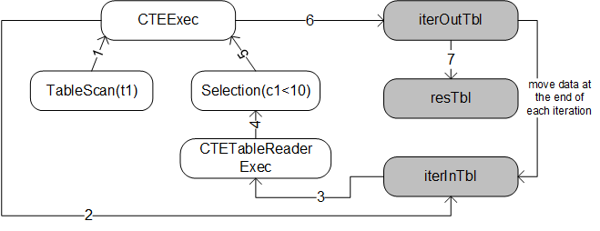

<!--
This is a template for TiDB's change proposal process, documented [here](./README.md).
-->

# Proposal: Support Common Table Expression

- Author(s): [@guo-shaoge](https://github.com/guo-shaoge), [@wjhuang2016](https://github.com/wjhuang2016)
- Discussion PR: https://github.com/pingcap/tidb/pull/24147
- Tracking Issue: https://github.com/pingcap/tidb/issues/17472

## Table of Contents

* [Introduction](#introduction)
* [Motivation or Background](#motivation-or-background)
* [Detailed Design](#detailed-design)
* [Test Design](#test-design)
    * [Functional Tests](#functional-tests)
    * [Scenario Tests](#scenario-tests)
    * [Compatibility Tests](#compatibility-tests)
    * [Benchmark Tests](#benchmark-tests)
* [Impacts & Risks](#impacts--risks)
* [Investigation & Alternatives](#investigation--alternatives)
* [Unresolved Questions](#unresolved-questions)
* [Future Work](#future-work)

## Introduction

This proposal describes the basic implementation of Common Table Expression(CTE) using the `Materialization` method.
`Merge` is another way to implement CTE and will be supported later.

## Motivation or Background

CTE was introduced in SQL:1999. It's a temporary result set which exists within a statement. You can reference it later in the statement.
It's similar to derived tables in some way. But CTE has extra advantages over derived tables.

1. CTE can be referenced multiple times.
2. CTE is easier to read.
3. You can use CTE to do hierarchical queries.

There are two kinds of CTE:
1. non-recursive CTE.

    ```SQL
    WITH
        cte1 AS (SELECT c1 FROM t1)
        cte2 AS (SELECT c2 FROM t2)
    SELECT cte1.c1, cte2.c2 FROM cte1, cte2 WHERE cte1.c1 = cte2.c2 AND cte1.c1 = 100;
    ```
2. recursive CTE, which can be used to do hierarchical queries. Recursive CTE normally consists of the seed part and the recursive part.
   Seed part will generate the origin data, the remaining computation will be done by the recursive part.

    ```SQL
    WITH RECURSIVE cte1 AS (
        SELECT part, sub_part FROM t WHERE part = 'human'
        UNION ALL
        SELECT t.part, t.sub_part FROM t, cte1 WHERE cte1.sub_part = t.part
    )
    SELECT * FROM cte1;
    ```

## Detailed Design
### Overview
There are two ways to implement CTE:
1. Merge: just like view, CTE is expanded on where it's used.
2. Materialization: use temporary storage to store the result of CTE, and read the temporary storage when using CTE.

`Merge` is normally a better way to implement CTE, because optimizer can pushdown predicates from outer query to inner query.
But when CTE is referenced multiple times, `Materialization` will be better. And recursive CTE can only be implemented by `Materialization`.

For simplicity, this design doc only uses `Materialization` to implement both non-recursive and recursive CTE.
So there is no need to consider how to choose between these two methods, so as to reduce the chance of bugs.
And in the near future, `Merge` will be definitely supported to implement non-recursive CTE.

`RowContainer` will be used to store the materialized result.
The result will first reside in memory, and when the memory usage exceeds `tidb_mem_quota_query`, intermediate results will be spilled to disk.

For recursive CTE, the optimizer has no way to accurately know the number of iterations. So we use the seed part's cost as CTE's cost.
Also we will add a system variable `cte_max_recursion_depth` to control the max iteration number.
If the maximum iteration number is reached, an error will be returned.

A major advantage of `Materialization` is that data will only be materialized once even if there are many references to the same CTE.
So we will add a map to record all CTE's subplan, these subplans will only be optimized and executed once.

### New Data Structures
#### Logical Operator
```Go
type LogicalCTE struct {
	logicalSchemaProducer

	cte       *CTEClass
	cteAsName model.CIStr
}

type CTEClass struct {
	IsDistinct bool
	seedPartLogicalPlan      LogicalPlan
	recursivePartLogicalPlan LogicalPlan
	IDForStorage int
	LimitBeg uint64
	LimitEnd uint64
}
```

`LogicalCTE` is the logical operator for CTE. `cte` is a member of `CTEClass` type.
The content of `CTEClass` will be the same if different CTE references point to the same CTE.

The meanings of main members in CTEClass are as follows:
1. `IsDistinct`: True if UNION [DISTINCT] and false if UNION ALL.
2. `seedPartLogicalPlan`: Logical Plan of seed part.
3. `recursivePartLogicalPlan`: Logical Plan of recursive part. It will be nil if CTE is non-recursive.
4. `IDForStorage`: ID of intermediate storage.
5. `LimitBeg` and `LimitEnd`: Useful when limit is used in recursive CTE.

```Go
type LogicalCTETable struct {
    logicalSchemaProducer

    name         string
    idForStorage int
}
```
`LogicalCTETable` will read the temporary result set of CTE. `idForStorage` points to the intermediate storage.

#### Physical Operator
`PhysicalCTE` and `PhysicalCTETable` will be added corresponding to `LogicalCTE` and `LogicalCTETable`.

#### Executor

```Go
type CTEExec struct {
	baseExecutor

	seedExec      Executor
	recursiveExec Executor

	resTbl     cteutil.Storage
	iterInTbl  cteutil.Storage
	iterOutTbl cteutil.Storage

	hashTbl baseHashTable
}
```

`CTEExec` will handle the main execution. Detailed execution process will be explained later.
1. `seedExec` and `recursiveExec`: Executors of seed part and recursive part.
2. `resTbl`: The final output is stored in this storage.
3. `iterInTbl`: Input data of each iteration.
4. `iterOutTbl`: Output data of each iteration.
5. `hashTbl`: Data will be deduplicated if UNION [DISTINCT] is used.

```Go
type CTETableReaderExec struct {
	baseExecutor

	iterInTbl cteutil.Storage
	chkIdx    int
	curIter   int
}
```

`CTETableReaderExec` is used in recursive CTE. It will read `iterInTbl` and the output chunk will be processed in `CTEExec`.

#### Storage
```Go
type Storage interface {
    OpenAndRef() bool
    DerefAndClose() error
    Add(chk *chunk.Chunk) error
    GetChunk(chkdIdx int) (*chunk.Chunk, error)
    Lock()
    Unlock()
}
```

`Storage` is used to store the intermediate data of CTE. Check the `resTbl`, `iterInTbl` and `iterOutTbl` in `CTEExec`.

Since there will be multiple executors using one `Storage`, we use a ref count to record how many users currently there are.
When the last user calls Close(), the `Storage` will really be closed.

1. `OpenAndRef()`: Open this `Storage`, if already opened, add ref count by one.
2. `DerefAndClose()`: Deref and check if ref count is zero, if true, the underlying storage will be truly closed.
3. `Add()`: Add chunk into storage.
4. `GetChunk()`: Get chunk by chunk id.
5. `Lock()` and `Unlock`: `Storage` may be used concurrently. So we need to add a lock.

### Life of a CTE
#### Parsing
In parsing phase, definition of CTE will be parsed as a subtree of the outermost select stmt.

#### Logical Plan
The parsing phase will generate an AST, which will be used to generate `LogicalCTE`. This stage will complete the following steps:
1. Distinguish between seed part and recursive part of the definition of CTE. And build logical plans for them.
2. Do some validation checks.

    1. Mutual recursive(cte1 -> cte2 -> cte1) is not supported.

    2. Column number of the seed part and the recursive part must be same.
    
    3. All seed parts should follow recursive parts.

    4. recursive parts cannot include: `ORDER BY`, `Aggregate Function`, `Window Function`, `DISTINCT`.

3. Recognize the same CTE. If there are multiple references to the same CTE.

We use the following SQL to illustrate:
```SQL
WITH RECURSIVE cte1 AS (SELECT c1 FROM t1 UNION ALL SELECT c1 FROM cte1 WHERE cte1.c1 < 10) SELECT * FROM t2 JOIN cte1;
```

The logical plan of above SQL will be like:


#### Physical Plan
In this stage, the `LogicalCTE` will be converted to `PhysicalCTE`. We just convert logical plans of the seed part and the recursive part to its physical plan.
Also `LogicalCTETable` will be converted to `PhysicalCTETable`.

The Physical Plan will be like:


#### Build Executor
Three structures will be constructed:
1. `CTEExec`: Evaluate seed part and recursive part iteratively.
2. `CTETableReaderExec`: Read result of previous iteration and return result to parent operator.
3. `Storage`: This is where the materialized results are stored. `CTEExec` will write it and `CTETableReaderExec` will read it.

The executor tree will be like:


#### Execution
The following pseudo code describes the execution of `CTEExec`:

```Go
func (e *CTEExec) Next(req *Chunk) {
    // 1. The first executed CTEExec will be responsible for filling storage.
    e.storage.Lock()
    defer e.storage.Unlock()
    if !e.storage.Done() {
        // 1.1 Compute seed part and store data into e.iterInTbl.
        for {
            // 1.2 Compute recursive part iteratively and break if reaches termination conditions.
        }
        e.storage.SetDone()
    }
    // 2. Return chunk in e.resTbl.
}
```

Only the first `CTEExec` will fill the storage. Others will be waiting until the filling process is done.
So we use `Done()` to check at the beginning of execution.
If the filling process is already done, we just read the chunk from storage.

The filling of `Storage` is done by `CTEExec` and `CTETableReaderExec` together. The following figure describes the process.



1. Compute the `SeedExec`(step 1) and all output chunks will be stored into `iterInTbl`(step 2), which will be the input data of next iteration.
2. Compute the `RecursiveExec` iteratively. `iterInTbl` will be read by `CTETableReaderExec`(step 3) and its output will be processed by executors in `RecursiveExec`(step 4,5). And finally the data will be put into `iterOutTbl`(step 5).
3. At the end of each iteration, we copy all data from `iterOutTbl` to `iterInTbl` and `resTbl`(step 7). So the output of the previous iteration will be the input of the next iteration.
4. Iteration will be terminated if:

    1. No data is generated in this iteration or
    2. Iteration number reaches `@@cte_max_recursion_depth` or
    3. Execution time reaches `@@max_execution_time`.

Data in storage will be spilled to disk if memory usage reaches `@@tidb_mem_quota_query`. `MemTracker` and `RowContainer` will handle all the spilling process.

Also we use a hash table to de-duplicate data in `resTbl`. Before copying data from `iterOutTbl` to `resTbl`, we use this hash table to check if there are duplications.

We also support use LIMIT in recursive CTE. By using LIMIT, users don’t have to worry about infinite recursion.
Because if the number of output rows reaches the LIMIT requirement, the iteration will be terminated early.

## Test Design

### Functional Tests

1. Basic usage of non-recursive and recursive CTE.
2. Define a new CTE within a CTE.
3. Use CTE in subquery.
4. Use CTE in UPDATE/DELETE/INSERT statements.
5. CTE name conflicts with other table names.
6. Join CTE with other tables/CTE.
7. Use expressions with CTE.

### Scenario Tests

We should test CTE used together with other features:
1. Use CTE with PREPARE/EXECUTE/PlanCache.
2. Use CTE with a partition table.
3. Stale read.
4. Clustered index.
5. SPM/Hint/Binding.

### Compatibility Tests

None

### Benchmark Tests

A basic performance test should be given in a specific scenario.
The memory usage, disk usage and QPS should be reported.

## Impacts & Risks

CTE is a new feature and it will not affect the overall performance.
But for now we only use `Materialization` to implement non-recursive CTE.
In some scenarios, the performance may not be as good as implementations which use `Merge`.

## Investigation & Alternatives

### Choose between Merge and Materialization
Most mainstream DBMS use `Merge` and `Materialization` to implement non-recursive cte, while recursive cte can only be implemented with `Materialization`.
`Merge` is preferred when there are no side effects, such as random()/cur_timestamp() is used in subquery.
But when CTE is referenced multiple times, `Materialization` may be better.
Also users can control which method to use explicitly by using hints.

### Materialization
For `Materialization`, most DBMS use some kind of container to store materialized result,
which will be spilled to disk if the size is too large. The computation steps for recursive CTE are all similar.

But different system use different ways to try to optimize:
1. Try to postpone materialization.
3. Pushdown predicates to reduce the size of the temporary table.

## Unresolved Questions

None

## Future Work
1. Support `Merge` and related hints(merge/no_merge).
2. Optimize `Materialization`, pushdown predicates to the materialized table.
2. MPP support. `CTEExec` will be implemented in TiFlash later. But SQL used in CTE definition still can be pushed to TiFlash.
