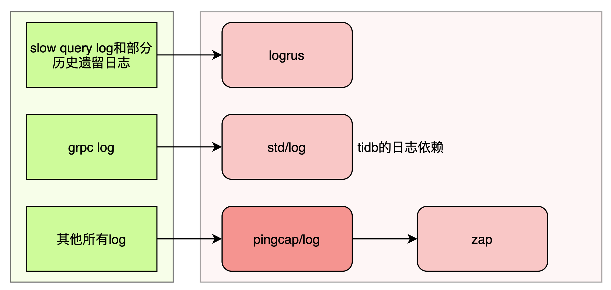
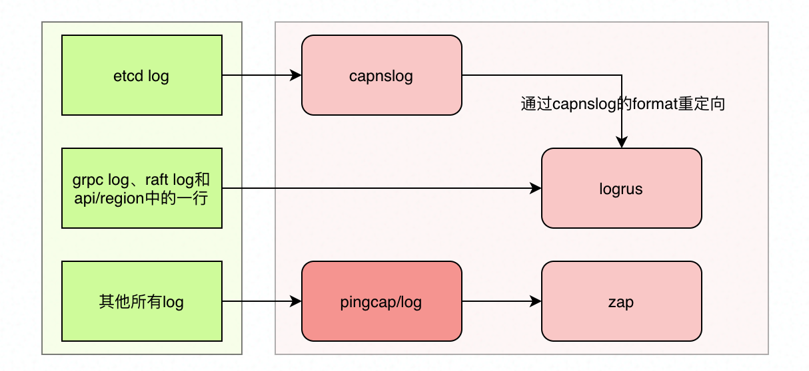

# Proposal:

- Author(s): [Yifan Xu](https://github.com/SabaPing)
- Last updated: May 11, 2021
- Discussion at: https://github.com/pingcap/tidb/pull/24181
- Tracking issue: https://github.com/pingcap/tidb/issues/24190

## Abstract

There are heterogeneous logging libraries in PingCAP's golang projects. These different logging libraries affect the development efficiency and even the user configuration experience.

It is necessary to unify those heterogeneous logging libraries.

## Background

Except for slow query logs, all other logs must satisfy the [unified-log-format RFC standard](https://github.com/tikv/rfcs/blob/master/text/2018-12-19-unified-log-format.md).

However, in practice, it was found that the format of logs is confusing:

- There are few logging configuration instructions in the document. We need to enrich document especially the type and the format of logs each component would emit.
- The configured logging parameters do not match the runtime logging, e.g. `tidb_stderr` is configured with text format, but the log is in json format.
- The logs of some components do not meet the [unified-log-format RFC standard](https://github.com/tikv/rfcs/blob/23d4f9aed68a295b678e8bd909ee8479e3ba0bd1/text/2018-12-19-unified-log-format.md), e.g. `tiflash_cluster_manager`.
- Duplicate logs, e.g. `pd_stderr` will emit both text and json logs with duplicate content (but with a few subtle differences in timestamps).

## Proposal

There must be something wrong with the engineering of these codes above, and they must be changed. The cost to change them is not small.

Rationale - for long-term consideration, we should maintain code quality. The speed of output can be sacrificed in time if necessary.

Implementation plan:

1. Unify log library for `pingcap/tidb` first. For dependent parts we write dummy code to satisfy.
2. Unify log library for `pingcap/br`, remove the dependency on `pingcap/tidb/util/logutil`, and clear dummy code of `pingcap/tidb`.
3. Unify log library for `tikv/pd`.

After the implementation, we have `pingcap/tidb`, `pingcap/br`, `tikv/pd` all depend directly on `pingcap/log` and do not depend on any other log libraries (including `std/log`) or each other.

## Rationale

The following rationales are organized by GitHub repositories.

### [pingcap/log](https://github.com/pingcap/log)

As a common logging library in PingCAP, it does the following things:

- Provides the standard config schema.
- Provides a factory method for creating log handlers.
- Hard code the log format according to [unified-log-format RFC standard](https://github.com/tikv/rfcs/blob/23d4f9aed68a295b678e8bd909ee8479e3ba0bd1/text/2018-12-19-unified-log-format.md).
- Encapsulates the logic of the rolling file.
- Provides global log handler and related methods for package dimension.

### TiDB

Log library dependencies:

For historical reasons, TiDB has two third-party logging libraries, `logrus` and `pingcap/log`. `pingcap/log` is a wrapper of `zap`.

Logs of TiDB can be divided into two types, slow query logs and the other logs.
As mentioned above, these two types of logs are emitted through two different logging libraries, which results in separate configurations for the two types of logs and requires writing additional configuration conversion code.

TiDB-specific logging logic is written inside `util/logutil/log.go`, e.g., logger initialization, logger configuration, and so on.

Note this file, which is one of the main culprits of circular dependencies. The following briefly describes the key logic in `util/logutil/log.go`, two init methods and four log handlers.

#### logrus

The init method of `logrus` may initialize two `logrus` handlers.

First, it is necessary to initialize the standard log handler (package level handler). `InitLogger` first initializes the standard logger according to the configuration.

Then, determine whether the configuration has enabled slow query log, and if so, create a log handler specific to slow query.

[Here is the code](https://github.com/pingcap/tidb/blob/e79fa8c6b654e5b94e9ed0a1c0f997d6564e95be/util/logutil/log.go#L261).

Regarding where these two handlers are used.

- Some historical legacy code, such as `cmd/importer/parser.go`, which uses the standard logger by `logrus`.
- Slow query log all uses the slow query log handler created by `logrus`, code in `executor/adapter.go`.

#### [pingcap/log](https://github.com/pingcap/log)

`pingcap/log` is a wrapper around zap, and as mentioned below the two terms are equivalently interchangeable.

Similar to `logrus`, the init method of zap `func InitZapLogger(cfg *LogConfig) error` may initialize two zap handlers.

- The global zap handler, the default log handler for the entire repo, through which the vast majority of logs are emitted.
- Slow query zap handler, which is only initialized and not used.

`InitZapLogger`'s logic is very similar to `logrus`' above.

#### gRPC Logger

In `main.go` there is a bunch of grpc logger initialization code, which is not in `util/logutil/log.go`.

[Here is the code](https://github.com/pingcap/tidb/blob/e79fa8c6b654e5b94e9ed0a1c0f997d6564e95be/tidb-server/main.go#L591).

The `NewLoggerV2` method creates a go native logger handler and is only used in grpc.

### PD

PD is similar to TiDB in that it also relies on `logrus` and `pingcap/log`, but with an additional layer of `capnslog` as a proxy.

Log library dependencies:

#### Logrus

The standard logger is then passed down to the etcd (via the `capnslog` proxy), grpc and draft components as the log handler for these packages.

There is only one `logrus` handler inside the entire PD codebase.

Only the etcd, grpc, and draft components use the `logrus` handler.

The initialization of `logrus` locates at `pkg/logutil/log.go`. [Here is the code](https://github.com/tikv/pd/blob/b07be86fb91aef07e8a68258ff6149256ab511f8/pkg/logutil/log.go#L260).

#### [pingcap/log](https://github.com/pingcap/log)

There is only one zap log handler inside the entire PD codebase, and its initialization is inline `cmd/pd-server/main.go`.

[Here is the code](https://github.com/tikv/pd/blob/b07be86fb91aef07e8a68258ff6149256ab511f8/cmd/pd-server/main.go#L66).

The logic is simple, create a new handler based on the configuration and replace the global handler at the `pingcap/log` package level.

Most of the logging logic in PD will use the global zap handler.

### [pingcap/br](https://github.com/pingcap/br)

TiDB depends on BR, which in turn depends on tidb's `util/logutil/log.go`, constituting a circular dependency.

Not only is it a circular dependency, it also happens to depend on the log component. This creates a considerable obstacle for the refactor.

The following code is from `pkg/lightning/log/log.go`, which calls TiDB's `InitLogger` and then `pingcap/log`'s InitLogger.

[Here is the code](https://github.com/pingcap/br/blob/b09611d526a754cee82e6d3b12edf67e4cc885ae/pkg/lightning/log/log.go#L77).

BR also relies on TiDB's slow log, which he initializes in the main function as `SlowQueryLogger`.

BR also calls TiDB's `InitLogger` twice in two places.

BR also created two different zap handlers in two places, one of which is not used.

These problem codes are not listed here.

To refactor TiDB's logging functionality, you must first change BR to remove the dependency on TiDB log, then let TiDB depend on the new version of BR, and finally refactor TiDB's logging.

## Compatibility and Migration Plan

Must ensure that refactoring is compatible with historical logging logic. 

Guaranteed by unit testing.

## Implementation

See meta issue: https://github.com/pingcap/tidb/issues/24190.

## Testing Plan

Mainly unit testing.

## Open issues (if applicable)
## Logging code for each component
