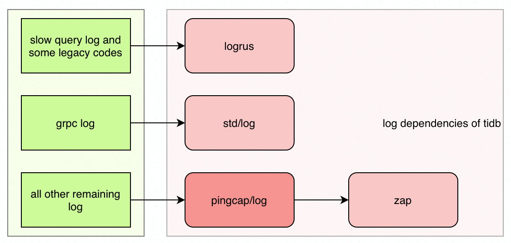
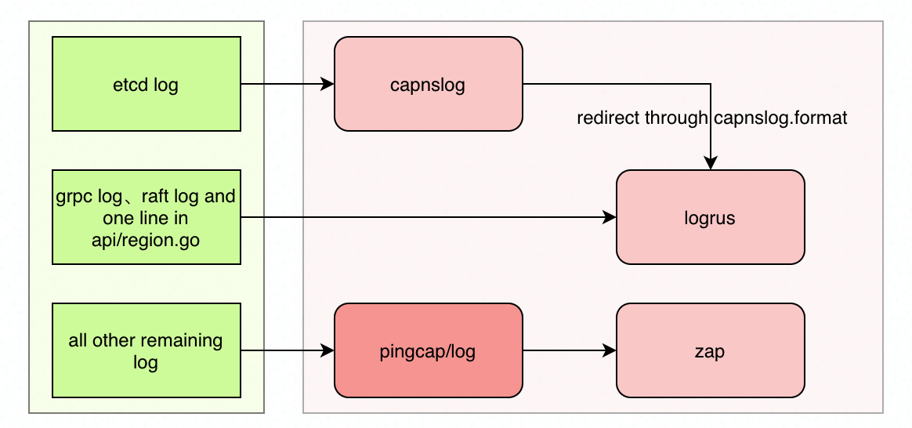

# Proposal: Unifying Log Library

- Author(s): [Yifan Xu](https://github.com/SabaPing)
- Last updated:  Apr 12, 2021
- Discussion at: N/A

## Motivation or Background

Tidb as a distributed system can be divided into several different components, such as tikv, pd, tidb, tiflash, etc. Each component hits a different log. Except for slow query logs, all other logs must satisfy the unified-log-format rfc standard.
However, during practice, it was found that the format of logs is confusing, as shown in the following four points.

- There are fewer logging configuration instructions in the documentation. The future needs to write clearly what logs each component will hit, and what the format of the logs are.
- The configured logging parameters do not match the runtime logging, e.g. tidb_stderr is configured with text format but the logging is in json format.
- The logs of some components do not meet the unified-log-format rfc standard, e.g. tiflash_cluster_manager.
- Duplicate logs, e.g. pd_stderr will hit both text and json logs with duplicate content (but with a few subtle differences in timestamps).

## Logging code for each component

### Pingcap/log

First, the address: [pingcap/log (github.com)](https://github.com/pingcap/log).

As a common logging library for pingcap golang, it does the following things:

- Provides the standard config schema
- provides a factory method for creating log handlers
- hard code the log format according to rfcs/2018-12-19-unified-log-format.md at master - tikv/rfcs (github.com)
- encapsulates the logic of the rolling file
- Provides global log handler and related methods for package dimension

Pingcap/log has a strong limitation -- it cannot customize the encoder for the text format; this problem has been fixed by the big guys, see [Feature/register zap encoder by 9547 - Pull Request #14 - pingcap/log ( github.com)](https://github.com/pingcap/log/pull/14).

When PD and TiDB-operator were using pingcap/log, there was no custom encoder function yet, so they implemented one by themselves respectively, but accidentally wrote out a circular dependency. This problem is also fixed by a big guys, see [logutil: replace etcd.defaultlogger with pingcap's text encoder by 9547 - Pull Request #3480 - tikv/pd (github.com)](https://github.com/tikv/pd/pull/3480), for details. Same big guy as above.

### TiDB

Log library dependencies:



For historical reasons, TiDB has two third-party logging libraries -- logrus and pingcap/log, with pingcap/log wrapping another layer on top of zap.

TiDB's logs can be divided by business into two types: slow query logs and remaining other logs. As mentioned above, the two types of logs are typed through two different logging repositories, which results in separate configurations for the two types of logs and requires writing additional configuration conversion code.

TiDB-specific logging logic -- such as logger initialization, logger configuration, etc. -- is written inside util/logutil/log.go. Note this file, which is one of the main culprits of circular dependencies. The following briefly describes the key logic in util/logutil/log.go -- the two init methods and the four log handlers.

#### Logrus

The init method of Logrus -- func InitLogger(cfg *LogConfig) error -- may initialize two logrus handlers.

First, there is necessarily the standard log handler (package level handler) of logrus. initLogger first initializes the standard logger according to the configuration.

```go
func InitLogger(cfg *LogConfig) error {
   log.SetLevel(stringToLogLevel(cfg.Level))
   log.AddHook(&contextHook{})

   if cfg.Format == "" {
      cfg.Format = DefaultLogFormat
   }
   formatter := stringToLogFormatter(cfg.Format, cfg.DisableTimestamp)
   log.SetFormatter(formatter)

   if len(cfg.File.Filename) != 0 {
      if err := initFileLog(&cfg.File, nil); err != nil {
         return errors.Trace(err)
      }
   }

// The rest is omitted.
```

Then, determine whether the configuration has enabled slow query log, and if so, create a log handler specific to slow query.

```go
if len(cfg.SlowQueryFile) != 0 {
   SlowQueryLogger = log.New()
   tmp := cfg.File
   tmp.Filename = cfg.SlowQueryFile
   if err := initFileLog(&tmp, SlowQueryLogger); err != nil {
      return errors.Trace(err)
   }
   SlowQueryLogger.Formatter = &slowLogFormatter{}
}
```

Regarding where these two handlers are used.

- Some historical legacy code, such as cmd/importer/parser.go, which uses the standard logger by logrus.
- Slow query log all uses the slow query log handler created by logrus, code in executor/adapter.go.

#### Pingcap/log (Zap)

Pingcap/log is a wrapper around zap, and as mentioned below the two terms are equivalently interchangeable.

Similar to logrus, the init method of zap -- func InitZapLogger(cfg *LogConfig) error -- may initialize two zap handlers.

- The global zap handler, the default log handler for the entire repo, through which the vast majority of logs are typed.
- Slow query zap handler, which is only initialized and not used.
  InitZapLogger's logic is very similar to logrus' above, so I won't repeat it here.

#### GRPC Logger

I almost forgot that there is a fish in the net, which is not in util/logutil/log.go. In main.go there is a bunch of grpc logger initialization code.

```go
if len(os.Getenv("GRPC_DEBUG")) > 0 {
   grpclog.SetLoggerV2(grpclog.NewLoggerV2WithVerbosity(os.Stderr, os.Stderr, os.Stderr, 999))
} else {
   grpclog.SetLoggerV2(grpclog.NewLoggerV2(ioutil.Discard, ioutil.Discard, os.Stderr))
}
```

The NewLoggerV2 method creates a go native logger handler and is only used in grpc.

### PD

PD is similar to tidb in that it also relies on logrus and pingcap/log, but with an additional layer of capnslog as a proxy. log library dependencies.



#### Logrus

Logrus的初始化代码在pkg/logutil/log.go：

```go
// cfg是pd启动后得到的配置文件
// 根据cfg配置logrus
log.SetLevel(StringToLogLevel(cfg.Level))
log.AddHook(&contextHook{})
if cfg.Format == "" {
   cfg.Format = defaultLogFormat
}
log.SetFormatter(StringToLogFormatter(cfg.Format, cfg.DisableTimestamp))
// etcd log
capnslog.SetFormatter(&redirectFormatter{})
// grpc log
lg := &wrapLogrus{log.StandardLogger()}
grpclog.SetLoggerV2(lg)
// raft log
raft.SetLogger(lg)
if len(cfg.File.Filename) == 0 {
   return
}
err = InitFileLog(&cfg.File)
```

The standard logger is then passed down to the etcd (via the capnslog proxy), grpc and draft components as the log handler for the three package's log handler.
There is only one logrus handler inside the entire pd.
Only the etcd, grupc, and draft components use the logrus handler.

#### Pingcap/log (Zap)

There is only one zap log handler inside the whole pd.
The initialization is hidden, in cmd/pd-server/main.go.

```go
// New zap logger
err = cfg.SetupLogger()
if err == nil {
   log.ReplaceGlobals(cfg.GetZapLogger(), cfg.GetZapLogProperties())
} else {
   log.Fatal("initialize logger error", errs.ZapError(err))
}
// Flushing any buffered log entries
defer log.Sync()
```

The logic is simple, create a new handler based on the configuration and replace the global handler at the pingcap/log package level.
Most of the logging logic in PD will use the global zap handler.

### Pingcap/br

Br is strangely listed here, he is not a necessary component for the tidb cluster to run. Write him out just for one reason: tidb depends on br, which in turn depends on tidb's util/logutil/log.go, constituting a circular dependency. Not only is it a circular dependency, it also happens to depend on the log component 🙃🙃🙃🙃! This creates a considerable obstacle for the refactor.
The following code is from pkg/lightning/log/log.go, which calls tidb's InitLogger and then pingcap/log's InitLogger.

```go
// InitLogger initializes Lightning's and also the TiDB library's loggers.
func InitLogger(cfg *Config, tidbLoglevel string) error {
   // logutil就是tidb的util/logutil/log.go
   logutil.InitLogger(&logutil.LogConfig{Config: pclog.Config{Level: tidbLoglevel}})

   logCfg := &pclog.Config{
      Level: cfg.Level,
   }
   if len(cfg.File) > 0 {
      logCfg.File = pclog.FileLogConfig{
         Filename:   cfg.File,
         MaxSize:    cfg.FileMaxSize,
         MaxDays:    cfg.FileMaxDays,
         MaxBackups: cfg.FileMaxBackups,
      }
   }
   // pclog是pingcap/log
   logger, props, err := pclog.InitLogger(logCfg)

// The rest is omitted.
```

Br also relies on tidb's slow log, which he initializes in the main function as SlowQueryLogger.
Br also calls tidb's InitLogger twice in two places.
Br also created two different zap handlers in two places, one of which is not used.
These problem codes are not listed here.
To refactor tidb's logging functionality, you must first change br to remove the dependency on tidb log, then let tidb depend on the new version of br, and finally refactor tidb's logging.


## What to do?

There must be something wrong with the engineering of these codes above, and they must be changed, but the cost of changing them is not small.
Principle: For long-term consideration, you can't 💩 on 💩. The speed of output can be sacrificed in time if necessary.
To do these things.

1. change the tidb first, being dependent on the place to write dummy code
2. modify the br log to remove the dependency on tidb loguitl.
3. modify pd and tidb again to unify the log library to pingcap/log.
4. br, pd, tidb all depend directly on pingcap/log and do not depend on any other log libraries (including std/log).
5. Br, pd, and tidb all encapsulate separate log layers on top of pingcap/log and do not rely on each other's log layers, preferring to add some boilerplate code.
