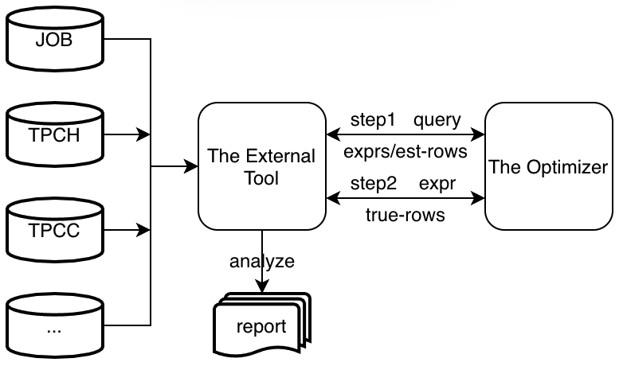
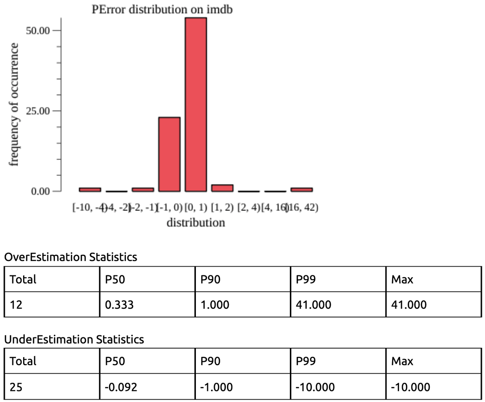

# Proposal: CE Evaluation Framework

- Author(s): [qw4990](https://github.com/qw4990), [time-and-fate](https://github.com/time-and-fate)

## Abstract

This proposal proposes a new approach that can quantify the performance of the CE(cardinality estimation) module of the optimizer under varied scenarios.

## Background

As a basic component of the optimizer, CE has the largest impact on query plans than other components (a conclusion from [How good are query optimizers, really?](https://www.vldb.org/pvldb/vol9/p204-leis.pdf)).

But due to the lack of an effective evaluation approach(framework), we can only rely on ONCALL issues from users and developers' experience to improve this module, which is inefficient and cannot support its long-term evolution.

So in this Sprint, we want to propose an evaluation approach which can quantify its performance under varied scenarios, and hope it can help us find more potential issues and provide some data to support the long-term evolution.

## Proposal

### The Main Idea


The main idea is displayed above, and the whole work can be divided into 2 parts:

1. The Optimizer: the optimizer needs to support recording all intermediate results of CE, which mainly consist of related expressions and their estimated rows;
2. The External Tool: the tool then uses these intermediate results to get their true rows, and then generates a report;


For example, if the query is `select * from t where c1=a and c2>2`:

1. The optimizer records 3 expressions(`c1=1`, `c2>2`, `c1=1 and c2>2`) and their estimated rows;
2. The external tool collects their true rows by processing some queries like `select count(*) where ?`, where `?` can be replaced with related expressions;
3. After collecting all true rows, the external tool analyzes them and generates a report.

Note: the reasons why we introduce a new approach instead of using `explain` directly are:

1. It can only show one plan for a query, for example, for a join query, it can only show one join order;
2. Its granularity is not fine enough, for example, for a CNF, it might just show the total estimated rows of the whole CNF instead of each filter's.

### CE Evaluation
When evaluating the CE module, we consider 3 dimensions below:

1. Dataset: JOB, TPCH, TPCC and so on;
2. Statistics Health Degree: 100%, 90%, 50%, 0%(no stats); 
3. Estimation Type: EQ/Range/CNF/DNF/ Estimation, some particular Estimation(`like`), Join Estimation and so on;

For each combination of the above dimensions, generate a `q-error` record, like `JOB-100%-EQ`:


These `q-error` records can be used to quantify the performance of CE under varied scenarios.

And by comparing them, we can find potential issues of CE, for example:

1. `*-0%(no-stats)-*`: if these kinds of records are bad, then the default statistics is not good enough;
2. `*-90%-*`: if these kinds of records are bad, then current estimation strategies cannot deal with stale statistics well;
3. `*-*-DNF`: if these kinds of records are bad, then it cannot handle DNF well;

### Interface
We use the same interface with optimizer trace: `trace target='estimation' <statement>`.
And the output is a download URL:
```
> trace target='estimation' select * from t where a < 10 and b > 10;
+------------+ 
| Dump_link  | 
+------------+ 
| xxx.zip    | 
+------------+
```

All trace information(intermediate results) is stored in a JSON file:
```
[{
    Type: "Column-Range",
    Table: "t",
    Expr: "a < 10",
    RowCount: 10
},{
    Type: "Column-Range",
    Table: "t",
    Expr: "b > 10",
    RowCount: 10
},{
    Type: "Expression",
    Table: "t",
    Expr: "a < 10 and b > 10",
    RowCount: 1
}]
```

### Event Tracking in the Optimizer
We introduced some event tracking into the optimizer to record intermediate results, and now they are in:

1. EQ/Range estimation;
2. DNF/CNF estimation;
3. Non-Range estimation like estimation for Like;
4. Estimation adjusting for Limit;

All these intermediate results are outputted by the JSON file above.

## Rationale

This approach can help us quantify the performance of CE under varied scenarios, and these intermediate results can also be used to diagnose the optimizer in the future.

