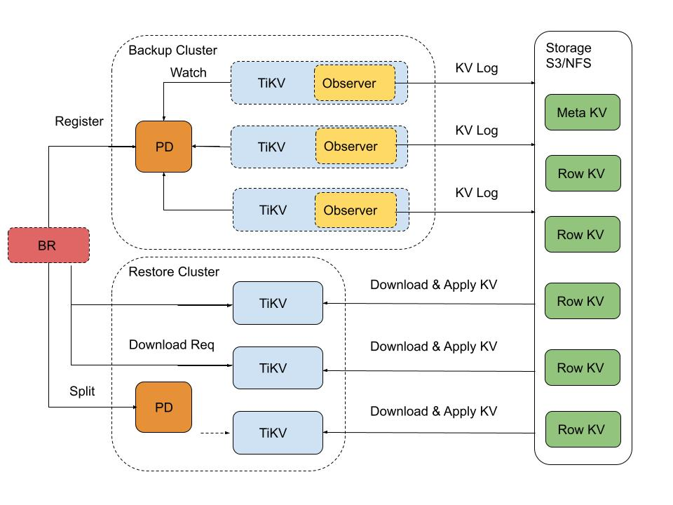
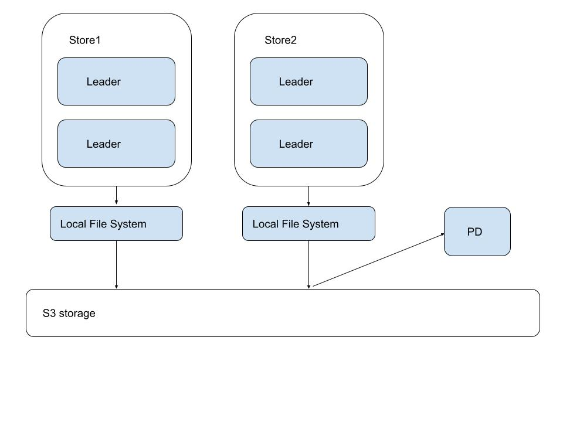

# TiDB Log-based Incremental Backup

- Author(s): @kennytm
- Discussion: N/A
- Tracking Issue: [#29501](https://github.com/pingcap/tidb/issues/29501)

## Table of Contents

* [Introduction](#introduction)
* [Background](#background)
* [Goals](#goals)
    + [Non-Goals for Version 1](#non-goals-for-version-1)
* [User Scenarios / Story](#user-scenarios--story)
* [Design](#design)
    + [BR](#br)
        - [Start task](#start-task)
        - [Check task status](#check-task-status)
        - [Stop task](#stop-task)
        - [TiKV](#tikv)
    + [Stop](#stop)
    + [Pause and Resume](#pause-and-resume)
    + [Output format](#output-format)
    + [Restore](#restore)
        - [Restore backups](#restore-backups)
    + [Merge (out of scope in v1)](#merge-out-of-scope-in-v1)
        - [Merge backups](#merge-backups)
    + [Error scenarios](#error-scenarios)
        - [Scaling out](#scaling-out)
        - [Crashing](#crashing)
        - [Network partition](#network-partition)
    + [Task management](#task-management)
* [Alternatives & Rationale](#alternatives--rationale)
* [Trivia](#trivia)

## Introduction 



This document introduces a novel solution for backing up incremental transactional data within the TiKV server.

## Background

The ability of commercial databases to handle emergencies and accidents is a basic requirement. When a disaster occurs, we must restore the database with minimal data loss and recovery time. Various factors such as exercise, recovery time, operability and operation and maintenance.

## Goals

* Support 200T TiDB cluster backup (66 TiKVs)
* Combine log-based backup and full backup to reach
    - RTO < 6h
    - RPO < 5 min
* Support Point in Time Recovery
* Log-based backup has nearly non impact on TiDB clusters.
* Support cluster/table level backup
* Support encrypt and compress data.

### Non-Goals for Version 1

* We do not support restoring into existing tables.
    - In version 1, we require a non-empty cluster or an empty table.
        * Restore requires a completely empty cluster to begin with, so that the Table IDs can match up and the StartTS/CommitTS are correct.
        * The initial "full restore" must retain the original table ID.
        * We can perform RewritePrefix/TS but it slows the process down. We do not expect normal public service until the restore is complete
    - The data may be in an inconsistent state, and the cluster is configured to "import mode".

## User Scenarios / Story

* Users want to ensure business continuity
    - when the database fails and cannot be restored within a certain period of time. The user quickly deploys a database of the same version as the production database, and restores the backup data to the database to provide external services;
* User services need to be able to restore the data at a certain point in the past to the new cluster to meet the business needs of judicial inspections or audits

## Detailed Design

### BR

A new subcommand is added to BR to control incremental backup tasks. (Provide a TiDB HTTP API as well, see the spec.)

#### Start task

```console
$ br stream start [task_name] -u 10.0.0.1:2379 -s 's3://bucket/path' [-f '*.*' -f '!mysql.*'] [--lastbackupts 123456789] [--endts 999999999] ...

Starting task <task_name> from ts=123456789...

Store 1: ok (next_backup_ts =222222222).
Store 2: ok (next_backup_ts =333333333).
Store 3: ok (next_backup_ts =444444444).
Store 8: ok (next_backup_ts =123456789).

Started!
```

#### Check task status

```console
$ br stream status task_name -u 10.0.0.1:2379

Checking status of <task_name>...

Store 1: error, task completed or not found.
Store 2: ok (next_backup_ts =900000000).
Store 3: ok (next_backup_ts =911111111).
Store 8: ok (next_backup_ts =922222222).
```

#### Stop task

```console
$ br stream stop task_name -u 10.0.0.1:2379

Stopping task <task_name>...

Store 1: error, task completed or not found.
Store 2: ok (next_backup_ts =987654321).
Store 3: ok (next_backup_ts =989898989).
Store 8: ok (next_backup_ts =987987987).

Stopped at --lastbackupts=987654321.

$ br stream stop task_name -u 10.0.0.1:2379

Stopping task <task_name>...

Store 1: error, task completed or not found.
Store 2: error, task completed or not found.
Store 3: error, task completed or not found.
Store 8: error, task completed or not found.

Failed to stop the task, maybe it is already stopped. Check the TiKV logs for details.
```

#### TiKV

* We will reuse the CmdObserver<E> trait. We may either embed the logic entirely inside cdc:: Delegate, or create a new StreamBackupObserver. Prefering the latter for separation of concern.
    - We probably don't need to implement RoleObserver + RegionChangeObserver. Both are used to monitor region-not-found or leader-changed errors to propagate to downstream delegates. In backup streaming we simply stop writing to the buffers.
    - If possible we may reuse the resolved_ts crate to fetch the ResolvedTS instead of making an observer our own to reduce impact.
* Support table filtering
    - We choose to enable table filtering during backup
    - The problem about table filtering is we only have a <Table ID → Table Name> map with txn in meta.go during log backup.(e.g. mDB1_Table20 -> []byte(tableInfo)), and some operations may change the map. For example, RENAME then TRUNCATE table. we may get such sequences.
       * time 1: <21, Test_A>
       * time 2: <21, Test_B>(RENAME)
       * time 3: <22, Test_B>(TRUNCATE)

    - To Solve this problem, we need TiKV to watch all meta key changes during a task.
        * BR starts a task
            * BR puts a table-filter into a task
            * BR calculates the key range from the given table-filter. and puts the key range space into PD/Etcd.
            * BR puts the task into PD/Etcd.

        * Every TiKV node watches the task and key range space in the task.
            * when the task changes key range. such as TRUNCATE. TiKV should be aware of this change and stop observing old ranges and start observing new key ranges. when the new key range starts. TiKV needs an incremental scan to get all related keys.

        * Meta Key
            * Every Task should watch the meta key range carefully. We had such meta keys for each table.
                * DB key
                * Table key
                * AutoTableID key(ignore. calculate later)
                * AutoRandom key(ignore.calculate later)
                * Sequence/Sequence cycle key(ignore for version 1)
                * Policy key (ignore for version 1)
                * DDL history key (ignore for not use)
            * BR will calculate meta key range at the beginning of the task.

        * Handle TiDB DDL
            * Create Table/Index within table-filter
                * update the task and calculate a new range.
            * Truncate Table within table-filter
                * update the task and calculate a new range.
            * Drop Table/Index
                * update the task.
            * Rename Table
                * rename table out of table-filter
                    * ignore. let restore handle this situation.
                * rename table into table-filter.
                    * ignore. since we didn’t backup this table at the beginning.

* Memory control
    - Every TiKV node flush events independently.
    - Flush to local storage directly.
       * if backup to s3, we have a separate thread push data from local storage to s3 at every 5 minutes.
    - Need a flush control when the disk is full.



* Rollback
    - The Rollbacks do the real delete in rocksdb according to the txn.
    - The Rollbacks only have the StartTS.
    - So we must apply rollback events at the end of one restore task. we must ensure that the prewrite happened before rollback.


### Stop

Stopping a task causes all collected events not yet flushed to be lost.

### Pause and Resume

Pausing a task will make it stop observing the TiKV changes, record the
ResolvedTS of every involved region, and immediately flush the log files
into external storage. Then it sleeps.

Resuming a task is like re-subscribing to a CDC stream, like running br
stream start «TaskName» --backupts «PrevRTS». All KVs between PrevRTS
and current CommitTS will be scanned out and logged as a single batch.

### Output format

-   There are kinds of events we can send out: "BR-like" or "CDC-like".
    -   "BR-like" generates events below the MVCC/Percolator abstraction, and is closer to BR's SST format with content like
        -   `Put(cf="default", key="zt1\_r1«StartTS»", value="encoded\_value")`
        -   `Put(cf="write", key="zt1\_r1«CommitTS»", value="P«StartTS»")`
        -   `Delete(cf="default", key="zt1\_r1«StartTS»")`
        -   `Put(cf="write", key="zt1\_r1«CommitTS»", value="D«StartTS»")`
    -   "CDC-like" is above the MVCC abstraction and is closer to CDC's format with content like
        -   `Prewrite(start\_ts=«StartTS», op=Put(key="t1\_r1", value="encoded\_value"))`
        -   `Commit(start\_ts=«StartTS», commit\_ts=«CommitTS», key="t1\_r1")`
        -   `Prewrite(start\_ts=«StartTS», op=Delete(key="t1\_r1"))`
        -   `Commit(start\_ts=«StartTS», commit\_ts=«CommitTS», key="t1\_r1")`
-   We choose the BR-like form since it is compatible with RawKV and is easier to merge into a Full Backup. But there seems to be worry that if a lock\_cf lock is exposed in the middle it will break the SI guarantee?
-   The received events are appended to local log files per task (+ fsync), sharded by prefix of the key.
    -   If the first byte of the key is "t" ("zt"), shard by the first 9 (11) bytes.
    -   Otherwise ("m"), place it into its own file.
    -   We do not distinguish by region (shall we?).
    -   Content should be encoded as a stream of protobuf messages or other efficient binary format.
-   The current ResolvedTS is attached to the set of local log files.
-   Every 5 minutes or 128 MiB of total data (whichever sooner), we move the log files into external storage atomically.
    -   May need to ensure we don't break a transaction into two files? (what if huge transactions?)
    -   Files are renamed «Storage://Prefix»/«PhysicalTableID:%02x»/«RegionIDAndMinTSOfTheLog:016x»/«StoreID».log
    -   The file should be generated for each region. If the region contains multi tables, split it by table.
    -   The metadata would be the index of those files.
    -   We may compress (producing .log.lz4) or encrypt the file (producing .log.lz4.aes256ctr) on demand (out of scope for now).
    -   Additionally we include a metadata file «Storage://Prefix»/stream-metas/«???:016x».meta recording the initial SHA-256 checksum, encryption IV, number of entries, range of ResolvedTS/StartTS/CommitTS and range of keys of every file involved.

```protobuf
enum FileType {
    Delete = 0;
    Put = 1;
}

message DataFileInfo {
    // SHA256 of the file.
    bytes sha_256 = 1;
    // Path of the file.
    string path = 2;
    int64 number_of_entries = 3;
    
    /// Below are extra information of the file, for better filtering files.
    // The min ts of the keys in the file.
    uint64 min_ts = 4;
    // The max ts of the keys in the file.
    uint64 max_ts = 5;
    // The resolved ts of the region when saving the file.
    uint64 resolved_ts = 6;
    // The region of the file.
    int64 region_id = 7;
    // The key range of the file.
    // Encoded.
    bytes start_key = 8;
    bytes end_key = 9;
    // The column family of the file.
    string cf = 10;
    // The operation type of the file.
    FileType type = 11;

    // Whether the data file contains meta keys(m prefixed keys) only.
    bool is_meta = 12;
    // The table ID of the file contains, when `is_meta` is true, would be ignored.
    int64 table_id = 13;
    
    // It may support encrypting at future.
    reserved "iv";
}
```

-   Not embedding metadata into \*.log files, so the BR controller can dispatch the restore tasks without downloading tons of files.
-   Similar to backup meta, we may split each \*.meta file into multiple levels if it becomes too large.
-   **What happens if upload still fails after several retries?**
    -   Pause the task and report an error which br stream status can see and Prometheus can receive.

### Restore

#### Restore backups

```console
$ br restore full -s 's3://bucket/snapshot-path' -u 10.0.5.1:2379

$ br stream restore -u 10.0.5.1:2379 \
   -s 's3://bucket/path' \
   [--startts 123456789] \
   [--endts 987654321] \
   [--checksum] \
   [-f 'db3.*']
```

1.  Restoring the full backup is unchanged, using the br restore command.
2.  To restore the BR-like incremental backup, the restore API has to perform the following:
    1.  Reads the last «MRTS».meta file just before --endts to obtain the region distribution of the keys.
    2.  Perform batch-split so region distribution is the same as the end state (only do this if the existing number of regions &lt;&lt; number of regions in the archive).
    3.  "Lock" the scheduler, disallow region moving/splitting/merging.
    4.  For every «MRTS».meta file (in parallel),
        1.  Translates the -f table name filter into key range filter.
        2.  For every log file (in parallel),
            1.  If a log file's MaxCommitTS ≤ --startts or MinStartTS > --endts, skip the log file.
            2.  If a log file's key range is filtered out, skip the log file.
            3.  Gets all regions intersecting with the file's key range.
            4.  Tell the ***leader*** of every region to download and apply the log file, along with:
                1.  --startts and --endts
                2.  Key range filter
                3.  SHA-256 checksum (null if --checksum=false)
    5.  Done.
3.  On the TiKV side, after receiving the restore-file command,
    1.  Download the file
    2.  If the SHA-256 checksum is provided, perform checksum comparison.
    3.  Iterate the KV pairs, keeping only those with StartTS or CommitTS between (--startts, --endts\], and key inside the given key range filter.
    4.  Append all the KV pairs into a BatchCommandsRequest.
    5.  Perform the batch commands and let Raft replicates this to all peers.
4.  Determine whether to perform restore externally on BR, or internally on TiKV.

### Merge (out of scope in v1)

#### Merge backups

```console
$ br stream merge \
   -s 's3://bucket/path/' \
   [--read-snapshot-storage 's3://bucket/snapshot-path'] \
   --write-snapshot-storage 's3://bucket/snapshot-path-new' \
   [--startts 123456789] \
   [--endts 987654321]
```

The "merge" operation performs an offline compaction. It applies the KV events on top of an existing snapshot, and produces a new set of SST files.

### Error scenarios

#### Scaling out

If BR (or TiDB API) directly sends the tasks to TiKV services (i.e.
"push-based interface"), when we add new TiKV stores they will not know
there is a backup task, causing information loss.

I think this suggests that either

-   There has to be some kind of "BR-stream-master" (like DM-master or CDC-master) which maintains the task list and push it to any new members, or
-   The task list should be stored on etcd / PD and every TiKV uses [<u>Watch</u>](https://etcd.io/docs/v3.5/tutorials/how-to-watch-keys/) to pull new tasks.

I very much prefer the stateless, pull-based approach, but afaik TiKV
has never introduced any etcdv3 dependency before (TiDB o.t.o.h. uses
etcdv3 extensively, esp in DDL sync).

(Since TiKV itself is also a KV store, we could as well use RawKV in a
non-watched keyspace to share the task list. But it seems CDC *is*
TiKV's Watch 🤔)

#### Crashing

After a TiKV store has successfully uploaded content to external
storage, it should report to the master / etcdv3 / S3 like "in task T,
in store 8, in region 432, we have backed up until TS=123456789".

In case of a crash, the new leader of region 432 should initialize
itself from this progress report, and start scanning from TS=123456789
rather than TS=0 or Now().

This also means there is a communication cost of fetching the initial
TS.

Because we need to ensure everything in the TS range 123456789..Now()
are intact, we have to extend the GC lifetime to include 123456789.
Setting a GC safepoint has a global effect, however, whereas we only
want to prevent GC from happening in this particular region. Therefore,
we'd like to instead change the [<u>gc\_worker.rs</u> <u>implementation
in
TiKV</u>](https://github.com/tikv/tikv/blob/5552758d277b0ab2761deb88c9a82525ecac8980/src/server/gc_worker/gc_worker.rs#L224).
A keyrange can indicate if it is ready to be GC'ed. If a leader has just
been elected for &lt; 5 minutes, we indicate the region as not-GC-ready.

#### Network partition

Consider split-brain, where a region's peers are split into two groups
(say <u>1</u>,2,3 / 3,4,<u>5</u>) and both sides have leader (<u>1</u>,
<u>5</u>), and both leaders do back up (inconsistent) data to S3. Raft
should be able to avoid this, the bridge node (3) being aware of both
sides should prevent any modification (Put/Delete) on one side from
taking place and thus the back up can never diverge. So this is
equivalent to a normal partition where the minority side is considered
dead (<u>1</u>,2,3 / <s>4,5</s>).

### Task management

As stated above we need a place reachable from all TiKVs to store the
task status.

**Starting task**

BR pushes these keys:

-   TaskInfo:(task\_name) → ( all info about the task )

TiKV, on initialization, scans for every KV in the keyspace TaskInfo:
to learn what backup tasks have been scheduled. After it is done, TiKV
watches the keyspace for any new tasks.

When a new task is seen by TiKV, and the task's end\_ts &gt;
current\_ts, it will do

```rust
for region in self.regions {
    if self.is_leader(region.id) {
        put!(
            "NextBackupTS:({task.name}, {self.store_id}, {region_id})",
            task.start_ts,
        );
    }
}
```

Stop the task if end\_ts &lt;= current\_ts.

**Stopping task**

Delete the TaskInfo key. Watcher should be able to do cleanup.

**Configurating, resuming and pausing task**

Update the TaskInfo key. The KV API is equivalent to starting a task.
Pausing changes the --start-ts to the last key's CommitTS, and set
"paused" to true. Resuming restores "paused" to false.

**Initialization, leader change and region split/merge**

For every new region, we assume all keys between NextBackupTS:\* to the
current TS is not yet backed up. So we initiate a full scan on the
region for CommitTS between these two numbers.

**Flushing**

For every region which this store is still a leader of, update
NextBackupTS:\* to the ResolvedTS of the region.

**Risks**

-   Still need to sort out all potential crash scenarios
-   Scanning TxnEntry after changing leaders, no matter when it happened, may reduce the cluster's performance.
-   Events such as "DeleteRange" and "IngestSST" are not handled.
-   Should we backup lockcf
-   How to deal with Rollback (esp across 5min point)
    -   may lead to dangling default cf entries if the KVDelete is not handled
    -   in some scenarios there may be a lot of rollbacks?
    -   The Rollback key will carry start ts. For each key with start ts we need to ensure the delete happened after the put.

## Alternatives & Rationale

**Scanning RaftDB**

Since all modifications must go through Raft consensus, we can capture
the changes on RaftDB instead of TiKVDB for the incremental changes. We
can even physically copy the WAL file to minimize computation. Another
advantage of scanning RaftDB is that, if we want to batch copy events
between two timestamps (e.g. after changing leader), we don't need to
scan the entire region key space, but just those entries indexed by TS.

In fact, TiCDC also considered this approach. It was eventually
abandoned, however, due to the difficulty of actually utilizing the raft
log. Given the previous failure, we will not attempt to touch the raft
log unless the TxnEntry scan proved to have a really bad effect on
performance.

-   Scan the raft log directly. The current raftstore implementation needs to be adjusted, such as raft log gc. In addition, it is also necessary to ensure that the scan is performed during the leader’s lifetime, otherwise the complete data may not be seen.

-   Also need to pay attention to region epoch check, raft log commit != apply successfully

-   To support the interpretation of raftlog, I think I need to implement most of the logic of raftstore now, especially some operations such as split/merge/conf change. Due to the existence of these operations, the original total order raft log in a region has a sloping relationship between different regions. I think it is not easy to solve. This is also the reason why cdc did not use raftlog or wal at the time.

## Trivia

-   CDC only observes leaders.
-   The tikv\_gc\_leader\_lease entry in mysql.tidb table is updated every few seconds (also tikv\_gc\_last\_run\_time every 10 minutes).
    -   The backup procedure must skip the key ranges of system schemas otherwise the backup storage is littered with irrelevant changes.
    -   Rolling upgrades can introduce new system tables, so it is probably insufficient to tell TiKV to “skip this key range” on start. It has to be maintained

-   There are 1PC and 2PC transactions. We may need to reuse the CDC / binlog sorter during restore for the 2PC transactions.
    -   1PC:
        -   {type=Committed/Initialized, start\_ts=X, commit\_ts=X+1, op\_type=Put/Delete, key=K, value=V}
    -   2PC:
        -   {type=Prewrite, start\_ts=X, commit\_ts=0, op\_type=Put/Delete, key=K, value=V} × N
        -   {type=Commit, start\_ts=X, commit\_ts=Y, op\_type=Put/Delete, key=K, value=nil} × N
-   The transactions are reconstructed from MVCC (percolator) in cdc::Delegate::sink\_data. Originally a CmdObserver&lt;E> impl defines a callback receiving Vec&lt;CmdBatch> which is isomorphic to Vec&lt;Vec&lt;Cmd>&gt; which is isomorphic to Vec&lt;Vec&lt;(RaftCmdRequest, RaftCmdResponse)>&gt; which is isomorphic to Vec&lt;Vec&lt;Vec&lt;(raftcmd\_pb::Request, raftcmd\_pb::Response)>&gt;&gt;. The Request/Response can be:
    -   <s>Get(cf, key) → value</s>
    -   Put(cf, key, value) → ()
    -   Delete(cf, key) → ()
    -   <s>Snap() → region</s>
    -   Prewrite(key, value, lock) → ()
    -   DeleteRange(cf, start\_key..end\_key, notify\_only) → ()
    -   IngestSST(sst) → ()
    -   <s>[<u>ReadIndex</u>](https://github.com/tikv/rfcs/blob/master/text/0014-consistent-replica-read.md)(start\_ts, key\_ranges) → (read\_index, locked)</s>
-   CDC only handles the Put and Delete commands on the "write", "lock" and "default" CFs, reconstructing MVCC.