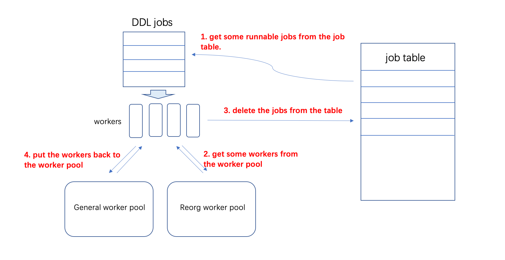

# TiDB Design Documents

- Author(s): [Jiwei Xiong](http://github.com/xiongjiwei), [Wenjun Huang](http://github.com/wjhuang2016)
- Tracking Issue: https://github.com/pingcap/tidb/issues/32031

## Table of Contents

* [Introduction](#introduction)
* [Motivation or Background](#motivation-or-background)
* [Detailed Design](#detailed-design)
* [Test Design](#test-design)
    * [Compatibility Tests](#compatibility-tests)
    * [Benchmark Tests](#benchmark-tests)
* [Unresolved Questions](#unresolved-questions)

## Introduction

This document describes the design of the feature Concurrent DDL, which will makes DDL run concurrently, the DDLs in different table will not block each other.

## Motivation or Background

DDL (Data Definition Language) is a data definition language, commonly used to describe and manage database schema objects, including but not limited to tables, indexes, views, constraints, etc., is one of the most commonly used database languages. The DDL change in TiDB is based on the two queues at the cluster level to achieve lock-free management, which solves the DDL conflict problem. However, under the concurrent execution of a large number of DDLs, especially when the execution time of DDLs is long, the phenomenon of DDL queuing and blocking will occur, which affects the performance of TiDB and hurts the user experience.

In previous implementation, there are 2 queues in tikv store the DDL information, one is `addIndex` type that store the long run DDL job like `create index`, another is `general` type that store the DDL like `create table`. When DDL is coming, the DDL will marshal to json and store into the queue.

Consider the following DDLs:
```
CREATE INDEX idx on t(a int);
ALTER TABLE t ADD COLUMN b int;
CREATE TABLE t1(a int);
```
Even though TiDB can run 3rd DDL, it have to wait the previous two finished because 2nd and 3rd DDL are in the same queue. It will be a big problem in big cluster with lots of DDLs.


This proposal force on the concurrency between different table, for the DDLs on the same table, make them serially.

## Detailed Design

Several tables will be provided to maintain the DDL meta in the DDL job's life cycle.

Table `mysql.tidb_ddl_job` stores all the queueing DDL meta.
```
+----------------+------------+------+------+----------------------------------+
| Field          | Type       | Null | Key  | Comment                          |
+----------------+------------+------+------+----------------------------------+
| job_id         | bigint(20) | NO   | PRI  | DDL job id                       |
| reorg          | bigint(20) | YES  |      | True if this DDL need reorg      |
| schema_id      | bigint(20) | YES  |      | The schema ID relate to this DDL |
| table_id       | bigint(20) | YES  |      | The table ID relate to this DDL  |
| job_meta       | blob       | YES  |      | The arguments of this DDL job    |
| is_drop_schema | bigint(20) | YES  |      | True if the DDL is a drop schema |
+----------------+------------+------+------+---------+------------------------+
```

Table `mysql.tidb_ddl_reorg` contains the reorg job data.
```
+---------------+------------+------+------+
| Field         | Type       | Null | Key  |
+---------------+------------+------+------+
| job_id        | bigint(20) | NO   |      |
| ele_id        | bigint(20) | YES  |      |
| curr_ele_id   | bigint(20) | YES  |      |
| curr_ele_type | blob       | YES  |      |
| start_key     | blob       | YES  |      |
| end_key       | blob       | YES  |      |
| physical_id   | bigint(20) | YES  |      |
+---------------+------------+------+------+
```

Table `mysql.tidb_ddl_history` stores the finished DDL job.
```
+---------------+------------+------+------+
| Field         | Type       | Null | Key  |
+---------------+------------+------+------+
| job_id        | bigint(20) | NO   | PRI  |
| job_meta      | blob       | YES  |      |
+---------------+------------+------+------+
```

In bootstrap step, TiDB will build these tables meta and put it into tikv directly. For new cluster, TiDB will also build `mysql` schema meta.

### DDL operations

Use the following DDL operations to manage the DDL jobs:
```sql
insert into mysql.tidb_ddl_job values (...) -- add ddl jobs
delete from mysql.tidb_ddl_job where job_id = ... -- delete ddl jobs
update mysql.tidb_ddl_job set job_meta = ... where job_id = ... -- update ddl jobs
select * from mysql.tidb_ddl_job -- get ddl jobs
```

### DDL job manager

DDL job manager will find the runnable DDL job and dispatch the jobs to DDL workers.
```golang
for {
    if !isOwner {
        // sleep a while
        continue
    }

    // if there are job coming
    select {
        case <-ddlJobCh:
        case <-ticker.C:
        case <-notifyDDLJobByEtcdCh:
    }

    job = findrunnableJob()
    if job != nil {
        waitForFreeWorker();
        go runJob(job)
    }
}
```

To prevent all the workers in worker pool occupied by the long run job like `add index`, TiDB will divide the pool into two types: `addIndex` worker pool and `general` worker pool, then the DDL job manager will be

```golang
for {
    // ...
    generalJob = findRunnableGeneralJob()
    reorgJob = findRunnableReorgJob()
    if generalJob != nil {
        waitForFreeGeneralWorker();
        go runGeneralJob(job)
    }
    if reorgJob != nil {
        waitForFreeReorgWorker();
        go runReorgJob(job)
    }
}
```

The runnable job defines as
1. not running.
2. the minimum job id on the same table.
3. no smaller `drop schema` job id on the same schema.
4. no smaller job id on the same schema if the job type is `drop schema`.

to get a general job, we can use SQL
```sql
select * from mysql.tidb_ddl_job where not reorg;
```
and return the first record.

Now we will describe how to achieve the 4 rules above:

Rule 1 and Rule 2: maintain a running job set, group by the table id and find the minimum one, and SQL can be written to
```sql
select * from mysql.tidb_ddl_job where job_id in (select min(job_id) from mysql.tidb_ddl_job where not reorg and job_id not in ({running job id}) group by table_id);
```

Then, we find some jobs and check Rule 3 and Rule 4:

Rule 3: check if there is a smaller `drop schema` job id on the same schema.
```sql
select * from mysql.tidb_ddl_job where is_drop_schema and job_id < {job.id} limit 1;
```
Rule 4: if the job is `drop schema`, check if there is a smaller job id on the same schema.
```sql
select * from mysql.tidb_ddl_job where job_id < {job.id} limit 1;
```

For reorg job, the process is almost the same.



### Show DDL jobs

get DDL jobs from the tables:
```sql
select * from mysql.tidb_ddl_job;
select * from mysql.tidb_history_job;
```

### Cancel DDL

find the cancel job and update the DDL meta to `JobStateCancelling` state
```sql
select job_meta from mysql.tidb_ddl_jon where job_id = {job_id};
-- set the job state to `JobStateCancelling`
update mysql.tidb_ddl_job set job_meta = {job} where job_id = {job.id}
```

### Upgrade compatibility

Consider the rolling upgrade, the first upgrade tidb instance will hang if there are internal DDLs because the new version TiDB will write DDL job into table, but the old version TiDB DDL owner will not run the job. So the upgrading TiDB should get the DDL owner first:
```golang
//...
if needDoUpgrade {
    ddl.requireOwner();
    // Do upgrade ...
}
```

In general, there will have no queueing DDL job when upgrading, but if there are some queueing DDL jobs, TiDB should migrate the DDL jobs from queue to table and wait for DDL job manager handle them.

```golang
//...
if needDoUpgrade {
    ddl.requireOwner();
    migrateDDL() // migrate queueing DDL jobs from queue to table, including reorg meta.
    // Do upgrade ...
}
```

### Compatibility with CDC

CDC will watch the key of the finished job in **queue** and sync the DDLs to other cluster, after concurrent DDL is implemented, CDC should watch the key of the finished job in **table**.

When upgrading a cluster, CDC should upgrade before TiDB and be able to watch the key of the finished job in **table** and **queue** at the same time. 
After several versions, CDC can remove the code of watching the key in **queue**.

### How to change the tables(`tidb_ddl_job`, `tidb_ddl_reorg`, `tidb_ddl_history`) meta?

If a new field is required in `tidb_ddl_job`, we can use a `ALTER TABLE` statement to add the field, the important thing is make this DDL run successfully.
Consider the rolling upgrade progress, only the first instance will run the upgrade SQL, at this time, the DDL owner will be the other TiDB instance, so that the DDL will
be executed successfully by the other old TiDB instance.

## Test Design

We will use [schrddl](https://github.com/PingCAP-QE/schrddl) test the concurrent DDL framework.

### Compatibility Tests


### Benchmark Tests


## Unresolved Questions

N/A
