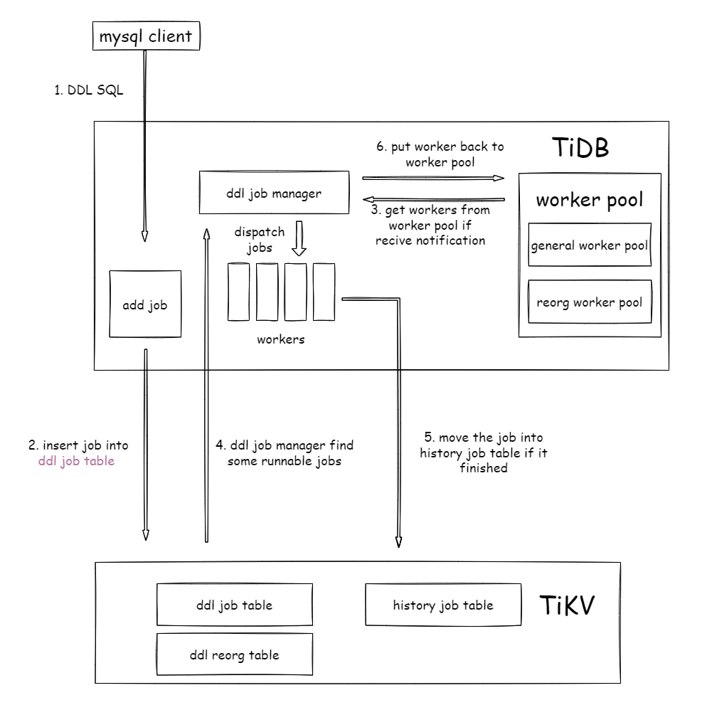
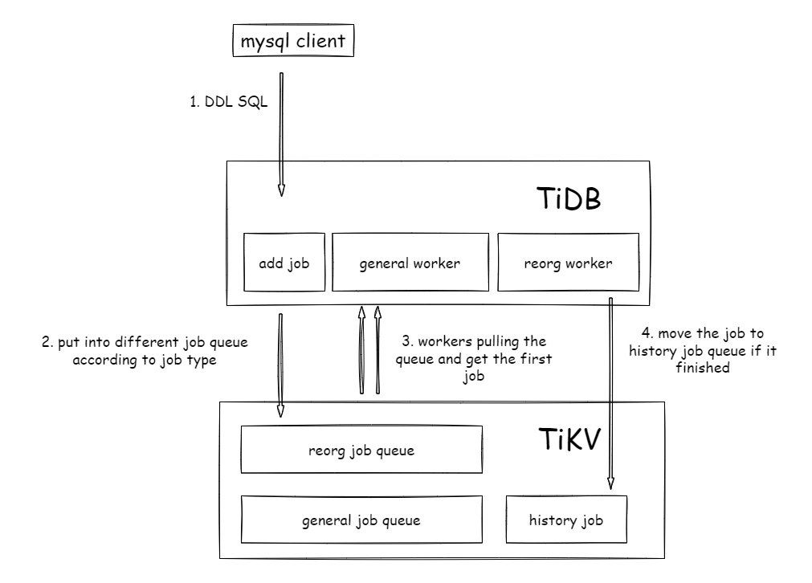

# TiDB Design Documents

- Author(s): [Jiwei Xiong](http://github.com/xiongjiwei), [Wenjun Huang](http://github.com/wjhuang2016), [Xia Li](https://github.com/zimulala)
- Tracking Issue: https://github.com/pingcap/tidb/issues/32031

## Table of Contents

* [Introduction](#introduction)
* [Motivation or Background](#motivation-or-background)
* [Current implementation](#current-implementation)
* [Goal](#goal)
* [Not Goal](#not-goal)
* [Idea](#idea)
* [Detailed Design](#detailed-design)
* [Test Design](#test-design)
    * [Compatibility Tests](#compatibility-tests)
    * [Benchmark Tests](#benchmark-tests)
* [Unresolved Questions](#unresolved-questions)

## Introduction

This document describes the design of Concurrent DDL, which makes DDL in different table are executed concurrently and do not block each other.

## Motivation and Background

DDL (Data Definition Language) is a data definition language, commonly used to describe and manage database schema objects, including but not limited to tables, indexes, views, constraints, etc., and is one of the most commonly used database languages. The DDL change in TiDB relies on the two cluster-level queues to achieve lock-free management, solving the DDL conflict problem. However,  when a large number of DDLs are executed simultaneously, especially when the execution time of DDLs is long,  DDL queuing and blocking occurs, which affects the performance of TiDB and  degrades the user experience.

## Current implementation

In a cluster, TiDB chooses a DDL owner to run the DDL job. There is only one owner at a time, the other TiDBs can still receive the DDLs and keep them in TiKV waiting for the owner to run it. We divide the DDL into two types. `reorg` for DDL job that takes a long time, contains data change, such as `add index`. `general` for short time, only meta data change, such as `create table`, they are stored in two queues and the corresponding DDL worker always fetches the first one and runs it.
It encounters some scenarios where a DDL would be blocked by other unrelated DDLs

1. Block happens in the same queue. _(reorg job blocks reorg job)_

```sql
CREATE INDEX idx on t(a int);   -- t is a big table
CREATE INDEX idx on t1(a int);  -- t1 is a small table
```

The 2nd DDL is blocked by the 1st because they are in the same queue and only the first is able to run. Create index on `t1` have to wait until `t` is done.

2. Block happens on dependency check. _(reorg job blocks general job)_

In current implementation, we have a constraint that can not run two DDLs one the same table at the same time, such as

```sql
CREATE INDEX idx on t(a int)    -- reorg queue
ALTER TABLE t ADD COLUMN b int  -- general queue
CREATE TABLE t1(a int)          -- general queue 
```

Because of the constraint, the 2nd DDL will be blocked by the 1st(they all operate the table t), and the 3rd is blocked by 2nd(they all in general queue). Finally, 3rd blocked by 1st, it does not make sence.

The problems above are more noticeable in a big cluster. Some of them already reported by the users, we have to take it into account. So, I propose refining the DDL framework from queue based to table based, and making some improvements to it.

## Goal

- Make DDLs on the different tables not block each other.
> Limited by DDL workers' count, we can still encounter this problem(when all workers are busy)

## Non-Goal

- Concurrency on the same table.

## Idea

1. The `queue base` DDL framework is not easy to find the proper DDL job, it can only get the first one. 
2. It's necessary to replace the queue with other data structures so that we can manipulate DDL job easily.
3. To solve this problem, we design the `table base` DDL framework. It can pick up any ready-to-run DDL job by SQL statement.

## Detailed Design

### Table Definition

Several tables will be provided to maintain the DDL meta in the DDL job's life cycle.

Table `mysql.tidb_ddl_job` stores all the queueing DDL meta.
```
+----------------+------+------+----------------------------------+
| Field          | Null | Key  | Comment                          |
+----------------+------+------+----------------------------------+
| job_id         | NO   | PRI  | DDL job ID                       |
| reorg          | YES  |      | True if this DDL need reorg      |
| schema_id      | YES  |      | The schema ID relate to this DDL |
| table_id       | YES  |      | The table ID relate to this DDL  |
| job_meta       | YES  |      | The arguments of this DDL job    |
| is_drop_schema | YES  |      | True if the DDL is a drop schema |
+----------------+------+------+---------+------------------------+
```

Table `mysql.tidb_ddl_reorg` contains the reorg job data.
```
+---------------+------+------+-----------------------------------------+
| Field         | Null | Key  | Comment                                 |
+---------------+------+------+-----------------------------------------+
| job_id        | NO   |      | DDL Job ID                              |
| curr_ele_id   | YES  |      | Current processing element ID           |
| curr_ele_type | YES  |      | Current processing element type         |
| ele_id        | YES  |      | Element ID for processing               |
| start_key     | YES  |      | The start key for the certain element   |
| end_key       | YES  |      | The end key for the certain element     |
| physical_id   | YES  |      | The physical ID for the certain element |
| reorg_meta    | YES  |      | reserved for add index                  |
+---------------+------+------+-----------------------------------------+
```
> An element is a column or an index that needs to reorg.

> `ele_id`, `start_key`, `end_key`, `physical_id` are the reorg context of a certain element.

Table `mysql.tidb_ddl_history` stores the finished DDL job.
```
+---------------+------+------+-------------------------------+
| Field         | Null | Key  | Comment                       |  
+---------------+------+------+-------------------------------+
| job_id        | NO   | PRI  | DDL job ID                    |  
| job_meta      | YES  |      | The arguments of this DDL job |
+---------------+------+------+-------------------------------+
```

In bootstrap step, TiDB will build these tables meta and put it into tikv directly. For new cluster, TiDB will also build `mysql` schema meta.

### DDL operations

Use the following DDL operations to manage the DDL jobs:
```sql
insert into mysql.tidb_ddl_job values (...) -- add ddl jobs
delete from mysql.tidb_ddl_job where job_id = ... -- delete ddl jobs
update mysql.tidb_ddl_job set job_meta = ... where job_id = ... -- update ddl jobs
select * from mysql.tidb_ddl_job -- get ddl jobs
```

If a DDL job is done, the worker will delete that job in `tidb_ddl_job` and its related reorg information in `tidb_ddl_reorg`, then insert the job `into tidb_ddl_history`.

### DDL job manager

DDL job manager will find the runnable DDL job and dispatch the jobs to DDL workers.
```golang
for {
    if !isOwner {
        // sleep a while
        continue
    }

    // if there are job coming
    select {
        case <-ddlJobCh:
        case <-ticker.C:
        case <-notifyDDLJobByEtcdCh:
    }

    if freeWorkerCount() > 0 {
        job = findrunnableJob()
        if job != nil {
            go runJob(job)
        }
    }
}
```

To prevent all the workers in worker pool occupied by the long run job like `add index`, TiDB will divide the pool into two types: `reorg` worker pool and `general` worker pool, then the DDL job manager will be

```golang
for {
    // ...
    if freeGeneralWorkerCount() > 0 {
        generalJob = findRunnableGeneralJob()
        if generalJob != nil {
            go runGeneralJob(generalJob)
        }
    }
    
    if freeReorgWorkerCount() > 0 {
        reorgJob = findRunnableReorgJob()
        if reorgJob != nil {
            go runReorgJob(reorgJob)
        }
    }
}
```

The runnable job defines as
1. It is not running.
2. It is with the minimal job id for all queueing jobs that refer to the same table.
3. Its job id is larger than `drop schema` job id, when a `drop schema` job exists in the job queue trying to drop the same schema.
4. When the job is `drop schema`, it is with the minimal job id for all queueing jobs refer to the same schema.

to get a general job, we can use SQL
```sql
select * from mysql.tidb_ddl_job where not reorg;
```
and return the first record.

Now we will describe how to achieve the 4 rules above:

Rule 1 and Rule 2: maintain a running job set, group by the table id and find the minimum one, and SQL can be written to
```sql
select * from mysql.tidb_ddl_job where job_id in (select min(job_id) from mysql.tidb_ddl_job where not reorg and job_id not in ({running job id}) group by table_id);
```

Then, we find some jobs and check Rule 3 and Rule 4:

Rule 3: check if there is a smaller `drop schema` job id on the same schema.
```sql
select * from mysql.tidb_ddl_job where is_drop_schema and job_id < {job.id} limit 1;
```
Rule 4: if the job is `drop schema`, check if there is a smaller job id on the same schema.
```sql
select * from mysql.tidb_ddl_job where job_id < {job.id} limit 1;
```

If there are records, we can not run the drop schema job.

The workflow will looks like



compare current implementataion



### Show DDL jobs

get DDL jobs from the tables:
```sql
select * from mysql.tidb_ddl_job;
select * from mysql.tidb_history_job;
```

### Cancel DDL

find the cancel job and update the DDL meta to `JobStateCancelling` state
```sql
begin;
select job_meta from mysql.tidb_ddl_job where job_id = {job_id};
-- set the job state to `JobStateCancelling`
update mysql.tidb_ddl_job set job_meta = {job} where job_id = {job.id}
commit;
```

### Upgrade compatibility

Consider the rolling upgrade, the first upgrade tidb instance will hang if there are internal DDLs because the new version TiDB will write DDL job into table, but the old version TiDB DDL owner will not run the job. So the upgrading TiDB should get the DDL owner first:
```golang
//...
if needDoUpgrade {
    ddl.requireOwner();
    // Do upgrade ...
}
```

In general, there will have no queueing DDL job when upgrading, but if there are some queueing DDL jobs, TiDB should migrate the DDL jobs from queue to table and wait for DDL job manager handle them.

```golang
//...
if needDoUpgrade {
    ddl.requireOwner();
    migrateDDL() // migrate queueing DDL jobs from queue to table, including reorg meta.
    // Do upgrade ...
}
```

### Compatibility with CDC

CDC will watch the key range of the ddl job **queue** and sync the finished DDLs to other cluster, after concurrent DDL is implemented, CDC should watch the key range of the `tidb_ddl_job` table and unmarshal the ddl job.
Since we maintain the old ddl framework at the same time, CDC should be able to watch key range of the ddl job queue and `tidb_ddl_job` table.
After several versions, CDC can remove the code of watching the key range of the queue.


### How to change the tables(`tidb_ddl_job`, `tidb_ddl_reorg`, `tidb_ddl_history`) meta?

If a new field is required in `tidb_ddl_job`, we can use a `ALTER TABLE` statement to add the field, the important thing is make this DDL run successfully.
Consider the rolling upgrade progress, only the first instance will run the upgrade SQL, at this time, the DDL owner will be the other TiDB instance, so that the DDL will
be executed successfully by the other old TiDB instance.

## Test Design

We will use [schrddl](https://github.com/PingCAP-QE/schrddl) test the concurrent DDL framework.

`Schrddl` is a fuzz test tool that generate DDL and DML SQLs sends to TiDB. For more information, you can read this document

### Benchmark Tests


## Unresolved Questions

N/A
