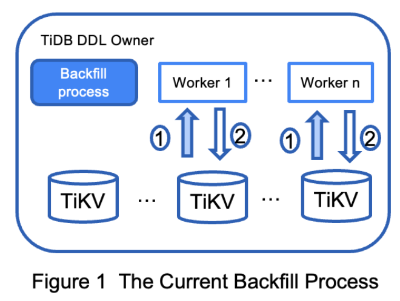
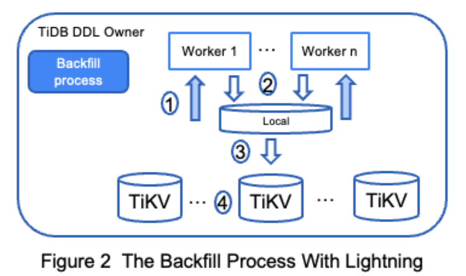

# TiDB Adding Index Acceleration 
- Author(s):     [Bear.C](https://github.com/Benjamin2037)
- Last updated:  2022-07-18
## Abstract
This document introduces a new way to create index in TiDB in a more efficient way. The existing proof-of-concept benchmark shows that it gives 4+ times performance improvement compared with the current solution. The current online create index implementation will be introduced as background knowledge.

## Background
The create index in TiDB is in an online fashion, users could add one index for a table and meanwhile DML transactions on the same table could be executed concurrently, which introduces a good experience to the user. To archive that, the process of creating an index is divided into 5 states internally:

- None - the initial state
- DeleteOnly - the index schema object is visible internally for the transactions, but index record can only be deleted.
- WriteOnly - the index schema object is visible internally for the transactions, and index record can be added/removed/updated.
- WriteReorganization - the index schema object is visible internally for the transactions, and index record can be added/removed/updated and the backfill workers are scheduled in this state to make sure index record will be 'backfilled' all for existing rows.
- Public - the final state in which all work is done and the index is visible to the user.

The backfill process scans all records from the table and generates an index key/value pair for each record, then fills the index data back into TiKV to form new index data. We found that backfilling data for index is a time-consuming task and it will be longer with user table data expanding sharply.

There are some measures that have been done to enhance the performance of creating index statements. For example, 1) the parallel execution backfill tasks and 2) adjustable batch size for every backfill batch. Below figure 1 is used to show the current backfill implementation.



From figure 1, the backfill task is firstly split into serial sub tasks, each sub tasks include one batch size record. Then, multi-workers are started up to execute backfill sub tasks parallelly.
Each worker is assigned one sub task and scans the specific record from the table.
Then generate index data for this batch record and write them back into TiKV with an optimistic write transaction.

## Goals
- Archives a better performance for creating the index in TiDB.
- Reduce the impact on DML transactions for foreground traffic when creating the index
## Non-Goal
- Make backfill work distributed in TiDB instances, which could be treated as a future enhancement based on this proposal.

## Proposal
The current backfill process could be inefficient for mainly two reasons:
1. The transactions need a full two-phase commit process and be transferred into a bunch of ‘Put’ operations for the storage(TiKV), which lead to extra overhead when we are trying to build a lot of index record.
2. The index data is written to TiKV in a ‘batch write’ transaction, it may conflict with the foreground traffic transaction and have to retry.

To improve the performance of backfill process, we would like to change it by:
1. One full copy of index data that uses the start of backfill processing as a snapshot and ingest the data to TiKV.
2. Delta part of index that user changed data during first step preparation a full copy.

The Online DDL supporting the above two preparing steps could be done async way. The new solution will also take use of this important fact.


## Rationale
In detail, instead of ‘batch write’ transaction, we could adopt the current Lightning to do the backfilling work. Lightning is a tool that is able to take rows as input and generate the SST files, ingest them to the storage(TiKV) directly. The figure 2 shows the changes of the new backfiller.



1. The first step is the similar as the current way, the worker is assigned to a sub task(range of data) and scans snapshot data with a unified timestamp obtained at ‘WriteReorganization’ state.
2. Generated this batch of index data, instead of committing a transaction for batch index data. A backfilling writer that is embedded with the Lightning engine built for each worker separately, it writes these index data to its local buffer and flush to the local storage as SST files.
3. The index data is sorted when compacting multiple SST files into one, each sorted files will be ingested into TiKV by the existing interface provided.
4. TiKV will finally combine the full copy of index data that was ingested with delta index part that was updated by user DML transaction during full copy preparation period. As the index at this time is almost completed its build process, so TiKV work in this step is not much.

Since Lightning writes index data firstly into local storage instead of committing backfill transactions to TiKV. This removes conflict with user transactions and there is no transaction commit time for backfill also. The main path bottleneck of adding indexes is removed. 

In addition to performance enhancement, the new solution could further lower the impact that DDL caused on DML. This point will be outstanding in the future implementation plan.

## Uniqueness check
For a unique index / primary key, we should be able to detect if a duplicate key is generated and reports an error if so. In order to archive that, we could reuse the `DuplicateDetect` interface provided by the Lightning engine:

```golang
service ImportSST {
   ...
   // Open a write stream to generate sst files
   rpc Write(stream WriteRequest) returns (WriteResponse) {}
   rpc RawWrite(stream RawWriteRequest) returns (RawWriteResponse) {}
   ...
 
   // Collect duplicate data from TiKV.
   rpc DuplicateDetect(DuplicateDetectRequest) returns (stream DuplicateDetectResponse) {}
}
```
Duplicate key will be reported when two unique index records with the same key but different value are encountered. In this case, we could report the error and cancel this DDL job.

### Checkpoints
In the current implementation, the progress of creating an index is persisted in reorgCtx, it is updated when each batch of the index is backfilled. For the new backfiller in this proposal, we could mark the progress in a similar way when an SST file generated from a batch of indexes is ingested successfully.
      
## Temporary files
The temporarily generated SST files are stored in local storage, the path of storage and maximum disk usage size should be configurable, but it’s not a good idea to modify them at runtime. If size of temporary files closes to allowed maximum size, the largest existing files are ingested to TiKV and cleaned.

Cleanup of the temporary files should be managed for the following cases:
- When the job is done or rollbacked, they are cleaned by the backfiller worker.
- Each TiDB instance should be able to check the inactive SST files and clean them, in case ownership of the job execution changes because of TiDB instance crashed.

## Limitations and future works
Compared with the current one, the CPU and memory consumption of new backfiller is not controlled smoothly when doing the ‘sort and ingest’.

## Compatibility
As an optimization, this proposal does not lead to any semantic change so theoretically there will be no compatibility issue.

### Enable/Disable
1. Use `tidb_ddl_enable_fast_reorg` to enable and disable new solution, default value is off. 

    Example:```TiDB> set global tidb_ddl_enable_fast_reorg = on/off;```

2. Use `tidb_ddl_disk_quota` to set a threshold of local disk max usage by new backfiller, the range of this variable is from 100 GiB to 1 PiB, default value is 100 GiB.
   
    Example:```TiDB> set global tidb_ddl_disk_quota = 107374182400;```

3. Use one config parameter `fast-reorg-local-path` to specify the sort path for lightning when it used in add index reorg stage. The default value is /tmp/tidb, please change it to your own disk path for the new backfiller could work properly.

    Example:```fast-reorg-local-path = "/tmp/tidb"```
