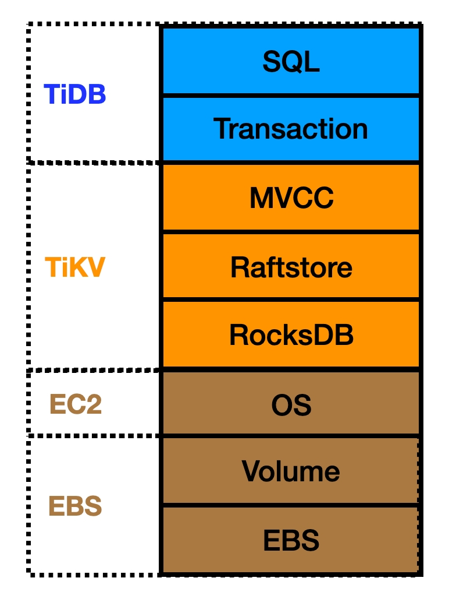
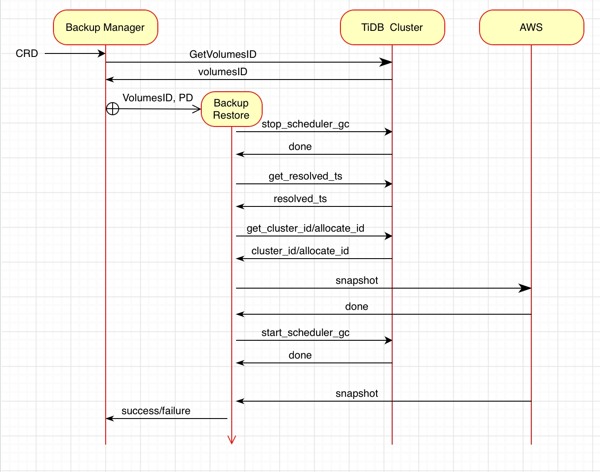
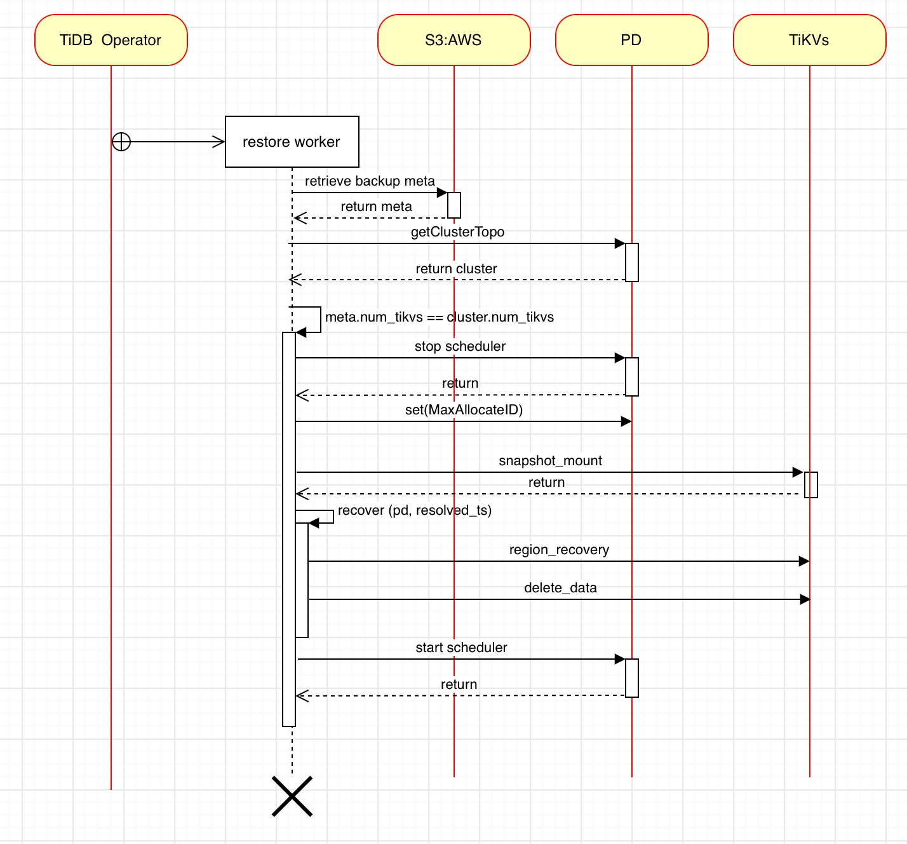

# TiDB Cluster on Amazon EBS Backup & Restore


## Table of Contents

* [Introduction](#introduction)
* [Goal](#goal)
* [Limitation](#limitation)
* [Architecture Design](#architecture-design)
    * [Solution Overview](#solution-overview)
      * [Backup Worker](#backup-worker)
      * [Restore Worker](#restore-worker)
    * [Key Design](#key-design)
      * [Backup](#backup)
      * [Restore](#restore)
    * [Data Consistency](#data-consistency)
      * [Transaction consistency](#transaction-consistency)
      * [A Raft Group consistency](#a-raft-group-consistency)
      * [Multi Raft Group consistency](#multi-raft-group-consistency)
* [Feature Detail Design](#feature-detail-design)
    * [Backup workflow](#backup-workflow)
    * [Restore workflow](#restore-workflow)
  * [Impacted components](#impacted-components)
    * [Backup Worker](#backup-worker)
    * [Restore Worker](#restore-worker)
    * [TiDB Operator](#tidb-operator)
      * [Backup design](#backup-design)
      * [Restore design](#restore-design)
    * [Backup & Restore](#backup-estore)
      * [BR Backup](#br-backup)
      * [BR Restore](#br-restore)
    * [TiKV](#tikv)
    * [Interface Definition](#interface-definition)
      * [restore worker - PD / TiKV](#restore-worker-pd-tikv)
      * [BR - PD](#br-pd)
      * [TiKV - PD](#tikv-pd)
      * [BR - TiKV](#br-tikv)
      * [BR - restore worker](#br-restore-worker)
    * [Backup & Restore](#backup-estore)
    * [Backup & Restore](#backup-estore)
    * [Backup & Restore](#backup-estore)
    * [Backup & Restore](#backup-estore)
* [Exception Handling](#exception-handling)
* [Backward / Forward Compatibility](#backward-forward-compatibility)
* [Security](#security)
* [Dependencies](#dependencies)
* [Technical Risk](#technical-risk)
* [Impacts & Risks](#impacts--risks)
* [Testing Note](#testing-note)
* [Design review](#design-review)


# **Introduction**

Amazon Elastic Block Store ([Amazon EBS](https://docs.aws.amazon.com/AWSEC2/latest/UserGuide/AmazonEBS.html)) is an easy-to-use, scalable, high-performance block-storage service designed for Amazon Elastic Compute Cloud (Amazon EC2). It provides varied volume types that best fit the workload. The EBS volumes that are attached to an instance are exposed as storage volumes that persist independently from the life of the instance. Most importantly, you can back up the data on your Amazon EBS volumes by taking EBS snapshots.

TiDB is a distributed database providing horizontal scalability, strong consistency, and high availability. It is designed to work in the cloud to make deployment, provisioning, operations, and maintenance flexible. 

Current TiDB Backup Restore solution provides high-performance backup and restore speeds for large-scale TiDB Clusters, however, the impact to  the cluster being backed up is notable for many customers and hard to reduce based on current implementation.  By leveraging the  Amazon EBS snapshot feature, we can provide a block-level based backup and recovery solution with transaction consistency and minimize the impact to the target TiDB cluster..


## Goal

Backup and Restore a TiDB cluster using the EBS snapshot on the AWS, it is expected to achieve:


* Minimize impact to the TiDB cluster during the backup.
    * QPS/Transaction Latency &lt; 5%
* Shorten backup and restore time.
    * Backup time &lt; 1 hours
    * Restore time &lt; 2 hours 


## Limitation


* Only AWS EBS supported, does not support EFS, local instance store etc.
* Does not support TiFlash backup & restore.
* Does not support other clouds.


# **Architecture Design**


## Solution overview

## 


A [Custom Resource Definition](https://kubernetes.io/docs/tasks/extend-kubernetes/custom-resources/custom-resource-definitions/) (CRD) generated based on the Backup/Restore request launched by the customer  in TiDB Operator. 

The Backup & Restore Controller detects the CRD. Then, creates a new POD to load the corresponding worker to execute the backup and restore work.


### **Backup Worker**


1. The backup started by a backup CRD where the customer submitted.
2. TiDB Operator creates/starts the Backup Worker (Job in the above figure) based on the CRD.
3. The Backup Worker gets the global resolved_ts of the TiDB cluster through PD and saves it into metadata.
4. The Backup Worker queries the topology information of the TiDB cluster and the corresponding EBS volume info of all TiKV nodes  and saves them in metadata. The Backup Worker configures the PD to prohibit operations such as replica, merge, and GC etc, and waits for the completion of the ongoing replica scheduling. At the same time, The Backup Worker gets the max allocated ID on the PD, and saves them in metadata.
5. The Backup Worker initiates an EBS snapshot to all nodes, and records the snapshot information in metadata.
6. The Backup Worker reconfigures the PD to get it back to its original state where we start backup.
7. The Backup Worker queries the status of the snapshot in each node, and waits until all snapshot states changed from pending to completed. The Backup Worker is automatically destroyed according to the configured CRD policy.

Notice:  If the user wants to delete the backup (snapshots and metadata), the user can simply remove the backup CR from TiDB Operator.


### **Restore Worker**


1. The Restore started by a restore CRD which the customer submitted.
2. TiDB Operator creates/starts the Restore Worker (Job in the above figure) based on the CRD.
3. The Backup Worker retrieves the global resolved_ts and topology diagram of the TiDB cluster from S3 backup metadata.
4. The Restore Worker checks the topology of the restored TiDB Cluster, (especially the number of TiKVs, volume). If it matches the topology in the metadata, the Restore Worker restores and mounts the snapshot to the restored TiDB Cluster from S3, otherwise it reports an error and exits.
5. The Restore Worker configures the PD to prohibit operations the same as Backup Worker do. 
6. The Restore Worker uses the global resolved_ts to invoke BR Recover component for  handling the data of the TiKV node into a consistent state.
7. The Restore Worker reconfigures the PD to get it back to its original state where we start backup. The TiDB cluster is online, and then The Restore Worker is automatically destroyed according to the CRD policy. The Restoration is finished.


## Key Design


### Backup

For Backup, as Backup Worker states, there are mainly 3 steps:


1. Configure the TiDB cluster.
2. Get TiDB cluster level resolved_ts.
3. Backup data by EBS snapshot.

Step 1 assume time &lt; 5 minute (included fault tolerance, e.g. retry)

Step 2 TiKV already maintains the resolved_ts component.

Step 3 snapshot depends on the customer's EBS volume type and data change. Excluding full snapshot at first time, one day data change with gp3 type takes ~ 10 minutes.  


### Restore

For Restore, as Restore Worker states, there are mainly 3 steps:


1. Init snapshot restore and prepare restored volume.
2. Region recovery, select a leader, and align raft log.
3. Resolved data by cluster level resolved_ts.

Step 1, assume takes &lt; 30 minutes

Step 2, assume takes &lt; 10 minutes, since the snapshot taken parallelly, the unalign raft log among peers in a Region is few.

Step 3, assume takes &lt; 30 minutes,  Resolved data by removing all key-values that have versions larger than resolved_ts. And also resolved data through the raft layer,  not to delete from disk directly.

Note: For EBS volume fully initialized, there are extra steps suggested by [AWS](https://docs.aws.amazon.com/AWSEC2/latest/UserGuide/ebs-initialize.html). 

Backup impact

EC2 IOPS may have some impact, we believed impact should be very few. Since EBS snapshot taken by AWS EBS service does not go through EC2, so that the impact should be very small, see next chapter.


## Data Consistency

TiDB Cluster On AWS EBS, a key-value write workflow as follows:

TiDB->TiKV->OS->EBS




<table>
  <tr>
   <td><strong>Layer</strong>
   </td>
   <td><strong>Owned By</strong>
   </td>
   <td><strong>Description</strong>
   </td>
  </tr>
  <tr>
   <td>SQL
   </td>
   <td>TiDB
   </td>
   <td>Where the user data comes from
   </td>
  </tr>
  <tr>
   <td>Transaction
   </td>
   <td>TiDB
   </td>
   <td>Refer to the transaction driver of TiDB,  which has ACID properties. 
   </td>
  </tr>
  <tr>
   <td>MVCC
   </td>
   <td>TiKV
   </td>
   <td>Multiversion Concurrency Control module in TiKV
   </td>
  </tr>
  <tr>
   <td>Raftstore
   </td>
   <td>TiKV
   </td>
   <td>An MultiRaft implementation in TiKV
   </td>
  </tr>
  <tr>
   <td>RocksDB
   </td>
   <td>TiKV
   </td>
   <td>A key-value storage stores user data
   </td>
  </tr>
  <tr>
   <td>OS
   </td>
   <td>AWS
   </td>
   <td>EC2 instance, response to local volume and format file system on volume.
   </td>
  </tr>
  <tr>
   <td>Volume
   </td>
   <td>AWS
   </td>
   <td>EBS volume, like a disk on an on-premises data center.
   </td>
  </tr>
  <tr>
   <td>EBS
   </td>
   <td>AWS
   </td>
   <td>More like an AWS storage pool, can provide a various performance disk (gp3, io2 etc) for EC2.
   </td>
  </tr>
</table>


In TiDB, The transaction layer adopts the Percolator model, which is 2 phase commit. TiDB is a distributed key-value database. TiKV uses the raft consensus algorithm to provide strong consistency. Furthermore, TiKV implements multi-raft in Raftstore and provides data consistency and scalability.

AWS EBS is the physical storage layer, and EBS volume can be backed up by EBS snapshot. In the transaction layer, after the data of the same transaction is encoded by the MVCC and processed by the raft layer, complete transaction data is written on different TiKV EBS volumes. The consistency of the snapshot on these volumes needs to be handled as follow:


#### Transaction consistency

TiKV has the Region resolved_ts component maintains timestamp (ts) within a Region. This resolved_ts ensures that the timestamp with the maximum consistency of the current Region data, any data with timestamp lower than resolved_ts has transaction layer consistency. Meanwhile, in the latest implementation, TiKV calculates the minimum resolved_ts of the current store, and reports it to PD. See [ReportMinResolvedTsRequest](https://github.com/fengou1/kvproto/blob/bd679cab506b8b8b75af2595624c3c3cd4254354/proto/pdpb.proto#L825).

In our solution, we get this resolved_ts from PD and use it as ts to resolve backup in the restore phase.

The key-value of the same transaction will be written to different Raft Groups. In the restore phase, after a Raft Group is handled to consistency, we use transaction-consistent resolved_ts to go to each TiKV to delete the data of incomplete transactions. For this step, see the detailed design of the Backup and Restore ResolvedData phase.

For more detailed design and demonstration process, see [EBS Backup Restore Demo](https://pingcap.feishu.cn/docs/doccntvRspfpQoojAlS5bHlXjsf)


#### A Raft Group consistency

For each Raft Group within TiKV, we have to deal with Region metadata and Region data.


* Region metadata


In TiKV#1, a write proposal has been applied, but TiKV#2 and TiKV#3 have not been applied.

For each Raft Group, we process the meta and data of the Region through BR RegionRecover, its workflow as follows:


1. In the restore phase,  put TiKV in the recovery mode, and TiKV reports all peer lists to BR.
2. For each raft group, find the peer with the largest commit index in the Region, and force it to be the leader. For other peers to be silent, start the raft state machine.
3. Wait for all peers in the Region until applied index == commit index, and then set the correct raft status to exit data RegionRecover recovery.
* Region data

In the previous step of RegionRecover phase, the second step is to start the raft state machine, so that the raft log of each Region non-leader node is applied to the largest commit index. Region-level data consistency achieved.


#### Multi Raft Group consistency

Turn off replica replication. The reason is that when there are a large number of write scenarios to TiDB Cluster, the snapshot is sync. It is very likely that replica replication between 2 volumes has been snapshotted. At block-level data may be lost. At the same time, replica scheduling makes the epoch version change, and there are many intermediate states that need to be processed. These states make it very complicated to deal with such problems. Currently PD supports the following methods to turn off replica replication:


```
./pd-ctl --pd=http://127.0.0.1:2379 config set merge-schedule-limit 0
./pd-ctl --pd=http://127.0.0.1:2379 config set region-schedule-limit 0
./pd-ctl --pd=http://127.0.0.1:2379 config set replica-schedule-limit 0
```


After the above schedule is limited to 0, replica addition, deletion and replication (from one TiKV to another) are prohibited. At the same time, functions such as merge and scatter across TiKV are also prohibited. For Regions that may have overlapping Ranges due to splits, after PD scheduling is resumed. please refer to the Recover function design for details, and for details about replicas, please refer to Q&A


# **Feature Detail Design**


### **Backup workflow**





After the TiDB Operator starts the Backup Worker, the backup job starts.


1. Get the cluster level consistency resolved_ts. Get it directly from PD ([report_min_resolved_ts_interval](https://github.com/tikv/pd/issues/4686) is configured) or
    1. Query PD to get all store IDs, see [GetAllStoresRequest](https://github.com/fengou1/kvproto/blob/bd679cab506b8b8b75af2595624c3c3cd4254354/proto/pdpb.proto#L235).
    2. Get the resolved_ts of each store through the store ID. See the [interface definition](#bookmark=id.n24qqyjt75si).
    3. Calculate the cluster level resolved_ts of the current cluster.
2. Configure the PD scheduler to stop cluster replica replication. Stop GC.
3. Backup the max allocated ID of the PD.
4. Take snapshots for all TiKV volumes in the cluster through CSI to save metadata information to S3. For details, refer to the definition of[ metadata information](#bookmark=id.pm5ucdf8u44s)
5. Wait for the snapshot to complete and save the cluster meta information to S3.
6. Resume scheduling of the PD cluster.
7. Exit the backup.


### **Restore workflow**





After the TiDB Operator starts the Restore Worker, it starts to restore work.

- Restore prerequisites:


* The customer already has a cluster to be restored and specified in the CRD.
* The backup data has been specified in the CRD.
1. The Restore Worker retrieves the backup metadata, which includes cluster topology information and cluster level resolved_ts during backup.
2. The Restore Worker gets the topology information of the present TiDB cluster through PD. (e.g: the number of TiKVs, replica). see [GetAllStoresRequest](https://github.com/fengou1/kvproto/blob/bd679cab506b8b8b75af2595624c3c3cd4254354/proto/pdpb.proto#L235).
3. The Restore Worker checks whether the topology information of the target cluster to be restored is consistent with the original cluster information. If they are identical, start the restoration, otherwise exit directly.
4. The Restore Worker stops the related scheduling of the PD, and the PD stops the scheduling interface definition [NewConfigSchedulerCommand](https://github.com/fengou1/pd/blob/7baf94c8644ccd55930d213e298fc0104bc7a453/tools/pd-ctl/pdctl/command/scheduler.go#L434)
5. The Restore Worker restores the PD with Cluster ID and max allocated ID. See [recoverFromNewPDCluster](https://github.com/fengou1/pd/blob/7baf94c8644ccd55930d213e298fc0104bc7a453/tools/pd-recover/main.go#L112).
6. The Restore Worker stops TiKV, and restores snapshot to volume according to the snapshot id in the metadata, mounts volume to TiKV.
7. Using the cluster level resolved_ts in the backup metadata, call the BR Recover to process all TiKV data into a cluster level consistent state.
8. The Restore Worker resumes the PD scheduler to bring TiDB cluster online, the restoration work is completed, and the restore worker exits.


## Impacted components

**Backup metadata definition**


```json
{
 "cluster_info": {
   "cluster_version": "v6.1.0",
   "max_alloc_id": "6000",
   "resolved_ts": "456745777823347",
 },
 "tikv" : {
   "replicas": 3,
   "stores": [
   {
     "store_id" : 1,
     "volumes" : [
       {
         "volume_id" : "vol-0e65f40961a9f6244",
         "type" : "raft-engine.dir",
         "mount_path" : "/var/lib/tikv/raft-engine",
         "restore_volume_id" : "vol-0e65f40961a9f0001", // Create volume from snapshot for restore
         "snapshot_id" : "snap-1234567890abcdef0", // Keep the whole metadata intact and add snapshot-created here
       },
       {
         "volume_id" : "vol-0e65f40961a9f6245",
         "type" : "storage.data-dir",
         "mount_path" : "/var/lib/tikv/data-dir",
         "restore_volume_id" : "vol-0e65f40961a9f0002",
         "snapshot_id" : "snap-1234567890abcdef1",
       }
     ]
   },
   {
     "store_id" : 2,
     "volumes" : [
       {
         "volume_id" : "vol-0e65f40961a9f6246",
         "type" : "raft-engine.dir",
         "mount_path" : "/var/lib/tikv/raft-engine",
         "restore_volume_id" : "vol-0e65f40961a9f0003",
         "snapshot_id" : "snap-1234567890abcdef2",
         "fsr-enabled": "false",
       },
       {
         "volume_id" : "vol-0e65f40961a9f6247",
         "type" : "storage.data-dir",
         "mount_path" : "/var/lib/tikv/data-dir",
         "restore_volume_id" : "vol-0e65f40961a9f0004",
         "snapshot_id" : "snap-1234567890abcdef3",
         "fsr-enabled": "false",
       }
     ]
   },
    {
     "store_id" : 3,
     "volumes" : [
       {
         "volume_id" : "vol-0e65f40961a9f6248",
         "type" : "raft-engine.dir",
         "mount_path" : "/var/lib/tikv/raft-engine",
         "restore_volume_id" : "vol-0e65f40961a9f0005",
         "snapshot_id" : "snap-1234567890abcdef4",
         "fsr-enabled": "false",
       },
       {
         "volume_id" : "vol-0e65f40961a9f6249",
         "type" : "storage.data-dir",
         "mount_path" : "/var/lib/tikv/data-dir",
         "restore_volume_id" : "vol-0e65f40961a9f0006",
         "snapshot_id" : "snap-1234567890abcdef5",
         "fsr-enabled": "false",
       }
     ]
   }
 ],
 },
 "pd" : {
   "replicas" : 3
 },
 "tidb": {
   "replicas" : 3
 },
 "kubernetes" : {
   "pvs" : [],  // PersistentVolume as resource native to Kubernetes
   "pvcs" : [],  // PersistentVolumeClaim as resource native to Kubernetes
   "crd_tidb_cluster" : {},     // CRD-TidbCluster for TiDB-Operator - Optional
   "options" : {}   // unstructured.Unstructured uses a collection of nested map[string]interface{} values - Optional
 }，
 "options" : {} 
}
```


### Backup Worker

Backup worker has implements the following functions:

1. Obtain the configuration information of the online backup cluster, such as resolved_ts, max allocate ID.

2. Configure cluster PD scheduling, stop replica scheduling, turn off GC during backup, and then turn on GC after backup.

3. The snapshot function of EBS/pv volumes whose TiKV running on.

Worker container contains: 1. backup-manager, 2. BR


```
//TODO: command name is not finalized, it may change during implementation
br backup ebs --pd "172.16.2.1:2379" -s "s3:/bucket/backup_folder" --volumes-file=backup.json
```


Backup worker workflow


1. TiDB Operator retrieves the PD address of the target cluster and all TiKV volume information.

2. TiDB Operator provides --volumes-file=backup.json for the backup cluster, starts the backup job, and backup.toml contains:


```json
{
 "tikv" : {
   "replicas": 3,
   "stores": [
   {
     "store_id" : 1,
     "volumes" : [
       {
         "volume_id" : "vol-0e65f40961a9f6244",
         "type" : "raft-engine.dir",
         "mount_path" : "/var/lib/tikv/raft-engine"
       },
       {
         "volume_id" : "vol-0e65f40961a9f6245",
         "type" : "storage.data-dir",
         "mount_path" : "/var/lib/tikv/data-dir"
       }
     ]
   },
   {
     "store_id" : 2,
     "volumes" : [
       {
         "volume_id" : "vol-0e65f40961a9f6246",
         "type" : "raft-engine.dir",
         "mount_path" : "/var/lib/tikv/raft-engine"
       },
       {
         "volume_id" : "vol-0e65f40961a9f6247",
         "type" : "storage.data-dir",
         "mount_path" : "/var/lib/tikv/data-dir",
       }
     ]
   },
    {
     "store_id" : 3,
     "volumes" : [
       {
         "volume_id" : "vol-0e65f40961a9f6248",
         "type" : "raft-engine.dir",
         "mount_path" : "/var/lib/tikv/raft-engine"
       },
       {
         "volume_id" : "vol-0e65f40961a9f6249",
         "type" : "storage.data-dir",
         "mount_path" : "/var/lib/tikv/data-dir",
       }
     ]
   }
 ], 
 },
 "pd" : {
   "replicas" : 3
 },
 "tidb": {
   "replicas" : 3
 }, 
 "kubernetes" : {
   "pvs" : [],  // PersistentVolume as resource native to Kubernetes
   "pvcs" : [],  // PersistentVolumeClaim as resource native to Kubernetes
   "crd_tidb_cluster" : {},     // CRD-TidbCluster for TiDB-Operator - Optional
   "options" : {}   // unstructured.Unstructured uses a collection of nested map[string]interface{} values - Optional
 }，
 "options" : {}
}
```


3. Job contains BR, BR reads the details of backup.json and starts backup. For more backup details, see BR Backup Detailed Design.


### RestoreWorker

Restore worker implements the following functions:

1. Obtain the deployment information of the recovery cluster, such as: PD, number of tikv

2. The ability to restore EBS/pv volumes from snapshot

3. Mount and start control of TiKV volume of cluster

4. Start BR for data recovery

Worker container contains: 1. backup-manager, 2. BR

Restore worker workflow:


1. backup-manager starts BR to read backup information from S3, get all snapshotIDs, set PD to the recovery mode. Examples of BR commands are as follows:


```
//TODO: command name is not finalized, it may change during implmenentation
/br restore ebs --pd "172.16.2.1:2379" -s "s3:///us-west-2/meta/&sk=xx..." --output=topology.json
```


BR command output as follows:


```json
{
 "cluster_info": {
   "cluster_version": "v6.1.0",
   "max_alloc_id": "6000",
   "resolved_ts": "456745777823347",
 },
 "tikv" : {
   "replicas": 3,
   "stores": [
   {
     "store_id" : 1,
     "volumes" : [
       {
         "volume_id" : "vol-0e65f40961a9f6244",
         "type" : "raft-engine.dir",
         "mount_path" : "/var/lib/tikv/raft-engine",
         "restore_volume_id" : "vol-0e65f40961a9f0001", // Create volume from snapshot for restore
         "snapshot_id" : "snap-1234567890abcdef0" // Keep the whole metadata intact and add snapshot-created here
       },
       {
         "volume_id" : "vol-0e65f40961a9f6245",
         "type" : "storage.data-dir",
         "mount_path" : "/var/lib/tikv/data-dir",
         "restore_volume_id" : "vol-0e65f40961a9f0002",
         "snapshot_id" : "snap-1234567890abcdef1"
       }
     ]
   },
   {
     "store_id" : 2,
     "volumes" : [
       {
         "volume_id" : "vol-0e65f40961a9f6246",
         "type" : "raft-engine.dir",
         "mount_path" : "/var/lib/tikv/raft-engine",
         "restore_volume_id" : "vol-0e65f40961a9f0003",
         "snapshot_id" : "snap-1234567890abcdef2"
       },
       {
         "volume_id" : "vol-0e65f40961a9f6247",
         "type" : "storage.data-dir",
         "mount_path" : "/var/lib/tikv/data-dir",
         "restore_volume_id" : "vol-0e65f40961a9f0004",
         "snapshot_id" : "snap-1234567890abcdef3"
       }
     ]
   },
    {
     "store_id" : 3,
     "volumes" : [
       {
         "volume_id" : "vol-0e65f40961a9f6248",
         "type" : "raft-engine.dir",
         "mount_path" : "/var/lib/tikv/raft-engine",
         "restore_volume_id" : "vol-0e65f40961a9f0005",
         "snapshot_id" : "snap-1234567890abcdef4"
       },
       {
         "volume_id" : "vol-0e65f40961a9f6249",
         "type" : "storage.data-dir",
         "mount_path" : "/var/lib/tikv/data-dir",
         "restore_volume_id" : "vol-0e65f40961a9f0006",
         "snapshot_id" : "snap-1234567890abcdef5"
       }
     ]
   }
 ],
 },
 "pd" : {
   "replicas" : 3
 },
 "tidb": {
   "replicas" : 3
 },
 "kubernetes" : {
   "pvs" : [],  // PersistentVolume as resource native to Kubernetes
   "pvcs" : [],  // PersistentVolumeClaim as resource native to Kubernetes
   "crd_tidb_cluster" : {},     // CRD-TidbCluster for TiDB-Operator - Optional
   "options" : {}   // unstructured.Unstructured uses a collection of nested map[string]interface{} values - Optional
 }，
 "options" : {} 
}
```


2. The backup-manager mounts the relevant volume and starts TiKV.

3. The backup-manager starts the BR again until the BR completes the restoration of data consistency, sets the PD flag to enter the normal mode, and then restarts TiKV to exit. For detailed design, see BR Restore Detailed Design


```bash
/br restore data --pd "172.16.2.1:2379" -s "s3:///us-west-2/meta/&sk=xx..."
```


### TiDB Operator

**Backup design**


1. Expand the CR of [TiDB Operator](https://github.com/pingcap/tidb-operator/): [Backup](https://github.com/pingcap/tidb-operator/blob/f73a54732ac19ddbb5b59e752794898b4502cd53/docs/api-references/docs.md#backup/BackupSchedule/Restore) / [BackupSchedule](https://github.com/pingcap/tidb-operator/blob/f73a54732ac19ddbb5b59e752794898b4502cd53/docs/api-references/docs.md#backupschedule) / [Restore](https://github.com/pingcap/tidb-operator/blob/f73a54732ac19ddbb5b59e752794898b4502cd53/docs/api-references/docs.md#restore), add new snapshot types.
2. Obtain PD / TiKV / TiDB replicas from each Spec of CR-[TiDBCluster](https://github.com/pingcap/tidb-operator/blob/f73a54732ac19ddbb5b59e752794898b4502cd53/docs/api-references/docs.md#tidbcluster).
3. Based on TiKV-StatefulSet to create the Pods / PVs / PVCs for extracting each store_id and the corresponding volume information, including volume ID, configuration type and the path to mount to the container, pay attention to the specific provisioner type here, and the volume_id will be distinguished. If the volume uses [AWS-EBS-CSI-driver](https://pingcap.feishu.cn/wiki/wikcnBbTz00zcig0FlErkCMJCKf#) whose Type is CSI and Driver is [ebs.csi.aws.com](http://ebs.csi.aws.com/), it will be extracted from Source.VolumeHandle after mapping.
4. Create a Job through Backup Manager, pass in the above meta information structure, configure storage such as S3, process permissions such as iam + serviceaccount or secret, and finally call BR to execute the call [EC2-CreateSnapshot](https://docs.aws.amazon.com/sdk-for-go/api/service/ec2/#EC2.CreateSnapshot) to create a snapshot, and complete the PD scheduler and GC at the same time. management to ensure volume snapshots are performed at safe points.
5. The actual volume snapshot progress is updated by the ticker to report the backup progress until the backup is completed.
6.  Wait for the BR execution to complete, report the update backup completion status, and exit the job.

**Restore design**


1.  Expand CR: Restore of TiDB Operator, add snapshot restore type, expand restore state machine, add volume restore completion status and data restore complete status.
2.  Set the recovery mark of CR-TiDBCluster and let the TiDBCluster Controller handle it. After the PD is created and running normally, it blocks the creation of TiKV-StatefulSet and waits for the mark of successful volume recovery to be cleared.
3. When PD is running and TiKV is not running, create Job-1 through Restore Manager, configure storage such as S3, process permissions such as iam + serviceaccount or secret, and finally call BR to restore the volume snapshot, and set the PD flag to be in recovery mode.
4. Wait for the BR execution to complete, report the metadata information of the update output, set the Restore status to volume recovery complete, and exit Job-1.
5. When the volume recovery is complete, the Restore Manager resets the blocking flag of TiKV, processes the volume information according to different Provisioners, converts the settings into the corresponding PVs, and clears the metadata information used for the binding of PVs and PVCs. In the scenario, you need to rename the corresponding PVs, and submit the above tags and newly constructed PVs / PVCs resources.
6.  After the TiKV member Manager is unblocked, it continues to execute the StatefulSet creation process, and then processes the submitted PVCs/PVs and other information. After TiKV starts running and interacts with the PD with the recovery mark for the first time, it enters the recovery mode to run.
7.  After the Restore Manager monitors that TiKV / PD is running, and there is a recovery mark, it creates Job-2, and finally calls BR to execute the data consistency of TiKV according to its own CR-Restore configuration parameters, metadata information, and current status. Process, clear data after min_resolved_ts, also clear PD flag and resume normal operation mode.
8. Wait for the BR execution to complete, report the updated Restore status as data recovery complete, and exit Job-2.
9. After the Restore Manager clears the recovery mark and monitors the normal operation of CR-TiDBCluster and provides services, set the Restore status to recovery complete.


### Backup & Restore 


#### BR Backup

1. Backup cluster basic metadata, such as resolved_ts, Allocate ID,

2. Configure cluster scheduling, stop replica scheduling, turn off GC during backup, and turn on GC after backup

3. The snapshot function of EBS/pv volumes

Backup workflow


<p id="gdcalert12" ><span style="color: red; font-weight: bold">>>>>>  gd2md-html alert: inline image link here (to imgs/image12.jpg). Store image on your image server and adjust path/filename/extension if necessary. </span><br>(<a href="#">Back to top</a>)(<a href="#gdcalert13">Next alert</a>)<br><span style="color: red; font-weight: bold">>>>>> </span></p>


1. The BR is connected to the PD, and the BR stops the copy scheduling of the PD, mainly by setting the number of PD operators to limit the copy scheduling. Before setting, you need to read the current operator configuration information, and restore the cluster configuration immediately after the snapshot is completed. The main PD operator needs to contain:

2. Read resolved_ts and save it in the backup data.

3. Shut down the GC and start a background safepoint keeper. Continuously update the GC safepoint to stop the GC.

4. Get the ongoing replica scheduling operator operation and wait until the scheduling is complete.

5. The BR calls the PD interface to read the allocatedID, and the cluster version is stored in the backup data.

6. For all tikv volume snapshots, the snapshot order is as follows:

   1. The same TiKV uses different raft log volumes and kv db volumes, the order of snapshots raft log volumes --> kv db volumes

snapshot required parameter --volume-id, other parameters are not required. aws ebs example:

7. After the Snapshot returns (EBS snapshot returns immediately), enable copy scheduling and enable GC.

8. Wait for the AWS snapshot to complete

9. Summarize all backup data information and upload to the target storage S3.


#### BR Restore

There are mainly 2 phase implementations, RegionRecover and ResolvedData.


* RegionRecover design
1. After the BR Recover function is invoked by TiDB Operator, BR first switches TiKV to recovery mode. At the same time, BR starts the recover_regions service. Monitor TiKV's Region information report.
2. TiKV scans the metadata of all local regions (including those in the Tombstone state), and sends it to the BR by a stream through the recover_regions service.
3. After the BR receives the reports of all Region info (peer list) of all TiKV instances, it makes a decision based on the reported peer list. And send the recovery command to all TiKV instances for each region; close gRPC stream after sending. The BR decision as follows:
    1. Within a Region, force the peer with the largest commit index as the leader.
    2. Set the tombstone to true when the pear is learner in the peer list.
4. TiKV deals with the BR Adviser recovery command accordingly. After completion, TiKV reports the completion status of the local peer.
5. When the BR receives all the reports of the recovery command complete, it starts the Region raft state machine and waits for the applied index == commit index. Then, report the result to the BR for data that has reached applied index == commit index. After that the BR cancels the leader. Exit the recovery mode.
6. RegionRecover completes.
* ResolvedData design

Delete RocksDB data according to the cluster level resolved_ts which get during the backup.


1. Scan the KV DB of each TiKV through resolved_ts.
2. Directly delete the Lock CF data of each KV DB.
3. For each KV DB's Data CF key-value, if start_ts > resolved_ts, delete this key-value.
4. Do not process the Write CF data of each KV DB.


### TiKV

Newly added recovery service/recovery mode

1. Definitions

After TiKV starts raft-engine and kv engine, when establishing pdclient, it actively reads recovery Mode, cluster ID, and the first message of the connection between TiKV and PD from PD.

TiKV performs data recovery in recovery mode. It mainly performs raft state machine and data consistency adjustment in the recovery phase. TiKV mainly completes the recovery work in three steps in Recovery mode:

Step 1: Report metadata, and adjust local metadata.

  1. Before TiKV starts, read the cold data of the disk to make recovery decisions for BR. Scan all local Region metadata and wait for BR to read and process. For details, see: RegionRecover Function Design in Recovery Phase. Code refer: demo

  2. After BR sends RecoveryCmd to TiKV, TiKV immediately performs metadata adjustment and saves the list of force leaders.

    1. Update the cluster id of the current kvdb. Under RecoveryMode, the latest cluster id generated by PD shall prevail.

    2. All raft states are inconsistent, the region peer state is normal, adjust and update the raft state. The purpose is to allow all normal peers to be created normally. TODO: @Ophone Ou

Step 2: Align raft log

  3. Stop raft's election by setting the maximum election timeout, in order to prevent all peers from electing. Only BRs can specify peers to initiate campaigns.

  4. Set the timeout time of the peer's maximum unowned state, so that even if the peer is still in the unowned state for a long time, it will not be considered invalid and will be deleted as a tombstone.

  5. Perform force leader processing, force the peers of the current node to launch elections, and confirm that they all become leaders.

  6. All region peers are aligned to the region's largest commit index. That is: applied index == commit index.

Step 3: Delete data (start a recovery service?)

  7. Delete data according to the resolved_ts given by BR.

In recover mode, data consistency recovery is mainly completed. For details, see Recover function design in recovery phase.


### Interface Definition


### restore worker - PD / TiKV


1. Get cluster level consistency timestamp resolved_ts from PD directly.

HTTP API


<p id="gdcalert13" ><span style="color: red; font-weight: bold">>>>>>  gd2md-html alert: inline image link here (to imgs/image13.png). Store image on your image server and adjust path/filename/extension if necessary. </span><br>(<a href="#">Back to top</a>)(<a href="#gdcalert14">Next alert</a>)<br><span style="color: red; font-weight: bold">>>>>> </span></p>


More info, please refer to[ PR](https://github.com/tikv/pd/pull/4716)


1. Get TiKV level consistency timestamp resolved_ts.

```go
message GetMinResolvedTsRequest {
   uint64 store_id = 1;
}

message GetMinResolvedTsResponse {
   uint64 store_id = 1;
   uint64 min_resolved_ts = 2;
}
```


### BR - PD


```go
type Client interface {
   // SetRecoveryMode for the cluster from BR.
   SetRecoveryMode(ctx context.Context, mode bool) error
}
```


### TiKV - PD


```go
type Client interface {
   // TiKV  GetRecoveryMode from PD.
   GetRecoveryMode(ctx context.Context) bool
}
```


### BR - TiKV

During the BR data recovery RegionRecover phase:

TiKV enters the recovery mode interface.


```go
message SwitchModeRequest {
   string pd_addr = 1;
   SwitchModeRequest request = 2;
   recover_server = 3;
   recover_server_port = 4;
}
message SwitchModeResponse {
}
```


TiKV report region meta interface.


```go
message RegionMeta {
   uint64 region_id = 1;
   uint64 commit_index = 2;
   uint64 term = 3;
}
```


BR RegionRecover command interface


```go
message RegionRecover {
   uint64 region_id = 1;
   bool force_leader = 2; // force the peer to be a leader
   bool silence = 3; // disable the voter
   bool tombstone = 4; // set this peer as tombstone
}
```


During the BR ResolvedData phase, delete data interface:


```go
message DeleteKVByTsRequest {
   Context context = 1;
   string cf = 2;
   uint64 start_ts = 3;
}

message DeleteKVByTsResponse {
   errorpb.Error error = 1;
}
```


### BR - restore worker

recovery phase

During the recovery phase, TiDB Operator needs to pass two parameters --pd and --resolved_ts to BR


```bash
/usr/bin/br recover --pd "172.16.2.1:2379" -resolved_ts=467775486547
```


## Exception Handling


* Backup


<p id="gdcalert14" ><span style="color: red; font-weight: bold">>>>>>  gd2md-html alert: inline image link here (to imgs/image14.png). Store image on your image server and adjust path/filename/extension if necessary. </span><br>(<a href="#">Back to top</a>)(<a href="#gdcalert15">Next alert</a>)<br><span style="color: red; font-weight: bold">>>>>> </span></p>


1. TiKV does not configure report_min_resolved_ts_interval, and directly obtains TiKV level resolved_ts from TiKV. 
2. Failed to stop PD scheduler, try again. If multiple retries fail within some minutes, the entire backup fails, and then stops snapshot and removes metadata.
3. Snapshot takes too long or failure

      In the version, we just simply fail the entire backup. Meanwhile, the snapshot taken shall be deleted since the backup shall be a failure.


4. If the PD cannot be connected, retry is required, and the retry logic can refer to the existing logic of BR.
5. Failed to start PD scheduler, try again. If multiple retries fail, the entire backup completed with exception, it shows key log / instruction to the user how to set backup to normal.
* Restore


<p id="gdcalert15" ><span style="color: red; font-weight: bold">>>>>>  gd2md-html alert: inline image link here (to imgs/image15.png). Store image on your image server and adjust path/filename/extension if necessary. </span><br>(<a href="#">Back to top</a>)(<a href="#gdcalert16">Next alert</a>)<br><span style="color: red; font-weight: bold">>>>>> </span></p>


1. Unable to obtain S3 data due to permissions, fail the restore.
2. The retry mechanism is introduced because the network cannot obtain S3 data. Design can refer to the existing BR and TiKV logic.
3. The Snapshot recovery volume fails, and a retry mechanism is introduced. It fails after some tries, and removes the restore volume, rolls back to the state where backup starts.
4. BR fails in RegionRecover phase and ResolvedData phase with timeout:
    1. The retry mechanism needs to consider the time cost and the success possibility of retry. If there is no possibility of success, it will fail directly.
    2. When rollback is required in failure scenarios, the rollback should consider not to destroy the original backup snapshot data. For example: if ResolvedData fails, rollback requires unmount volume, delete volume, and set TiKV to the original state.


## Backward / Forward Compatibility

Only support v6.0.0 or late


## Security

We prefer the IAM role to backup and restore, however, we are able to use the secret key-id way to launch the backup and restore. Here we re-use the TiDB Operator logic to handle the security part.


## Dependencies

[AWS API](https://docs.aws.amazon.com/AWSEC2/latest/APIReference/Welcome.html)

[AWS EBS Snapshot](https://docs.aws.amazon.com/AWSEC2/latest/UserGuide/AmazonEBS.html)

[K8S CSI driver](https://www.google.com/url?q=https://github.com/kubernetes-sigs/aws-ebs-csi-driver/tree/master/examples/kubernetes/snapshot&sa=D&source=docs&ust=1649386957733703&usg=AOvVaw2a-iF4GtipADKwzRItsAiK)


## Technical Risk

All block issues had been identified. However some part of design may need some spiking during the implementation phase.


# **Testing Note**


* White Box - CI:

1. Use Linux LVM or ceph to simulate EBS

2. Data consistency verification

  1. Generate data across multiple TiKV within a single Raft Group

  2. Multi Raft Group data is inconsistent

  3. The transaction data (including the verification of async commit) is inconsistent

  4. Mix the above scenarios

3. The LVM snapshots created contain the above scenario.

4. Develop a set of tools to read region meta and KV DB information from TiKV

  1. Maximum applied index per region

  2. The minimum start_ts of lock CF in each TiKV, and the maximum commit_ts of commit CF

  3. Backup start time backup_ts, snapshot completion time snap_ts

5. Verify the correctness of the backup data

All data in TiKV lockCF has a timestamp larger than resolved_ts.

6. Verification of recovered data

  1. Use the tool to check the maximum applied index of all Regions

  2. resolved_ts, compare resolved_ts during backup and resolved_ts after cluster restored


* Black Box - SQL Validation Method:

Stale Read method for online data verification

Write a script, use the backup resolved_ts, Stale Read the original cluster data, compare with restore the cluster data

More verification methods are added in the implementation phase.

**Feature Breakdown**


<table>
  <tr>
   <td><strong>User Story</strong>
   </td>
   <td><strong>Description</strong>
   </td>
   <td><strong>Impact Component</strong>
   </td>
   <td><strong>Size</strong>
   </td>
   <td><strong>Comment</strong>
   </td>
  </tr>
  <tr>
   <td>#1
   </td>
   <td>Introduce some interfaces among restore worker PD and TiKV
   </td>
   <td>PD Client/kvproto
   </td>
   <td>~2 point
   </td>
   <td>
   </td>
  </tr>
  <tr>
   <td>#2
   </td>
   <td>Define interface between BR and TiKV
   </td>
   <td>kvproto
   </td>
   <td>~2 point
   </td>
   <td>
   </td>
  </tr>
  <tr>
   <td>#3
   </td>
   <td>Introducing a new recovery mode in TiKV.  Maybe some spike is needed.
   </td>
   <td>TiKV
   </td>
   <td>~XL
   </td>
   <td>
   </td>
  </tr>
  <tr>
   <td>#4
   </td>
   <td>Implement BR RegionRecover service and demo it
   </td>
   <td>BR/TiKV
   </td>
   <td>~2XL
   </td>
   <td>
   </td>
  </tr>
  <tr>
   <td>#5
   </td>
   <td>Implement BR ResolvedData function and demo it
   </td>
   <td>BR/TiKV
   </td>
   <td>~XL
   </td>
   <td>
   </td>
  </tr>
  <tr>
   <td>#6
   </td>
   <td>Implement get resolved_ts function
   </td>
   <td>TiDB Operator
   </td>
   <td>~3 point
   </td>
   <td>
   </td>
  </tr>
  <tr>
   <td>#7
   </td>
   <td>Implement stop scheduler and start scheduler function
   </td>
   <td>TiDB Operator
   </td>
   <td>3~5 point
   </td>
   <td>
   </td>
  </tr>
  <tr>
   <td>#8
   </td>
   <td>Adapt PD Recovery (backup and restore Cluster ID and Max Allocated ID)
   </td>
   <td>TiDB Operator
   </td>
   <td>~2 point
   </td>
   <td>
   </td>
  </tr>
  <tr>
   <td>#9
   </td>
   <td>CSI-EBS snapshot function design
   </td>
   <td>TiDB Operator
   </td>
   <td>~XL
   </td>
   <td>
   </td>
  </tr>
  <tr>
   <td>#10
   </td>
   <td>MetaData design
   </td>
   <td>TiDB Operator
   </td>
   <td>~5 point
   </td>
   <td>
   </td>
  </tr>
  <tr>
   <td>#11
   </td>
   <td>CI function design and implementation
   </td>
   <td>TiDB Operator/BR/TiKV
   </td>
   <td>~2XL
   </td>
   <td>
   </td>
  </tr>
  <tr>
   <td>#12
   </td>
   <td>Demo
   </td>
   <td>TiDB Operator/BR/TiKV
   </td>
   <td>~5 point
   </td>
   <td>
   </td>
  </tr>
  <tr>
   <td>#13
   </td>
   <td>Full coverage validation design and test.
   </td>
   <td>TiDB Operator/BR/TiKV
   </td>
   <td>~3XL
   </td>
   <td>
   </td>
  </tr>
</table>


Total: 11 XL

Note:

1 point = 1 person/day

XL = 1 person/month

**Glossary and Acronyms**

Raft Group

A Raft Group contains a Region and a raft state machine that drives the data changes of the entire Region. Here we mainly focus on

Main structure descriptions related to: RegionLocalState, RaftLocalState and RaftApplyState

E.g:


<p id="gdcalert16" ><span style="color: red; font-weight: bold">>>>>>  gd2md-html alert: inline image link here (to imgs/image16.png). Store image on your image server and adjust path/filename/extension if necessary. </span><br>(<a href="#">Back to top</a>)(<a href="#gdcalert17">Next alert</a>)<br><span style="color: red; font-weight: bold">>>>>> </span></p>


The Region objects/instances of Region 4 on Store1, Store 2 and Store 4, the replica/peer and raft state machines contained in the Region are represented as a Raft Group. 

Region

The following protobuf definition is a TiKV Region. We call the objects or instances defined below as Region objects or instances. There is only one Region object with unique id in the one TiKV, and there may be multiple Region objects with the same id from different TiKVs. The collection of these Region objects with the same id is called Region.


```
message Region {
   uint64 id = 1;
   // Region key range [start_key, end_key).
   bytes start_key = 2;
   bytes end_key = 3;
   RegionEpoch region_epoch = 4;
   repeated Peer peers = 5;
   encryptio@npb.EncryptionMeta encryption_meta = 6;
}
```


Peer

The following protobuf definition as Peer or Replica


```
message Peer {
   uint64 id = 1;
   uint64 store_id = 2;
   PeerRole role = 3;
}
```


**Reference**


1. [TiKV 源码分析](https://pingcap.com/zh/blog/?tag=TiKV%20%26%2328304%3B%26%2330721%3B%26%2335299%3B%26%2326512%3B)
2. [AWS EBS ](https://docs.aws.amazon.com/AWSEC2/latest/UserGuide/AmazonEBS.html)

**Feature Crew**


<table>
  <tr>
   <td><strong>Role</strong>
   </td>
   <td><strong>Name</strong>
   </td>
   <td>
   </td>
  </tr>
  <tr>
   <td>Product Manager (PM)
   </td>
   <td>@Albert @Ian Zhai 
   </td>
   <td>R/I/C
   </td>
  </tr>
  <tr>
   <td>Dev Lead
   </td>
   <td>@Henry Long @Cheng Luan @Neil Shen 
   </td>
   <td>R/C/I
   </td>
  </tr>
  <tr>
   <td>TiKV
   </td>
   <td>@Peng Qu @Wei Liu
   </td>
   <td>C/I/V
   </td>
  </tr>
  <tr>
   <td>PD
   </td>
   <td>@Haizhi Geng 
   </td>
   <td>C/I
   </td>
  </tr>
  <tr>
   <td>TiDB Operator
   </td>
   <td>@Yingan Xu @Xuecheng Zhang 
   </td>
   <td>C/I
   </td>
  </tr>
  <tr>
   <td>Transaction
   </td>
   <td>@Yilin Chen @Rui Xu 
   </td>
   <td>C
   </td>
  </tr>
  <tr>
   <td>Backup & Restore
   </td>
   <td>@Juncen Yu @Kennytm Chen @Zak Zhao @Le Wang 
   </td>
   <td>C/I/V
   </td>
  </tr>
  <tr>
   <td>Author
   </td>
   <td>@Shawn Yu(Architect) @Ophone Ou @Yingan Xu 
   </td>
   <td>C/R/I
   </td>
  </tr>
  <tr>
   <td>Feature Owner
   </td>
   <td>@Ophone Ou 
   </td>
   <td>A/V
   </td>
  </tr>
</table>


R - Responsible, A - Accountable, C - Consulted, I - Informed, V - Verified, S - Signatory


# **Design review**

2022/03/30

Meeting Minutes:

Summary: The feature solution is feasible, but the details need to be clarified (already discussed this with Jay, Qupeng and Bokang on 31/03).

Q1: Why delete the raft log. from Shawn 

Answer: after the applied index in the recovery phase.

region raft log > applied index, delete to speed up recovery. The question is not important any more, since we have a new proposal here.

Q2: Why should the raft log be consistent? form longheng.

Convenient and fast recovery, saving recovery time. Possibly the TiKV startup time is particularly long. Whether it is necessary needs to be further confirmed. AP: Ophone setup already group meeting with Jay and QuPeng – done

Q3: After closing the replica replication, there may be replicas that are being scheduled. from jay

Wait for all tikv copies to apply to the current last index, and then back up from jay

Optional solution: send readindex

We can also check operator status by PD, so that we know the ongoing operator.

Q4: How to deal with restore failover from longheng during restore

Complete failure scenarios - has general description, more detail may come during the coding design.

Q5: The backup process is as short as possible

read index is optional, flush memtable is not considered for the time being.

Q6: How does EBS snapshot ensure data consistency when raft RocksDB and KV RocksDB are on different volumes?

Solution suggested by Jay:

1. Turn off GC first, 

2. get resolved_ts

3.take raft log snapshot

4. kv data snapshot. 

Q7: Backup and restore online business data consistency verification.

See Testing design

2022/02/09

1. Minimal demo plan @Peng Qu @Ophone Ou @Shawn Yu

Based on the current detailed design document, decompose key points, and conduct feasibility verification and demo for these key points. After the key points are clearly decomposed, more people may be required to participate, mainly requiring PD and TiKV skills

2. Organize and verify EBS snapshot related issues Owner: @Ophone Ou

The meeting raised a number of issues that do not currently affect the current programme

1. In the non-stop Split/Merge backup, whether there may be holes between regions from: @Wallace Liu

Need to add a few pictures to explain these scenarios.

2. Use raft log to track the copy of the region or to track the copy through the data of one of the pears, whether it is possible to fall into extremely complex raft logic processing when the raft log is used to track the copy from: @Wallace Liu

3. Whether to stop Split / Merge, and whether to stop from: @Neil Shen
