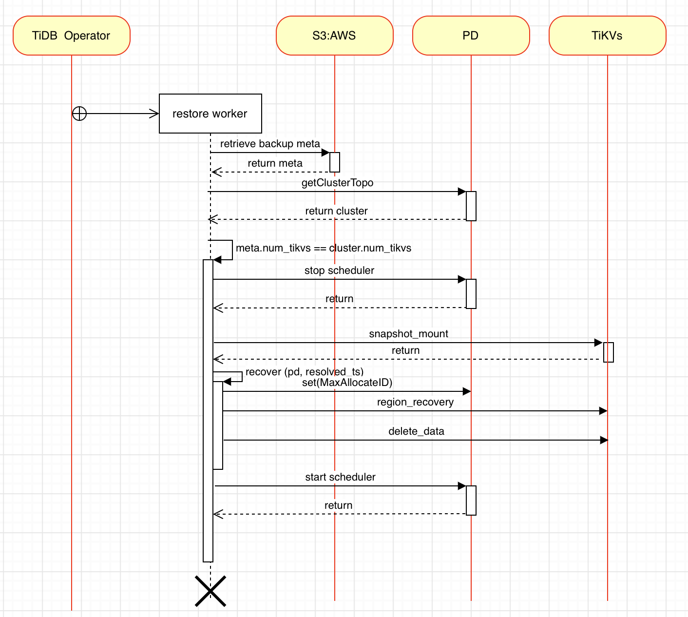

# TiDB Cluster on Amazon EBS Backup & Restore


## Table of Contents

* [Introduction](#introduction)
* [Goal](#goal)
* [Limitation](#limitation)
* [Architecture Design](#architecture-design)
    * [Solution Overview](#solution-overview)
      * [Backup Worker](#backup-worker)
      * [Restore Worker](#restore-worker)
    * [Key Design](#key-design)
      * [Backup](#backup)
      * [Restore](#restore)
    * [Data Consistency](#data-consistency)
      * [Transaction consistency](#transaction-consistency)
      * [A Raft Group consistency](#a-raft-group-consistency)
      * [Multi Raft Group consistency](#multi-raft-group-consistency)
* [Feature Detail Design](#feature-detail-design)
    * [Backup workflow](#backup-workflow)
    * [Restore workflow](#restore-workflow)
  * [Impacted components](#impacted-components)
    * [Backup Worker](#backup-worker)
    * [Restore Worker](#restore-worker)
    * [TiDB Operator](#tidb-operator)
      * [Backup design](#backup-design)
      * [Restore design](#restore-design)
    * [Backup Restore](#backup-restore)
      * [BR Backup](#br-backup)
      * [BR Restore](#br-restore)
    * [TiKV](#tikv)
    * [Interface Definition](#interface-definition)
      * [restore worker - PD / TiKV](#restore-worker-pd-tikv)
      * [BR - PD](#br-pd)
      * [TiKV - PD](#tikv-pd)
      * [BR - TiKV](#br-tikv)
      * [BR - restore worker](#br-restore-worker)
* [Exception Handling](#exception-handling)
* [Backward / Forward Compatibility](#backward-forward-compatibility)
* [Security](#security)
* [Dependencies](#dependencies)
* [Technical Risk](#technical-risk)
* [Impacts & Risks](#impacts--risks)
* [Testing Note](#testing-note)
* [Design review](#design-review)


# **Introduction**

Amazon Elastic Block Store ([Amazon EBS](https://docs.aws.amazon.com/AWSEC2/latest/UserGuide/AmazonEBS.html)) is an easy-to-use, scalable, high-performance block-storage service designed for Amazon Elastic Compute Cloud (Amazon EC2). It provides varied volume types that best fit the workload. The EBS volumes that are attached to an instance are exposed as storage volumes that persist independently from the life of the instance. Most importantly, you can back up the data on your Amazon EBS volumes by taking EBS snapshots.

TiDB is a distributed database providing horizontal scalability, strong consistency, and high availability. It is designed to work in the cloud to make deployment, provisioning, operations, and maintenance flexible. 

Current TiDB Backup Restore solution provides high-performance backup and restore speeds for large-scale TiDB Clusters, however, the impact to the cluster being backed up is notable for many customers and hard to reduce based on current implementation. By leveraging the Amazon EBS snapshot feature, we can provide a block-level based backup and recovery solution with transaction consistency and minimize the impact to the target TiDB cluster..


## Goal

Backup and Restore a TiDB cluster using the EBS snapshot on the AWS, it is expected to achieve:


* Minimize impact to the TiDB cluster during the backup.
    * QPS/Transaction Latency &lt; 5%
* Shorten backup and restore time.
    * Backup time &lt; 1 hours
    * Restore time &lt; 2 hours 


## Limitation


* Only AWS EBS supported, does not support EFS, local instance store etc.
* Does not support TiFlash backup & restore.
* Does not support other clouds.


# **Architecture Design**


## Solution overview


A [Custom Resource Definition](https://kubernetes.io/docs/tasks/extend-kubernetes/custom-resources/custom-resource-definitions/) (CRD) generated based on the Backup/Restore request launched by the customer  in TiDB Operator. 

The Backup & Restore Controller detects the CRD. Then, creates a new POD to load the corresponding worker to execute the backup and restore work.


### **Backup Worker**


1. The backup started by a backup CRD where the customer submitted.
2. TiDB Operator creates/starts the Backup Worker (Job in the above figure) based on the CRD.
3. The Backup Worker gets the global resolved_ts of the TiDB cluster through PD and saves it into metadata.
4. The Backup Worker queries the topology information of the TiDB cluster and the corresponding EBS volume info of all TiKV nodes and saves them in metadata. The Backup Worker configures the PD to prohibit operations such as replica, merge, and GC etc, and waits for the completion of the ongoing replica scheduling.
5. The Backup Worker initiates an EBS snapshot to all nodes, and records the snapshot information in metadata.
6. The Backup Worker reconfigures the PD to get it back to its original state where we start backup.
7. The Backup Worker queries the status of the snapshot in each node, and waits until all snapshot states changed from pending to completed. The Backup Worker is automatically destroyed according to the configured CRD policy.

Notice: If the user wants to delete the backup (snapshots and metadata), the user can simply remove the backup CR from TiDB Operator.


### **Restore Worker**


1. The Restore started by a restore CRD which the customer submitted.
2. TiDB Operator creates/starts the Restore Worker (Job in the above figure) based on the CRD.
3. The Backup Worker retrieves the global resolved_ts and topology diagram of the TiDB cluster from S3 backup metadata.
4. The Restore Worker checks the topology of the restored TiDB Cluster, (especially the number of TiKVs, volume). If it matches the topology in the metadata, the Restore Worker restores and mounts the snapshot to the restored TiDB Cluster from S3, otherwise it reports an error and exits.
5. The Restore Worker configures the PD to prohibit operations the same as Backup Worker do. 
6. The Restore Worker uses the global resolved_ts to invoke BR Recover component for handling the data of the TiKV node into a consistent state.
7. The Restore Worker reconfigures the PD to get it back to its original state where we start backup. The TiDB cluster is online, and then The Restore Worker is automatically destroyed according to the CRD policy. The Restoration is finished.


## Key Design


### Backup

For Backup, as Backup Worker states, there are mainly 3 steps:


1. Configure the TiDB cluster.
2. Get TiDB cluster level resolved_ts.
3. Backup data by EBS snapshot.

Step 1 assume time &lt; 5 minute (included fault tolerance, e.g. retry)

Step 2 TiKV already maintains the resolved_ts component.

Step 3 snapshot depends on the customer's EBS volume type and data change. Excluding full snapshot at first time, one day data change with gp3 type may takes ~ 10 minutes in our test.


### Restore

For Restore, as Restore Worker states, there are mainly 3 steps:


1. Initialize snapshot restore and prepare restored volume.
2. Region recovery, select a leader, and align raft log.
3. Resolved data by cluster level resolved_ts.

Step 1, assume takes &lt; 30 minutes

Step 2, assume takes &lt; 10 minutes, since the snapshot taken parallelly, the unalign raft log among peers in a Region is few.

Step 3, assume takes &lt; 30 minutes, Resolved data by removing all key-values that have versions larger than resolved_ts. And also resolved data through the raft layer, not to delete from disk directly.

Note: For EBS volume fully initialized, there are extra steps suggested by [AWS](https://docs.aws.amazon.com/AWSEC2/latest/UserGuide/ebs-initialize.html). 


## Data Consistency

TiDB Cluster On AWS EBS, a key-value write workflow as follows:

TiDB->TiKV->OS->EBS


<table>
  <tr>
   <td><strong>Layer</strong>
   </td>
   <td><strong>Owned By</strong>
   </td>
   <td><strong>Description</strong>
   </td>
  </tr>
  <tr>
   <td>SQL
   </td>
   <td>TiDB
   </td>
   <td>Where the user data comes from
   </td>
  </tr>
  <tr>
   <td>Transaction
   </td>
   <td>TiDB
   </td>
   <td>Refer to the transaction driver of TiDB, which has ACID properties. 
   </td>
  </tr>
  <tr>
   <td>MVCC
   </td>
   <td>TiKV
   </td>
   <td>Multiversion Concurrency Control module in TiKV
   </td>
  </tr>
  <tr>
   <td>Raftstore
   </td>
   <td>TiKV
   </td>
   <td>An MultiRaft implementation in TiKV
   </td>
  </tr>
  <tr>
   <td>RocksDB
   </td>
   <td>TiKV
   </td>
   <td>A key-value storage stores user data
   </td>
  </tr>
  <tr>
   <td>OS
   </td>
   <td>AWS
   </td>
   <td>EC2 instance, response to local volume and format file system on volume.
   </td>
  </tr>
  <tr>
   <td>Volume
   </td>
   <td>AWS
   </td>
   <td>EBS volume, like a disk on an on-premises data center.
   </td>
  </tr>
  <tr>
   <td>EBS
   </td>
   <td>AWS
   </td>
   <td>More like an AWS storage pool, can provide a various performance disk (gp3, io2 etc) for EC2.
   </td>
  </tr>
</table>


In TiDB, The transaction layer adopts the Percolator model, which is 2 phase commit. TiDB is a distributed key-value database. TiKV uses the raft consensus algorithm to provide strong consistency. Furthermore, TiKV implements multi-raft in Raftstore and provides data consistency and scalability.

AWS EBS is the physical storage layer, and EBS volume can be backed up by EBS snapshot. In the transaction layer, after the data of the same transaction is encoded by the MVCC and processed by the raft layer, complete transaction data is written on different TiKV EBS volumes. The consistency of the snapshot on these volumes needs to be handled as follow:


#### Transaction consistency

TiKV has the Region resolved_ts component maintains timestamp (ts) within a Region. This resolved_ts ensures that the timestamp with the maximum consistency of the current Region data, any data with timestamp lower than resolved_ts has transaction layer consistency. Meanwhile, in the latest implementation, TiKV calculates the minimum resolved_ts of the current store, and reports it to PD. See [ReportMinResolvedTsRequest](https://github.com/fengou1/kvproto/blob/bd679cab506b8b8b75af2595624c3c3cd4254354/proto/pdpb.proto#L825).

In our solution, we get this resolved_ts from PD and use it as ts to resolve backup in the restore phase.

The key-value of the same transaction will be written to different Raft Groups. In the restore phase, after a Raft Group is handled to consistency, we use transaction-consistent resolved_ts to go to each TiKV to delete the data of incomplete transactions. For this step, see the detailed design of the Backup and Restore ResolvedData phase.


#### A Raft Group consistency

For each Raft Group within TiKV, we have to deal with Region metadata and Region data.


* Region metadata


In TiKV#1, a write proposal has been applied, but TiKV#2 and TiKV#3 have not been applied.

For each Raft Group, we process the meta and data of the Region through BR RegionRecover, its workflow as follows:


1. In the restore phase, put TiKV in the recovery mode, and TiKV reports all peer lists to BR.
2. For each raft group, find the peer with most reliable log in the Region, and force it to be the leader. For other peers to be silent, start the raft state machine. leader selection refer to [BR Restore](#br-restore)
3. Wait for all peers in the Region until applied index == last index, and then set the correct raft status to exit data RegionRecover recovery.
* Region data

In the previous step of RegionRecover phase, the second step is to start the raft state machine, so that the raft log of each Region non-leader node is applied to the largest log index. Region-level data consistency achieved.


#### Multi Raft Group consistency

Turn off pd scheduler. The reason is that when there are a large number of write scenarios to TiDB Cluster, the snapshot is sync. It is very likely that peer replication from one tikv volume to another, while 2 volumes has been snapshotted asynchronously. At block-level data may be lost. At the same time, replica scheduling makes the epoch version change, and there are many intermediate states that need to be processed. These states make it very complicated to deal with such problems. Currently PD supports the following methods to turn off peer replication:


```
./pd-ctl --pd=http://127.0.0.1:2379 config set merge-schedule-limit 0
./pd-ctl --pd=http://127.0.0.1:2379 config set region-schedule-limit 0
./pd-ctl --pd=http://127.0.0.1:2379 config set replica-schedule-limit 0
./pd-ctl --pd=http://127.0.0.1:2379 config set hot-region-schedule-limit 0
```


After the above schedule is limited to 0, peer addition, deletion and replication (from one TiKV to another) are prohibited. At the same time, functions such as merge and scatter across TiKV are also prohibited. For Regions that may have overlapping Ranges due to splits, after PD scheduling is resumed. please refer to the Recover function design for details, and for details about replicas, please refer to Q&A


# **Feature Detail Design**


### **Backup workflow**


After the TiDB Operator starts the Backup Worker, the backup job starts.


1. Get the cluster level consistency min_resolved_ts. 
2. Configure the PD scheduler to stop cluster peer replication. And also stop GC.
3. Take snapshots for all TiKV volumes in the cluster through aws api, save metadata information to S3. For details, refer to the definition of[ metadata information](#bookmark=id.pm5ucdf8u44s)
4. Wait for the snapshot to complete and save the cluster meta information to S3.
5. Resume scheduling of the PD cluster.
6. Exit the backup.


### **Restore workflow**





After the TiDB Operator starts the Restore Worker, it starts to restore work.

- Restore prerequisites:


* The customer already has a cluster to be restored and specified in the CRD.
* The backup data has been specified in the CRD.
1. The Restore Worker retrieves the backup metadata, which includes cluster topology information and cluster level min_resolved_ts during backup.
2. The Restore Worker gets the topology information of the present TiDB cluster through PD. (e.g: the number of TiKVs, replica). see [GetAllStoresRequest](https://github.com/fengou1/kvproto/blob/bd679cab506b8b8b75af2595624c3c3cd4254354/proto/pdpb.proto#L235).
3. The Restore Worker checks whether the topology information of the target cluster to be restored is consistent with the original cluster information. If they are identical, start the restoration, otherwise exit directly.
4. The Restore Worker stops the related scheduling of the PD, and the PD stops the scheduler.
5. The Restore Worker stops TiKV, and restores snapshot to volume according to the snapshot id in the metadata, mounts volume to TiKV.
6. The Restore Worker restores the PD with max allocated ID which caculate from region meta report by tikv.
7. Using the cluster level resolved_ts in the backup metadata, call the BR Recover to process all TiKV data into a cluster level consistent state.
8. The Restore Worker resumes the PD scheduler to bring TiDB cluster online, the restoration work is completed, and the restore worker exits.


## Impacted components

**Backup metadata definition**


```json
{
 "cluster_info": {
   "cluster_version": "v6.3.0",
   "max_alloc_id": "6000",
   "resolved_ts": "456745777823347",
 },
 "tikv" : {
   "replicas": 3,
   "stores": [
   {
     "store_id" : 1,
     "volumes" : [
       {
         "volume_id" : "vol-0e65f40961a9f6244",
         "type" : "raft-engine.dir",
         "mount_path" : "/var/lib/tikv/raft-engine",
         "restore_volume_id" : "vol-0e65f40961a9f0001",
         "snapshot_id" : "snap-1234567890abcdef0",
       },
       {
         "volume_id" : "vol-0e65f40961a9f6245",
         "type" : "storage.data-dir",
         "mount_path" : "/var/lib/tikv/data-dir",
         "restore_volume_id" : "vol-0e65f40961a9f0002",
         "snapshot_id" : "snap-1234567890abcdef1",
       }
     ]
   },
   {
     "store_id" : 2,
     "volumes" : [
       {
         "volume_id" : "vol-0e65f40961a9f6246",
         "type" : "raft-engine.dir",
         "mount_path" : "/var/lib/tikv/raft-engine",
         "restore_volume_id" : "vol-0e65f40961a9f0003",
         "snapshot_id" : "snap-1234567890abcdef2",
         "fsr-enabled": "false",
       },
       {
         "volume_id" : "vol-0e65f40961a9f6247",
         "type" : "storage.data-dir",
         "mount_path" : "/var/lib/tikv/data-dir",
         "restore_volume_id" : "vol-0e65f40961a9f0004",
         "snapshot_id" : "snap-1234567890abcdef3",
         "fsr-enabled": "false",
       }
     ]
   },
    {
     "store_id" : 3,
     "volumes" : [
       {
         "volume_id" : "vol-0e65f40961a9f6248",
         "type" : "raft-engine.dir",
         "mount_path" : "/var/lib/tikv/raft-engine",
         "restore_volume_id" : "vol-0e65f40961a9f0005",
         "snapshot_id" : "snap-1234567890abcdef4",
         "fsr-enabled": "false",
       },
       {
         "volume_id" : "vol-0e65f40961a9f6249",
         "type" : "storage.data-dir",
         "mount_path" : "/var/lib/tikv/data-dir",
         "restore_volume_id" : "vol-0e65f40961a9f0006",
         "snapshot_id" : "snap-1234567890abcdef5",
         "fsr-enabled": "false",
       }
     ]
   }
 ],
 },
 "pd" : {
   "replicas" : 3
 },
 "tidb": {
   "replicas" : 3
 },
 "kubernetes" : {
   "pvs" : [],
   "pvcs" : [],
   "crd_tidb_cluster" : {},
   "options" : {}
 }
 "options" : {} 
}
```


### Backup Worker

Backup worker has implements the following functions:

1. Obtain the configuration information of the online backup cluster, such as resolved_ts.

2. Configure cluster PD scheduling, stop replica scheduling, turn off GC during backup, and then turn on GC after backup.

3. The snapshot function of EBS/pv volumes whose TiKV running on.

Worker container contains: 1. backup-manager, 2. BR


```bash
backup full --type=aws-ebs --pd "172.16.2.1:2379" -s "s3:/bucket/backup_folder" --volumes-file=backup.json
```


Backup worker workflow


1. TiDB Operator retrieves the PD address of the target cluster and all TiKV volume information.

2. TiDB Operator provides --volumes-file=backup.json for the backup cluster, starts the backup job, and backup.toml contains:


```json
{
 "tikv" : {
   "replicas": 3,
   "stores": [
   {
     "store_id" : 1,
     "volumes" : [
       {
         "volume_id" : "vol-0e65f40961a9f6244",
         "type" : "raft-engine.dir",
         "mount_path" : "/var/lib/tikv/raft-engine"
       },
       {
         "volume_id" : "vol-0e65f40961a9f6245",
         "type" : "storage.data-dir",
         "mount_path" : "/var/lib/tikv/data-dir"
       }
     ]
   },
   {
     "store_id" : 2,
     "volumes" : [
       {
         "volume_id" : "vol-0e65f40961a9f6246",
         "type" : "raft-engine.dir",
         "mount_path" : "/var/lib/tikv/raft-engine"
       },
       {
         "volume_id" : "vol-0e65f40961a9f6247",
         "type" : "storage.data-dir",
         "mount_path" : "/var/lib/tikv/data-dir",
       }
     ]
   },
    {
     "store_id" : 3,
     "volumes" : [
       {
         "volume_id" : "vol-0e65f40961a9f6248",
         "type" : "raft-engine.dir",
         "mount_path" : "/var/lib/tikv/raft-engine"
       },
       {
         "volume_id" : "vol-0e65f40961a9f6249",
         "type" : "storage.data-dir",
         "mount_path" : "/var/lib/tikv/data-dir",
       }
     ]
   }
 ], 
 },
 "pd" : {
   "replicas" : 3
 },
 "tidb": {
   "replicas" : 3
 }, 
 "kubernetes" : {
   "pvs" : [],
   "pvcs" : [],
   "crd_tidb_cluster" : {},
   "options" : {}
 }
 "options" : {}
}
```


3. Job contains BR, BR reads the details of backup.json and starts backup. For more backup details, see BR Backup Detailed Design.


### RestoreWorker

Restore worker implements the following functions:

1. Obtain the deployment information of the recovery cluster, such as: PD, number of tikv

2. The ability to restore EBS/pv volumes from snapshot

3. Mount and start control of TiKV volume of cluster

4. Start BR for data recovery

Worker container contains: 1. backup-manager, 2. BR

Restore worker workflow:


1. backup-manager starts BR to read backup information from S3, get all snapshotIDs, set PD to the recovery mode. Examples of BR commands are as follows:


```bash
br restore full  --type=aws-ebs --prepare --pd "172.16.2.1:2379" -s "s3:///us-west-2/meta/&sk=xx..." --output=topology.json
```


BR command output as follows:


```json
{
 "cluster_info": {
   "cluster_version": "v6.3.0",
   "max_alloc_id": "6000",
   "resolved_ts": "456745777823347",
 },
 "tikv" : {
   "replicas": 3,
   "stores": [
   {
     "store_id" : 1,
     "volumes" : [
       {
         "volume_id" : "vol-0e65f40961a9f6244",
         "type" : "raft-engine.dir",
         "mount_path" : "/var/lib/tikv/raft-engine",
         "restore_volume_id" : "vol-0e65f40961a9f0001",
         "snapshot_id" : "snap-1234567890abcdef0"
       },
       {
         "volume_id" : "vol-0e65f40961a9f6245",
         "type" : "storage.data-dir",
         "mount_path" : "/var/lib/tikv/data-dir",
         "restore_volume_id" : "vol-0e65f40961a9f0002",
         "snapshot_id" : "snap-1234567890abcdef1"
       }
     ]
   },
   {
     "store_id" : 2,
     "volumes" : [
       {
         "volume_id" : "vol-0e65f40961a9f6246",
         "type" : "raft-engine.dir",
         "mount_path" : "/var/lib/tikv/raft-engine",
         "restore_volume_id" : "vol-0e65f40961a9f0003",
         "snapshot_id" : "snap-1234567890abcdef2"
       },
       {
         "volume_id" : "vol-0e65f40961a9f6247",
         "type" : "storage.data-dir",
         "mount_path" : "/var/lib/tikv/data-dir",
         "restore_volume_id" : "vol-0e65f40961a9f0004",
         "snapshot_id" : "snap-1234567890abcdef3"
       }
     ]
   },
    {
     "store_id" : 3,
     "volumes" : [
       {
         "volume_id" : "vol-0e65f40961a9f6248",
         "type" : "raft-engine.dir",
         "mount_path" : "/var/lib/tikv/raft-engine",
         "restore_volume_id" : "vol-0e65f40961a9f0005",
         "snapshot_id" : "snap-1234567890abcdef4"
       },
       {
         "volume_id" : "vol-0e65f40961a9f6249",
         "type" : "storage.data-dir",
         "mount_path" : "/var/lib/tikv/data-dir",
         "restore_volume_id" : "vol-0e65f40961a9f0006",
         "snapshot_id" : "snap-1234567890abcdef5"
       }
     ]
   }
 ],
 },
 "pd" : {
   "replicas" : 3
 },
 "tidb": {
   "replicas" : 3
 },
 "kubernetes" : {
   "pvs" : [],
   "pvcs" : [],
   "crd_tidb_cluster" : {},
   "options" : {}
 }
 "options" : {} 
}
```


2. The backup-manager mounts the relevant volume and starts TiKV.

3. The backup-manager starts the BR again until the BR completes the restoration of data consistency, sets the PD flag to enter the normal mode, and then restarts TiKV to exit. For detailed design, see BR Restore Detailed Design


```bash
br restore full --type=aws-ebs --pd "172.16.2.1:2379" -s "s3:///us-west-2/meta/&sk=xx..."
```


### TiDB Operator

**Backup design**


1. Expand the CR of [TiDB Operator](https://github.com/pingcap/tidb-operator/): [Backup](https://github.com/pingcap/tidb-operator/blob/f73a54732ac19ddbb5b59e752794898b4502cd53/docs/api-references/docs.md#backup/BackupSchedule/Restore) / [BackupSchedule](https://github.com/pingcap/tidb-operator/blob/f73a54732ac19ddbb5b59e752794898b4502cd53/docs/api-references/docs.md#backupschedule) / [Restore](https://github.com/pingcap/tidb-operator/blob/f73a54732ac19ddbb5b59e752794898b4502cd53/docs/api-references/docs.md#restore), add new snapshot types.
2. Obtain PD / TiKV / TiDB replicas from each Spec of CR-[TiDBCluster](https://github.com/pingcap/tidb-operator/blob/f73a54732ac19ddbb5b59e752794898b4502cd53/docs/api-references/docs.md#tidbcluster).
3. Based on TiKV-StatefulSet to create the Pods / PVs / PVCs for extracting each store_id and the corresponding volume information, including volume ID, configuration type and the path to mount to the container, pay attention to the specific provisioner type here, and the volume_id will be distinguished. If the volume uses [AWS-EBS-CSI-driver](https://pingcap.feishu.cn/wiki/wikcnBbTz00zcig0FlErkCMJCKf#) whose Type is CSI and Driver is [ebs.csi.aws.com](http://ebs.csi.aws.com/), it will be extracted from Source.VolumeHandle after mapping.
4. Create a Job through Backup Manager, pass in the above meta information structure, configure storage such as S3, process permissions such as iam + serviceaccount or secret, and finally call BR to execute the call [EC2-CreateSnapshot](https://docs.aws.amazon.com/sdk-for-go/api/service/ec2/#EC2.CreateSnapshot) to create a snapshot, and complete the PD scheduler and GC at the same time. management to ensure volume snapshots are performed at safe points.
5. The actual volume snapshot progress is updated by the ticker to report the backup progress until the backup is completed.
6. Wait for the BR execution to complete, report the update backup completion status, and exit the job.

**Restore design**


1. Expand CR: Restore of TiDB Operator, add snapshot restore type, expand restore state machine, add volume restore completion status and data restore complete status.
2. Set the recovery mark of CR-TiDBCluster and let the TiDBCluster Controller handle it. After the PD is created and running normally, it blocks the creation of TiKV-StatefulSet and waits for the mark of successful volume recovery to be cleared.
3. When PD is running and TiKV is not running, create Job-1 through Restore Manager, configure storage such as S3, process permissions such as iam + serviceaccount or secret, and finally call BR to restore the volume snapshot, and set the PD flag to be in recovery mode.
4. Wait for the BR execution to complete, report the metadata information of the update output, set the Restore status to volume recovery complete, and exit Job-1.
5. When the volume recovery is complete, the Restore Manager resets the blocking flag of TiKV, processes the volume information according to different Provisioners, converts the settings into the corresponding PVs, and clears the metadata information used for the binding of PVs and PVCs. In the scenario, you need to rename the corresponding PVs, and submit the above tags and newly constructed PVs / PVCs resources.
6. After the TiKV member Manager is unblocked, it continues to execute the StatefulSet creation process, and then processes the submitted PVCs/PVs and other information. After TiKV starts running and interacts with the PD with the recovery mark for the first time, it enters the recovery mode to run.
7. After the Restore Manager monitors that TiKV / PD is running, and there is a recovery mark, it creates Job-2, and finally calls BR to execute the data consistency of TiKV according to its own CR-Restore configuration parameters, metadata information, and current status. Process, clear data after min_resolved_ts, also clear PD flag and resume normal operation mode.
8. Wait for the BR execution to complete, report the updated Restore status as data recovery complete, and exit Job-2.
9. After the Restore Manager clears the recovery mark and monitors the normal operation of CR-TiDBCluster and provides services, set the Restore status to recovery complete.


### Backup Restore 


#### BR Backup

1. Backup cluster basic metadata, such as resolved_ts,

2. Configure cluster scheduling, stop replica scheduling, turn off GC during backup, and turn on GC after backup

3. The snapshot function of EBS/pv volumes

Backup workflow


1. The BR is connected to the PD, and the BR stops the peer related scheduler of the PD, mainly by setting the number of PD operators to limit. Before setting, it need to read the current operator configuration information, and restore the cluster configuration immediately after the snapshot is completed. The main PD operator needs to contain:
```go
	const enableTiKVSplitRegion = "enable-tikv-split-region"
	scheduleLimitParams := []string{
		"hot-region-schedule-limit",
		"leader-schedule-limit",
		"merge-schedule-limit",
		"region-schedule-limit",
		"replica-schedule-limit",
		enableTiKVSplitRegion,
	}
```
2. Read resolved_ts and save it in the backup data.

3. Shut down the GC by start a background safepoint keeper. Continuously update the GC safepoint to stop the GC.

4. Get the ongoing peer scheduling operator operation and wait until the scheduling is complete.

56. After the Snapshot returns (EBS snapshot returns immediately), enable copy scheduling and enable GC.

6. Wait for the AWS snapshot to complete

7. Summarize all backup data information and upload to the target storage S3.


#### BR Restore

There are mainly 2 phase implementations, RegionRecover and ResolvedData.


* RegionRecover design
1. After the 1st BR is invoked by TiDB Operator, BR first put a recovery marker in pd, and all startup TiKV read the marker at very early startup, then TiKV switches to recovery mode. At the same time, TiKV starts the recovery service.
2. BR send a read region meta request to TiKV, TiKV scans the metadata of all local regions, and sends it to the BR by a stream.
3. After the BR receives the reports of all Region info (peer list) of all TiKV instances, it makes a decision based on the reported peer list. And send the recovery command to all TiKV instances for each region; close gRPC stream after sending. The BR decision as follows:
    1. for any region, select a peer as leader, peer has the max last log term as qualified leader, or
    2. if the last log term is the same, select peer has the max last log index
    3. if the last log index is the same, select peer has the max commit index
4. BR send recover region command to TiKV, TiKV assign a leader and then wait all region peer apply to last index.
5. RegionRecover completes.
* ResolvedData design
start 2 worker to delete data with ts > min_resolved_ts

1. Scan the KV DB of each TiKV through min_resolved_ts.
2. Directly delete the Lock CF data of each KV DB.
3. For each KV DB's write CF key-value, if commit_ts > resolved_ts, delete this key-value in write CF and delete this key in default CF also. 


### TiKV

Newly added recovery service/recovery mode

1. Definitions

After TiKV starts raft-engine and kv engine, when establishing pdclient, it actively reads recovery marker from pd at very beginning of the connection between TiKV and PD.

TiKV performs data recovery in recovery mode. It mainly performs raft state machine and data consistency adjustment in the recovery phase. TiKV mainly completes the recovery work in two steps in Recovery mode:

Step 1: Report metadata, and adjust local metadata.

  1. Before TiKV starts, read the cold data of the disk. Update TiKV the cluster ID while pd connected. Also, TiKV initialize a bootstrapped cluster to PD, put PD in bootstrapped status.
  2. TiKV startup, and start recovery service, BR sends read region meta to TiKV, TiKV collect all region meta and sent to BR
  3. BR make a leader list, send to TiKV.TiKV assign a leader for region, and wait leader apply to last log
  4. BR send wait apply to TiKV, TiKV wait and check all region apply to last log

Step 3: Delete data

  7. TiKV start 2 thread to resolve data, one for clean up the lock cf, another is to delete data from write cf and data cf.

In recover mode, data consistency recovery is mainly completed. 


### Interface Definition


### BR - PD
1. enable snapshot recovery marker in pd

```bash
curl "172.16.5.31:3279/pd/api/v1/admin/snapshot-recovering" -XPOST
```

2. Get cluster level consistency timestamp resolved_ts from PD directly.

More info, please refer to[ PR](https://github.com/tikv/pd/pull/4716)


```bash
curl "172.16.5.31:3279/pd/api/v1/min-resolved-ts"
```

3. set max allocate id

```bash
curl "172.16.5.31:3279/pd/api/v1/admin/base-alloc-id" -XPOST -d "10000"
```

### TiKV - PD


```go
    message IsSnapshotRecoveringRequest {
        RequestHeader header = 1;
    }

    message IsSnapshotRecoveringResponse {
        ResponseHeader header = 1;
        bool marked = 2;
    }
    rpc IsSnapshotRecovering(IsSnapshotRecoveringRequest) returns (IsSnapshotRecoveringResponse) {}
```

### BR - TiKV

During the BR backup, a admin check op interface to check if region has ongoing interface
```go
    message CheckAdminRequest {
    }

    message CheckAdminResponse {
        Error error = 1;
        metapb.Region region = 2;
        bool has_pending_admin = 3;
    }

    // CheckPendingAdminOp used for snapshot backup. before we start snapshot for a TiKV. 
    // we need stop all schedule first and make sure all in-flight schedule has finished.  
    // this rpc check all pending conf change for leader.
    rpc CheckPendingAdminOp(CheckAdminRequest) returns (stream CheckAdminResponse) {}
```

TiKV enters the recovery mode when pd is marked as Snapshot Recovery.


TiKV report region meta interface.


```go
    message RegionMeta {
        uint64 region_id = 1;
        uint64 peer_id = 2;
        uint64 last_log_term = 3;
        uint64 last_index = 4;
        uint64 commit_index = 5;
        uint64 version = 6;
        bool tombstone = 7; //reserved, it may be used in late phase for peer check
        bytes start_key = 8;
        bytes end_key = 9;
    }

    // command to store for recover region
    message RecoverRegionRequest {
        uint64 region_id = 1;
        bool as_leader = 2; // force region_id as leader
        bool tombstone = 3; // set Peer to tombstoned in late phase
    }
    // read region meta to ready region meta
    rpc ReadRegionMeta(ReadRegionMetaRequest) returns (stream RegionMeta) {}
```


BR RegionRecover command interface


```go
    // command to store for recover region
    message RecoverRegionRequest {
        uint64 region_id = 1;
        bool as_leader = 2; // force region_id as leader
        bool tombstone = 3; // set Peer to tombstoned in late phase
    }

    message RecoverRegionResponse {
        Error error = 1;
        uint64 store_id = 2;
    }

    // execute the recovery command
    rpc RecoverRegion(stream RecoverRegionRequest) returns (RecoverRegionResponse) {}
```


During the BR ResolvedData phase, delete data interface:


```go
    // resolve data by resolved_ts
    message ResolveKvDataRequest {
        uint64 resolved_ts = 1;
    }

    message ResolveKvDataResponse {
        Error error = 1;
        uint64 store_id = 2;
        uint64 resolved_key_count = 3; // reserved for summary of restore 
        // cursor of delete key.commit_ts, reserved for progress of restore
        // progress is (current_commit_ts - resolved_ts) / (backup_ts - resolved_ts) x 100%
        uint64 current_commit_ts = 4;
    }

    // execute delete data from kv db
    rpc ResolveKvData(ResolveKvDataRequest) returns (stream ResolveKvDataResponse) {}
```


### BR - restore worker

backup phase

```bash
backup full --type=aws-ebs --pd "172.16.2.1:2379" -s "s3:/bucket/backup_folder" --volumes-file=backup.json
```

volume prepare phase

```bash
br restore full --type=aws-ebs --prepare --pd "172.16.2.1:2379" -s "s3:///us-west-2/meta/&sk=xx..." --output=topology.json
```

recovery phase

During the recovery phase, TiDB Operator needs to pass two parameters --pd and --resolved_ts to BR


```bash
br restore full --type=aws-ebs --pd "172.16.2.1:2379" -s "s3:///us-west-2/meta/&sk=xx..."
```


## Exception Handling


* Backup


1. TiKV does not configure report_min_resolved_ts_interval, backup directly failed backup. 
2. Failed to stop PD scheduler, try again. If multiple retries fail within some minutes, the entire backup fails, and then stops snapshot and removes metadata. At the same time, delete snapshot already taken.
3. Snapshot takes too long or failure

    In the version, we just simply fail the entire backup. Meanwhile, the snapshot taken shall be deleted since the backup shall be a failure.

4. If the PD cannot be connected, retry is required, and the retry logic can refer to the existing logic of BR.


* Restore


1. Unable to obtain S3 data due to permissions, fail the restore.
2. The retry mechanism is introduced because the network cannot obtain S3 data. Design can refer to the existing BR and TiKV logic.
3. The Snapshot recovery volume fails, and a retry mechanism is introduced. It fails after some tries, and removes the restore volume, rolls back to the state where backup starts.
4. BR fails in RegionRecover phase and ResolvedData phase with timeout:
    1. The retry mechanism needs to consider the time cost and the success possibility of retry. If there is no possibility of success, it will fail directly.
    2. When rollback is required in failure scenarios, the rollback should consider not to destroy the original backup snapshot data. For example: if ResolvedData fails, rollback requires unmount volume, delete volume, and set TiKV to the original state.


## Backward / Forward Compatibility

Only support v6.3.0 or late


## Security & Privilege

We prefer the IAM role to backup and restore, however, we are able to use the secret key-id way to launch the backup and restore. Here we re-use the TiDB Operator logic to handle the security part.

an extra permission need for EBS backup IAM role:
```json
{
    "Version": "2012-10-17",
    "Statement": [
        {
            "Effect": "Allow",
            "Action": [
                "s3:*",
                "s3-object-lambda:*"
            ],
            "Resource": "*"
        },
        {
            "Effect": "Allow",
            "Action": [
                "ec2:AttachVolume",
                "ec2:CreateSnapshot",
                "ec2:CreateTags",
                "ec2:CreateVolume",
                "ec2:DeleteSnapshot",
                "ec2:DeleteTags",
                "ec2:DeleteVolume",
                "ec2:DescribeInstances",
                "ec2:DescribeSnapshots",
                "ec2:DescribeTags",
                "ec2:DescribeVolumes",
                "ec2:DetachVolume"
            ],
            "Resource": "*"
        }
    ]
}
```

Notice: prefix with ec2 Action is require to do the ebs backup and restore.
## Dependencies

[AWS API](https://docs.aws.amazon.com/AWSEC2/latest/APIReference/Welcome.html)

[AWS EBS Snapshot](https://docs.aws.amazon.com/AWSEC2/latest/UserGuide/AmazonEBS.html)


## Technical Risk

All block issues had been identified. However some part of design may need some spiking during the implementation phase.


# **Testing Note**


* Transaction consistency

1. using the sync-diff-inspector to do a consistency validation, [sync-diff-inspector](https://docs.pingcap.com/tidb/stable/sync-diff-inspector-overview)

2. using the tidb-snapshot with checksum to validate consistency

  1. create a tidbcluster by tidb-operator

  2. luanch a tpcc to prepare some data

  3. apply a ebs backup yaml, check Commint-Ts

  4. using the Commit-Ts to take a session level tidb snapshot
  5. do database admin checksum

* On-premise backup and restore

4. setup a enviroment with LVM disk

  1. prepare a lvm snapshot script

  2. add --skip-AWS in tidb-operator backup and restore yaml

  3. change some code in BR for --skip-AWS, run prepare scripts

**Reference**


1. [TiKV 源码分析](https://pingcap.com/zh/blog/?tag=TiKV%20%26%2328304%3B%26%2330721%3B%26%2335299%3B%26%2326512%3B)
2. [AWS EBS ](https://docs.aws.amazon.com/AWSEC2/latest/UserGuide/AmazonEBS.html)