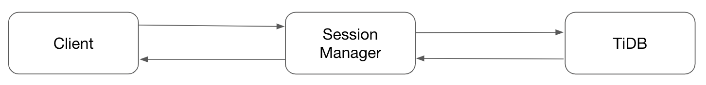
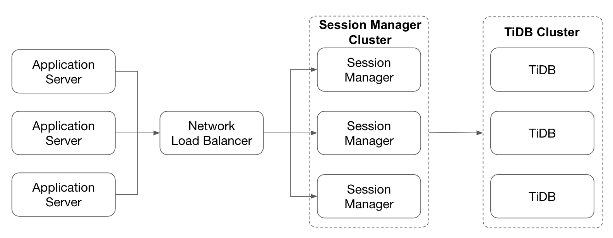
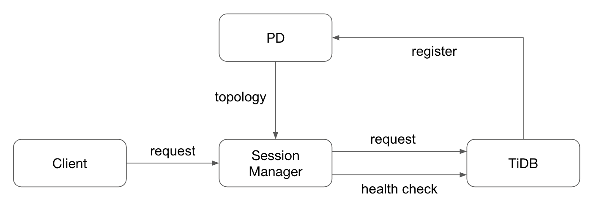
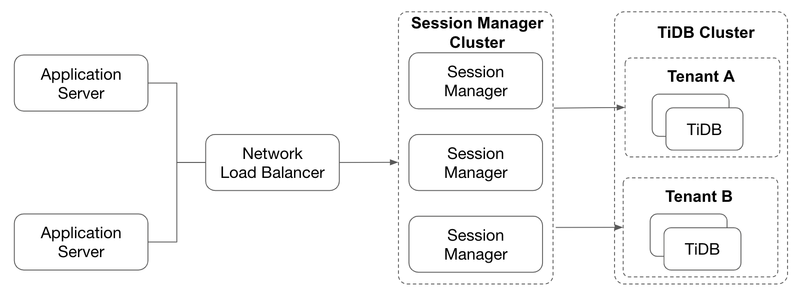

# Proposal: Session Manager

- Author(s): [djshow832](https://github.com/djshow832)
- Tracking Issue: https://github.com/pingcap/tidb/issues/35258

## Abstract

This proposes a design of a TiDB component called Session Manager. It keeps client connections alive while the TiDB server upgrades, restarts, scales in, and scales out.

## Background

Applications generally connect to TiDB through a connection pool to reduce the overhead of creating connections. Connections in the pool are kept alive, thus TiDB has to disconnect the client connections during shutdown. This causes reconnections and QPS jitters on the application side when the TiDB cluster rolling upgrades, restarts, and scales in. Thus, database administrators sometimes operate TiDB clusters when the QPS reaches the bottom, typically in the middle of the night, which is painful.

Besides, TiDB needs to be upgraded transparently in the TiDB Cloud Dev Tier once the latest version is ready. The current situation makes TiDB impossible to upgrade without affecting users.

Therefore, we propose a new TiDB component, called Session Manager. Applications or load balancers connect to the Session Manager instead of TiDB. The Session Manager keeps the session states of current connections and redirects the session to alive TiDB instances automatically when a TiDB instance is down.

### Goal

- When the TiDB cluster performs upgrades or restarts, the Session Manager redirects the backend connections from inactive TiDB instances to active instances. This is especially important on the Dev Tier because TiDB will be upgraded frequently and automatically.
- When the TiDB cluster scales out, the Session Manager is aware of the new TiDB instances and redirects some backend connections to the new instances. This is important in a serverless architecture.
- When the TiDB cluster scales in, the Session Manager waits for the ongoing transactions to be finished and redirects some backend connections to active TiDB instances.

### Non-Goals

- When a TiDB instance fails accidentally, the Session Manager redirects the backend connections from the failed TiDB instance to an active instance.
- Block list, allow list, traffic control, audit logs.

## Proposal

### Deployment

In the cloud, applications typically connect to the Network Load Balancer (NLB), which balances the traffic to the TiDB cluster. Session Manager is placed between the NLB and the TiDB cluster.

The NLB balances the traffic to the Session Manager, and the Session Manager balances the traffic to the TiDB cluster. Most of the time, Session Manager only forwards messages between the NLB and the TiDB instances.

The Session Manager also needs to be highly available. An easy way is to deploy multiple isolated Session Manager instances. However, it's painful to maintain. For example, when a user wants to modify a configuration, he needs to connect to the proxies one by one. What we need is a Session Manager cluster.

Client addresses should be recorded in slow logs, audit logs, TiDB logs, and processlist to enable users to check the source of requests. Besides, users may configure different privileges for different IPs. However, from the viewpoint of TiDB, the client address is the address of the Session Manager. Some proxies use the [Proxy Protocol](https://www.haproxy.com/blog/using-haproxy-with-the-proxy-protocol-to-better-secure-your-database/) to pass the client address to the server and TiDB also supports the Proxy Protocol. Session Manager will also use the Proxy Protocol in the handshake phase.

### TiDB Instance Discovery

Traditional proxies require users to configure the addresses of TiDB instances. When the TiDB cluster scales out, scales in, or switches to another TiDB cluster, the user needs to reconfigure it in the proxies.

A Session Manager instance is deployed independently with other TiDB components. To connect to the TiDB cluster, the PD addresses should be passed to the Session Manager before startup. PD contains an etcd server, containing all the instance addresses in the cluster. The Session Manager watches the etcd key to detect a new TiDB instance. This is just like what TiDB instances do.

The Session Manager should also do a health check on the TiDB instance to ensure it is alive, and migrate the backend connections to other TiDB instances if it is down. The health check is achieved by trying to connect the MySQL protocol port, just like other proxies.

Session Manager can do various health checks on TiDB instances:

- It can observe the CPU and memory usage of TiDB instances so that it can perform load-based balance.
- It can observe whether the latest schema is fetched on TiDB instances so that it can avoid directing client connections to the TiDB instances that cannot serve requests.

When a TiDB instance needs to be shut down gracefully due to scale-in, upgrading, or restarting, no more new connections are accepted. The health check from the Session Manager will fail and the Session Manager no longer routes new connections to the instance. However, it still waits for the ongoing queries to be finished since the instance is still alive.

When a TiDB instance quits accidentally, the ongoing queries fail immediately and the Session Manager redirects the connections.

### Authentication

When the Session Manager migrates a session, it needs to authenticate with the new TiDB server.

It's unsafe to save user passwords in the Session Manager, so we use a token-based authentication:

1. The administrator places a self-signed certificate on each TiDB server. The certificate and key paths are defined by configurations `security.session-token-signing-cert` and `security.session-token-signing-key`. The certificates on all the servers are the same so that a message encrypted by one server can be decrypted by another.
2. When the Session Manager is going to migrate a session from one TiDB instance to another, it queries the session token. The session token is composed by the username, token expiration time, and a signature. The signature is signed with the private key of the certificate.
3. The Session Manager then authenticates with the new TiDB server with a new auth-plugin. The session token acts as the password. The new server checks the username, token expiration time, and the signature. The signature should be verified by the public key.

To ensure security, TiDB needs to guarantee that:

- The certificate rotates periodically so that it minimizes the effect of leaking the certificate.
- The username in the session token must be the same with the that in the handshake packet, so one user cannot log in with the identity of another user.
- The token expiration time cannot exceed the current time and the token lifetime cannot be too long, so one user cannot forge the token by brute force, or use a valid token for a long time.
- The signature should be verified so that TiDB can make sure the data is not forged.
- Secure transport is enforced when querying the session token because the token cannot be leaked.

### Connection State Maintenance

A MySQL connection is stateful. TiDB maintains a session state for each connection, including session variables, transaction states, and prepared statements. If the Session Manager redirects the frontend query from one backend connection to another without restoring the session state in the new connection, an error may occur.

The basic workflow is as follows:

1. When the client queries from the Session Manager, the Session Manager forwards the commands to TiDB and then forwards the query result from TiDB to the client. The session states are only updated by TiDB.
2. When the Session Manager is going to migrate a session from one TiDB instance to another, it queries the session states from the original TiDB instance and saves them. Session Manager queries session states by sending `SHOW SESSION_STATES`, the result of which is in JSON type.
3. The Session Manager then connects to the new TiDB instance and replays the session states by sending `SET SESSION_STATES '{...}'`, the parameter of which is just the result of `SHOW SESSION_STATES`.

Session states include:

- Session variables. All the session variables are replayed, because the default values may be different between TiDB instances.
- Prepared statements with their IDs. The prepared statements are created in either binary or text protocol.
- Session SQL bindings.
- User-defined variables.
- The current database.
- Last insert ID, found rows, and row count for the last query, as well as last query info, last transaction info, last DDL info.
- Last sequence values.
- Last warning and error messages.

Transactions are hard to be restored, so Session Manager doesn't support restoring a transaction. Session Manager must wait until the current transaction finishes or the TiDB instance exits due to shut down timeout. To be aware of whether the session has an active transaction, Session Manager needs to track the transaction status. This can be achieved by parsing the status flag in the response packets.

Similarly, Session Manager doesn't support restoring a result set. If the client uses a cursor to read, Session Manager must wait until the data is all fetched. Session Manager can parse the request and response packets to know whether the prepared statement is using a cursor and whether all the data is fetched.

Besides, there are some other limitations:

- When the session contains local temporary tables, table locks, or advisory locks, the TiDB won't return the session states and Session Manager will report connection failure.
- For long-run queries, such as `ADD INDEX` and `LOAD DATA`, TiDB probably won't wait until they finish. In this case, the client will be disconnected.
- Session Manager needs to reconnect to the new TiDB, which introduces handshake, authentication, and session states initialization, so there will be a performance jitter during the redirection.
- The session-level plan cache on the new TiDB instance is empty, so there will be a slight performance jitter for a while after the redirection.

### Configuration

For static configurations, they are read before the startup of the Session Manager and cannot be changed online, such as the port. These configurations can be set by command line parameters.

For dynamic configurations, it's unacceptable to restart Session Manager to set them because Session Manager is supposed to be always online. The configurations can be overwritten anytime and take effect on the whole cluster. These configurations can be stored on an etcd server, which is deployed on the same machine as the Session Manager. Each Session Manager instance watches the etcd key to update the configurations in time.

Session Manager provides an HTTP API to update dynamic configurations online, just as the other components do.

### Observability

Session Manager is one of the products in the TiDB ecosystem, so it's reasonable to integrate Session Manager with Grafana and TiDB-Dashboard.

Like the other components, Session Manager also reports metrics to Prometheus. The metrics include but are not limited to:

- The CPU and memory of each Session Manager instance
- The number of successful and failed session migrations
- The latency and QPS of queries

TiDB-Dashboard should be able to fetch the logs and profiling data of each Session Manager instance.

To troubleshoot the Session Manager, Session Manager provides an HTTP API to fetch instance-scoped or global-scoped data, such as:

- The processlist on the Session Manager instance
- The available TiDB instances from the viewpoint of the Session Manager

## Compatibility

### Upgrade Compatibility

To avoid upgrading Session Manager, Session Manager is supposed to be simple and stable enough.

However, we still can never guarantee that Session Manager will be bug free, so it still needs to support rolling upgrade. Once upgrading, the client connections will definitely be disconnected.

### MySQL Compatibility

Session Manager connects to the MySQL protocol port of TiDB servers, so it should be compatible with MySQL.

## Test Plans

Session Manager is an essential component of the query path, so it's very important to ensure its stability.

We have lots of cases to test, including:

- Test various ORM and connectors with all versions. The MySQL protocol, especially the authentication part, is different among those versions.
- Test various L4 Proxies. Different proxies use different methods to check the health of Session Manager.
- Test various statements, including randomly generated statements and MySQL tests.
- Test all scenarios tests that we have, and randomly make Session Manager redirect sessions at any time.

## Alternative Proposals

Traditional SQL proxies typically maintain the session states on themselves, rather than by backend SQL servers. They parse every response packet, or even request packet, to incrementally update the session states.

This is also possible for Session Manager. MySQL supports [`CLIENT_SESSION_TRACK` capability](https://dev.mysql.com/doc/internals/en/packet-OK_Packet.html#cs-sect-packet-ok-sessioninfo), which is also used for session migration. MySQL server is able to send human-readable state information and some predefined session states in the OK packet when the session states are changed.

The most significant advantage of this method is that Session Manager can support fail over. Now that Session Manager has all the up-to-date session states, it can migrate sessions anytime, even if the TiDB instance fails accidentally.

However, there are some drawbacks of this method:

- There are only 4 predefined state types, and the type is encoded in an `int<1>`. However, TiDB has tens of state types, some of which are TiDB-specific. We cannot extend the state types because it will break forward compatibility if MySQL adds more state types in the future.
- For some changes, e.g. user-defined variables, the OK packet just notifies the client that there is a change, but doesn't tell it what the change is. We also need to extend the protocol, which is a risk.
- There are some inevitable limitations of fail over. For example, Session Manager will never know whether the statement succeeds when TiDB doesn't respond to a `COMMIT` statement or an auto-commit DML statement.
- To support fail over, Session Manager should also be capable of reconnecting to a new Server without a fresh token. That means Session Manager may need to obtain user passwords in a certain way.

## Future Work

The most attractive scenario of routing client connections is multi-tenancy.

These are some scenarios where multi-tenancy is useful:

- Separate different businesses (or workloads) to achieve resource isolation. Each business is assigned a tenant.
- Multiple users share a TiDB cluster to save cost.

In this architecture, the NLB is not aware of tenants. Each TiDB instance belongs to only one tenant to isolate resources. Thus, it's Session Manager's responsibility to route sessions to different TiDB instances.

Session Manager can distinguish tenants by the SNI servers.
