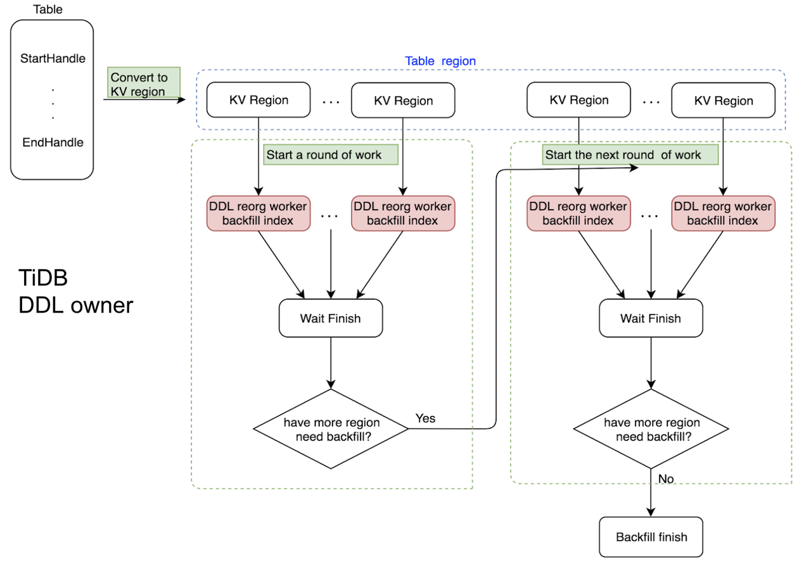
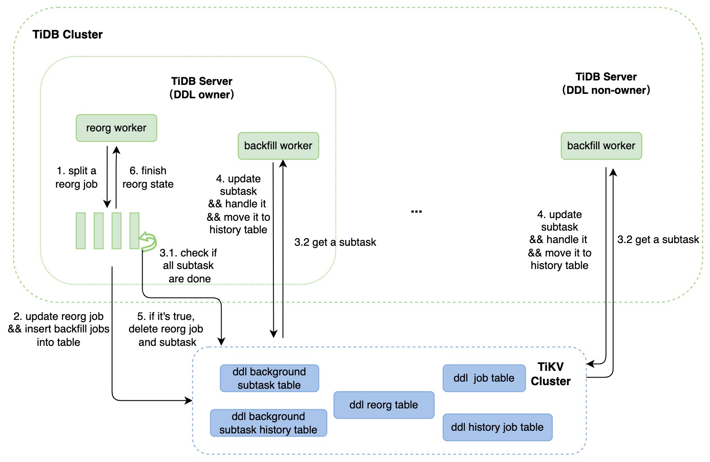

# Proposal: Distributed DDL Reorg

- Author(s): [zimulala](https://github.com/zimulala), [Defined2014](https://github.com/Defined2014)
- Tracking Issue: https://github.com/pingcap/tidb/issues/41208

## Abstract

This is distributed processing of design in the DDL reorg phase. The current design is based on the main logic that only the DDL owner can handle DDL jobs. However, for jobs in the reorg phase, it is expected that all TiDBs can claim subtasks in the reorg phase based on resource usage.

## Motivation or Background

At present, TiDB already supports parallel processing of DDL jobs on the owner. However, the resources of a single TiDB are limited. Even if it supports a parallel framework, the execution speed of DDL is relatively limited, and it will compete for resources that affect the daily operations such as TiDB's TPS.

DDL Jobs can be divided into the general job and the reorg job. It can also be considered that improving DDL operation performance can be divided into improving the performance of all DDL jobs (including the time consumption of each schema state change, checking all TiDB schema state update success, etc.), and improving the performance of the reorg stage. The current time-consuming and resource-consuming stage is obviously the reorg stage.

At present, considering the problem of significantly improving DDL performance and improving TiDB resource utilization, and relatively stable design and development, we will DDL reorg stage for distributed processing.

## Current Implementation

At present, the master branch reorg stage processing logic (that is, no lighting optimization is added), takes an  added index as an example. The simple steps that the owner needs to perform in the reorg stage of the added index operation:

1. Split the entire table [startHandle: endHandle] into ranges by region.
2. Each backfill worker scans the data in the corresponding range, then checks the data and writes it to the index.
3. After all backfill workers complete step 2, check if there is still data to process:
    1. If there is continued step 2
    2. If not, complete the entire reorg phase and update the relevant meta info.



## Rationale

### Prepare

The reorg worker and backfill worker for this scenario are completely decoupled, i.e. the two roles are not related.

Backfill workers build the associated worker pool to handle subtasks ( DDL small tasks that a job splits into during the reorg phase).

### Process

The overall process of this document program is rough as follows:

1. DDL After the owner gets the reorg job, the reorg worker will handle its various state changes until the reorg stage. We split the job into multiple subtasks by data key, and then store the relevant information on the table.
2. After that, regularly check whether all subtasks are processed (this operation is similar to the original logic), and do some other management, such as cancellation.
3. All TiDB backfill workers (regardless of whether TiDB is a DDL owner) will get subtasks to handle.
    1. Get the corresponding number of backfill workers from the backfill worker pool, and let them process subtasks in parallel. This operation is similar to the original logic and can be optimized later.
    2. Each backfill worker serially gets subtasks, executes them serially until all processing is complete, and then exits.
4. After checking in step 2 that all subtasks have been processed, update the relevant meta info and proceed to the next stage. If any subtasks fail, cancel the other subtasks and finally roll back the DDL job.



## Detailed Design

### Meta Info Definition

The contents of the existing table structure may be lacking, and a new Metadata needs to be added or defined.

Add a new field to the `DDLReorgMeta` structure in the `mysql.tidb_ddl_job` table, for example:

```go
type DDLReorgMeta struct {
    ...                    // Some of the original fields
    
    IsDistReorg   bool     // Determine whether do dist-reorg
}
```

Consider that if all subtask information is added to the TiDB_ddl_reorg.reorg field, there may be a lock problem. It is added to the `mysql.tidb_background_subtask` table, the specific structure is as follows:

```sql
+---------------+------------+------+-------------+
| Field              | Type         | Null | Key  |
+---------------+------------+------+-------------+
| id                 | bigint(20)   | NO   | PK   | auto
| Namespace string   | varchar(256) | NO   | MUL  |
| Key string         | varchar(256) | NO   | MUL  | // ele_key, ele_id, ddl_job_id, sub_id
| ddl_physical_tid   | bigint(20)   | NO   |      |
| type               | int          | NO   |      | // e.g.ddl_addIndex type
| exec_id            | varchar(256) | YES  |      |
| exec_expired       | Timestamp    | YES  |      | // TSO
| state              | varchar(64)  | YES  |      |
| checkpoint         | longblob     | YES  |      |
| start_time         | bigint(20)   | YES  |      |
| state_update_time  | bigint(20)   | YES  |      |
| meta               | longblob     | YES  |      |
+---------------+------------+------+-------------+
```

Add the following to the BackfillMeta field:

```go
type BackfillMeta struct {
    CurrKey         kv.Key
    StartKey        kv.Key
    EndKey          kv.Key
    EndInclude      bool    
    ReorgTp         ReorgType
    ...
    
    *JobMeta // parent job meta
}
```

Add `mysql.tidb_background_subtask_history` table to record completed (including failure status) subtasks. The table structure is the same as tidb_background_subtask . Considering the number of subtasks, some records of the history table are deleted regularly in the later stage.

### Principle

The general process is simply divided into two parts:

1. Managing reorg jobs is divided into the following two parts. This function is done by the reorg worker on the DDL owner node.
    1. Split the reorg job and insert it into subtasks as needed.
    2. Check if the reorg job is processing complete (including status such as failure).
2. Process the subtask and update the relevant metadata. After completion, move the subtask to the history table. This function can be processed by all roles and is completed by backfill workers.

Regarding step 1.b, the current plan is to reorg worker through timer regular check, consider the completion of subtask synchronization through PD, to actively check.

### Rules

Rules for backfill workers to claim subtasks:

- The idle backfill worker on TiDB-server will be woken up by a timer to try to preempt the remaining subtasks.
- Lease mechanism, the current TiDB backfill worker does not update the exec_expired field for a long time (keep-alive process), and other TiDB backfill workers can preempt it.
- The Owner Specifies the value. At present, the reorg worker will first split the reorg into subtasks, and then use the total number of subtasks to determine whether only native execution is required or all nodes are processed.
    - The total number of split tasks is less than minDistTaskCnt, then mark them all as native, so that the node where the owner is located has priority;
    - Otherwise, all nodes preempt the task in the first two ways.

Later, it can support more flexible segmentation tasks and assign claim tasks.

Subtask claim notification method:

- Active way:
    - The Owner node notifies the backfill worker on the local machine through chan.
    - The Owner node notifies backfill workers to other nodes by changing the information registered in the PD.
- Passive mode: All nodes themselves periodically check if there are tasks to handle.

### Interface Definition

Adjust the `backfiller` and `backfillWorker` to update their interfaces and make them more explicit and generic when fetching and processing tasks.

- `backfiller` interfaces:
```go
// backfiller existing interfaces:
func BackfillDataInTxn(handleRange reorgBackfillTask) (taskCtx backfillTaskContext, errInTxn error)
func AddMetricInfo(float64)

// backfiller new interfaces:
// get batch tasks
func GetTasks() ([]*BackfillJob, error){}
// update task
func UpdateTask(bfJob *BackfillJob) error{}
func FinishTask(bfJob *BackfillJob) error{}
// get the backfill context
func GetCtx() *backfillCtx{}
func String() string{}
```

- Interfaces that need to be added or modified by `backfillWorker`.

```go
// In the current implementation, the result is passed between the reorg worker and the backfill worker using chan, and it runs tasks by calling `run`
// In the new framework, two situations need to be adapted
// 1. As before, transfer via chan and reorg workers under the same TiDB-server
// 2. Added support for transfer through system tables to reorg workers between different TiDB-servers
// Consider early compatibility. Implement the two adaptations separately, i.e., use the original `run` function for function 1 and `runTask` for function 2
func (w *backfillWorker) runTask(task *reorgBackfillTask) (result *backfillResult) {}
// updatet reorg substask exec_id and exec_lease
func (w *backfillWorker) updateLease(bfJob *BackfillJob) error{}
func (w *backfillWorker) releaseLease() {}
// return backfiller related info
func (w *backfillWorker) String() string {}
```

- Add the backfill worker pool like `WorkerPool`(later considered to be unified with the existing WorkerPool).
- In addition, the above interface will be modified in the second phase of this project to make it more general.

### Communication Mode

In the current scheme, the backfill worker obtains subtasks and the reorg worker checks whether the subtask is completed through regular inspection and processing. Here, we consider combining PD watches for communication.

### Breakpoints Resume

When the network partition or abnormal exit occurs in the TiDB where the current backfill worker is located, the corresponding subtask may not be handled by the worker. In the current scheme, it is tentatively planned to mark whether the executor owner of the current subtask is valid by lease. There are more suitable schemes that can be discussed later. The specific operation of this scheme:

1. When the backfill worker handles a subtask, it will record the current DDL_ID (may need worker_type_worker_id suffix) in the tidb_background_subtask table as the exec_id, and regularly update the exec_expired value and curr_key.
2. Non-DDL owner TiDB encountered this problem:
    1. When there is a network problem in the TiDB where the backfill worker who is processing the subtask is located, and another TiDB obtains the current subtask and finds that its exec_expired expired (for example, the exec_expired + lease value is earlier than now () ), the exec_id and exec_expired values of this subtask are updated, and the subtask is processed from curr_key.
3. DDL Owner TiDB may encounter this problem refer to the following changing owner description.

### Changing Owner

- DDL an exception may occur in the TiDB where the owner is located, resulting in the need to switch DDL owner.
    1. The reorg worker will check the reorg info to confirm that the reorg job has completed subtasks.
        1. If it is not completed, enter the stage of reorg job splitting, and then enter the process of checking the completion of the reorg job. The subsequent process will not be repeated.
        2. If completed, enter the process of checking the completion of the reorg job. The follow-up process will not be repeated. (Problem: under the new framework, no owner can continue to perform backfill phase tasks).

### Failed

When processing the reorg stage, the process with an error when backfilling is handled as follows:

1. When one of the reorg workers has an error when processing subtask, it changes the state in the tidb_background_subtask table to the failed state and exits the process of processing this subtask.
2. DDL In addition to checking whether all tasks are completed, it will also check whether   there is a subtask execution failure (currently considering an error will return ).
    1. Move unprocessed subtasks into the TiDB_background_subtask_history table.
    2. When there is no subtask to process, the error is passed to the generation logic. This will convert the DDL job to a rollback job according to the original logic.
3. All TiDB b ackfill worker in each task to take subtask, if the half of the execution found that the task does not exist (indicating that half of the reorg task failed to execute, the owner cleaned up its subtask), then exit normally .
4. Follow-up operations refer to the rollback process.

### Cancel

When the user executes admin cancel ddl job , the job is marked as canceling as in the original logic. DDL the reorg worker where the owner is located checks this field and finds that it is canceling, the next process is similar to step 3-6 of Failed.

### Clean up

Since the subtask may be segmented by each table region, it may cause the `mysql.tidb_background_subtask_history` table is particularly large, so you need to add a regular cleaning function.

### Display

#### Display of Progress

The first stage can be through subtasks inside row count to calculate the entire DDL job row count. Then the display is the same as the original logic.

Subsequent progress can be displayed more humanely, providing results such as percentages, allowing users to better understand the processing of the reorg phase.

#### Monitor

Update and add some new logs and metrics.

## Further

- Improve and optimize backfill processing subtask scheduling strategy
    - Use more flexible and reasonable subtask segmentation and preemption mechanism
    - Prevent small reorg jobs from being blocked by large reorg jobs , this function should be handled in conjunction with resource management functions
- The framework is more general, and the current form and interface are more general, but relatively simple, the future will be improved so that it can be used more with DDL reorg as slower background tasks
- Consider the design of removing DDL owner
- Remove the reorg worker layers, and each TiDB -server only keeps one DDL worker for schema synchronization and other work.


