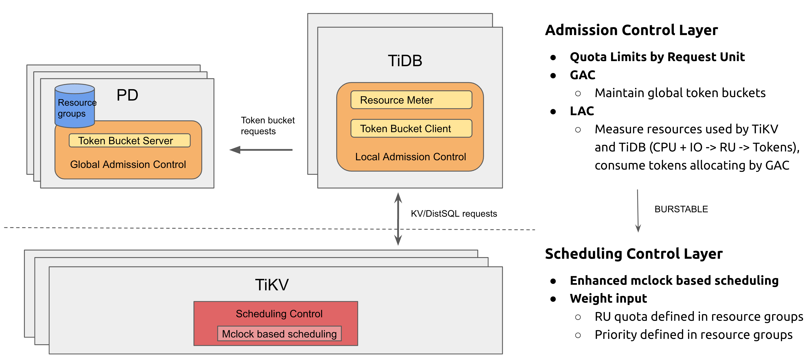
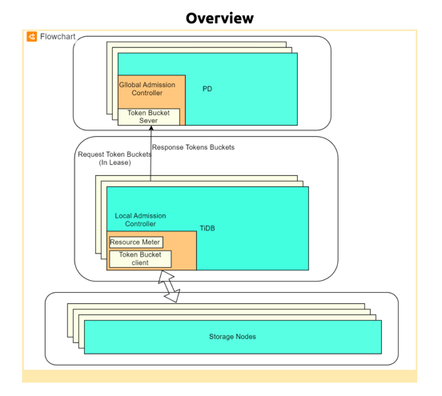
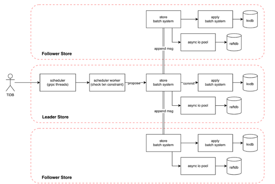

# Global Resource Control in TiDB
- Author: [nolouch](https://github.com/nolouch), [BornChanger](https://github.com/BornChanger), [glorv](https://github.com/glorv), [Connor1996](https://github.com/Connor1996), [tiancaiamao](https://github.com/tiancaiamao)
- Tracking Issue: https://github.com/pingcap/tidb/issues/38825

## Summary

A Global Resource Control mechanism that limits multiple applications' resource usage in a shared TiDB cluster, avoids interference between applications.

## Background and Motivation

A TiDB cluster for multiple applications to share the same data service, and there are several Aurora or MySQL, or other database instances as the data service backend. TiDB has the advantage of scalability but also has some challenges in the big-size cluster. How to make the shared cluster provide stable, predictable performance for different Applications? Part of what needs to be done is to control the resource usage of each application.

Currently, TiDB lack of global admission control limits the request from the SQL layer to the storage layer, and different users or applications may influence each other in the shared environment. Use a global admission control to ensure that the cluster doesn't become overloaded, avoid interference between applications, and enforce the throughput limits requested by customers.

Moreover, this resource control mechanism can be used by Resource Manage in the future of TiDB Cloud. Users can pay for the actual usage.  So, consider scenarios. It supports two models.

- **Provisioned:** On-Premise deployment, multi-applications shared on the big cluster. In this mode, you provision the number of RU rate limits or(CPU, IO Rate) and priority for the users/tenant/sessions.
- **Serverless:** In this mode, the user can pay the total cumulative RU for the tenant or user. Then the resources can not be limited until the RU is exhausted. This requirement TiDB Cloud has sufficient flexibility. such as auto-scale resources.

## Detailed Design

Global Resource Control Architecture Overview



**Resource Group** helps users to control over its resources, to enable or restrict resource consumption. resource groups have attributes that define the group. all attributes can be set at group creation time and  modified any time thereafter. The attributes define how many resource units in this group relative CPU, IO, Memory and so on.
resource groups can be assigned to different resource objects. such as session/users/tenant.
There are two dimensions to control the resources, one is Global Quota dimension, which is more of a tenant-level application, users can plan the usage of resources in provision, to limit the resources usage. The other side is the scheduling(weight) dimension, to ensure better control behavior when the resources are insufficient.

**Global Quota dimension**  This part is the upper limiter and lower limit(reservation) for the resource group. This defines the provision of the resource usage of the application layer. Here mainly use a token bucket algorithm to limit the resources at the entry of TiDB, count total resource usage including sql and storage layer.

**Scheduling dimension**  Currently, this part is implemented only at the storage side but we may also add similar mechanism in the tidb side in the future. The propose of the new scheduler is to ensure the tasks from different resource group can always consume reasonable resources according to their RU settings so the QoS of each resource group is ensured. TiKV uses the dmclock algorithm to ensure the fairness between different resource groups.

Will introduce this two dimensions control mechanism in the following.

### User SQL interface

The `Request Unit` can be assigned to a different level, like user or tenant. The syntax is like MySQL resource group, but it is used differently:

```sql
CREATE RESOURCE GROUP resouce_group_name RU_PER_SEC=20000 [PRIORITY=HIGH|MEDIUM|LOW] [BURSTABLE]
/*eg:*/
CREATE RESOURCE GROUP oltp_applicaton RU_PER_SEC=20000, PRIORITY=HIGH, burstable;
CREATE RESOURCE GROUP small_applicatoin RU_PER_SEC=5000;
CREATE RESOURCE GROUP olap_application RU_PER_SEC = 50000 PRIORITY=LOW, BURSTABLE;
/* bind resource group via DCL */
ALTER USER user_name RESOURCE GROUP resouce_group_name;
CREATE USER user_name IDENTIFIED BY 'password' RESOURCE GROUP resource_group_name;

/* bind resource group to the current session */
SET RESOURCE GROUP resouce_group_name

/* bind resource group to sql via optimizer hint */
SELECT /*+ RESOURCE_GROUP(resouce_group_name) */ * from table_name;
```

### Global Quota Control(- Global admission control)

The global admission control can be an independent module that is easy to use and compiled by TiDB. And also, it's possible to be an independent service. Because its local controller part may be installed to the SQL layer first, or it may be moved from the SQL layer to the proxy layer with the evolution. And it also will be related to the billing system in the future. Therefore, it should be as decoupled as possible.
The subsystem can be enabled and disabled. Once enabled, it may bring some performance regression (1%~5% from TopSQL) due to the statistics and control overhead.

Overview



**Global Admission Controller(GAC):** The Global Admission Controller service centrally tracks the total consumption of the user or tenant in terms of tokens. And maintain the global token bucket with the setting refill rate(RU). It is also responsible for dynamically allocating and adjusting local token buckets. Global Admission Controller maintains some settings and consumption in the etcd, and uses etcd election to achieve high availability,

**Local Admission Controller(LAC):** Local Admission Controller has the Resource Measure part and a local token bucket part. The local token bucket uses it for admission control of the KV request. Each KV request consumes tokens and might need to wait until there are enough tokens available. CPU usage of SQL requests also consumes tokens but accounts for it after the fact.

### Request unit

Request unit (short as **RU**) is the uniformed abstract unit of system resource including CPU, IO, etc. Customers explicitly specified the capacity that an application user or tenant required in terms of requesting units (**RU**).

### Request unit Model

Here is to define a cost model relative to the actual cluster resource capacity. Each request will consume the resource capacity. The TiDB layer will cost CPU and memory for different SQL requests, and then SQL requests will transform into the KV requests. These KV requests include different types, requiring the resource of CPU/IO/Memory. All in one, our abstraction unit needs to be mapped to the resources of the cluster, including CPU/IO/Memory, and even the network. For now, we only consider two factors: CPU and IO.

$$RU=\alpha_r + \beta_r * IOBytes + \gamma_r * CpuSecs$$

The values of the coefficients α,β,γ vary in different environment, they require datasets from various tests then regress and fit a solution(values) that best maps the actual resource usage.
Currently, TiKV cannot control the IOPS well, the IO only considers the IO flow first. But we can continuously improve this model, such as adding IOPS, memory, etc. In addition, it is possible to subdivide the request type. such as distinguishing the consumption of the small query and big query, different query about: Update, Insert.

### Metering the Request unit

`SQL Request` and `KV Request` to describe the request stage across the SQL layer and Storage layer. In the prototype, SQL Request is not considered because one SQL instance corresponds to one tenant user, and the resource control is at the tenant level, so it only needs to calculate SQL instance CPUSecs. Here we should consider user level, it requires us to meter SQL query CPUSecs.

### Tag in request and collect resource usage

`TopSQL` has done some infrastructure before. TopSQL can aggregate at SQL digest level CPU consumption, which includes SQL query execution process but does not include parse process because SQL digest is labeled after the parser stage.  There is a problem with aggregating `SQL Digestlevel` to the `user` level, it may need to add an additional tag.  
After SQL Request transforms to KV request, the tag information like SQL digest will be set in the context of KV request. KV requests will be handled in the storage level, There exist different KV request types. Read requests including KV Request `Get/Scan/Coprocess` and so on. Write KV Requests including `Prewrite/Commit/Put/Lock `and so on.  After the request is handled, the KV response will collect the details of the resource usage response to the SQL layer.
After some of this, we can aggregate the actual RU consumption of the query. With these preparations, it can integrate with the admission control module to be mentioned later.

### Global Resource Quota Limiter
#### Distributed Token Buckets

The core of admission control is the distributed token buckets algorithm. The algorithm can be described as the Local Token Buckets in the TiDB Nodes (KV clients), and communicating with a centralized token buckets server in GAC. The tokens are **RRUs** or **WRUs**.  One TiDB Node may exist multiple token buckets for users. These local buckets will make local admission decisions and communicate with the server to reconfigure the local tokens at regular intervals (default 10s).
```go
ProtoBuf
message TokenBucketRequest {
  message RequestRU {
    repeated RequestUnitItem request_r_u = 1;
  }

  string resource_group_name = 1;
  RequestRU ru_items = 2;
  // Aggregate statistics in group level.
  Consumption consumption_since_last_request = 3;
  uint64 target_request_period_ms = 2;
  uint64 client_unique_id = 3;
}
message TokenBucketResponse {
  string resource_group_name = 1;
  repeated GrantedRUTokenBucket granted_r_u_tokens = 2;
}
message GrantedRUTokenBucket {
  RequestUnitType type = 1;
  TokenBucket granted_tokens = 2;
  int64 trickle_time_ms = 3;
}
enum RequestUnitType {
  RU = 0;
}
message TokenBucket {
  TokenLimitSettings settings = 1;
  // Once used to reconfigure, the tokens is delta tokens.
  double tokens = 2;
}
message TokenLimitSettings {
  uint64 fill_rate = 1;
  int64 burst_limit = 2;
  double max_tokens = 3;
}
message Error {
    string message = 1;
}
message Consumption {
  double r_r_u = 1;
  double w_r_u = 2;
  double read_bytes = 3;
  double write_bytes = 4;
  double total_cpu_time_ms = 5;
  double sql_layer_cpu_time_ms = 6;
  double kv_read_rpc_count = 7;
  double kv_write_rpc_count = 8;
}
```

In this protocol, there are some key fields:
- `target_request_period_ms`: This field is the lease interval for the local token buckets, it is configurable.
- `requested_r_u`: It's a load expect with load estimation. This is an exponentially weighted moving average of the load at the nod.

#### Bursting and Refill rate

Bucket Tokens have two parts.
- `burst`: it is an accumulated value, it absorbs temporal spikes in workloads of the tenant user. Moreover, if the system is elastic enough, such a cluster can be auto-scale in the cloud. It can be used as the budget for users to pay. If the burst is enough, customers feel free to use resources without limitation, which matches the main idea of the serverless product.
- `refill rate`: rate-limit resource consumption. grant the tokens over a specified period of time, according to a fraction of the global refill rate
Once a request with a token bucket server is completed, the node adjusts its local token bucket according to the response. Either adding burst tokens or setting up a refill rate.
#### Debt

The token buckets can be "debt", as we mentioned, due to some statistics only being accounted for after the fact (eg, the read size of coprocess request, the CPUSecs usage). When a local bucket is in debt, KV operations are blocked until the debt is paid. This may lead to the latency not being stable . There is an improvement that allows the debt to be paid over a time period from the refill rate.
#### Adaptive Capacity

When a request from the application arrives, the request deducts tokens. Eventually, the LAC will run out of tokens because of consumption or expiry. When the LAC runs out of tokens, it requests more tokens from Global Token Server immediately. The Glocal Token Server instance uses the information provided by the client to estimate the global token consumption and vends tokens available for the next time unit to the client's share of overall tokens. Thus, it ensures that workloads can adaptively turn the local bucket fill rage up to the maximum capacity.
#### Balance the consumed capacity

The data hosted on a single storage node could be wholly unrelated and belong to different users or tenants. where each application could be from a different customer and have varied traffic patterns. Co-location was a straightforward problem with provisioned performance for application. Balancing the requirements of the provision for user's data may need to be considered.

### Scheduling Control

Compared to Storage, SQL layer node is easier to scale out since it's stateless, especially with k8s.
Storage(TiKV/Tiflash) cluster sharing with QoS guarantee is more challenging. In this chapter, we will discuss our design on request scheduling at Storage side first. There are 3 goals:
- Requests from higher priority resource group are scheduled more
- No starving for lower priority request
- Soft quota limiters can be issued to resource groups

#### QoS Metadata management

Resource Manager keeps the persisted metadata of resource groups. Resource Manager will translate that metadata information from abstract RUs into system resources like vCPU, read bandwidth, write bandwidth, etc to TiKV/Tiflash nodes.

Metadata sync-up is bidirectional. Resource Manager notifies TiKV on resource group metadata change at DDL execution time via http API interface. And TiKV nodes inquire Resource Manager when local metadata is missing or might be stale. Resource group metadata is in memory only at TiKV nodes.

#### Soft quota limiters

We can specify the quota limits for some resource groups to prevent the overrun and for TiKV node protection, by reusing the front-end quota limiter (token bucket algorithm) framework of TiKV. With the quota limiter capping, requests from some resource group might be throttled even when the TiKV instance is not saturated.

#### New field in kv protobuf

TiDB needs to inject into gRPC requests a resource group related information, like the resource group id, in the protobuf message.

#### Front-end requests scheduling

Resource consumption on vCPU, read bandwidth and write bandwidth needs to be normalized into internal "Shares" represented as a number. At different modules and different phases, the normalization formulas are different.

Read request and write request handling are quite different in TiKV. Read request handling in TiKV is already in fine grain, and we can almost directly use request elapsed time as resource consumption, while write path handling is rather complex.

##### dmClock Algorithm

`mClock` is a priority-based scheduling algorithm. Each resource group maintains a separate task queue, the schedule always pops and executes a task for the queue whose next task has the minimum priority value. The
$$P_i = \max(P{i-1} + w, V_t)$$
$P_{i-1}$ is the accumulated weight of executed tasks. Vt is the minimum priority of all non-empty queues, it is used when queue i is empty.
`w` is a number that represents the resource consumed by this task.
It's easy to prove that by using the mclock algorithm, we can ensure a resource group to obtain its share of resources with reasonable latency.
`dmClock` extends the `mClock` algorithm to fit in the distribued environment. In a distributed system like TiDB, a SQL request is likely to be transfer to multiple kv request and sent to different store. If the data is unevenly distribute the `mClock` is not enough to gain fair scheduling globally. The `dmClock` changes `w` from the cost of a single task plus the cost of other tasks sent to other storages. Thus, the total $$P_i represent the total resource consumption of all tasks in all stores.

**Implement**

Because the standard mclock algorithm needs a FIFO queue for each resource group and a global priority queue to sort between these queues, it is not easy to implement a high-performance scheduler with the similar performance of yatp.
we make a few changes to the algorithm to make it easy for our usage and better performance.
To make things simple, we change the priority calculation formula to:

$$Vt_i = \sum{w_i}$$

$$P_i = Vt_{i-1} + w_i$$

And periodically renew Vt by increasing the Vt of each resource group by half the delta value of max Vt.
$$Vt_i = Vt_i + (\max{(\forall{Vt})}-V_i)/2$$

##### Absolute Priority

In addition to the `dmClock` based scheduling, we support an absolute priority at the resource group level. That is, the tasks priority is changed from single accumulated `weight` to `(priority, weight)`, so tasks bind to resource groups with higher priority will always be scheduled earily. This is usefully in case that when the total resource quota is not enough, the QoS of higher priority application can be ensured first. Note that absolute priority may lead to starvation of low-priority tasks in case the system's total resources are not enough.

##### Read path

Previously, all read requests are executed by the yatp thread pool, whose scheduler is a multi-level feedback queue, and each level is a FIFO queue.
Because the current yatp's scheduler is a FIFO queue, a new task is always put at the end of the queue, thus the latency of all tasks are high when there are a lot of tasks.

In the first implementation, the read path will only use the CPU time to calculation the cost of each task, we may change the statistics to also include other resources in the future.

##### Write Path

For one region, it may be written by requests with different priorities. As requests would be serialized to raft log, the high or low-priority requests may be interleaved and can't change the order. But it's okay, our goal is to keep the QoS of the high-priority requests. So we always handle the regions having high-priority requests first. And considering the real use case, one region would probably be touched only by one user, as business logic should be isolated in most cases.

###### Write path in a picture.



Here is the flow of typical txnkv write requests(use lease read), involving five thread pool to adapt with priority-based scheduling.
- Scheduler(grpc thread)
don't do any scheduling, the overhead for acquiring txn latch is small
- Scheduler worker
Once latch and region snapshot is acquired, txn constraint check, which is several gets and seeks, is handled by this worker. This pool is based on yatp, so simply reuse the work of read flow priority scheduling.
- Store batch system(usually call it raftstore)
The most critical one, elaborate below
- Async io pool
Assume that async-io is always enabled, all raft log entries are written to raft-engine here. Change the FIFO queue to a priority-based queue. The write batch including high priority requests are out first.
- Apply batch system
Committed entries are written to kvdb here. Should poll regions having committed entries of high-priority requests first.

###### Store batch system
Assumption: only considered for async-io enabled
Store batch system drives raft groups. Some messages are time critical, like raft heartbeat, so these shouldn't be delayed by priority scheduling.
```rust
fn poll() {
    loop {
        let fsms = fetch_fsms();
        let readies = vec![];
        for fsm in fsms {
            for msg in fsm.mail_box.recv() {
                handle_message(msg);
            }  
        let write = fsm.collect_ready();
        async_io_pool_sender.send(write); 
        }
    }
}
```
Propose messages and Raft append messages cause disk write. But due to async-io, the poll speed would be fast enough to handle any messages in a short time. So we only consider priority scheduling in async io pools and propose a queue.
Here are rules:
- When proposing a request with high priority, the fsm is set to high priority. When the message is handled, the fsm is set back to normal priority
- For fetch_fsms, fsms of high priority should be fetched first.
- High priority is set to the context of raft entry as well. So followers can know the region is of high priority.

#### Front-end requests vs back-end requests

Backend requests scheduling is also taken into account. They can be assigned to some predefined resource groups and quota limiters.  And schedulers can handle them along with front-end requests at some underneath level, where IO is more sensitive.

## Other Issues

### On-demand provisioning

Because the concept of request units is new to customers, it may be challenging to forecast the provisioned throughput. Also, the application's data distribution and workload non-uniform access may lead to not all data across all storage nodes. Although from the global perspective of the entire cluster, there remain many resources, the application setting may still be inappropriate. Hence, we should let the cluster have a capacity to burst at the node level, and it may need to do something about balancing the consumed capacity mentioned above.

### Diagnostics

Metrics on # of blocked requests due to out of token,  per user, per tenant.
HWM of RU for slow queries, for individual users and tenants
LWM, HWM, Average rate for individual resource group

### Reference

- Resource Abstract in other systems:
  - DynamoDB:  https://aws.amazon.com/dynamodb/pricing/provisioned/
  - MongoDB:https://www.mongodb.com/docs/atlas/billing/serverless-instance-costs/
  - CRDB: https://www.cockroachlabs.com/docs/cockroachcloud/serverless-faqs.html#what-is-a-request-unit
  - Cosmos DB https://docs.microsoft.com/en-us/azure/cosmos-db/request-units
- SET RESOURCE GROUP Statement https://dev.mysql.com/doc/refman/8.0/en/set-resource-group.html
- Amazon DynamoDB: A Scalable, Predictably Performant(2022) https://www.usenix.org/system/files/atc22-elhemali.pdf
- CRDB Distributed token bucket: https://github.com/cockroachdb/cockroach/blob/master/docs/RFCS/20210604_distributed_token_bucket.md
- Ceph dmclock: https://github.com/ceph/dmclock 
