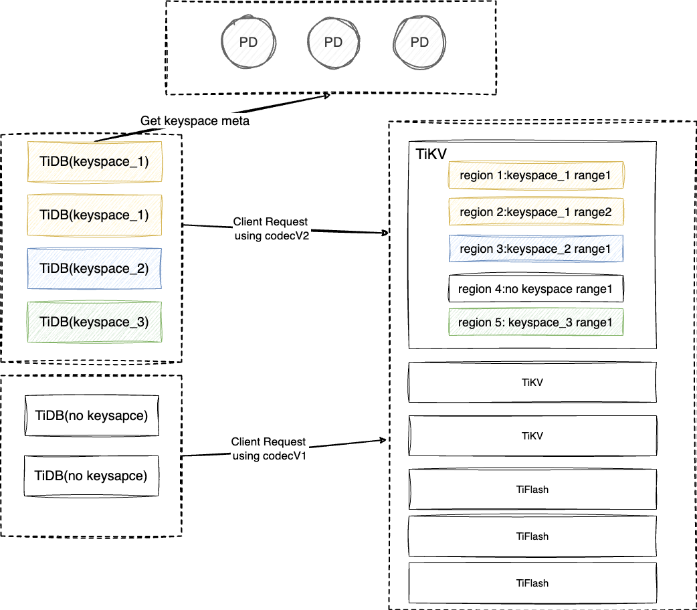

# Proposal: Keyspace
* Authors: [ystaticy](https://github.com/ystaticy), [iosmanthus](https://github.com/iosmanthus), [AmoebaProtozoa](https://github.com/AmoebaProtozoa)


## Motivation
We hope to store data of multiple applications in a TiKV cluster.
For example in multi-tenant scenario.A common solution is to add a prefix in front of the key to distinguish the data of multiple applications.
So we introduce a new concept 'Keyspace' to describe the logical of the isolation with different business scenarios in a TiKV cluster.


## Keyspace key prefix
Keyspace can only be used when TiKV enabled api v2.
### Key encoding:
We use different key prefix to distinguish different Keyspace.
[Keyspace key encoding](https://github.com/tikv/rfcs/blob/master/text/0069-api-v2.md#key-encoding)

'x', 'r' are key mode prefixes that indicates which mode the key is belonging to.
After mode prefix is 3 bytes for keyspace.
1. `x`: It represent TxnKV key.
2. `r`: It represent RawKV key.

So when TiDB enabled Keyspace, there are 4 bytes in key more than the scenario which does not use Keyspace.
It will start with 'x' + keyspace Id (3 bytes) ,because TiDB uses TxnKV client.

### Keyspace ID
Behind key mode, it take 3 bytes to store `keyspaceID`, the default keyspaceID is `[0, 0, 0]`.
The max keyspace id is 16777216; Keyspace ID is allocated by PD createKeyspace interface.

## Architecture

### PD
PD is responsible for Keyspace Meta managment.
It provide http interface and RPC interface to create, load, change state or configuration Keyspace Meta.
Keyspace Meta store in etcd data in PD.

### Client-go
Compare with API V1. API V2 add 1 byte Keymode and 3 bytes keyspace Id in front of userkey.

### TiDB
A tenant can have multiple TiDB nodes. But a TiDB node can only serve one tenant.
It can enabled by tidb configuration by `keyspace-name`.

### TiKV
TiKV should enable API V2, and different keyspace will distinguish by different key prefix.

## Implementation

### PD
To be supplemented in another PR

### TiDB
#### Using API V2 and etcd namespace to distinguish TiKV data and etcd path by Keyspace.
1. Configure Keyspace name by setting `keyspace-name` in the configuration file.
   * When TiDB server start, it will open a TiKV driver. The driver have a TxnKV client object `tikv.KVStore`. If `keyspace-name` has been set, it will start to use `tikv.KVStore` by API V2 to access TiKV.
2. The etcd path should has different prefix by etcd namespace.
   * There is a etcd client be created when domain init. If `keyspace-name` has been set, it will add a etcd namespace when create etcd client.
   * The format of etcd namespace is `/keyspaces/tidb/$keyspaceId`.

#### TiDB BR support Keyspace
To be supplemented in another PR

### TiKV
#### client-go

client-go should also support API V2 and Keyspace, which will make all the codec logic transparent to upper users. We currently maintain these implementations in [tikv/client-go/api-v2](https://github.com/tikv/client-go/tree/api-v2).

The new version of client-go unifies all the codec logic by introducing a new interface call `Codec`.
```go
// Codec is responsible for encode/decode requests.
type Codec interface {
   // ...
	EncodeRequest(req *tikvrpc.Request) (*tikvrpc.Request, error)
	// DecodeResponse decode the resp with the given codec.
	DecodeResponse(req *tikvrpc.Request, resp *tikvrpc.Response) (*tikvrpc.Response, error)
	// EncodeRegionKey encode region's key.
	EncodeRegionKey(key []byte) []byte
	// DecodeRegionKey decode region's key
	DecodeRegionKey(encodedKey []byte) ([]byte, error)
	// EncodeRegionRange encode region's start and end.
	EncodeRegionRange(start, end []byte) ([]byte, []byte)
	// DecodeRegionRange decode region's start and end.
	DecodeRegionRange(encodedStart, encodedEnd []byte) ([]byte, []byte, error)
	// EncodeRange encode a key range.
	EncodeRange(start, end []byte) ([]byte, []byte)
	// DecodeRange decode a key range.
	DecodeRange(encodedStart, encodedEnd []byte) ([]byte, []byte, error)
	// EncodeKey encode a key.
	EncodeKey(key []byte) []byte
	// DecodeKey decode a key.
	DecodeKey(encoded []byte) ([]byte, error)
}
```

This interface will encode the key-related request right before it is sent to the TiKV/TiFlash/PD server, and decode the response right after it is received. This design should neat enough to make encoding and decoding transparent to the upper users.

Typically, [`codecV2`](https://github.com/tikv/client-go/blob/239ac1b2b7fc67921b00e1d51d47f3716c2c2f0c/internal/apicodec/codec_v2.go#L41) implements the `Codec` interface and all the Keyspace related codec logic.
The encode logic is trivial, but the decode logic is a little bit complicated.
To achive transparency, `codecV2` will map the region range into `[0, +inf)`, if the range is not overlapped with the current keyspace, it will return an error.
For example, if the keyspace is `[x001, x002)`, then the region range `[x003, x004)` is invalid, and `[x000, x002)` is mapped to `[0, +inf)`.

client-go provides a function called `NewCodecPDClientWithKeyspace` to create a PD client with Keyspace support. It try to fetch the keyspace id with the given keyspace name from PD, and create a `codecV2` with the keyspace id.
You could get the `Codec` within the `CodecPDClient` and use it to construct a "codeced" TiKV gRPC client.

#### Coprocessor

TiKV Coprocessor use the range in the request to determine which range it should scan.
After scanning, it will transform the key/value pair into the columnar format and begin to execute the DAG request.
However, the original code could not recognize the new format key.
So the [`RangeScanner`](https://github.com/iosmanthus/tikv/components/tidb_query_common/src/storage/scanner.rs#L20) should be modified to support the new format key by ignore the first 4 bytes if the request is using API V2.


