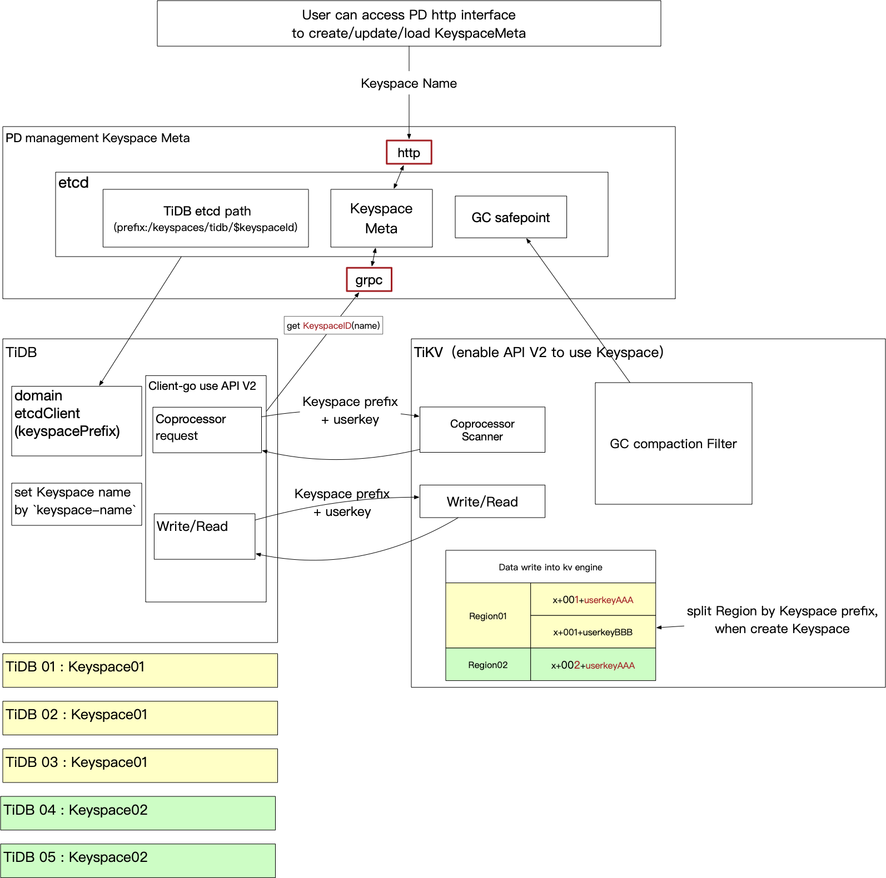

# Proposal: Keyspace
* Authors: [ystaticy](https://github.com/ystaticy), [iosmanthus](https://github.com/iosmanthus), [AmoebaProtozoa](https://github.com/AmoebaProtozoa),[zeminzhou](https://github.com/zeminzhou)


## Motivation

We aim to store data from multiple applications in a TiKV cluster. For instance, in a multi tenant scenario, a common solution is to add a prefix to the key to differentiate the data of various applications. Therefore, we introduce a new concept referred to as `Keyspace` to describe the logical isolation among different business scenarios within a TiKV cluster.

## Architecture

In this section, we will outline the architecture when utilizing keyspaces.



### PD

PD is responsible for managing `Keyspace` metadata. It provides HTTP and RPC interfaces to create, load, and modify `Keyspace` metadata. All other components retrieve the keyspace metadata from PD.

### TiDB

After the keyspace is created on PD, it can be configured on multiple TiDB instances, forming a TiDB cluster for that keyspace. However, a TiDB instance can serve only one keyspace at a specific moment, unless it is restarted and configured to use a different keyspace.

### Client-go

In TiDB, client-go utilizes [codec V2](https://github.com/tikv/rfcs/blob/master/text/0069-api-v2.md#new-key-value-codec) to add a keyspace prefix when the keyspace is set. A client configured with a keyspace can only read and write data from the specified keyspace.

### TiKV

In TiKV, different keyspaces are isolated by different data key prefixes.

### TiFlash

In TiFlash, requests carry the keyspace prefix, and the data structures and storage paths are isolated by the keyspace ID.

## Usage

To use TiDB with `Keyspace`, the following configuration is required:
1. TiKV needs to [enable API V2](https://github.com/tikv/rfcs/blob/master/text/0069-api-v2.md#tikv-server).
2. The TiDB configuration should set `keyspace-name` to specify which keyspace is currently served by the TiDB instance.
3. BR, Lightning, Dumpling, and TiCDC specify the keyspace by setting `keyspace-name` on the command line.

## Implementation

### PD

#### PD Functionality

PD provides an HTTP interface and an RPC interface to create, load, change the state, and configure keyspace metadata, and is responsible for interacting with the keyspace metadata store. Users can request the `create keyspace` interface by specifying the keyspace name, which generates the keyspace metadata.
* [PD HTTP interface](https://github.com/tikv/pd/blob/098b802fcda75b5ae0527b0b50b95ba8b31403cf/server/apiv2/handlers/keyspace.go)
* [PD RPC interface](https://github.com/tikv/pd/blob/b95dddaa7e9decaad7c24becb401c67cea83fd3a/server/keyspace_service.go)

#### Keyspace Name

**Keyspace Name** is specified by the creator during the creation of the keyspace, and once the keyspace is created, the keyspace name cannot be bound to another keyspace.

#### Keyspace ID Allocation

**Keyspace ID** is allocated by PD createKeyspace interface. The keyspace id is assigned by auto-incrementing the id, so keyspace ids are not re-assigned. The max keyspace id is 16777216, no new keyspaces can be created after the maximum keyspace id has been reached.

#### Keyspace Metadata

[**Keyspace Meta**](https://github.com/pingcap/kvproto/blob/d9297553c9009f569eaf4350f68a908f7811ee55/proto/keyspacepb.proto#L26C1-L33C2) is built when a keyspace is created, and the keyspace management interface operates on this metadata. The keyspace state in the metadata changes according to the keyspace state machine. The state change logic is as follows:


### TiDB

#### Using API V2 and etcd namespace to isolate TiKV data and etcd path by Keyspace.

1. Configure the keyspace name by setting `keyspace-name` in the configuration file. 
   * When the TiDB server starts, it will open a TiKV driver. The driver has a TxnKV client object called `tikv.KVStore`. If `keyspace-name` is set, it will use `tikv.KVStore` via API V2 to access TiKV.
2. The etcd path should have a different prefix based on the etcd namespace. 
   * An etcd client is created during domain initialization. If `keyspace-name` is set, it will add an etcd namespace when creating the etcd client. 
   * The format of the etcd namespace is `/keyspaces/tidb/$keyspaceId`.

#### TiDB BR

If "keyspace-name" is set when executing the BR command, it supports restore and backup for the specified keyspace data. The BR task will parse the old keyspace prefix from the source data, and get target keyspace from KVStore.codec. The old keyspace prefix and new keyspace prefix are used to update the old key prefix and new key prefix of rewrite rules. Restore checksum also requires the old and new keyspace prefixes. The backup task needs to add a target keyspace prefix when building ranges in `BackupRequest` to scan for the data of the specified keyspace in TiKV.

#### TiDB Lightning

If `keyspace-name` is set when executing the `Lightning` command, it will encode the key to add the keyspace prefix before appending rows to the SST file, and decode the key before recording conflict data into the TiDB table.

#### TiCDC

If `keyspace-name` is set when creating a changefeed to the TiCDC server, the server will only capture the table data within that keyspace for the changefeed. For changefeeds configured with a keyspace, the TiCDC server will encode the table range with the keyspace prefix to subscribe to the table data from the TiKV server, and it will also decode the keyspace prefix from the key received from the TiKV server to retrieve the table data. If `keyspace-name` is not set, the TiCDC server will not capture the table data from [API V2](https://github.com/tikv/rfcs/blob/master/text/0069-api-v2.md#tikv-server).

#### TiDB GC

##### Concepts of GC management type:

1. Global GC:
   - Represents the previous default GC logic. There is a TiDB GC Worker that is responsible for calculating the global GC safe point for the entire cluster.
   - The default GC management type for a keyspace is global GC.
2. Keyspace Level GC:
   - Indicates that the keyspace will advance its own GC safe point.
   - `Keyspace` GC related data includes: minimum start timestamp, GC safe point, and service safe point, which are stored in the dedicated path of each keyspace in PD.

Previously, there was only one GCWorker leader for GC in the entire PD and TiKV cluster. After supporting keyspace level GC, the default GC management type for a keyspace is global GC. Alternatively, you can specify the GC management type as global_gc or keyspace_level_gc via the keyspace meta's configuration `gc_management_type`.

* When a specified keyspace uses global GC, this keyspace will have its own GCWorker leader. However, this GCWorker leader is not responsible for calculating the GC safe point or resolving locks. This keyspace will rely on the GC safe point produced by the GCWorker leader that is not configured with a keyspace in the cluster for GC, and will use its own keyspace specific GCWorker leader for deleting ranges.

* When a specified keyspace uses keyspace level GC, this keyspace will have its own GCWorker leader that computes its own GC safe point, resolves locks, and deletes ranges. The keyspace level safe point information is stored in PD, isolated by the keyspace prefix, and only GC the data within its keyspace range, without affecting other keyspaces.

#### Observability

Keyspace observability is essential for understanding and managing performance effectively.

1. Metric Filtering: TiDB metrics can be filtered by the `keyspace_id` label for precise monitoring.
2. Grafana Setup: Add a query box for `keyspace_id` in Grafana dashboards to visualize data specific to each keyspace.
3. Log Enhancement: Include the `keyspace_name` label in TiDB logs for better tracking and context in log analysis.

### TiKV

`Keyspace` can only be used when TiKV [enabled API V2](https://github.com/tikv/rfcs/blob/master/text/0069-api-v2.md#tikv-server).
For more details about keyspace in TiKV, please refer to the [API V2 RFC](https://github.com/tikv/rfcs/blob/master/text/0069-api-v2.md).

#### Keyspace Key encoding:

We use [`Keyspace` key encoding](https://github.com/tikv/rfcs/blob/master/text/0069-api-v2.md#key-encoding) as the key prefix for keyspace to isolate data between different keyspaces. When TiDB enables `Keyspace`, it operates in `TxnKV` mode. The prefix 'x' indicates the `TxnKV` key mode, followed directly by a 3-byte keyspace ID identifier, and then comes the user key.

#### Client-go

Client-go also supports API V2 and `Keyspace`. This will make all the codec logic transparent to applications. We currently maintain these implementations in tikv/client-go/api-v2. The new version of client-go unifies all the codec logic by introducing a new interface called `Codec`:
```go
// Codec is responsible for encode/decode requests.
type Codec interface {
	// GetAPIVersion returns the api version of the codec.
	GetAPIVersion() kvrpcpb.APIVersion
	// GetKeyspace return the keyspace id of the codec in bytes.
	GetKeyspace() []byte
	// GetKeyspaceID return the keyspace id of the codec.
	GetKeyspaceID() KeyspaceID
	// EncodeRequest encodes with the given Codec.
	// NOTE: req is reused on retry. MUST encode on cloned request, other than overwrite the original.
	EncodeRequest(req *tikvrpc.Request) (*tikvrpc.Request, error)
	// DecodeResponse decode the resp with the given codec.
	DecodeResponse(req *tikvrpc.Request, resp *tikvrpc.Response) (*tikvrpc.Response, error)
	// EncodeRegionKey encode region's key.
	EncodeRegionKey(key []byte) []byte
	// DecodeRegionKey decode region's key
	DecodeRegionKey(encodedKey []byte) ([]byte, error)
	// DecodeBucketKeys decode region bucket's key
	DecodeBucketKeys(keys [][]byte) ([][]byte, error)
	// EncodeRegionRange encode region's start and end.
	EncodeRegionRange(start, end []byte) ([]byte, []byte)
	// DecodeRegionRange decode region's start and end.
	DecodeRegionRange(encodedStart, encodedEnd []byte) ([]byte, []byte, error)
	// EncodeRange encode a key range.
	EncodeRange(start, end []byte) ([]byte, []byte)
	// DecodeRange decode a key range.
	DecodeRange(encodedStart, encodedEnd []byte) ([]byte, []byte, error)
	// EncodeKey encode a key.
	EncodeKey(key []byte) []byte
	// DecodeKey decode a key.
	DecodeKey(encoded []byte) ([]byte, error)
}
```

This interface will encode the key-related request right before it is sent to the TiKV/TiFlash/PD server. It will decode the response immediately after it is received. This design aims to be neat enough to make encoding and decoding transparent to applications.

Typically, [`codecV2`](https://github.com/tikv/client-go/blob/239ac1b2b7fc67921b00e1d51d47f3716c2c2f0c/internal/apicodec/codec_v2.go#L41) implements the `Codec` interface and the codec logic related to `Keyspace`.
The encoding logic is trivial, but the decoding logic is somewhat complicated.
To achieve transparency, `codecV2` will map the region range to `[0, +inf)`, if the range is not overlapped with the current keyspace, it will return an error.
For instance, if the keyspace is `[x001, x002)`, then the region range `[x003, x004)` is invalid, and `[x000, x002)` is mapped to `[0, +inf)`.

client-go provides a function called `NewCodecPDClientWithKeyspace` to create a PD client with `Keyspace` support. It tries to fetch the keyspace id with the given keyspace name from PD, and create a `codecV2` with the keyspace id.
You could get the `Codec` within the `CodecPDClient` and use it to construct a TiKV gRPC client.

#### Coprocessor

TiKV Coprocessor uses the range specified in the request to determine which range to scan. After scanning, it transforms the key/value pairs into a columnar format and begins executing the DAG request. However, the original code cannot recognize the new format of the key. Therefore, the `RangeScanner` should be modified to support the new format of the key by ignoring the first 4 bytes if the request uses API V2.

### TiFlash

TiFlash is a columnar storage engine that acts as a coprocessor for TiKV. When TiDB is configured with a keyspace, TiFlash requests also include the keyspace prefix. TiFlash's data structures and storage paths are isolated by the keyspace ID.

#### Storage

Without a keyspace, TiFlash stores each table's columnar/schema data in a separate directory identified by the table ID. However, in a keyspace scenario, multiple keyspaces may have the same table ID, which means that the table ID alone cannot uniquely identify a table.

The storage path structure of TiFlash will be as follows:
```
.
├── data
│   ├── ks_1_t_92
│   │   ├── data
├── metadata
│   ├── ks_1_db_1
│   │   └── ks_1_t_92.sql
│   ├── ks_1_db_2
│   └── system
```

Each table directory will be identified by both the keyspace ID and the table ID.

#### Cache

When decoding row data into a columnar format, TiFlash ignores the keyspace prefix. Table-related cache structures will be refactored into a map of `<KeyspaceID, TableID> -> <ValueType>` instead of `<TableID> -> <ValueType>`.

#### Schema sync

When syncing the schema from TiDB to TiFlash, TiFlash adds the keyspace prefix to requests sent to TiKV for specific table schemas.

#### Request handling

TiFlash requests carry the keyspace prefix. TiFlash parses `<KeyspaceID, TableID>` from the encoded key range. It then uses this information to route requests to the relevant table storage.

### Placement Rules

Placement rules are isolated by keyspace. TiDB must name placement rules using the keyspace prefix, such as `keyspace-<keyspace_id>-xxxx`. Additionally, the key range of some rules must be encoded.
