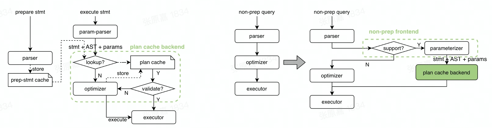

# Proposal: Non-Prepared Plan Cache

* Author: [qw4990](https://github.com/qw4990)
* Tracking issue: https://github.com/pingcap/tidb/issues/36598

## Background
TP queries can get lots of performance benefits from Plan Cache, but the current [TiDB Plan Cache](https://docs.pingcap.com/tidb/dev/sql-prepared-plan-cache) can only support Prepare/Execute Statements. Most of our users are still using general(non-prepared) queries to access TiDB instead of Prepare/Execute. So if Plan Cache can support general queries, these users can gain some performance benefits as well.
Some other mature Databases have already supported this feature: 1) [Oracle](https://docs.oracle.com/en/database/oracle/oracle-database/19/tgsql/improving-rwp-cursor-sharing.html) and 2) [OceanBase](https://www.oceanbase.com/docs/common-oceanbase-database-cn-10000000001576952).

## Overview

As the left part of the above diagram show, Plan Cache can be split into 2 parts logically:
1. The Frontend: this part is used to deal with different protocols (binary or text), and prepare all arguments required by the backend (SQL, AST, Normalized Parameters, etc.)
2. The Backend: find an available cached Plan from the cache or generate a new Plan for the input arguments

And more specifically, the backend can be abstracted as a function `GetPlan(SQL, AST, Params)`, and it works as below:
1. Look up the Plan Cache to find a cached plan for the input SQL;
2. If it can find an available plan, fill this plan with the input parameters, and return the plan; (cache hit)
3. If not, pass `(AST, Params)` to the optimizer to generate a new plan, return this plan, and put this plan into the cache; (cache miss)

To support Non-Prepared Plan Cache, logically we can re-use the whole backend, and just update the frontend a little:
1. Check whether the current query is supported by Non-Prepared Plan Cache;
2. If not, just fall back to the normal optimization code path;
3. If yes:
   1. Normalize this query and prepare all arguments `(SQL, AST, Params)`;
   2. Pass these arguments to the Plan Cache backend to get a Plan;

## Details
### Scope & Limitations
Currently, TiDB only caches one plan for a parameterized query. 

For example, the queries `SELECT * FROM t WHERE a < 1` and `SELECT * FROM t WHERE a < 100000` share the same parameterized form, `SELECT * FROM t WHERE a < ?`, and thus share the same plan.

Due to the preceding risks and the fact that the execution plan cache only provides significant benefits for simple queries (if a query is complex and takes a long time to execute, using the execution plan cache might not be very helpful), TiDB has strict restrictions on the scope of non-prepared plan cache. 
The restrictions are as follows:

1. Queries or plans that are not supported by the Prepared plan cache are also not supported by the non-prepared plan cache.
2. Currently, only point get or range queries on a single table that contain `Scan`, `Selection`, or `Projection` operators are supported, such as `SELECT * FROM t WHERE a < 10 AND b in (1, 2)`.
3. Queries that contain complex operators such as `Agg`, `Limit`, `Window`, or `Sort` are not supported.
4. Queries that contain non-range query conditions are not supported, such as:
1. `LIKE` is not supported, such as `c LIKE 'c%'`.
2. `+` operation is not supported, such as `a+1 < 2`.
5. Queries that filter on columns of `JSON`, `ENUM`, `SET`, or `BIT` type are not supported, such as `SELECT * FROM t WHERE json_col = '{}'`.
6. Queries that filter on `NULL` values are not supported, such as `SELECT * FROM t WHERE a is NULL`.
7. Queries with more than 50 parameters after parameterization are not supported, such as `SELECT * FROM t WHERE a in (1, 2, 3, ... 51)`.
8. Queries that access partitioned tables, virtual columns, temporary tables, views, or memory tables are not supported, such as `SELECT * FROM INFORMATION_SCHEMA.COLUMNS`, where `COLUMNS` is a TiDB memory table.
9. Queries with hints, subqueries, or locks are not supported.
10. DML statements are not supported.

We'll solve these limitations step by step later on.

### Separated Cache
Prepared Plan Cache and Non-Prepared Plan Cache are totally separated, cached plans in them do not affect each other.

### Cacheable Check
We implement a cacheable checker to check whether a query can be supported by Non-Prepared Plan Cache(cacheable_checker).
If a query is not supported, we can just fall back to the normal optimization code path.

### Parameterization
Plan Cache uses parameterized SQL as the key, so we need a way that can parameterize any SQL fast.
For example, parameterize `select * from t where a<10` to `select * from t where a<?`;
Currently, we implement this on `AST`:
1. First, we iterate the `AST` and replace all constant values with `?`;
2. Then, we call `AST.Restore` to get the parameterized SQL;

### New Variables
Introduce 2 variables below to control Non-Prepared Plan Cache behaviors:
- `tidb_enable_non_prepared_plan_cache`: indicate whether to enable this feature;
- `tidb_non_prepared_plan_cache_size`: indicate the cache size;
