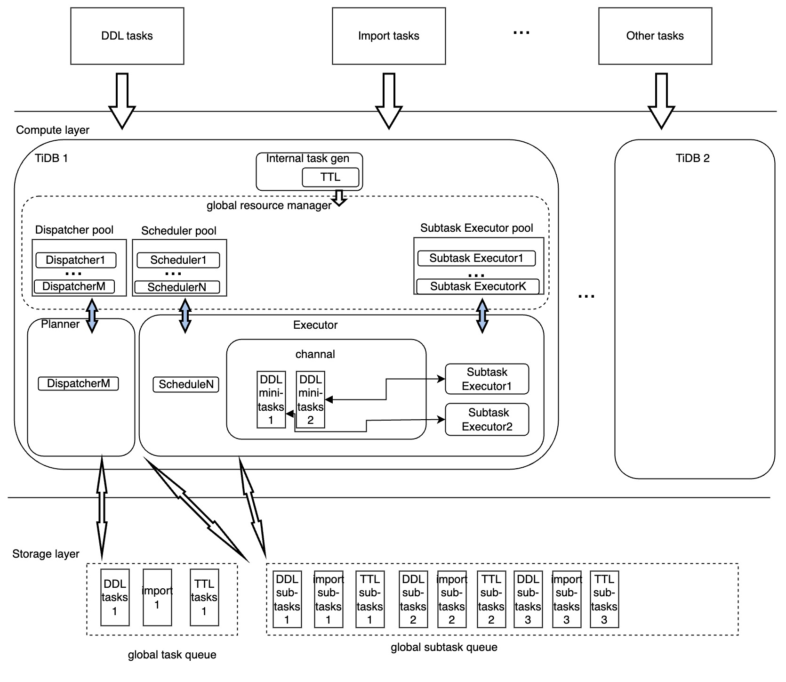

# Proposal: Unified Distributed Parallel Execution Framework

- Author: [Benjamin](https://github.com/Benjamin2037)
- Tracking Issue: https://github.com/pingcap/tidb/issues/41495

## Background and Benefits

TiDB is a distributed database that provides high scalability, availability, and performance for database service. This proposal introduces a unified distributed parallel execution framework to support all backend tasks, such as DDL, data import, TTL, analyze and backup&restore, in a distributed manner.
The framework may bring three outstanding benefits to TiDB users:
1. The distributed execution model provides better scalability and improved runtime performance for backend tasks.
2. It optimizes resource utilization within the TiDB cluster for backend tasks.
3. The framework enables resource management by treating backend tasks as a whole and scheduling different task executions according to user expectations.

## Goal and Non-goal

In this section, we define the goals and non-goals for the Phase I of the framework. Future versions will be described in the "Future Work" section.

### Goal

The Phase I of the framework aims to:
1. Build the fundamental component of the framework.
2. Support limited scenarios of backend tasks, including:
   1. Partition table create index in a distributed way for DDL.
   2. Maybe import table task execution in a distributed way for the Import service.
   
### Non-goal

The Phase I of the framework does not aim to:
1. Support query execution. For query distributed execution support, please see the TiFlash documentation.
2. Provide sophisticated high availability (HA) capability, which will be improved in future phase.
3. Support task runtime status, such as task execution progress, which will be provided in later phase.
4. Support TTL, auto-analyze, and BR, which will be supported in later phase.

## Architecture

This section we will describe the Architecture of the framework.


The architecture diagram shows the key modules required for the framework to handle incoming backend tasks in a distributed manner with high performance and good HA capability. These modules are:

1. Global task queue: used to store the backend tasks' runtime information.
2. Global subtask queue: used to store TiDB node-level subtask runtime information. It is split from the task handle data and is a TiDB node-level executor unit.
3. Dispatcher: task runtime owner. It generates planner for tasks, monitors task runtime status, and pushes tasks into the next stage of execution.
4. Scheduler: TiDB node-level subtask runtime owner. It picks up one subtask and runs it on one TiDB node in parallel ways, sets subtask status, monitors task status, and determines what to do next.
5. Subtask executor: the real worker that executes a slice of a subtask and returns the result and error, if any, back to the scheduler.
6. Resource pool: For the dispatcher, scheduler, and executor, we limit them into a pool according to class. a global resource manager take care of limit the framework runtime resource usage quantity.

## Detail Design

This section introduces the data structures and interfaces that define the detail design of the framework.

### System Variable

The system variable `tidb_enable_dist_task` is used to enable/disable the framework.

```sql
mysql> set global tidb_enable_dist_task = ON|OFF;
```

### Data Structure

In implementation, the following two tables are used to represent the global task queue and global subtask queue:


| Name              | Type                                           | Memo |
|-------------------|------------------------------------------------|------|
| id                | BIGINT(20) NOT NULL AUTO_INCREMENT PRIMARY KEY |      | 
| task_key          | VARCHAR(256) NOT NULL                          |      |
| type              | VARCHAR(256) NOT NULL                          |      |
| dispatcher_id     | VARCHAR(256)                                   |      |
| state             | VARCHAR(64) NOT NULL                           |      |
| start_time        | TIMESTAMP                                      |      |
| state_update_time | TIMESTAMP                                      |      |
| meta              | LONGBLOB                                       |      |
| concurrency       | INT(11)                                        |      |
| step              | INT(11)                                        |      |

| Name              | Type                                       | Memo |
|-------------------|--------------------------------------------|------|
| id                | bigint not null auto_increment primary key |      |
| namespace         | varchar(256)                               |      |
| task_key          | varchar(256)                               |      | 
| ddl_physical_tid  | bigint(20)                                 |      |
| type              | int                                        |      |  
| exec_id           | varchar(256)                               |      |
| exec_expired      | timestamp                                  |      |
| state             | varchar(64) not null                       |      |
| checkpoint        | longblob not null                          |      | 
| start_time        | bigint                                     |      |        
| state_update_time | bigint                                     |      | 
| meta              | longblob                                   |      |                                            |      |

### Interface

Dispatcher
```go
// Dispatch defines the interface for operations inside a dispatcher.
type Dispatch interface {
	// Start enables dispatching and monitoring mechanisms.
	Start()
	// GetAllSchedulerIDs gets handles the task's all available instances.
	GetAllSchedulerIDs(ctx context.Context, gTaskID int64) ([]string, error)
	// Stop stops the dispatcher.
	Stop()
}
```
Scheduler
```go
// InternalScheduler defines the interface of an internal scheduler.
type InternalScheduler interface {
	Start()
	Stop()
	Run(context.Context, *proto.Task) error
	Rollback(context.Context, *proto.Task) error
}

// Scheduler defines the interface of a scheduler.
// User should implement this interface to define their own scheduler.
type Scheduler interface {
	InitSubtaskExecEnv(context.Context) error
	SplitSubtask(subtask []byte) []proto.MinimalTask
	CleanupSubtaskExecEnv(context.Context) error
	Rollback(context.Context) error
}
```

## Usage

The phase I of the unified distributed parallel execution framework is currently planned as an experimental feature. This feature is designed to support the execution of `Create index` or `Add index` tasks in a distributed manner.

To enable distributed `Add index` for DDL tasks, the following system variables and config parameters may be related:

**System Variables**:

* [tidb_ddl_reorg_worker_cnt](https://docs.pingcap.com/tidb/stable/system-variables#tidb_ddl_reorg_worker_cnt)
* [tidb_ddl_reorg_priority](https://docs.pingcap.com/tidb/stable/system-variables#tidb_ddl_reorg_priority)
* [tidb_ddl_error_count_limit](https://docs.pingcap.com/tidb/stable/system-variables#tidb_ddl_error_count_limit)
* [tidb_ddl_reorg_batch_size](https://docs.pingcap.com/tidb/stable/system-variables#tidb_ddl_reorg_batch_size)

**Fast DDL Path:**
* [tidb_ddl_enable_fast_reorg](https://docs.pingcap.com/tidb/stable/system-variables#tidb_ddl_enable_fast_reorg-new-in-v630)
* [tidb_ddl_disk_quota](https://docs.pingcap.com/tidb/stable/system-variables#tidb_ddl_disk_quota-new-in-v630)

**Config parameter:**
* [temp-dir](https://docs.pingcap.com/tidb/stable/tidb-configuration-file#temp-dir-new-in-v630)

## Future Work
1. Stabilize the framework capability and improve the user experience to make it more user-friendly and efficient for handling various tasks.
2. Expand the supported backend tasks to include more types of operations such as `Load Data`, `TTL`, `Auto-Analyze`, `Backup`, `Restore`, and more.
3. Implement the ability to pause and resume tasks, which would allow users to easily control and manage the execution of tasks based on their requirements and priorities.
4. Introduce a resource manager to provide better control and monitoring of the backend tasks' resource utilization, including CPU, memory usage. This will ensure that tasks are executed in a more optimized and efficient way.
