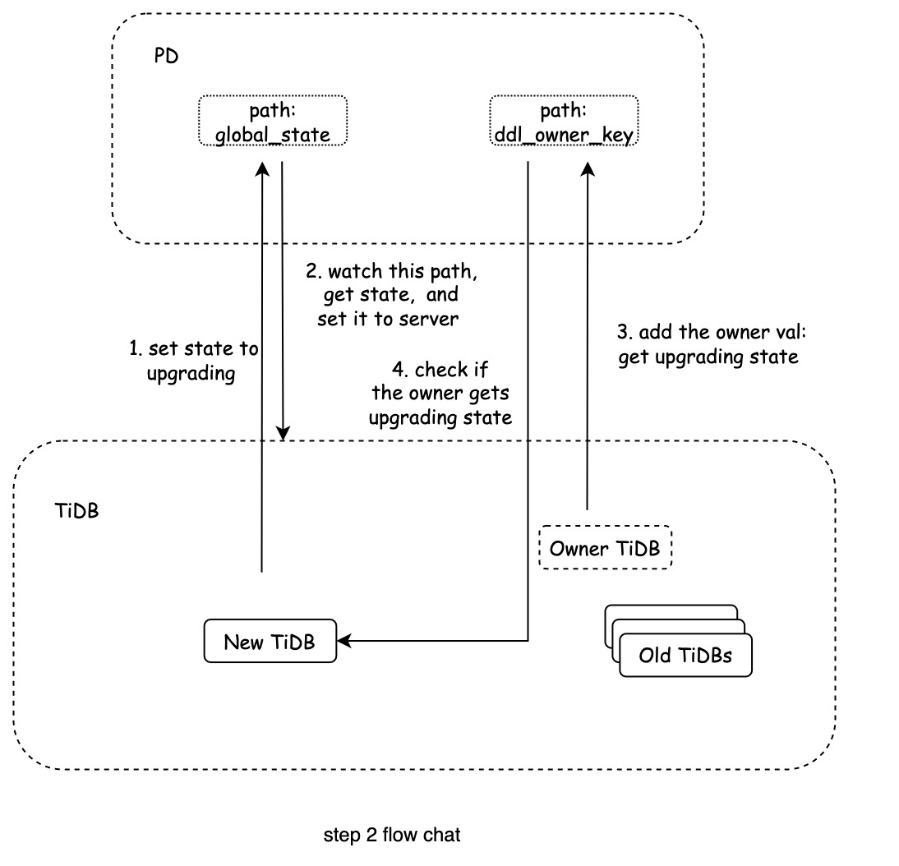

# Proposal: Pause User DDL when Upgrading TiDB

* Author: [zimulala](https://github.com/zimulala)
* Tracking issue: https://github.com/pingcap/tidb/issues/39751

## Abstract

This document describes a feature that allows users to pause the execution of their Data Definition Language (DDL) statements during the upgrade process of TiDB. During the upgrade process, the system stops the execution of user DDL statements, completes the system DDL operation, and finally resumes the execution of the original user DDL statements. This feature is available for upgrades from v7.1 and later versions of TiDB, and it does not support upgrades from versions prior to v7.1.

## Motivation or Background

Since the cluster upgrade may need to deal with DDL statements(there may be some DDL statements being processed before the upgrade), and DDL itself implementation framework will also need to adjust, resulting in some versions may not be able to roll the upgrade situation. Although above scenarios may only exist in some upgrade cases, it is not easy to describe them one by one. Therefore, when upgrading TiDB clusters, users need to first confirm that there are no DDL statements being executed, otherwise there may be problems with unexpection behavior.
- The above rule is only described in the doc, and users may misoperate. Related [doc](https://docs.pingcap.com/tidb/dev/upgrade-tidb-using-tiup#upgrade-tidb-using-tiup).
- During the upgrade operation, users need to communicate and coordinate with each business to cancel DDL, then upgrade, and finally re-execute DDL. Specific scenarios such as large cluster scenarios shared across multiple systems, such as scenarios on TiDB cloud.

## Detailed Design

Here are some roles for TiDB in the cluster (assuming upgrading from v7.1 to v7.2 here):
- New TiDB: The new version of TiDB that will be upgraded, such as v7.2.
- Old TiDB: Other TiDBs in the cluster that have not been upgraded, such as v7.1.
- Owner TiDB: The TiDB where the DDL owner in the cluster is located.

Specific upgrade process:
1. New TiDB: Check whether the old TiDB version is greater than or equal to v7.1, if not, then exit the whole process. That means the cluster upgrade process will follow legcy upgrade ways, that means User have to make sure there is no user issued DDL in running state.
2. Notify the cluster that all TiDB enters to pause executing user DDL operations. Notification method:
   1. New TiDB: Set the PD path (for example: `/tidb/server/global_state` , use this path later) to the current TiDB version. In addition, in order to prevent multiple TiDB nodes from upgrading at the same time, it will check whether the value on the `/tidb/server/global_state` path is empty.
   2. All TiDBs：
      1. The newly started TiDB will first check the `/tidb/server/global_state` value and whether it needs to enter upgrading mode.
      2. The running TiDB will watch `/tidb/server/global_state` , and when it receives an upgrade status notification, it will enter upgrading mode.
   3. Owner TiDB: Mark the information in the owner value on the PD (that is, the value corresponding to the DDL owner key recorded on the PD) to indicate that upgrading has been received.
   4. New TiDB: Check whether the owner TiDB has received the upgrading signal. If so, enter the following process, otherwise wait.
3. After receiving `/tidb/server/global_state` notification
   1. All TiDBs: At this time, for the newly received DDL operation, consider setting it to pause directly.
   2. Owner TiDB: For existing user DDL operations, pause them (consider removing step-3.i). Enable the pause DDL function (in implementation), and pause all user DDL operations (to distinguish between operations that the user himself has paused).
4. New TiDB: Perform upgrade-related operations in normal bootstrap.
5. New TiDB: Restore the original user DDL operation, that is, resume all DDL operations (the operation that the user paused before bootstrap needs to be preserved).
6. Resume normal execution of DDL mode
   1. New TiDB: Release pause mode on PD and set `/tidb/server/global_state` and the owner value to normal state.
   2. All TiDBs: watch `/tidb/server/global_state` , receive this notification, and enter normal mode.
7. Complete the bootstrap operation.

### Limitations

In the plan, we distinguish between DDL operation types. Among them, we distinguish whether the DDL operation is a system DDL operation or a user DDL operation  by whether the DDL operation is performed on the system table. Therefore, we require users to not perform DDL operations on system tables when upgrading.

## Compatibility

- TiDB
  - This feature is not supported when upgrading from v7.1 and previous versions.
- Other components
  - During the upgrade process, the operation of some components is not supported, such as:
    - Backup/Restore, Lightning ( Physical Import Mode ) : The operation of this type of component cannot be processed during the upgrade process, because the DDL in the paused state may be copied to TiDB during these operations. However, the DDL in this state cannot be automatically resumed, which may lead to subsequent DDL block.
  - During the upgrade process, the operation of some components may be blocked, such as:
    - DM, TiCDC and Lightning (Logical Import Mode) and other components. That is, during the upgrade process, import SQL to TiDB through such components, and there are DDL operations (if there is a system DDL operation that may have latent risk), then these DDL will be set to paused, causing this import operation to block.

## Test Design

- The original upgrade tests.
- Test some of the following scenarios to check whether the upgrade is normal, and whether the DDL operation is as expected.
  - Add DDL operations before upgrading.
  - Test scenarios during the upgrade process:
    - Add DDL operations.
    - The upgrade was interrupted.
    - The DDL owner has changed.

## Impacts & Risks

1. Since TiDB itself has some functional roles or judgments on whether some functions are enabled or not, and there will be different versions and other factors during the upgrade process, we need to consider more scenarios, and these scenarios may have omissions in design or testing.
2. For DDL jobs being executed, the current design may cause them to execute on DDL owners of different versions of TiDB. This scenario requires rolling upgrade compatibility for DDL operations.

## Future Works

With regard to risk 2 mentioned above, the two main issues that we need to deal with later:
- Do not allow running DDL jobs to be processed on different versions of TiDB.
  - Cancel the running DDL job, wait for the bootstrap to finish, and then do an orderly playback.
  - You need to wait for all TiDB upgrades to execute DDL jobs normally, otherwise this problem will still occur.
- Consider not letting the new version of DDL jobs be processed on the old version of TiDB, and not letting the old version of DDL jobs be processed on the new version of TiDB.
  - A queued DDL job is best played back through its query.

## Investigation & Alternatives

The following schemes are mainly different in the way of notifying the upgrading status to the cluster and replying that the cluster status is normal. The specific schemes are as follows:

### Plan 1

1. Same as step-1 in the selection plan.
2. Notify the cluster that all TiDB enters to pause executing user DDL operations. Notification method:
   1. Same as step-2.a in the selected plan.
   2. All TiDBs: Watch /tidb/server/global_up3rading path, the TiDB that receives the notification sets the upgrading mode to on, for example:
      - You can add a field to ServerInfo to show whether it has upgrading mode turned on.
      - You can add /tidb/server/global_upgrading_all_nodes/ and all TiDB receiving notifications will have their IDs set on it.
   3. New TiDB: Check whether the upgrading mode of all surviving TiDBs is turned on, wait if it is not turned on, and enter the next process if it is turned on.
3. Same as steps 3 to 5 in the selection plan. Where step-3.ii has two ways:
   1. When the owner executes, the user DDL operations are filtered out directly. Similar to the description in step-3.b in the selection plan, but the DDL job state is not updated (ie not persisted to the storage layer). In addition, the running DDL may require special handling.
   2. Record all user DDL operations and save them to the storage layer, and need to create a new table for storage. When restoring, put it back into the DDL job table. The advantage is that even if the DDL framework is overhauled (such as the previous KV queue changed to the DDL job table), this function is not affected.
4. Resume normal execution of DDL mode
   1. Release the pause mode on the PD and set the `/tidb/server/global_state` to null.
   2. Restore the normal mode of the machine, which can accept user DDL requests.
   3. Old TiDB：
      1. Clean up the information in step-2.b.
      2. It can receive notifications from the step-2.b process to know that it can return to normal mode, or it can return to normal mode after upgrading.
5. Complete the bootstrap operation.

#### Foreseeable disadvantages

- Step b, notify all TiDB to enter upgrading mode and confirm that if all TiDBs enter this mode, the process may have more problems.

### Plan 2

Difference from Scheme 1: Whether you need to notify all TiDBs to enter upgrading mode.
1. Same as step-1 and Step-2.a in plan1.
2. Make new TiDB a DDL owner in two ways:
   - Old TiDB watches `/tidb/server/global_state` , receives the notification, and withdraws from the owner campaign by setting the `tidb_enable_ddl` method.
   - Through etcd'Resign 'and'Leader' and other ways to make new TiDB slowly become DDL owner.
3. Then you can skip all the TiDB in the synchronous cluster to enter the upgrading mode, only the TiDB where the current DDL owner is located enters this mode, and then proceed directly to steps 3 to 5 in the selection plan.
4. Complete the bootstrap operation.

#### Foreseeable disadvantages

- Bootstrap process, if  new TiDB encountered network and other reasons cause the owner to change.
- You can consider exiting this bootstrap directly and starting over. However, interrupting the last execution of this upgradeToVerXXX may be a switch on. Then, the old TiDB in the cluster may not support this switch well.
