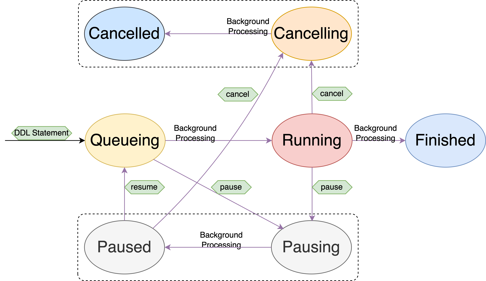

# Pause/Resume DDL jobs

- Author: [dhysum](https://github.com/dhysum)
- Tracking Issue:
  - https://github.com/pingcap/tidb/issues/40041
  - https://github.com/pingcap/tidb/issues/18015

## Background and Benefits

DDL jobs are running asynchronously in the background, which may take a very
long time to execute. The Admin could cancel the running DDL job if
necessary, for example, out of resource.

As a DDL job may take a lot of effort, it could be a big waste to
just cancel and restart the job. It has several stages and steps back in the
yard to finish a DDL job, we may just pause it at some step and resume it right
from that place.

Also, such feature will benefit the Upgrade of the TiDB Cluster.

## Goal

Add two commands to pause and resume a long-running DDL job. In particularly:

1. `admin pause ddl jobs 3,5;`

    The jobs (here are job 3 and job 5) should be in Running or Queueing(Wait)
    state. Other states should be rejected.

2. `admin resume ddl jobs 3,5;`

    Only Paused jobs could be resumed. Other states should be rejected.

## Architecture

There is no change on the architecture, just following the current one.

## Detail Design

The whole design is simple:

1. Add pause/resume in parser
2. Add builder in planner
3. Add builder in executor
4. Valid the job's state, and turn it to be Pausing, if `admin pause ...`
by end user

    4.1 Valid the state first, only Running job could be paused, just like
`admin cancel ...`

    4.2 Turn the state to be Pausing

    4.3 Background worker will check the state, and turn the state to be Paused
    , then just return and stay in current stage; And this is what is different
    from `admin cancel ...`

    4.4 Background worker will continue fetching the job and check the state,
    and keep doing nothing until the state changed

    4.5 Specially, the Reorg state could take a long time (maybe minutes, even
    hours), we also need to check the state of the job, and stop the reorg
    accordingly

5. Validate the job's state, and turn it to be Queueing, if `admin resume ...`
by end user

    5.1 After the job's state changes, the background worker should check the
    job's state and continue the work

    5.2 No other actions should be taken

### State Machine

## Usage

1. Create an index

    `create index idx_usr on t_user(name);`

2. In another session, show the DDL jobs

    `admin show ddl jobs 15;`

    It will show 15 DDL jobs, change the number if you want to see more. And
    then, find the running one (job_id) you want to pause.

3. Pause the job by

    `admin pause ddl jobs $job_id` ---- $job_id is what you get from upper step

4. Resume the paused job

    Also, you can find the Paused jobs by (change the number if you want to see
    more):

    `admin show ddl jobs 15;`

    Then, reumse it by:

    `admin resume ddl jobs $job_id`

## Future Work

None.
