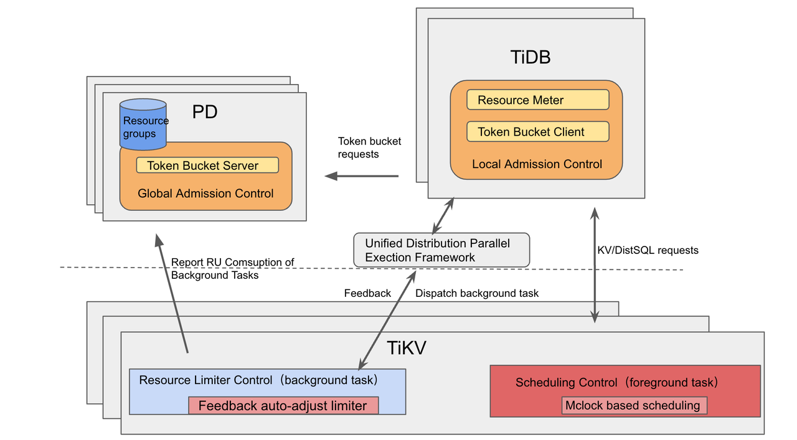

# Background Tasks Control

- Author： [glorv](https://github.com/glorv)
- Tracking Issue:
  - <https://github.com/pingcap/tidb/issues/44517>

## Motivation

Resource control is used to solve some problems of resource usage under data consolidation. We can currently control some normal query tasks by means of RU limiter and scheduling. But it's not an adaptation for some background or bulk import/export tasks very well.

Due to the implementation restriction, resource control can't be applied for some tasks such as BR and TiDB Lightning. And for some long-running tasks such as DDL or background auto-analyze, it's also hard to control the resource usage becase it's not easy to select a proper RU settrings for these kind of jobs.

## Design Goals

- Background tasks will try to use the system's (on the TiKV side) free resources and reduce the impact of background tasks on foreground tasks.
- Metering resource consumption by background tasks, and unifying the consumption unit to RU.
- The resource control of background tasks should be easy to integrate into different components and do not depend on the component's implementation detail
- Feedback to the upper layer(TiDB) to coordinate the concurrency of dispatched tasks

## Definition of background task

From our previous analysis, different background tasks can run in different execution routines (e.g Lightning and BR run in a separate tokio thread pool), and different phases of a single task can run in different routines (e.g. For fast DDL, the ingest phase is like Lightning and the merge phase runs as normal transactions). Furthermore, for some tasks, whether it is background depends on the user. For big queries on the normal reading path, if the QoS is important, we better treat it as foreground tasks; But if the minimum impact on other tasks is more important, then a background job is preferred.

So, we define the "background task" as tasks that may consume a lot of resources and should run with the lowest priority. The "background task"s should run at a speed that their resource consumption should have little performance impact(better 0 in the ideal case) on all foreground tasks. And background tasks are allowed to consume extra free resources for better efficiency. The background tasks can run in a separate routine from the foreground ones, e.g. Lightning import and BR backup and resource, but they can also share the same routines with the foreground ones, e.g. the read phase of DDL and TTL table GC.

## Background Resource Group Management

The background tasks controls obeys the same rule as resource control, that is, each resource group can't configue it's background settings separately.

We extend the resource group SQL interface to also support background tasks control:

```sql
CREATE/ALTER RESOURCE GROUP rg1
    RU_PER_SEC = 100000 [ PRIORITY = (HIGH|MEDIUM|LOW) ] [BURSTABLE]
    [ BACKGROUND = ( TASK_TYPES = "br,analyze" ) ];
```

Currently, we only support set the task types that should be controlled in the background manner. We may extend this interface to include more setttings such as task priority in the future.

If a resource group's background setting is not set, we automatically apply the `default` resource group's settings to this group.

We also introduce a new session variable `tidb_request_source_type` to help tag some SQL based tasks. For example, TiDB Lightning and BR uses this variable to set the checksum requests as "lightning" or "br" and in TiDB Lightning's SQL mode, all the SQL statements is executed under the task name of "lightning".

```sql
SET @@tidb_request_source_type = "lightning";
```

The `tidb_request_source_type` variable is mostly used in the internal logic, but it's also possible to use this variable to allow other tasks be controlled as background jobs. For example, by setting this variable user can let `dumpling` or `TiSpark` tasks be control in the background mode.

## Implementation: Resource Limiter on TiKV for Background Task

Considering that the load on each tikv can be very different if there are hotspots, the available resources that can be used for background tasks can also be very different. So resource control at the global level is not fit here. Instead, each store should have its own local resource manager that only considers the resource usage of each resource group locally. 

In order to control the background tasks' resource usage, we plan to add an extra quota resource limit layer to the background jobs. That is, for foreground jobs, on the tikv side, the scheduler only controls the enqueue/deque order. Thus, running tasks is not under control, and tasks from different routine(thread pool) are not controlled either. But for the background jobs, the extra quota limiter layer can ensure the running tasks(in different pools) can be preempted early enough, so their resource usage can appeal to the setting:



- Control the resource usage of all background tasks by the Resource Limiter: The rate limit is dynamically adjusted to the value via the formula TiKVTotalRUCapcity - sum(RUCostRateOfForgroundTasks), with a fine-grained adjusting duration, we can ensure the foreground tasks' RU is always enough(or near the system's maximum if the foreground requirement reaches the maximum quota), so the background tasks' impact on foreground tasks should be very low; on the other hand,  when the foreground resource consumption is low, the controller should increase the limit threshold, so background jobs can take advantage of the remaining resources.
- The local resource manager will statics RU consumption of background jobs via the Resource Limiter: We will do statistics and report the resource consumption to the global resource manager. In the first stage, we only do statistics globally but control it locally.
- Feedback mechanism: It's better to give feedback on how fast the limiter layer executes tasks on tikv to the upper layer like tidb, so that the upper layer task framework can adjust the number of tasks.

### Resource Limiter Details 

In the first implementation, we manage CPU and IO with separate limiters, so workloads with different resource consumption can make full use of the resources. The implementation is much like the foreground rate limiter, but we don't distinguish between read and write io:

```rust
// The public interface of resource control
struct ResourceGroupManager {
    groups: Map<String, ResourceGroup>,
}

struct ResourceGroup {
    // This is the original resource group setting in pb format.
    settings: PbResourceGroupSetting,
    // New field, we add a ResourceLimiter for each resource group that enables background task control
    limiter: Option<Arc<ResourceLimiter>>,
}

impl ResourceGroupManager {
    // new interface to return a resource limiter.
    // return none if the task_type should not be controlled in background mode
    pub fn get_resource_limiter(&self, group_name: &str, task_type: &str) -> Option<Arc<ResourceLimiter>> {
        ...
    }
}

// the real quota limiter
struct ResourceLimiter {
    cpu_limiter: AsyncRateLimiter,
    io_limiter: AsyncRateLimiter,
}

impl ResourceLimiter {
    // the return value is the wait duration.
    pub fn consume(&self, cpu_time: Duration, io_bytes: u64) -> Duration {
        let cpu_dur = self.cpu_limiter.consume(cpu_time.as_micros());
        let io_dur = self.io_limiter.consume(io_bytes);
        cpu_dur.max(io_dur)
    }
}
```

### Integrate Resource Limiter in TiKV

Most of the tasks in tikv are running in an async manner, so our resource control will be defined as a future wrapper. The only thing other components need to do is to wrap their task with this future wrapper under the right resource group. The future wrapper takes the responsibility to track resource usage and calculate the time after each poll. This approach is exactly the same as the foreground rate limiter.

Some basic data structure definitions:

```rust
struct LimitedFuture<F> {
    //The acutal task
    f: F,
    limiter: Arc<ResourceLimiter>,
}

impl LimitedFuture {
    pub fn new(f: F, limiter: Arc<ResourceLimiter>) -> Self;
}

impl Future for LimitedFuture {
    fn poll() -> F::Output {
        let start = Instant::now();
        // `get_thread_io_bytes_total` is implemented under the `file_system` componenet.
        let io_bytes_before = get_thread_io_bytes_total();
        let res = self.f.pool();
        let dur = start.elapsed();
        let io_bytes_delta = get_thread_io_bytes_total() - io_bytes_before;
        let wait_dur = self.limiter.consume(dur, io_bytes_delta);
        AsyncSleep(wait_dur);
        return res;
    }
}
```

In our implementation, we integrate this rate limiter in the following components so it can cover most use cases:

- Coprocessor. All SQL read requests are handled via the coprocessor component, this can ensure all read reuqests are covered.
- Txn Scheduler. The write requests in tikv are handled via multiple threadpools via a pipeline manner, to make things simple, we only apply the rate limiter in the first phase, that is, the txn scheduler worker pool. Though this is not ideal, the result is acceptable in our benchmark. We may enhance this mechanism in the future.
- Backup. We apply the rate limiter in backup kv scan and sst upload procedure.
- SST Service. Most sst relate operations are handled via the sst service. This ensure BR, TiDB Lightning and DDL(fast mode) can be controlled.

#### Example: Integrate background control to BR

In most cases, other components such as backup or lightning should only need to use the `ResourceGroupManager::get_resource_limiter` to get the related resource limiter and wrap the running tasks with `LimitedFuture`. 

Let's take the br backup as an example. The most resource consuming part of br backup is under the function `BackupRange::backup`. A simplified process is as follows:

```rust
struct BackupRange {
    start_key: Key,
    end_key: Key,
    region: RegionInfo,
    ...
}

impl BackupRange {
    async fn backup(req) -> Result<..>;
}

async fn backup(req) {
    // backup all the region ranges
    for r in req.ranges {
        r.backup().await;
    }
}
```

To integrate this with resource control, we just need to change the following:

```rust
async fn backup(req) {
    // `resource_manager` should be inited when build the br endpoint.
    let resource_limiter = resource_manager.get_resource_group(req.get_resource_group_name());
    // backup all the region ranges
    for r in req.ranges {
        let task = r.backup();
        if let Some(ref limiter) = resource_limiter {
            LimitedFuture(task, limiter.clone()).await;
        } else {
            task.await;
        }
    }
}
```

For the simple case, the above should be enough.

While in some cases, a single task can run for a long time,  in order to make the quota limit smoother, we need to insert some manual reschedule code to let the runtime suspend the current task and schedule other tasks. In general, big tasks are handled with a loop, so we can set up a timer and after each loop, we should check if the total running duration exceeds a specified threshold. If so, we just yield the current task. 

#### RU consumption statistics

Through the consumption statistics inside Limiter, we can know the resource consumption of CPU and IO, and then we can use the RU formula to uniformly convert related resources into RU. The RU consumption cycle is reported to the Global Resource Manager.

### Resource Limit Auto-adjusting

In order the control the total resource usage of background tasks, we periodically adjust the CPU and IO quota limit based on the realtime foreground tasks' resource consumption.

When there are multiple resource groups that have active background tasks, the quota limit for different groups is distributed based on their ru setting:

```rust

enum ResourceType {
    Cpu,
    Io,
}

fn adjust_background_resource_quota(resurce_type: ResourceType) {
  let mut available__quota = get_instance_total_resource(resurce_type)
  for group in get_all_foreground_resource_groups():
    available_resource_quota -= group.get_resource_cost_rate()
  
  // reserve 10% free resource for potential foreground traffic increment.
  available_resource_quota *= 0.9
  let bg_groups = get_all_background_resource_groups();
  bg_groups.sort_by(|g| estimated_ru_consuming_rate(g) / g.ru_per_sec())
  let total_background_quota = get_all_background_resource_groups().ru_per_sec().sum()
  
  for g in bg_groups {
    let expect_quota = group.ru_per_sec() / total_background_quota * available_ru_quota;
    let estimated_cost_rate = estimated_ru_consuming_rate(g);
    if estimated_cost_rate <= expect_quota {
      group.SetRULimit(estimated_cost_rate)
      available_ru_quota -= estimated_cost_rate
    } else {
      group.SetRULimit(expect_quota)
      available_ru_quota -= expect_quota
    } 
    total_background_quota -= g.ru_per_sec()
  }
}
```

Because we can't get the total IO bandwidth, we requires the user to explicitly provide it via TiKV's configuration. If the config is set to 0(default value), that means this IO bandwidth is unlimited, the IO rate limiter is disable in this case.
