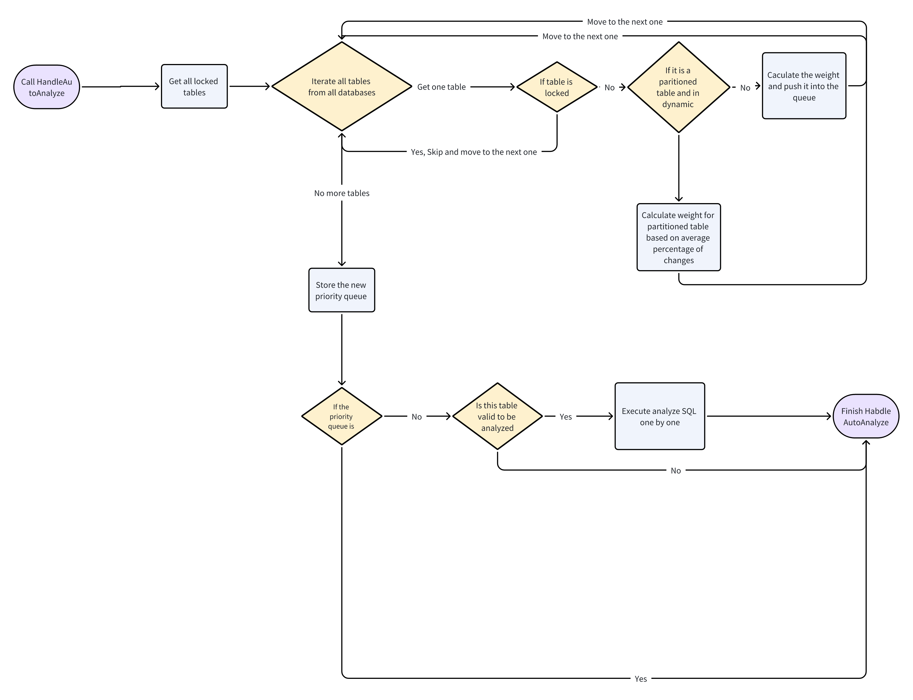

# Priority Queue for Auto Analyze

- Author(s): [Rustin Liu](http://github.com/hi-rustin)
- Discussion PR: <https://github.com/pingcap/tidb/pull/49018/>
- Tracking Issue: <https://github.com/pingcap/tidb/issues/50132>

## Table of Contents

- [Priority Queue for Auto Analyze](#priority-queue-for-auto-analyze)
  - [Table of Contents](#table-of-contents)
  - [Introduction](#introduction)
  - [Motivation or Background](#motivation-or-background)
  - [Detailed Design](#detailed-design)
    - [Partitioned Table](#partitioned-table)
    - [Failed analysis](#failed-analysis)
    - [Dataflow](#dataflow)
    - [Frequently Asked Questions](#frequently-asked-questions)
  - [Test Design](#test-design)
    - [Functional Tests](#functional-tests)
    - [Compatibility Tests](#compatibility-tests)
    - [Performance Tests](#performance-tests)
  - [Impacts \& Risks](#impacts--risks)
  - [Investigation \& Alternatives](#investigation--alternatives)
    - [CRDB](#crdb)
      - [Basic Idea](#basic-idea)
      - [Implementation Details](#implementation-details)
      - [Frequently Asked Questions](#frequently-asked-questions-1)
    - [MySQL](#mysql)
      - [Basic Idea](#basic-idea-1)
      - [Implementation Details](#implementation-details-1)
      - [Frequently Asked Questions](#frequently-asked-questions-2)
    - [SQL Server](#sql-server)
      - [Basic Idea](#basic-idea-2)
  - [Unresolved Questions](#unresolved-questions)

## Introduction

Auto analyze is a background job that automatically collects statistics for tables. This design proposes a priority queue for auto analyze to improve the efficiency of auto analyze.

## Motivation or Background

We have received numerous complaints in the past regarding the auto-analysis tasks. If users have many tables, we must assist them in analyzing the tables in the background to ensure up-to-date statistics are available for generating the best plan in the optimizer.
There are some complaints from users:

1. The automatic analysis retry mechanism has flaws.
   1. If one table analysis keeps failing, it will halt the entire auto-analysis process.
2. Automatic analysis may encounter starvation issues.
   1. The analysis of small tables is being delayed due to the analysis of some large tables.
3. Due to the random selection algorithm, some tables cannot be analyzed for a long time.

So we need to design a priority queue to solve these problems.

## Detailed Design

Before we design the priority queue, we need to know the current auto analyze process.

1. During the TiDB bootstrap process, we initiate the load and update of the stats worker. [session.go?L3470:15]
2. We spawn a dedicated worker to perform automated analysis tasks. [domain.go?L2457:19]
3. For every stats lease, we will trigger an auto-analysis check: [domain.go?L2469:17]
   > Please note that we only run it on the TiDB owner instance.
4. Check if we are currently within the allowed timeframe to perform the auto-analysis. [autoanalyze.go?L149:15]
5. To prevent the process from getting stuck on the same table's analysis failing, randomize the order of databases and tables. [autoanalyze.go?L155:5]
6. Try to execute the auto-analysis SQL. [autoanalyze.go?L243:6]
   1. **If the statistics are pseudo, it means they have not been loaded yet, so there is no need to analyze them.** [autoanalyze.go?L247:5]
   2. **If the table is too small, it may not be worth analyzing. We should focus on larger tables.** [autoanalyze.go?L247:5]
   3. **If the table has never been analyzed, we need to analyze it.** [autoanalyze.go?L287:6]
   4. **If the table reaches the autoAnalyzeRatio, we need to analyze it.** [autoanalyze.go?L287:6]
      > We use `modify_count/count` to calculate the ratio. [autoanalyze.go?L301:40]
   5. **If the indexes have no statistics, we need to analyze them anyway.** [autoanalyze.go?L262:15]

[session.go?L3470:15]: https://sourcegraph.com/github.com/hi-rustin/tidb@d4618d4a5f91ee3703336fd1ba328c2e477652e5/-/blob/pkg/session/session.go?L3470:15
[domain.go?L2457:19]: https://sourcegraph.com/github.com/hi-rustin/tidb@d4618d4a5f91ee3703336fd1ba328c2e477652e5/-/blob/pkg/domain/domain.go?L2457:19&popover=pinned
[domain.go?L2469:17]: https://sourcegraph.com/github.com/hi-rustin/tidb@d4618d4a5f91ee3703336fd1ba328c2e477652e5/-/blob/pkg/domain/domain.go?L2469:17&popover=pinned
[autoanalyze.go?L149:15]: https://sourcegraph.com/github.com/hi-rustin/tidb@d4618d4a5f91ee3703336fd1ba328c2e477652e5/-/blob/pkg/statistics/handle/autoanalyze/autoanalyze.go?L149:15&popover=pinned
[autoanalyze.go?L155:5]: https://sourcegraph.com/github.com/hi-rustin/tidb@d4618d4a5f91ee3703336fd1ba328c2e477652e5/-/blob/pkg/statistics/handle/autoanalyze/autoanalyze.go?L155:5&popover=pinned
[autoanalyze.go?L243:6]: https://sourcegraph.com/github.com/hi-rustin/tidb@d4618d4a5f91ee3703336fd1ba328c2e477652e5/-/blob/pkg/statistics/handle/autoanalyze/autoanalyze.go?L243:6&popover=pinned
[autoanalyze.go?L247:5]: https://sourcegraph.com/github.com/hi-rustin/tidb@d4618d4a5f91ee3703336fd1ba328c2e477652e5/-/blob/pkg/statistics/handle/autoanalyze/autoanalyze.go?L247:5&popover=pinned
[autoanalyze.go?L287:6]: https://sourcegraph.com/github.com/hi-rustin/tidb@d4618d4a5f91ee3703336fd1ba328c2e477652e5/-/blob/pkg/statistics/handle/autoanalyze/autoanalyze.go?L287:6&popover=pinned
[autoanalyze.go?L301:40]: https://sourcegraph.com/github.com/hi-rustin/tidb@d4618d4a5f91ee3703336fd1ba328c2e477652e5/-/blob/pkg/statistics/handle/autoanalyze/autoanalyze.go?L301:40&popover=pinned
[autoanalyze.go?L262:15]: https://sourcegraph.com/github.com/hi-rustin/tidb@d4618d4a5f91ee3703336fd1ba328c2e477652e5/-/blob/pkg/statistics/handle/autoanalyze/autoanalyze.go?L262:15&popover=pinned

The above process is the current auto analyze process. We can see that the current auto analyze process is a random selection algorithm. We need to design a priority queue to solve the above problems.

Since we perform analysis tasks synchronously on a single node for each table, we need to carry out weighted sorting on the tables that need analysis.

1. Only the total count of the table more than 1000 rows will be considered.
2. We still use tidb_auto_analyze_ratio to determine if the table needs to be analyzed. The default value is 0.5. It means that auto-analyze is triggered when greater than 50% of the rows in a table have been modified.
3. If a table is added to the auto-analysis queue, a weight must be assigned to it to determine the execution order.

The refresh time of the auto-analyze queue is not only determined by the frequency we set, but also depends on the execution time of the previous analysis task. Therefore, we can safely continue to use the old scheme of refreshing the queue every 3 seconds. This will only lead to excessive CPU consumption for auto-analyze checks when the entire cluster is idle, which is acceptable for us at the moment. In the future, we can completely solve this issue by updating the queue instead of rebuilding the entire queue.

Weight table:
| **Name**             | **Meaning**                                                                                                                                                                                   | **Weight**                                                                                                                                                                                                                                                           |
|----------------------|-----------------------------------------------------------------------------------------------------------------------------------------------------------------------------------------------|----------------------------------------------------------------------------------------------------------------------------------------------------------------------------------------------------------------------------------------------------------------------|
| Percentage of Change | The percentage of change since the last analysis. Note: For unanalyzed tables, we set the percentage of changes to 100%.                                                                      | log10(1 + Change Ratio). [Check the graph](https://www.desmos.com/calculator/gb3i2cropz).  **Note: For unanalyzed tables, we set the percentage of changes to 100%**                                                                                                                                                                                                                          |
| Table Size           | The size is equal to the number of rows multiplied by the number of columns in the table that are subject to analysis. The smaller tables should have a higher priority than the bigger ones. | Applying a logarithmic transformation, namely log10(1 + Table Size), and its 'penalty' is calculated as 1 - log10(1 + Table Size). [Check the graph.](https://www.desmos.com/calculator/x3fq76w8sb)                                                                                                                  |
| Analysis Interval    | Time since the last analysis execution for the table. The bigger interval should have a higher priority than the smaller interval.                                                            | Applying a logarithmic transformation, namely log10(1 + Analysis Interval). To further compress the rate of growth for larger values, we can consider taking the logarithmic square root of x'. The final formula is log10(1 + √Analysis Interval). [Check the graph.](https://www.desmos.com/calculator/plhtkfqhx9) |
| Special Event        | For example, the table has a new index but it hasn't been analyzed yet.                                                                                                                       | HasNewindexWithoutStats: 2                                                                                                                                                                                                                                           |

We need to design a formula that ensures the three variables (Change Ratio of the table, Size of the table, and the Time Interval since the last analysis) maintain specific proportions when calculating weights. Here is a basic idea:

- Table Change Ratio (Change Ratio): Accounts for 60%
- Table Size (Size): Accounts for 10%
- Analysis Interval (Analysis Interval): Accounts for 30%

The calculation formula is: priority_score = ($$0.6 \times \log_{10}(1 + \text{Change Ratio}) + 0.1 \times (1 - \log_{10}(1 + \text{Table Size})) + 0.3 \times \log_{10}(1 + \sqrt{\text{Analysis Interval}})$$ + special_event[event])
The calculation formula is: `priority_score = (change_percentage[size] * last_failed_time_weight[interval] * special_event[event])`

The ratio mentioned above is determined based on our current sample data. We need more tests to ascertain a more accurate ratio. Furthermore, we will expose these ratios as some configurations, as more precise control and adjustments may be necessary in different scenarios.

### Partitioned Table

For partitioned tables, if the pruning mode is static, then we don't need to merge the global statistics, so we can consider it as a normal table and calculate the weight for it.
But if the pruning mode is dynamic, then we need to get all the partitions that need to be analyzed and calculate the average percentage of changes, and consider it as a single item in the priority queue.

Pseudocode:

```go
function calculateAvgChangeForPartitions(partitionStats, defs, autoAnalyzeRatio):
    totalChangePercent = 0
    count = 0
    partitionNames = []

    for each def in defs:
        tblStats = partitionStats[def.ID]
        changePercent = calculateChangePercentage(tblStats, autoAnalyzeRatio)
        if changePercent is 0:
            continue

        totalChangePercent += changePercent
        append def.Name.O to partitionNames
        count += 1

    avgChange = totalChangePercent / count
    return avgChange, partitionNames

function calculateChangePercentage(tblStats, autoAnalyzeRatio):
    if tblStats.Pseudo or tblStats.RealtimeCount < AutoAnalyzeMinCnt:
        return 0

    if not TableAnalyzed(tblStats):
        return 1

    tblCnt = tblStats.RealtimeCount
    if histCnt = tblStats.GetAnalyzeRowCount() > 0:
        tblCnt = histCnt

    res = tblStats.ModifyCount / tblCnt
    if res > autoAnalyzeRatio:
        return res

    return 0
```

### Failed analysis

Sometimes we may encounter some problem when we analyze a table, we need to avoid analyzing the same table again and again. So after we select a table from the priority queue. We need to make sure that it is valid to be analyzed.
We check the interval between now and the last failed analysis ends time to determine if we need to analyze the selected table.

**The calculation rule is: if interval >=  2 * average automatic analysis interval then we thought it was a valid table to be analyzed. We only compute it after we get it from the priority queue, which would help us save a lot of resources. Because getting this information from TiKV is very expensive.**

Pseudocode:

```go
function IsValidToAnalyze(j):
    if j.Weight is 0:
        return false

    lastFailedAnalysisDuration, err1 = getLastFailedAnalysisDuration(j.DBName, j.TableName, "")
    if err1 is not nil:
        return false

    averageAnalysisDuration, err2 = getAverageAnalysisDuration(j.DBName, j.TableName, "")
    if err2 is not nil:
        return false

    // Failed analysis duration is less than 2 times the average analysis duration.
    // Skip this table to avoid too many failed analysis.
    if lastFailedAnalysisDuration < 2 * averageAnalysisDuration:
        return false

    return true
```

### Dataflow

Pick One Table From The Priority Queue (default: every 3s)



### Frequently Asked Questions

1. How many auto-analysis tasks can we run at the same time in the cluster?

   Only one. We only execute the auto-analysis background worker and task on the owner node.

2. What happens if we analyze the same table multiple times at the same time?

   It will use the most recent successful analysis result.

3. Why don't we simply separate the queues for large tables and small tables?

   Because currently in our entire cluster, only the owner node can submit tasks on its own instance. Even if we divide into two queues, we will still encounter situations of mutual blocking.
   Unless we can submit tasks for both large and small tables simultaneously on the owner node. But I'm afraid this would put additional pressure on that node.
   Additionally, we cannot simply determine what constitutes a large table and what constitutes a small table. Therefore, weighting based on the number of rows might be more reasonable.

4. How to get the last failed automatic analysis time?

   We can find the latest failed analysis from mysql.analyze_jobs. It has a fail_reason column.

5. How do we identify if a table has a new index?

   During the bootstrap process, we load statistics for both indexes and columns and store them in a cache. This cache allows us to identify if a table has a new index without statistics.

6. How do we ascertain if a table has never been analyzed?

   We utilize the cache to verify if there are no loaded statistics for any indexes or columns of a table. If the cache doesn't contain any statistics for a table, it indicates that the table has never been analyzed.

## Test Design

This feature requires a focus on both correctness and performance tests. The primary objective of the correctness tests is to validate the accuracy of priority calculations. Performance tests aim to ensure that the priority queue's operation doesn't negatively impact system performance.

### Functional Tests

These tests should cover all potential scenarios involving the priority queue. For instance, the priority queue should correctly handle situations such as:

1. A table that has never undergone analysis.
2. A table that has been analyzed, but its index lacks statistical data.
3. Multiple tables experiencing significant changes, requiring the priority queue to assign appropriate priorities.
4. A single table undergoing substantial changes, but analysis fails. In this case, the priority queue should assign the correct priority based on the last failed interval.
5. Mix of the above scenarios.

### Compatibility Tests

This feature is designed to seamlessly integrate with all existing functionalities, ensuring that the introduction of the priority queue does not compromise the accuracy of the auto-analyze process.

To provide users with control, we will introduce a new system variable that allows the enabling or disabling of the priority queue. By default, this feature will be set to `OFF`.

Following extensive testing and validation, we may consider setting the priority queue as the default option in future iterations.

### Performance Tests

Calculating the priority score for each table should not negatively impact the system's performance. We will perform extensive testing to ensure that the priority queue does not introduce any performance issues.

## Impacts & Risks

After the priority queue is enabled, the auto analyze process will be changed from random selection to weighted sorting. From the perspective of the user, the auto analyze process will be more reasonable.

## Investigation & Alternatives

### CRDB

#### Basic Idea

Statistics are refreshed in the following cases:

- When there are no statistics.
- When it has been a long time since the last refresh, where "long time" is based on a moving average of the time across the last several refreshes.
- After a successful `IMPORT` or `RESTORE` into the table.
- After any schema change affecting the table.
- After each mutation operation (`INSERT`, `UPDATE`, or `DELETE`), the probability of a refresh is calculated using a formula that takes the cluster settings shown in the following table as inputs. These settings define the target number of rows in a table that must be stale before statistics on that table are refreshed. Increasing either setting will reduce the frequency of refreshes. In particular, `min_stale_rows` impacts the frequency of refreshes for small tables, while `fraction_stale_rows` has more of an impact on larger tables.

| Setting                                              | Default Value | Details                                                                               |
|------------------------------------------------------|---------------|---------------------------------------------------------------------------------------|
| `sql.stats.automatic_collection.fraction_stale_rows` | 0.2           | Target fraction of stale rows per table that will trigger a statistics refresh.       |
| `sql.stats.automatic_collection.min_stale_rows`      | 500           | Target minimum number of stale rows per table that will trigger a statistics refresh. |

You can configure automatic statistics collection on a per-table basis.

#### Implementation Details

1. Each server will create a refresher to refresh the stats periodically. [server_sql.go?L1126:2]
2. The refresher spawns a goroutine to try to trigger a refresh every minute. [automatic_stats.go?L438:11]
3. Refreshers use a map to store all mutation counts and use it as affected rows to try to trigger a refresh. [automatic_stats.go?L518:10]
4. `maybeRefreshStats` implements core logic.
   1. Use the average full refresh time to check if too much time has passed since the last refresh. [automatic_stats.go?L817:3]
   2. Use `statsFractionStaleRows` and `statsMinStaleRows` to calculate target rows: `targetRows := int64(rowCount*statsFractionStaleRows) + statsMinStaleRows`
   3. Generate a non-negative pseudo-random number in the half-open interval `[0,targetRows)` to check if it needs to trigger a refresh. [automatic_stats.go?L836:6]
   4. Try to refresh the table. This function will execute SQL through the CRDB job framework: `CREATE STATISTICS %s FROM [%d] WITH OPTIONS THROTTLING %% AS OF SYSTEM TIME '-%s'` [automatic_stats.go?L843:14]
   5. If it meets `ConcurrentCreateStatsError`
      1. If it must be refreshed, then set the `rowsAffected` to 0, so that we don't force a refresh if another node has already done it.
      2. If it is not a must-be-refreshed table, we ensure that the refresh is triggered during the next cycle by passing a very large number(`math.MaxInt32`) to the `rowsAffected`.
5. Clean up old mutation counts. [automatic_stats.go?L540:7]

[server_sql.go?L1126:2]: https://sourcegraph.com/github.com/cockroachdb/cockroach@6d7d8415f112fc478779bf2868be2385237030da/-/blob/pkg/server/server_sql.go?L1126:2&popover=pinned
[automatic_stats.go?L438:11]: https://sourcegraph.com/github.com/cockroachdb/cockroach@6d7d8415f112fc478779bf2868be2385237030da/-/blob/pkg/sql/stats/automatic_stats.go?L438:11&popover=pinned
[automatic_stats.go?L518:10]: https://sourcegraph.com/github.com/cockroachdb/cockroach@6d7d8415f112fc478779bf2868be2385237030da/-/blob/pkg/sql/stats/automatic_stats.go?L518:10&popover=pinned
[automatic_stats.go?L817:3]: https://sourcegraph.com/github.com/cockroachdb/cockroach@6d7d8415f112fc478779bf2868be2385237030da/-/blob/pkg/sql/stats/automatic_stats.go?L817:3&popover=pinned
[automatic_stats.go?L836:6]: https://sourcegraph.com/github.com/cockroachdb/cockroach@6d7d8415f112fc478779bf2868be2385237030da/-/blob/pkg/sql/stats/automatic_stats.go?L836:6&popover=pinned
[automatic_stats.go?L843:14]: https://sourcegraph.com/github.com/cockroachdb/cockroach@6d7d8415f112fc478779bf2868be2385237030da/-/blob/pkg/sql/stats/automatic_stats.go?L843:14&popover=pinned
[automatic_stats.go?L540:7]: https://sourcegraph.com/github.com/cockroachdb/cockroach@6d7d8415f112fc478779bf2868be2385237030da/-/blob/pkg/sql/stats/automatic_stats.go?L540:7&popover=pinned

#### Frequently Asked Questions

1. Who can send the mutation count to the refresher?

   `NotifyMutation` is called by SQL mutation operations to signal the Refresher that a table has been mutated. Method [NotifyMutation (automatic_stats.go?L729:21)](https://sourcegraph.com/github.com/cockroachdb/cockroach@6d7d8415f112fc478779bf2868be2385237030da/-/blob/pkg/sql/stats/automatic_stats.go?L727:21&popover=pinned)

2. How do they determine the analyzing conflicts?

   They store all the analysis jobs in their database.
   So they can check whether there are any other CreateStats jobs in the pending, running, or paused status that started earlier than this one.

3. Which node will execute the analysis job?

   Because CRDB has a scheduled job framework, it depends on the executor and scheduler.

   For an auto-analysis job, it has an inline executor, it simply executes the job's SQL in a txn. Method [ExecuteJob (executor_impl.go?L40:38)](https://sourcegraph.com/github.com/cockroachdb/cockroach@6d7d8415f112fc478779bf2868be2385237030da/-/blob/pkg/jobs/executor_impl.go?L40:38&popover=pinned)

   The scheduler logic: In short, each node will start a scheduled job execution daemon to attempt to retrieve an executable task from the job queue for execution. Each node has a maximum number of runnable tasks.

### MySQL

#### Basic Idea

The [innodb_stats_auto_recalc](https://dev.mysql.com/doc/refman/8.0/en/innodb-parameters.html#sysvar_innodb_stats_auto_recalc) variable, which is enabled by default, controls whether statistics are calculated automatically when a table undergoes changes to more than 10% of its rows. You can also configure automatic statistics recalculation for individual tables by specifying the `STATS_AUTO_RECALC` clause when creating or altering a table.

#### Implementation Details

1. It uses a `recalc_pool` to store tables that need to be processed by background statistics gathering. [dict0stats_bg.cc?L87:23]
2. Call `row_update_statistics_if_needed` when updating data. [row0mysql.cc?L1101:20]
   1. It uses `stat_modified_counter` to indicate how many rows have been modified since the last stats recalc. When a row is inserted, updated, or deleted, it adds to this number.
   2. If `counter` > `n_rows` / 10 (10%), then it pushes the table into the `recalc_pool`. [row0mysql.cc?L1119:9]
   3. Call `dict_stats_recalc_pool_add` to add a table into `recalc_pool`. [dict0stats_bg.cc?L117:6]
3. A thread named `dict_stats_thread` is created to collect statistics in the background. [dict0stats_bg.cc?L355:6]
4. The stats thread is notified by `dict_stats_event`, it is set by `dict_stats_recalc_pool_add`. [dict0stats_bg.cc?L137:16]
5. It also wakes up periodically even if not signaled. [dict0stats_bg.cc?L365:5]
6. After it is notified, it calls `dict_stats_process_entry_from_recalc_pool` to get a table from the pool to recalculate the stats. [dict0stats_bg.cc?L261:13]
   1. If there are a lot of small hot tables, it puts them back and picks another one in the next round.

[dict0stats_bg.cc?L87:23]: https://sourcegraph.com/github.com/mysql/mysql-server@87307d4ddd88405117e3f1e51323836d57ab1f57/-/blob/storage/innobase/dict/dict0stats_bg.cc?L87:23&popover=pinned
[row0mysql.cc?L1101:20]: https://sourcegraph.com/github.com/mysql/mysql-server@87307d4ddd88405117e3f1e51323836d57ab1f57/-/blob/storage/innobase/row/row0mysql.cc?L1101:20&popover=pinned
[row0mysql.cc?L1119:9]: https://sourcegraph.com/github.com/mysql/mysql-server@87307d4ddd88405117e3f1e51323836d57ab1f57/-/blob/storage/innobase/row/row0mysql.cc?L1119:9&popover=pinned
[dict0stats_bg.cc?L117:6]: https://sourcegraph.com/github.com/mysql/mysql-server@87307d4ddd88405117e3f1e51323836d57ab1f57/-/blob/storage/innobase/dict/dict0stats_bg.cc?L117:6&popover=pinned
[dict0stats_bg.cc?L355:6]: https://sourcegraph.com/github.com/mysql/mysql-server@87307d4ddd88405117e3f1e51323836d57ab1f57/-/blob/storage/innobase/dict/dict0stats_bg.cc?L355:6&popover=pinned
[dict0stats_bg.cc?L137:16]: https://sourcegraph.com/github.com/mysql/mysql-server@87307d4ddd88405117e3f1e51323836d57ab1f57/-/blob/storage/innobase/dict/dict0stats_bg.cc?L137:16&popover=pinned
[dict0stats_bg.cc?L365:5]: https://sourcegraph.com/github.com/mysql/mysql-server@87307d4ddd88405117e3f1e51323836d57ab1f57/-/blob/storage/innobase/dict/dict0stats_bg.cc?L365:5&popover=pinned
[dict0stats_bg.cc?L261:13]: https://sourcegraph.com/github.com/mysql/mysql-server@87307d4ddd88405117e3f1e51323836d57ab1f57/-/blob/storage/innobase/dict/dict0stats_bg.cc?L261:13&popover=pinned

#### Frequently Asked Questions

1. How many auto-analysis tasks can we run at the same time on the server?

   It only uses one stats thread, picking one table to run each time.

### SQL Server

#### Basic Idea

When the automatic update statistics option, [AUTO_UPDATE_STATISTICS](https://learn.microsoft.com/en-us/sql/t-sql/statements/alter-database-transact-sql-set-options?view=sql-server-ver16#auto_update_statistics) is ON, the Query Optimizer determines when statistics might be out-of-date and then updates them when they are used by a query.

Starting with SQL Server 2016 (13.x) and under the database compatibility level 130, the Database Engine also uses a decreasing, dynamic statistics recompilation threshold that adjusts according to the table cardinality at the time statistics were evaluated.

| Table type             | Table cardinality (n) | Recompilation threshold (# modifications) |
|------------------------|-----------------------|-------------------------------------------|
| Temporary              | n < 6                 | 6                                         |
| Temporary              | 6 <= n <= 500         | 500                                       |
| Permanent              | n <= 500              | 500                                       |
| Temporary or permanent | n > 500               | MIN (500 + (0.20 *n), SQRT(1,000* n))     |

For example, if your table contains 2 million rows, then the calculation is the minimum of `500 + (0.20 * 2,000,000) = 400,500` and `SQRT(1,000 * 2,000,000) = 44,721`. This means the statistics will be updated every 44,721 modifications.

## Unresolved Questions

1. After adopting a time interval as the indicator, will it prevent us from implementing a strategy of updating the queue instead of rebuilding the entire queue in the future? Because after each change, we need to recalculate the time interval for all tables to determine their priority.

   Perhaps we can tolerate a temporary delay, for example, by updating the entire queue only after encountering 100 updates.
