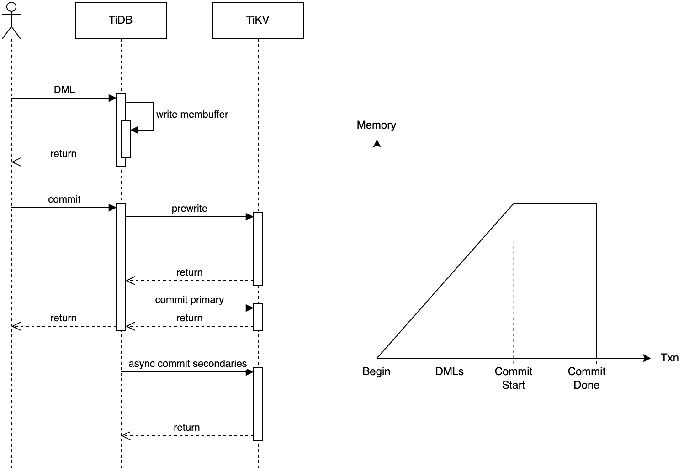
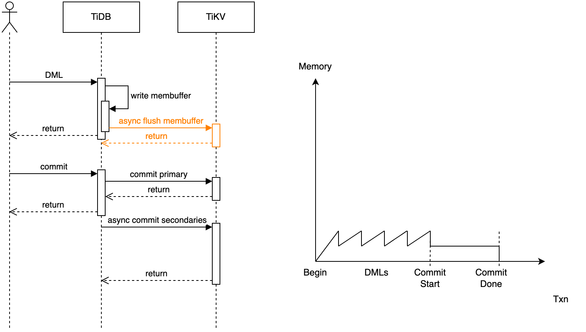
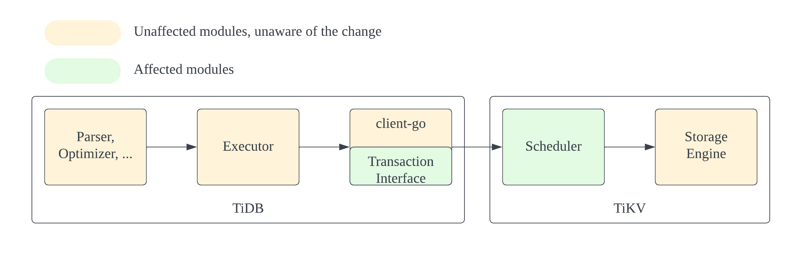
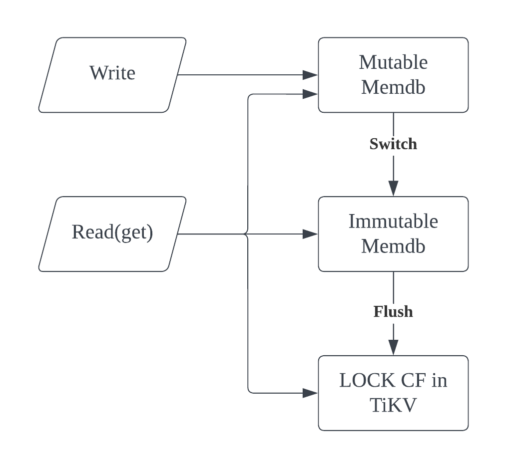
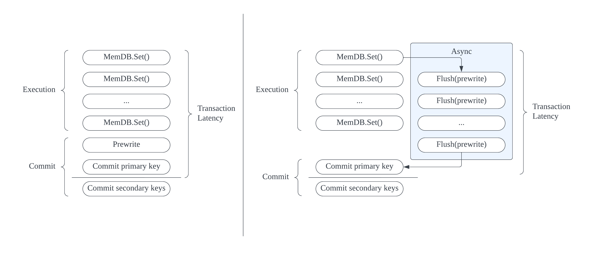

# Pipelined DML

Authors: @ekexium, @you06

Tracking issue: https://github.com/pingcap/tidb/issues/50215

In the context of this document, we assume that the users are primarily from TiDB. However, it is also applicable to pure TiKV users.

## Background

### Introduction

The 2PC protocol of TiDB buffers all writes of a transaction in TiDB memory before committing. A large transaction can easily cause OOM. In bulk data processing, it's common to have a single statement processing millions of lines, which cannot be satisfied by normal transactions. We had developed features to work around this: the deprecated unsafe batch-dml and non-transactional DML for such scenarios. However, they are either unsafe or have too many constraints to satisfy all users.

The doc proposes a refinement of the original 2PC protocol, called Pipelined DML, introducing a new mode of transaction. Writes of a transaction are continuously flushed to TiKV, rather than buffered in memory until commit. This approach allows the size of TiDB transactions to be largely unrestricted by memory limitations. By asynchronously flushing the buffer, the execution phase and the prewrite phase form a pipeline, thus decreasing transaction latencies.

This design presents a large transaction solution that effectively removes size limitations while significantly enhancing execution speed.

- Vanilla TiDB



- Large transaction Overview



**Terms Used**

Execution phase: The opertions in parser, planner, executor, including those writing to Membuffer.

Batch: The content in the immutable MemDB is defined as a 'batch.' Each call to flush() creates a new batch.

MemDB: a special data structure based on red-black tree and value logs in TiDB. Currently all mutations of a transaction are buffered in its MemDB before committing.

SPK: Sub-primary key. A special type of key used for large transactions. Its value contains many secondary keys. It helps track all secondary keys belonging to a transaction.

### Current State and Context

For normal transactions, mutations are buffered in memory before committing. Larger transactions consume a larger volume of memory. There are 2 mechanisms that limit transaction sizes to avoid OOM.

- A config item that controls the txn size `txn-total-size-limit`. If it is set to other values than its default `100MB`, it takes control. It limits the total size of keys and values of a memdb to be smaller than this value. Note the actual memory usage must be greater than the size due to various amplification.
- If `txn-total-size-limit` is set to its default value, this setting is ignored and the memory tracker takes control. The mem tracker controls the memory used by the session, with a limit set by the system variable `tidb_mem_quota_query`.

To bypass the limit, there was a batch-dml feature. It has been deprecated and not suggested for use because it is unsafe and highly prone to corrupt data. It splits a statement into multiple transactions and commit them. It is enabled and controlled by system variables `tidb_enable_batch_dml`, `tidb_batch_dml_insert`, `tidb_batch_dml_delete`, `tidb_dml_batch_size`.

To provide a safe method for splitting transactions for a statement, we developed [non-transactional DML](https://docs.pingcap.com/tidb/dev/non-transactional-dml). It essentially acts like a user script, splitting a single statement into multiple statements for execution, rather than splitting the transaction itself. It's free from data corruption. However, the complexity of splitting and concatenating SQL statements imposes many constraints on this feature.

The need for large transactions remains.

### Motivation for Change

TiDB cannot support super large transactions (> tens of GBs) due to its design, which stores the KV mutations in its memory before committing. There are two drawbacks:

- The transaction fails when memory is not sufficient. This is usual when doing ETL work.
- There is an increasing performance penalty as mem buffer grows huge, e.g. the essential O(NlogN) time complexity in the red-black tree implementation of mem buffer.

Some users suffer from the above drawbacks.

## Requirements

### Technical

- Transaction integrity - ACID
- No or few limits on syntax
- Transaction size can be 500+ GB
- Write performance: 14k+ row/s for general workload (from FRM-676)
- Compatible with existing features

Non-requirements for current state:

- Some features depending on the Staging API of membuffer are not supported
  - Multi statement transaction
  - Transaction savepoint

## Proposed Solution

We've brainstormed and discussed various options. By evaluating the pros and cons, we were able to eliminate most of them.

There are two designs worth consideration. They have much in common and can be discussed together. Both designs periodically flush the content of mem buffer to TiKV via Flush(Prewrite) requests. A read(get) request should read from both membuffer and TiKV. When committing, the prewrite phase is no longer needed once all content of the membuffer are flushed.

Their differences are marked in different colors. The two solutions vary fundamentally in their approach to committing:

- Design A: Commit by scanning keyspace. This is a passive way to find keys belonging to the transaction.
- Design B: Commit by tracking secondary keys in a tree, like [lock secondaries](https://github.com/tikv/tikv/blob/ca8c70d9a0ca499007a8457c9d77cdfb958823e2/components/txn_types/src/lock.rs#L84) in async commit transactions. This is a active way to specify keys belonging to a transaction.

### Experimental and POC Validation

We conducted a series of experiments to verify the feasibility of the proposed design.

General result of experiments:

|                              | Memory(RES) | Duration of Vanilla TiDB | Duration of This Proposal | Diff in Duration |
| ---------------------------- | ----------- | ------------------------ | ------------------------- | ---------------- |
| Sysbench10m rows             | 6.64GB      | 3m36s                    | 2m10s                     | -40%             |
| SysbenchNonclustered10m rows | 8.73GB      | 5m1s                     | 3m47s                     | -25%             |

Note: * marks the calculation value(cannot test due to the environment limitation). 

Experiments show that the proposed solution has

- Acceptable performance
  - TiDB Memory
    - In the document, we have presented two slightly different solutions. Each of these solutions can reduce the **membuffer's memory consumption to as low as 1%** in the case of large transactions, thereby allowing users to execute statements that involve hundreds of gigabytes.
  - Transaction latency
    - The solutions create a pipeline connecting the execution and prewrite phases, making it possible to reduce whole transaction latency. Note the batch size and the number of regions involved in a batch can greatly impact performance.
- Enough user-friendliness
  - It only applies to auto-commit statement, satisfying current user needs.
  - It does not have extra requirements for deployments. All existing users can benefit from it
  - There are no constraints on SQL syntax.
- Acceptable code complexity 
  - Only the transaction protocol, namely client-go and the scheduler layer in TiKV are changed.
  - The feature is transparent to upper layer execution and lower layer storage engine.

### UI Changes

We need a variable to control the feature and the flush concurrency, name it `tidb_xx_concurrency` now.

- `tidb_xx_concurrency == 0`, feature off.
- `tidb_xx_concurrency > 0`, feature on.
- Support `SET_VAR` hint.

### Code Changes

#### Scope

The proposed solution only affects the tikv client and the scheduler part of TiKV, plus necessary controlling code in TiDB. The enhanecment shall be transparent to upper layers like optimizers and executors, and lower storage layers.



A user(TiDB, in this context) of the transaction interface provided by client-go, shall be able to switch to the large transaction mode without changes, except when it's using the staging API which is discussed in Unresolved Questions below.

#### Data Structure Changes

##### MemDB Replacement

To eliminate the memory limitation, we cannot let memdb hold all mutations. KV mutations are written into stores in the same way as prewrite records, thus atomicity is guaranteed by the transaction protocol.

Because large transactions and common transactions share the same code for execution, to avoid too much modification of the TiDB code, we choose to modify the memdb.

We need to provide a wrapper for the current memdb.

- There are **2** memdbs in the pool. One is mutable, the other is immutable
- Once the mutable memdb satisfies the flush condition and the immutable memdb has finished its flush, drop the immutable memdb, swtich the mutable memdb to immutable, and create a new mutable memdb.
- The write process will be blocked when mutable memdb becomes too large and cannot flush. This could happen when flush is slow.
- Writes only go to the mutable memdb. The diagram shows it clearly.



We can mitigate the performance degeneration caused by O(NlogN) complexity of memdb.

At any moment we allow at most 1 memdb to be in the process of flushing. Consider the following operation sequence. It may not be a TiDB case, but we don't want to add more dependency on how TiDB uses it. The final result is expected to be `(x, 2)`. But if there are multiple memdbs flushing concurrently, the handling of the mutations may be totally reversed(`put(x, 2) -> del(x) -> put(x, 1)`) . The final result becoms `(x, 1)`.

```Prolog
put(x, 1)
del(x)
put(x, 2)
```

To avoid this anomaly, we should avoid multiple requests writing a key in parallel. Since we limit only 1 memdb can be flushing in the same time.

##### Guranteeing linerizability

Eliminating concurrent flushing is not enough. Consider such an operation sequence

```Plain
write(x, 1)
flush (retry happened)
TiKV write (x, 1)
clientReceiveResponse (x, 1)
write(x, 2)
flush
TiKV write (x, 2)
clientReceiveResponse (x, 2)
retrying request (x, 1) arrived late
TiKV write (x, 1)
```

The final result in TiKV becomes (x, 1), while we expect (x, 2).

To make the system linearizable, we attach a self-increasing number to each flush. We call it the `generation`. Each prewrite request in a flush carries a generation to TiKV. Locks in LOCK CF store the generation and update them when lock value is updated. Prewrite request checks the generations. Those requests that must have been stale are rejected. A [Quint spec](https://github.com/pingcap/tla-plus/blob/9625b0c9d7c3325569b7adf0d85376f7dc7e5874/LargeTransaction/memdb.qnt) verifies the design.

##### Tracking secondary keys in locks

There are 3 types of keys in a transaction

- Primary key. It is stored in client memory. Chosen in the same way as before.
- Sub-primary key (SPK). The keys are stored in client memory. The key follows the `spk_<start_ts>_<spk_id>` format. It is a representative of a group of secondary keys. The secondary keys in the group are encoded in its value.
- Secondary keys. They can only stay in memory temporarily. Once a flush finishes, those keys and values that have been persisted in TiKV are dropped from client memory.

Memory usage is then reduced to a fraction of its original, down to one in several thousandths.

#### Transaction Protocol Changes

The diagram shows their overall difference in process between normal transactions and our proposed large transactions.



##### Adapting the Staging Interface

The staging interface is tightly coupled with the implementation of MemDB.

- Option 1: implement the compatible staging interface in large transactions
- Option 2: workaround its usage
  - Rollback `AddRecord/UpdateRecord/DeleteRecord/updateRecord`
    - Fail the stmt(txn) if any error occurs
  - Statement buffer
    - Only allow single statement large transactions. 
  - Statement snapshot of MemDB, which returns the oldest stage(the snapshot when current statement begins)
    - For Membuffer, let `Iter()` always returns an empty iterator.
    - For TiKV, a txn won't read content from locks it writes.

We choose option 2 for its simplicity and more predictable delivery.

##### Write

The interface remains unchanged. Users of the new mem buffer see no difference between normal and large transactions.

After every write opertion to memdb, trigger a check to start flush. The check condition can be based on the number of keys in current memdb, or the current total size of memdb.

If the mutable memdb becomes too large and the last flush has not finished, the write is blocked until the last flush finishes.

In addition to values, write operations can write flags. Flags are stored in memdbs, but not in TiKV. These flags usually control key-specific behavior. In large transactions, flags are handled differently. 

- Some flags that used to work in prewrite requests now work in flush requests, such as `PresumeKNE`, `AssertExist`,`AssertNotExist`. 
- Some flags just won't appear in large transactions, such as `KeyLocked`and `NeedConstraintCheckInPrewrite`. 
- The others are handled case by case.

##### Flush

```plain
if there is no ongoing flush {
    mark current active mutable memdb as immutable
    go withRetry(flush(immutable memdb)())
    new a memdb as current active mutable memdb (or reuse the other one)
}
```

Divide the batch into several groups. For each group, make a new entry with key = `spk_<start_ts(fixed length)>_<spk_id>` and value = `encode(keys in the group)`

Store the key (without its value) in memory. We call it a SPK (sub-primary key). Flush it together with the group.

A group can not be unrestrictedly large as the value of SPK must contain all keys in the group.

- Where to put the SPKs?
  - In a special key range (**this is our proposed method**, all SPKs start with fixed prefix `"spk_"`)
    - Doesn't affect other meaningful data of TiDB
    - This might introduce assumption to client-go about key ranges possibly used by TiDB. This pattern can be avoided by either:
      - Letting TiDB tell client-go what range/prefix can be used for storing SPKs; or
      - Letting client-go reserve some special key ranges and reject users of client-go to access them, so do TiKV clients in other languages (also mentioned below for handling the issue about SPK conflicting with user key).
    - In case there are too may large transactions (unlikely to happen though), the "spk" range might become a hotspot
  - An alternative: Near the primary
    - It should be ignored when normal reading is performed on the key. By adding a new mutation type `TxnMeta` (in addition to `Put`, `Delete`, `Lock`, `Rollback`), or just reusing the `Lock` mutation type, we can make it transparent to normal transaction reads. 
    - When a transaction has too many SPKs, another transaction who is scanning near the range may be slowed down when skipping these keys.
    - If we are going to implement the transaction anchor key in the future, some of the mechanisms can be reused.
    - Needs consideration about avoiding being conflicted with user keys, even if we don't consider pure-kv uses for now.

##### Read

For `Get(key)` and `BatchGet(keys)`, read in the following order. Resort to the next tier only if the key cannot be found in the previous tiers.

Mutable memdb -> immutable memdb -> TiKV

For Iterator and Scan, similar to the existing UnionIter, a 3-tier UnionIter is used. 

Mutable memdb -> immutable memdb -> TiKV

**Statement** **snapshot**: A statement shall not read its own mutations using Iterator. Get() can read its own mutations.

For single statement transaction, simply returns an empty iter for `Iter`-like interface. Mutations that have been flushed to TiKV exist in locks, which will not be read by the txn itself during execution.

##### Commit

In commit phase, we need to switch the prewrite record into readable commit record, the key here is how to find out all keys that need to be committed.

The ideal way is to let each store scan the locks located in it and commit them, but it's complex to deal it with Raft leader transfer, e.g. the region not scanned yet is moved to another store, in which it's located in the scanned key space, then it'll be missed. Though missing commit of secondaries does not affect correctness, the cost of resolve lock is unacceptable. So it's better to commit by regions.

The client will record the lower and upper bounds of all keys in the prewrite phase. In commit phase, TiDB will iterate over the related regions, and commit the regions with concurrency limited by store.

It may reuse the **resolve-lock** command. When the batch size reaches the limit(256 keys or size of 32K), it stops scanning locks, do the async write, and spawn a new task waiting to be executed next round.

The client 

```plain
for remaining secondary keys in membuffer, make a group and flush. Wait until flush finishes.
prewrite(update) PK, and get minCommitTS in PK
get commit ts
commit PK
// txn is considered committed now
for all SPK in membuffer,
    commit SPK to TiKV
    get SKs in this group, commit them
```

##### Concurrency Control

In typical scenarios that require large transactions, we anticipate minimal contention. Consequently, large transactions adopt an extended optimistic transaction model, which avoids pessimistic locks and performs existence checks during the prewrite phase.

###### Key Existence Check (Conflict Detection)

The unique checking should follow the lazy-check-key-not-exist strategy as in optimistic transactions to reduce latency during executing. The lazy check setting is required to be true.

With this strategy, when writing rows, only memdb is checked, the rest unique checking will be done in the flush request in TiKV. Once a flush request returns a duplicated key error, the statement should be aborted.

###### LockKeys()

LockKeys is forbidden, as a large transaction uses optimistic concurrency control.

###### TTL/Heartbeat

A large transaction will execute for a long time, so we must keep renewing the TTL of the primary key since the first mutation is written into the store.

##### Crash Recovery

###### Resolve locks

After checking transaction status from PK, TiDB will resolve locks for the region. If the coordinator is down, the rest locks will be handled by GC.

A variant worth consideration is to select another special key as PK, or utilize the `secondaries` field that was for async commit, and let PK track all SPKs. In this way, we will be able to find all keys of a transaction from any one of the keys. ResolveLocks can then proactively resolve all locks the transaction left. We leave this as a potential optimization rather than a mandatory requirement in our initial version.

A large transaction can leave so many unresolved locks. Fortunately we have [Transaction Status Cache](https://github.com/tikv/tikv/pull/15749). It caches the status of some transactions. Once a lock belonging to a large transaction is checked once, following read requests that meet other locks in the same TiKV can quickly ignore the lock by checking the transaction status cache.

##### GC

GC will block until the large transaction is done.

SPKs need to be GCed some time after the large transaction finishes, whether it is committed or rolled back. After resolving locks, the GC worker could safely scan the range to find useless SPKs `[spk_, spk_<safepoint(fixed length)>)` and delete them.

Alternative: Instead of exposing the transaction implementation detail (the SPKs) to the upper level GC worker, we can add a new mutation type that can be safely deleted in GC, or simply store the value in a new field in LOCK type and supports reading it. However it introduces extra complexity in implementation.

##### Conflict Resolution

**Large-write x normal-write**

Whoever acquires the lock (in LOCK CF or in-memory pessimistic lock) wins. The other gets a `KeyIsLocked` error as usual. If a flush meets a `KeyIslocked`, it backs off and retries.

**Large-write x large-write**

Same as large-write x normal-write. This is a bad practice to have multiple large transactions that can conflict with each other running in parallel.

**Large-write x read**

A read request meets a lock written by the large txn. 

- read_ts < start_ts of the large txn, ignore lock
- read_ts >= start_ts of the large txn. Similar to old large transactions, it calls `check_txn_status` on the PK, trying to push its `min_commit_ts` so that `min_commit_ts` > `read_ts` of the read request. If `min_commit_ts` is successfully pushed, the read request can ignore the lock.
  - If `min_commit_ts` is continuously pushed, the large txn may have difficuly in committing. It is also bad practice to have read-write conflict.

**Large-read x normal write**

Same as normal read

### Compatibility / Interface Changes

- Backward compatibility
  - Backward compatible for sure
- Compatibility with other modules/features
  - **CDC: incompatible in stage 1. But it's feasible to fix it later.**
    - OOM risk. Current CDC matches the prewrite and commit records of a key in memory. The matcher in cdc/kv/matcher.go can be modified to disk-based.
    - Resolved-ts can be blocked. CDC strongly depends on the order of commit ts and a global watermark. Currently, CDC choose the watermark by resolved ts. The prewrite lock of large transaction may block the resolved ts for hours. Generally, the current resolved-ts maintaince suffers from long transaction blocking, and large transactions enlarge the impact of it. One of the most intuitive ideas is to utilize `min_commit_ts` to maintain `resolved_ts` instead of`start_ts`. There have been discussions to free CDC from being blocked by long transactions.
    - Multiple flush(prewrite) records observed by CDC. CDC considers the prewrite record as the final result of the transaction. This convention will be broken in large transactions because a key can be flushed for multiple times. We can make sure that CDC only uses the last flushed record as its prewrite record to make it work.
      - TBD: CDC can split transactions. Is it problematic when it can observe multiple prewrites?
  - **Binlog: incompatible.**
    -   The transaction's mutations are written into pump server in 2 phases commit process, thus **the memory limitation of pump server will be problem**. Large transactions must be disabled when binlog is enabled.
  - **Stale read: currently impair the advance of safe-ts.**
    -   The safe ts is also inferred from the resolved ts, so large transactions may block the safe ts advance, thus leads to **data-is-not-ready retry of stale read** for regions involved in the large transaction. The applied ts solution can solve this issue.
  - **BR: compatible, but requires a small improvement**
    -   BR will retry when there is a lock. That means, **large transactions** **will block BR until it commit all keys**, which may last for hours. To avoid waiting in BR, primary lock's min-commit-ts need to be pushed and the locks of large transactions can be bypassed.
  - **Flashback: compatible**
    -   Flashback will kill the ongoing connections, and the left prewrite locks should be cleaned up by the flashback statement.
  - MVCC get (debug interface) .. Little modification needed
  - RC isolation level: forbidden. We assume large txn runs in SI, though there should be no difference for single-stmt txns.
  - Key space. Keys with prefix "spk_" are occupied and cannot be used elsewhere. It also stops pure TiKV users from using the key range.
    - Option 1: From the next version of TiKV, we officially mark a key range as preserved, e.g. "__tikv_internal". Users are not allowed to access keys in this range. It solves the issue of user-key conflicts forever, not only for this project. But it might break backward compatibility for pure TiKV users.
    - Option 2: Add additional flag to the key, between the memcomparable-encoded user key and the timestamps. Currently the keys in rocksdb is like: `{encode(user_key)}{ts}`. If we allow some keys to be `{encode(user_key)}{additional_suffixes}{ts}`, where the `additional_suffixes` can be a mark that tells that the key is an SPK for some transaction, it then can be distinguished with any other data keys. This sounds simple. However, it would be a breaking change to the `Key` type in TiKV and any other related stuff. Also it's hard to tell how high the risk would be for other components (such as TiFlash, brie tools, etc.).
    - Option 3: when beginning a large transaction, we explicitly require the user to provide the prefix. For TiDB it's always "spk_". Pure TiKV users are responsible for providing a prefix that their user keys will never use.
  - Async commit / 1PC. Disable them for large transactions.

### Resource Control

There are some requirements for large transactions:

- The concurrency in one store should not be too large.
- The Raft entry cannot be too large.
- Should not impact the TP workflow.

We control concurrency, batch size and priority of flush and commit tasks for flow control.

If resource control is enabled in TiKV, there is a priority based scheduler pool with 3 priorities(high/normal/low). Large transactions can set the default priority to low to reduce the impact of other queries. If there is a resource control group, large transaction also inherit the resource limitation set by the group.

### Future optimizations

- Better resolve lock
  - Might utilize transaction cache
  - Let PK track all SPKs.
- Multi stmt transaction
- Performance
  - When TiDB node has a performant disk available, we can consider modifying memdb to be a disk-based buffer. The other parts of the transaction protocol do not change. We didn't choose this as our first solution because it requires extra deployment, while we would like to have a solution that is generally available for every user in need. Instead, we leave it as a potential optimization that's worth consideration. There are several ways that we can utilize disks in TiDB:
    - Option 1: store all mutations in TiDB locally. It does not allow the pipeline optimization. 
    - Option 2: store only secondary keys (without values) in TiDB locally. When committing, TiDB finds secondary keys from local disk instead of scan TiKV or use PSKs.
  - For single-stmt transactions, staging is unnecessary. If we can sacrifice staging interface, a more optimized buffer can replace current memdb.
  - Read-write conflict. We can also cache `min_commit_ts` in transaction cache. When read requests are frequent, it can save a lot check_txn_status requests.
  - Ranges to scan can be distinguished by indexes, reducing unnecessary scans. However it introduces the concept of index in client-go.
- Dependency on underlying storage engine. Any blocker to switch to other storage engines?

## Test Design

### Acceptance Tests

Run large transactions of sizes from 10 GB to 500 GB. The memory usage of client(TiDB) should be lower than 1% of the transaction size. The latency should be lower than or comparable to vanilla version.

### Scenario Tests

Large transactions satisfy simulated workload of real customer needs.

### Compatibility Tests

- Disable large transactions with incompatible features. Errors should be returned.
  - CDC
  - pessimistic transaction
  - async commit and 1PC
  - Binlog

### Performance Tests

Establish the expectation of memory, latency, and resource usage for various workloads.

## Unresolved Questions

### Staging Interface (for multi-statement transactions)

There is a set of `Staging()/Release()/Cleanup()` methods in the current membuffer implementation. They are used to partially rollback modifications inside a transaction. 

- Staging API plays an important role in preventing a SQL from reading its own writes, like in `INSERT INTO t SELECT * FROM t`. Vanilla`MemDB.getSnapshot()` returns the snapshot at `stage[0]`, namely the snapshot of the starting point of current statement.
- Operations that could fail and rolled back also utilize the staging interface, e.g. `AddRecord`, `UpdateRecord`, `DeleteRecord`.
- In a multi-statement transaction, if a statement runs into an error, its modifications made to the membuffer can be easily rolled back via `Celanup()` as if the statement has never been executed. In our proposed solution, modifications can exist in both membuffer and TiKV, making the rolling back hard to implement.

### UnionIter in multi-statement transactions

During a UnionIter's lifetime, if a write operation happens and triggers flush, the underlying memdbs and TiKV could change, which may affect the UnionIter depending on how it's implemented. 

For single-statement, the memdb iterator always returns empty, and it should never read its own write. No problem.

For multi-statement, it depends on how to solve the staging interface issue.