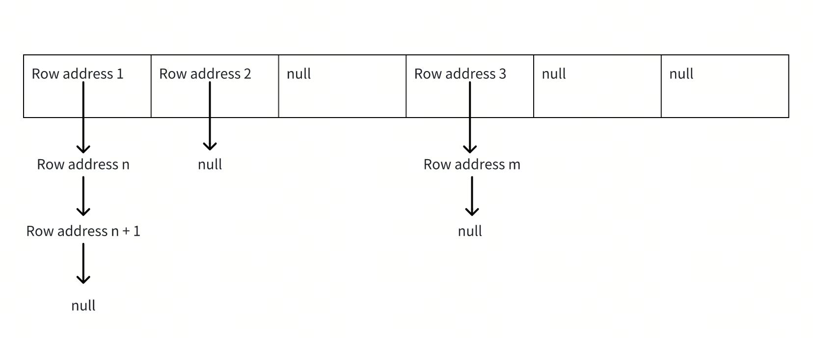
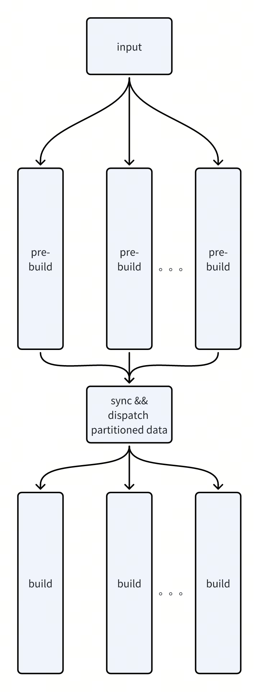
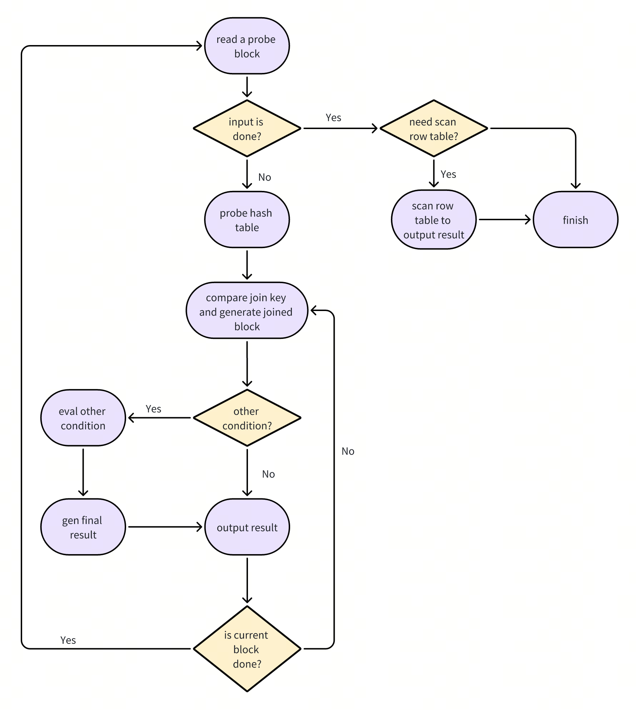

# Proposal: Hash Join V2

- Author(s): [windtalker](https://github.com/windtalker)
- Tracking Issue: https://github.com/pingcap/tidb/issues/53127

## Introduction 
Hash join is a widely used join algorithm. TiDB supports hash join since its 1.0 version, however, the current implementation 
of hash join has some shortcomings:
* At build stage, it does not support concurrent build, which may lead some performance issues when the build side is large. 
* At probe stage, the interface is not well-designed, which may cause redundant calculations in some cases: https://github.com/pingcap/tidb/issues/47424
* In current implementation, there are some concepts that are actually not found in other database's implementation. For example, beside left side/right side and build side/right side, there is inner side/outer side , and `useOuterToBuild`, `outerIsRight`, `tryToMatchInners`, `tryToMatchOuters` are introduced to handle the extra complex. This makes the current code too complex to understand and more error-prone when we try to fix bug.

Taking into account the above factors, we decided to do a complete refactoring of hash join.

## Problems

The basic idea of hash join is to divide the join into build stage and probe stage. On the build stage, a hash table is built 
based on the join key, on the probe stage, a lookup is made in the hash table using the join key, and the join result is 
generated based on the lookup result and the join type. The problems faced in the build stage mainly include the design of 
the hash table, the data organization on the build side and the concurrent build of the hash table. The problems faced in 
the probe stage include memory control during the probe process(especially when there are large number of duplicated join keys), 
the processing of hash table lookup results for various join types and the generation of the final join result.

## Detailed Design

### Build side
The most intuitive problem in build side is the data organization of the build side data. The input data of build side is using 
column storage, and during build stage, we convert the column storage to row storage.
#### Row storage memory layout
```
|---------------------|-----------------|----------------------|-------------------------------|
            |                   |                   |                           |
            V                   V                   V                           V
       next_row_ptr          null_map     serialized_key/key_length           row_data
```
* next_row_ptr: the ptr to link to the next row, used in hash table build, it will make all the rows of the same hash value form a linked list
* null_map: null_map actually includes two parts: the null_flag for each column in current row, the used_flag which is used in
right semi/outer join. If used_flag is needed, it will always be the first bit of null_map.
* serialized_key/key_length(optional): if the join key is inlined, and the key has variable length, this field is used to record the key length
of current row, if the join key is not inlined, this field is the serialized representation of the join keys, used to quick
join key compare during probe stage. This field is optional, for join keys that can be inlined in the row_data(for example,
join key with one integer) and has fixed length, this field is not needed.
* row_data: the data for all the columns of current row. The columns in row_data is variable length. For elements that has fixed length(e.g. int64), 
it will be saved directly, for elements has variable length(e.g. string related elements), it will first save the size followed by the raw data.
 
Since the row_data is variable length, it is by design that the column data in row_data should only be used by sequential access. In order to adopt 
this sequential access restrict, the columns order in row_data must be well-designed instead of just using its original order. 

The columns in the build side can be divided into 3 categories:
* columns used as join key: if the join key is inlined, then it will be accessed first since it need to be used to compare the join key
* columns used by non-equal conditions: it will be used after join key comparison
* all the other columns: these columns will be used last to construct the join results

The order of the columns in all columns data is as follows

|                         | has non-equal condition                                       | no non-equal condition               |
|-------------------------|---------------------------------------------------------------|--------------------------------------|
| join key is inlined     | join key columns + non-equal condition columns + rest columns | join key columns + rest column       |
| join key is not inlined | non-equal condition columns + rest columns                    | all columns in their original order  |

#### RowTable
RowTable is mainly used to store data that has been converted to row storage. RowTable needs to store two parts of information: meta and data.
```go
type rowTable struct {
    meta     *tableMeta
    segments []*rowTableSegment
}
```
##### Meta
`tableMeta` is used to record some meta-related information used in build, including at least
```go
type TableMeta struct {
    // if the row has fixed length
    isFixedLength bool
    // the row length if the row is fixed length
    rowLength int
    // if the join keys has fixed length
    isJoinKeysFixedLength bool
    // the join keys length if it is fixed length
    joinKeysLength int
    // is the join key inlined in the row data
    isJoinKeysInlined bool
    // the length of null map, the null map include null bit for each column in the row and the used flag for right semi/outer join
    nullMapLength int
    // the column order in row layout, as described above, the save column order maybe different from the column order in build schema
    // for example, the build schema maybe [col1, col2, col3], and the column order in row maybe [col2, col1, col3], then this array
    // is [1, 0, 2]
    rowColumnsOrder []int
    // the column size of each column, -1 mean variable column, the order is the same as rowColumnsOrder
    columnsSize []int
    // the serialize mode for each key
    serializeModes []codec.SerializeMode
    // the first n columns in row is used for other condition, if a join has other condition, we only need to extract
    // first n columns from the RowTable to evaluate other condition
    columnCountNeededForOtherCondition int
    // total column numbers for build side chunk, this is used to construct the chunk if there is join other condition
    totalColumnNumber int
    // column index offset in null map, will be 1 when if there is usedFlag and 0 if there is no usedFlag
    colOffsetInNullMap int
    // keyMode is the key mode, it can be OneInt/FixedSerializedKey/VariableSerializedKey
    keyMode keyMode
    // offset to rowData, -1 for variable length, non-inlined key
    rowDataOffset int
    // the mask of usedFlag in nullmap
    usedFlagMask uint32
}
```
#### Data
`rowTableSegment` is used to save row storage data, including at least
```go
type rowTableSegment struct {
    rawData         []byte           // the chunk of memory to save the row data
    hashValues      []uint64         // the hash value of each rows
    rowLocations    []unsafe.Pointer // the start address of each row
    validJoinKeyPos []int            // the pos of rows that need to be inserted into hash table, used in hash table build
}
```
### Hash table design
Hash table uses a chain hash table. The required space will be resized in advance before the hash table is built, and will 
not be resized during the entire build process. Therefore, there is no need to save hash value-related information in the 
hash table. The row address can be stored in each slot of the hash table. The structure of the entire hash table is as follows:



### Hash table building
The building of the hash table is divided into two stages:
1. Pre-build stage: Receive data, physically partition the data, and convert the data from column storage to row storage. The number of partitions: partition_num = max (concurrency, 16)
2. Build stage: After all the data is pre-built, the rowTable data is assigned to the build thread, and each build thread builds its target hash table independently. If there are more build threads than partitions, the conflict is handled by CAS during the hash table build. If the build thread is less than or equal to the number of partitions, a single hash table can only be written by a single thread, so there is no write conflict

### Overall process of build stage



### Probe side

#### Hash table lookup
After calculating the hash value of the join key, the hash table lookup can be done by directly accessing the corresponding 
slot of the target hash table
#### Join key comparison
Since chain hash table is used, after hash table lookup, we still need to compare the join key. The join key on the Build 
side is already in the row. The join key on the probe side is serialized to a byte buffer, TiDB will use memory compare for 
key comparison. For some simple cases, it can be improved to use some specific comparison: for example, if the join key is 
one int, TiDB can use int compare instead of memory compare
#### Joined block generation and non-equal condition evaluation
After join key compare, we need to generate a joined block by combining the probe columns and the build columns. For joins 
don't have other non-equal conditions, the joined block is the final join result. For joins that have some non-equal conditions, 
the joined block is an intermediate result, and we evaluate the non-equal condition based on the joined block, and then 
generate the final join result. By generating an intermediate joined block, we can evaluate the non-equal condition in vector 
mode which is faster and easier to support complex non-equal condition.

When generating intermediate joined block, we try to only construct the minimum columns which are enough for non-equal condition:
* For probe side, only the columns used by non-equal condition are constructed
* For build side
  * If the join key is not inlined, only the columns used by non-equal condition are constructed
  * If the join key is inlined, the join key columns and the columns used by non-equal condition are constructed

#### Probe interface
```go
type JoinProbe interface {
    // SetChunkForProbe will do some pre-work when start probing a chunk 
    SetChunkForProbe(chunk *chunk.Chunk) error
    // Probe is to probe current chunk, the result chunk is set in result.chk, and Probe need to make sure result.chk.NumRows() <= result.chk.RequiredRows()
    Probe(joinResult *hashjoinWorkerResult, sqlKiller sqlkiller.SQLKiller) (ok bool, result *hashjoinWorkerResult)
    // IsCurrentChunkProbeDone returns true if current probe chunk is all probed 
    IsCurrentChunkProbeDone() bool 
    // ScanRowTable is called after all the probe chunks are probed. It is used in some special joins, like left outer join with left side to build, after all 
    // the probe side chunks are handled, it needs to scan the row table to return the un-matched rows 
    ScanRowTable(joinResult *hashjoinWorkerResult, sqlKiller sqlkiller.SQLKiller) (result *hashjoinWorkerResult) 
    // IsScanRowTableDone returns true after scan row table is done 
    IsScanRowTableDone() bool 
    // NeedScanRowTable returns true if current join need to scan row table after all the probe side chunks are handled 
    NeedScanRowTable() bool 
    // InitForScanRowTable do some pre-work before ScanRowTable, it must be called before ScanRowTable 
    InitForScanRowTable()
}
```
#### Overall process of probe stage

