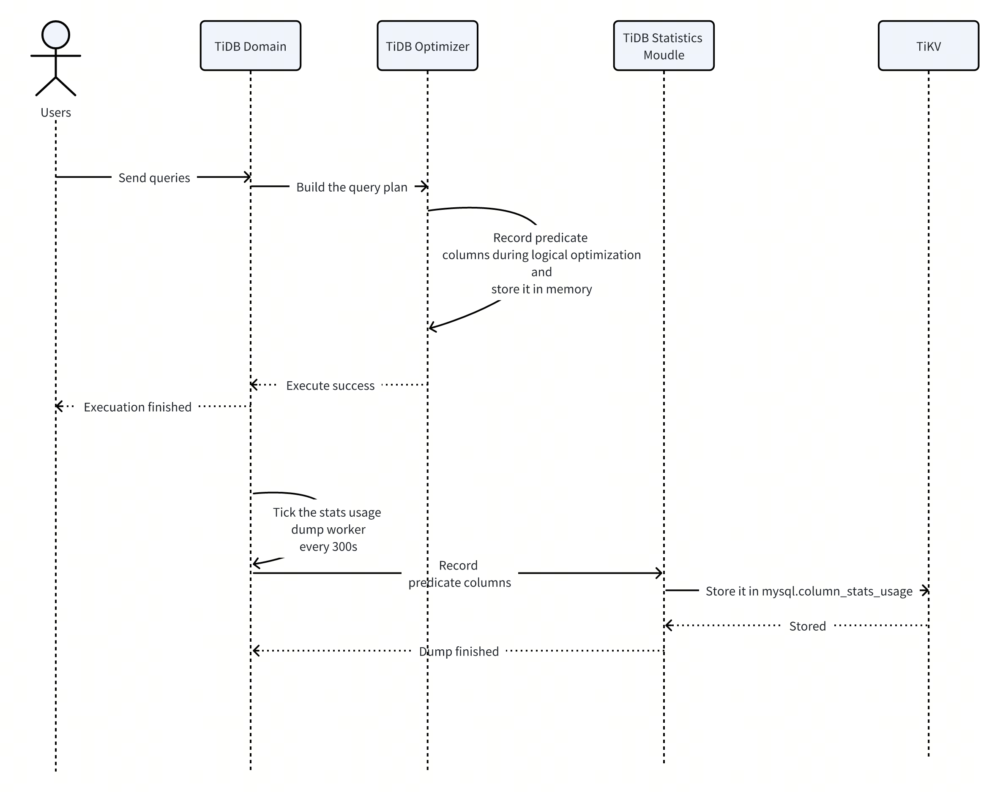
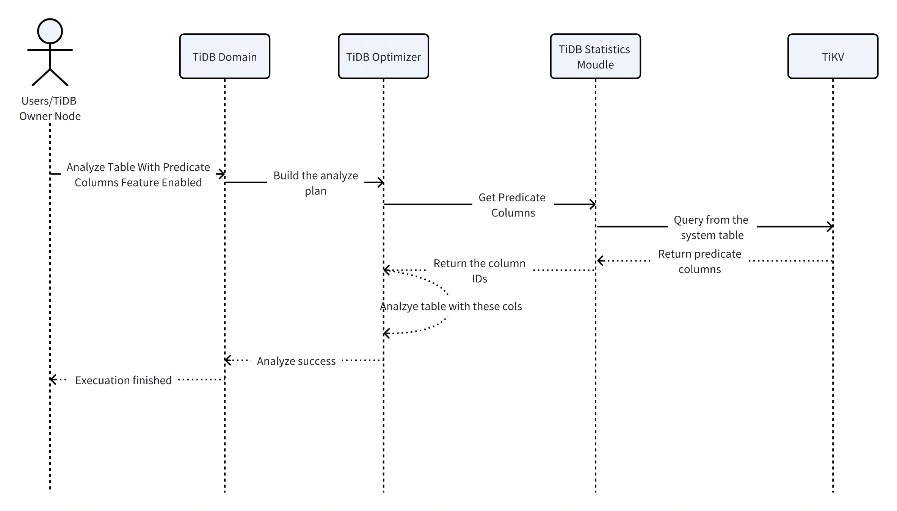

# Analyze Predicate Columns

- Author(s): [Poe Liu](http://github.com/0xPoe)
- Discussion PR: <https://github.com/pingcap/tidb/pull/53511>
- Tracking Issue: <https://github.com/pingcap/tidb/issues/53567>

## Table of Contents

- [Analyze Predicate Columns](#analyze-predicate-columns)
  - [Table of Contents](#table-of-contents)
  - [Introduction](#introduction)
  - [Motivation or Background](#motivation-or-background)
  - [Detailed Design](#detailed-design)
    - [ANALYZE Syntax](#analyze-syntax)
    - [Tracking Predicate Columns](#tracking-predicate-columns)
      - [Collect During Logical Optimization Phase](#collect-during-logical-optimization-phase)
      - [Flush Predicate Columns To The System Table](#flush-predicate-columns-to-the-system-table)
      - [Collection Dataflow](#collection-dataflow)
    - [Using Predicate Columns](#using-predicate-columns)
      - [Analysis Dataflow](#analysis-dataflow)
    - [Cleanup Outdated Predicate Columns](#cleanup-outdated-predicate-columns)
    - [Global Variable](#global-variable)
  - [Test Design](#test-design)
    - [Functional Tests](#functional-tests)
    - [Compatibility Tests](#compatibility-tests)
    - [Performance Tests](#performance-tests)
  - [Impacts \& Risks](#impacts--risks)
    - [If new predicate columns appear, they cannot be analyzed in time](#if-new-predicate-columns-appear-they-cannot-be-analyzed-in-time)
    - [Use PREDICATE COLUMNS when your workload's query pattern is relatively stable](#use-predicate-columns-when-your-workloads-query-pattern-is-relatively-stable)
  - [Investigation \& Alternatives](#investigation--alternatives)
    - [CRDB](#crdb)
      - [Summary](#summary)
      - [Implementation](#implementation)
    - [Redshift](#redshift)
      - [Summary](#summary-1)
      - [Implementation](#implementation-1)
  - [Unresolved Questions](#unresolved-questions)

## Introduction

This document describes the design of the feature that allows TiDB to analyze only the predicate columns when executing the `ANALYZE` statement. This feature is designed to reduce the cost of `ANALYZE` and improve the efficiency of analyzing large tables.

## Motivation or Background

The ANALYZE statement would collect the statistics of all columns currently. If the table is big and wide, executing `ANALYZE` would consume lots of time, memory, and CPU. See [#27358](https://github.com/pingcap/tidb/issues/27358) for details.
However, only the statistics of some columns are used in creating query plans, while the statistics of others are not. Predicate columns are those columns whose statistics are used in query plans, usually in where conditions, join conditions, and so on. If ANALYZE only collects statistics for predicate columns and indexed columns (statistics of indexed columns are important for index selection), the cost of ANALYZE can be reduced.

## Detailed Design

### ANALYZE Syntax

```sql
ANALYZE TABLE tbl_name PREDICATE COLUMNS;
```

Using this syntax, TiDB will only analyze columns that appear in the predicate of the query.

Compare with other syntaxes:

| Analyze Statement                   | Explain                                                          |
| ----------------------------------- | ---------------------------------------------------------------- |
| ANALYZE TABLE t;                    | It will analyze with default options. (Usually all columns)      |
| ANALYZE TABLE t ALL COLUMNS;        | It will analyze all columns.                                     |
| ANALYZE TABLE t COLUMNS col1, col2; | It will only analyze col1 and col2.                              |
| ANALYZE TABLE t PREDICATE COLUMNS;  | It will only analyze columns that exist in the previous queries. |

### Tracking Predicate Columns

#### Collect During Logical Optimization Phase

As all the predicates need to be parsed for each query, we need to do it during the logical optimization phase.
It requires a new logical optimization rule, and we can use it to go through the whole plan tree and try to find all the predicate columns.

We will consider these columns to be the predicate columns:

- PushDown Conditions from DataSource
- Access Conditions from DataSource
- Conditions from Select
- GroupBy Items from Aggregation
- PartitionBy from the Window function
- Equal Conditions, Left Conditions, Right Conditions and Other Conditions from JOIN
- Correlated Columns from Apply
- SortBy Items from Sort
- SortBy Items from TopN
- Columns from the CTE if distinct specified

After we get all predicate columns from the plan tree, we can store them in memory. The reason for storing them in memory is that we don't want to slow down the optimization process by sending the request to TiKV.
Additionally, we want to record when this column was used, we also need to record the timestamp.

It is a map from `TableItemID` to `time.Time`:

```go
type TableItemID struct {
        TableID          int64
        ID               int64
        IsIndex          bool
        IsSyncLoadFailed bool
}

// StatsUsage maps (tableID, columnID) to the last time when the column stats are used(needed).
// All methods of it are thread-safe.
type StatsUsage struct {
        usage map[model.TableItemID]time.Time
        lock  sync.RWMutex
}
```

#### Flush Predicate Columns To The System Table

We use a new system table `mysql.column_stats_usage` to store predicate columns.

```sql
CREATE TABLE IF NOT EXISTS mysql.column_stats_usage (
        table_id BIGINT(64) NOT NULL,
        column_id BIGINT(64) NOT NULL,
        last_used_at TIMESTAMP,
        last_analyzed_at TIMESTAMP,
        PRIMARY KEY (table_id, column_id) CLUSTERED
);
```

The detailed explanation:

| Column Name      | Description                                          |
| ---------------- | ---------------------------------------------------- |
| table_id         | The physical table ID.                               |
| column_id        | The column ID from schema information.               |
| last_used_at     | The timestamp when the column statistics were used.  |
| last_analyzed_at | The timestamp at when the column stats were updated. |

After we collect all predicate columns in the memory, we can use a background worker to flush them from the memory to TiKV. The pseudo-code looks like this:

```go
func (do *Domain) updateStatsWorker() {
    dumpColStatsUsageTicker := time.NewTicker(100 * lease)
    for {
        select {
            case <-dumpColStatsUsageTicker.C:
                statsHandle.DumpColStatsUsageToKV()
        }
    }
}

func (s *statsUsageImpl) DumpColStatsUsageToKV() error {
    colMap := getAllPredicateColumns
    for col, time := range colMap {
        StoreToSystemTable(col, time)
    }
}
```

As illustrated, a ticker triggers the flush operation. This operation retrieves all predicate columns from memory and stores them in the system table. The ticker interval is set to 100 times the lease, where the lease is derived from the [statistics lease](https://docs.pingcap.com/tidb/stable/tidb-configuration-file#stats-lease).
So it is adjustable according to the [statistics lease](https://docs.pingcap.com/tidb/stable/tidb-configuration-file#stats-lease).

#### Collection Dataflow



### Using Predicate Columns

We can use the predicate columns in both automatic statistics collection and manual statistics collection.

Whether the statistics collection is triggered automatically or manually, it reads the predicate columns from the system table and only analyzes these columns, provided that the PREDICATE COLUMNS have already been configured in the analyze options.

To comprehend the application of predicate columns in automatic statistics collection, it's essential to understand how TiDB persists the analyze options.

In TiDB, we use a system table to store the analyze options, called `mysql.analyze_options`:

```sql
CREATE TABLE IF NOT EXISTS mysql.analyze_options (
    table_id BIGINT(64) NOT NULL,
    sample_num BIGINT(64) NOT NULL DEFAULT 0,
    sample_rate DOUBLE NOT NULL DEFAULT -1,
    buckets BIGINT(64) NOT NULL DEFAULT 0,
    topn BIGINT(64) NOT NULL DEFAULT -1,
    column_choice enum('DEFAULT','ALL','PREDICATE','LIST') NOT NULL DEFAULT 'DEFAULT',
    column_ids TEXT(19372),
    PRIMARY KEY (table_id) CLUSTERED
);
```

We can focus on the `column_choice` column, which has three different column options in the analyze statement. The corresponding relations are as follows:

| Analyze Statement                        | column_choice | column_ids | mysql.column_stats_usage                                                 | Explain                                                                  |
| ---------------------------------------- | ------------- | ---------- | ------------------------------------------------------------------------ | ------------------------------------------------------------------------ |
| ANALYZE TABLE t;                         | DEFAULT(ALL)  | None       | None                                                                     | It will analyze all analyzable columns from the table.                   |
| ANALYZE TABLE t ALL COLUMNS;             | ALL           | None       | None                                                                     | It will analyze all columns from the table.                              |
| ANALYZE TABLE t LIST COLUMNS col1, col2; | LIST          | col1, col2 | None                                                                     | It will only analyze col1 and col2.                                      |
| ANALYZE TABLE t PREDICATE COLUMNS;       | PREDICATE     | None       | All predicate columns were collected before in mysql.column_stats_usage. | It will only analyze columns that exist in the mysql.column_stats_usage. |

As you can see, we pick PREDICATE as the column_choice for the ANALYZE TABLE t PREDICATE COLUMNS statement. At the same time, we now consider DEFAULT to be ALL, but to support predicate columns during auto-analyze, we need to change the definition of DEFAULT.

| Predicate Column Feature Status | Predicate Columns in `mysql.column_stats_usage` | Meaning                                                                                                                                                          |
| ------------------------------- | ----------------------------------------------- | ---------------------------------------------------------------------------------------------------------------------------------------------------------------- |
| Enabled                         | Present                                         | Use those predicate and indexed columns to analyze the table.                                                                                                    |
| Enabled                         | Absent                                          | Only analyze indexed columns of the table. **If there are no indexes present, we will bypass the analysis of this table and directly set the modify_count to 0** |
| Disabled                        | -                                               | Analyze all columns of the table                                                                                                                                 |

After we change the definition of DEFAULT, we can use the predicate columns to analyze the table during auto-analyze.

#### Analysis Dataflow



### Cleanup Outdated Predicate Columns

Users may have made schema changes, requiring the removal of non-existent columns from the `mysql.column_stats_usage` table.

Before initiating the analyze process, we can first retrieve all predicate columns, compare them with the current schema, and remove any columns that no longer exist from the `mysql.column_stats_usage` table.

### Global Variable

In the experimental implementation, we introduce a new global variable `tidb_enable_column_tracking` to control whether to use predicate columns in the analyze process.

But because we decided to track all columns by default, so it becomes unnecessary to use this variable. We will mark it deprecated and remove it in the future.

In this feature, we introduce a new global variable `tidb_analyze_column_options` to control whether to use predicate columns or all columns in the analyze process.

Users can set this variable to `ALL` or `PREDICATE` to analyze all columns or only predicate columns. The default value will be `PREDICATE` after this feature is fully implemented.

```sql
SET GLOBAL tidb_analyze_column_options = 'PREDICATE';

SET GLOBAL tidb_analyze_column_options = 'ALL';
```

| Value     | Description                                                    |
| --------- | -------------------------------------------------------------- |
| PREDICATE | Use predicate columns in the analyze process.                  |
| ALL       | Analyze all columns (**But still collect predicate columns**). |

We continue to collect predicate columns even when the feature is disabled. This ensures that we can promptly catch up with the latest predicate columns when the feature is re-enabled.

## Test Design

This feature requires a series of tests to ensure its functionality and compatibility.

### Functional Tests

1. Test that the predicate columns are correctly collected and stored in the system table.
2. Test that the predicate columns are correctly used in the analyze process.
3. Test that the query plan is correct after the predicate columns are used in the analyze process.
4. Test that the predicate columns are correctly cleaned up when they are no longer exist.

### Compatibility Tests

1. Test that the feature is compatible with the auto-analyze feature.
2. Test that the feature is compatible with the rolling upgrade.

### Performance Tests

Test that the query plan is optimized after the predicate columns are used in the analyze process.

## Impacts & Risks

### If new predicate columns appear, they cannot be analyzed in time

If a table has some new queries that use some new predicate columns, but we have just finished an auto-analysis for this table. Then for a long time, the optimizer cannot get the statistics for the newly used columns until we have enough modification to trigger the auto-analysis again.
**This problem is more obvious during cluster creation or POC.** But by default, we always collect statistics for all indexes, so we consider this problem to be acceptable.

### Use PREDICATE COLUMNS when your workload's query pattern is relatively stable

When the query pattern is variable, with different columns frequently being used as predicates, using PREDICATE COLUMNS might temporarily result in stale statistics. Stale statistics can lead to suboptimal query runtime plans and long runtimes.

## Investigation & Alternatives

### CRDB

#### Summary

By default, CockroachDB automatically generates table statistics when tables are created, and as they are updated. It does this using a background job that automatically determines which columns to get statistics on — specifically, it chooses:

- Columns that are part of the primary key or an index (in other words, all indexed columns).
- Up to 100 non-indexed columns.

#### Implementation

If the column list is not specified in the analyze SQL, the default column list will be used to generate statistics.
To determine a useful set of default column statistics, they rely on information provided by the schema.

1. The presence of an index on a particular set of columns indicates that the workload likely contains queries that involve those columns (e.g., for filters), and it would be useful to have statistics on prefixes of those columns. For example, if a table abc contains indexes on (a ASC, b ASC) and (b ASC, c ASC), we will collect statistics on a, {a, b}, b, and {b, c}. (But if ```multiColEnabled``` is false, they will only collect stats on a and b).
2. Columns in partial index predicate expressions are also likely to appear in query filters, so stats are collected for those columns as well.
3. They only collect histograms for index columns, plus any other boolean or enum columns (where the "histogram" is tiny).

See more: <https://github.com/cockroachdb/cockroach/blob/51bbfff84c26be8a2b40e25b4bce3d59ea63dc59/pkg/sql/create_stats.go#L360>

### Redshift

#### Summary

Amazon Redshift ANALYZE command can optionally collect information only about columns used in previous queries as part of a filter, join condition or a GROUP BY clause, and columns that are part of the distribution or sort keys (predicate columns). There’s a recently introduced option for the ANALYZE command that only analyzes predicate columns:

```sql
ANALYZE <table name> PREDICATE COLUMNS;
```

#### Implementation

When you run ANALYZE with the PREDICATE COLUMNS clause, the analyze operation includes only columns that meet the following criteria:

- The column is marked as a predicate column.
- The column is a distribution key.
- The column is part of a sort key.

If none of a table's columns are marked as predicates, ANALYZE includes all of the columns, even when PREDICATE COLUMNS is specified. If no columns are marked as predicate columns, it might be because the table has not yet been queried.

## Unresolved Questions

None
