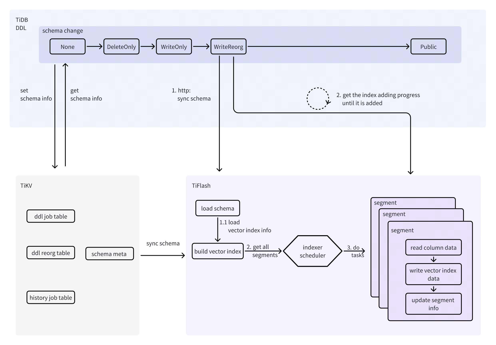

# Proposal: Vector Index

* Author: [zimulala](https://github.com/zimulala)
* Tracking issue: https://github.com/pingcap/tidb/issues/55693

## **Introduction**

Vector Index refers to constructing a time and space efficient data structure for vector data based on a certain mathematical quantization model, to efficiently retrieve several vectors that are as similar as possible to the target vector. Currently, we plan to support the HNSW series of vector indexing methods.

## **Motivation or Background**

This document plans to support the same processing of vector indexes as ordinary indexes, its specific functions are as follows :

* Support adding and using vector indexes, including adding vector indexes during and after table creation.
* Support dropping and renaming vector indexes.

## **Detailed Design**

The process of adding a vector index is similar to that of adding an ordinary index. However, since the actual vector index data is added to TiFlash, there is no process for populating the index data to TiKV.  
The following figure takes the add vector index operation as an example and briefly describes its execution process.



### **TiDB**

#### **Parser**

Syntax required to create a vector index:

* Adding a new ConstraintElem syntax creates a vector index when creating a table.

```sql
CREATE TABLE foo (
    id       INT PRIMARY KEY,
    data     VECTOR(5),
    data64   VECTOR64(10),
    -- "WITH OPTION" is not supported in Phase 1
    VECTOR INDEX idx_name USING HNSW ((VEC_COSINE_DISTANCE(data))) [WITH OPTION "m=16, ef_construction=64"]
);
```

* By `IndexKeyTypeOpt` add `VECTOR` index type, and `IndexTypeOpt` add `HNSW` option type, and add vector index after creating the table.

```sql
CREATE VECTOR INDEX idx_name USING HNSW ON foo ((VEC_COSINE_DISTANCE(data))) 
-- Proposal 1, "WITH OPTION" is not supported in Phase 1
    [WITH OPTION "m=16, ef_construction=64"];
-- Proposal 2， "VECTOR_INDEX_PARAM" is not supported in Phase 1
    [VECTOR_INDEX_PARAM "m=16, ef_construction=64"];

ALTER TABLE foo ADD VECTOR INDEX idx_name USING HNSW ((VEC_COSINE_DISTANCE(data))) 
-- "WITH OPTION" is not supported in Phase 1
 [WITH OPTION "m=16, ef_construction=64"];
```

* The syntax is similar to a normal index, and there are several ways to create an index

```sql
CREATE VECTOR INDEX idx ON t ((VEC_COSINE_DISTANCE(a))) USING HNSW;
CREATE VECTOR INDEX IF NOT EXISTS idx ON t ((VEC_COSINE_DISTANCE(a))) TYPE HNSW;
CREATE VECTOR INDEX ident ON db.t (ident, ident ASC ) TYPE HNSW;

ALTER TABLE t ADD VECTOR ((VEC_COSINE_DISTANCE(a))) USING HNSW COMMENT 'a';
ALTER TABLE t ADD VECTOR INDEX ((VEC_COSINE_DISTANCE(a))) USING HNSW COMMENT 'a';
ALTER TABLE t ADD VECTOR INDEX IF NOT EXISTS ((VEC_COSINE_DISTANCE(a))) USING HNSW COMMENT 'a';
```

#### **Planner && Executor**

* Support to choose vector index by CBO and `USE INDEX` hint.
* The vector index only obtains the top n values through similarity. The following is the syntax for using a vector index when querying.

```sql
SELECT * 
FROM foo 
ORDER BY VEC_COSINE_DISTANCE(data, '[3,1,2]')
LIMIT 5;
```

Currently, the use of vector indexing is supported on the master branch and supports the explain function.

* Protobuf adds the new field of \`indexId\` when TiDB interacts with TiFlash.

```sql
type ANNQueryInfo struct {
        QueryType        ANNQueryType         `protobuf:"varint,1,opt,name=query_type,json=queryType,enum=tipb.ANNQueryType" json:"query_type"`
        DistanceMetric   VectorDistanceMetric `protobuf:"varint,2,opt,name=distance_metric,json=distanceMetric,enum=tipb.VectorDistanceMetric" json:"distance_metric"`
        TopK             uint32               `protobuf:"varint,3,opt,name=top_k,json=topK" json:"top_k"`
        ColumnName       string               `protobuf:"bytes,4,opt,name=column_name,json=columnName" json:"column_name"`
        ColumnId         int64                `protobuf:"varint,5,opt,name=column_id,json=columnId" json:"column_id"`
        RefVecF32        []byte               `protobuf:"bytes,6,opt,name=ref_vec_f32,json=refVecF32" json:"ref_vec_f32,omitempty"`
        MaxDistance      float64              `protobuf:"fixed64,10,opt,name=max_distance,json=maxDistance" json:"max_distance"`
        HnswEfSearch     uint32               `protobuf:"varint,20,opt,name=hnsw_ef_search,json=hnswEfSearch" json:"hnsw_ef_search"`
        XXX_unrecognized []byte               `json:"-"`
        
        // new fields
        IndexId          int64                `protobuf:"varint,5,opt,name=column_id,json=columnId" json:"column_id"`
}
```

The analyze statement is not supported at the moment.

#### **DDL**

##### **Limitations and Constraints**

* A replica of TiFlash is required
    * Cluster must have a TiFlash replica
    * About the TiFlash replica of the table for which the vector index needs to be created
        * When a table is created with an index, the TiFlash replica of the table is set to 1 by default in the first stage (serverless is greater than or equal to minReplica in the configuration item).
        * After creating a table, creating an index requires a TiFlash replica.
* Cannot be created on TiFlash nodes with static encryption enabled
* Cannot be a primary key index
* Cannot be a composite index
* Create several index constraints for the same column
    * There can be different vector indexes defined using different `distance functions`
    * Different vector indexes defined by the same `distance function` will not exist
* Same name processing as the ordinary index
* Vector index requires support for functions

| function | Phase 1 | Phase 2 | Phase 3 |
| :---- | :---- | :---- | :---- |
| VEC\_L1\_DISTANCE |  |  | TBD |
| VEC\_L2\_DISTANCE | v |  |  |
| VEC\_NEGATIVE\_INNER\_PRODUCT（名字待定） VEC\_NEGATIVE\_INNER\_PRODUCT (name to be determined) |  | v |  |
| VEC\_COSINE\_DISTANCE | v |  |  |

* Incompatibility with other features(This operation is not supported in the first phase of this design, but it can be considered for support in the future).
    * Setting invisible properties is not supported
    * Dropping a column with a vector index is not supported, and creating multiple indexes together is not supported. Also, modifying column types with vector indexes is not supported (lossy changes).
        * Workaround, split it into multiple operations: for example, we can first drop all vector indexes on the column, and then drop the column.

##### **Meta Information**

Add the `VectorIndexInfo` information field to describe and store information about vector indexes. In addition, add relevant information to the existing `IndexInfo` to record information about vector indexes.

```go
// VectorIndexInfo is the information on the vector index of a column.
type VectorIndexInfo struct {
    // Kind is the kind of vector index. Currently, only HNSW is supported.
    Kind           VectorIndexKind  `json:"kind"`
    // Dimension is the dimension of the vector.
    Dimension      uint64           `json:"dimension"` // Set to 0 when initially parsed from comment. Will be assigned to flen later.
    // DistanceMetric is the distance metric used by the index.
    DistanceMetric DistanceMetric   `json:"distance_metric"`
}

// IndexInfo provides meta data describing a DB index.
type IndexInfo struct {
    ID            int64                     `json:"id"`
    Name          CIStr                     `json:"idx_name"`      // Index name.
    ...
    // VectorInfo is the vector index information.
    VectorInfo    *VectorIndexInfo           `json:"is_vector"`     
}
```

##### **Add Vector Index**

* Consider adding `ActionAddVectorIndex` DDL job type, through the existing DDL framework, to achieve the operation of adding a vector index.
    * The middle state is consistent with adding a normal index (None \-\> Delete-Only \-\> Write-Only \-\> Write-Reorg \-\> Public).
    * When in the Write-Reorg state, do not use the runReorgJob mechanism of this state, that is, do not enable backfilling or check execution progress logic in the background.
        * Sync `VectorIndexInfo` to TiFlash.
        * Wait for TiFlash to fill in the HNSW Index data.
        * We can check whether the operation has been completed by checking whether the `ROWS_STABLE_NOT_INDEXED` value of the table corresponding to the added vector index on the `system.dt_local_indexes` table on TiFlash is 0\.
        * Obtain error info from indexStat to determine if there is an error during execution.
* Compatible with Cancel, Pause, and Resume operations
    * The Pause operation needs to consider pausing the operation during the reorg phase.
        * Not supported in the first phase
    * Implement Rollback related operations.
        * `The IsRollbackable` check is the same as a general index.
        * Like general indexes, if you roll back during the Write-Reorg phase, you also need to delete the index data that has been added.

##### **Drop Vector Index**

* No need to add a DDL job type, similar to deleting a general index operation.
    * The middle state is consistent with deleting a general index (None \- \> Write-Only \- \> Delete-Only \- \> Delete-Reorg \- \> None).
* Judgment, if it is a vector index
    * Delete-Reorg state
        * No need to wait for HNSW Index data deletion on TiFlash to complete .
        * There is no need to add this metadata to `MySQL.gc_delete_range`
* Compatible with Cancel, Pause, and Resume operations
    * The Pause operation needs to consider pausing the operation during the reorg phase.
        * Not supported in the first phase
    * Implement Rollback related operations.
        * `The IsRollbackable` check is the same as a general index.

##### **Rename Vector Index**

No need to add a DDL job type, just like renaming a general index operation. We don't have to wait for TiFlash's synchronization operation, just return directly after the TiKV operation is completed.

#### **Display**

* Compatible with `admin show ddl` to display the progress of DDL operation execution
    * The display way is considered the same as the general DDL display way, and the `ROWS_STABLE_INDEXED` information of the corresponding table of the `information_schema.tiflash_indexes` table on TiFlash can be filled into the `ROW_COUNT` information of the DDL job.
* Add or update relevant system table information
    * information\_schema tiflash\_tables (already supported)
    * information\_schema tiflash\_segments (already supported)
    * information\_schema tiflash\_indexes (already supported)
        * Add columns index\_name and index\_id.
        * Add columns error\_msg and error\_count.
    * information\_schema.tidb\_indexes
* Support `show create table`
* `The admin check table/index` and `admin repair table` operations do not currently consider processing of vector indexes.
* Add relevant metrics
    * Because `ActionAddVectorIndex` is a new DDL job type, the monitoring information for adding a vector index operation needs to be handled the same as adding a general index.
    * Because dropping or renaming a vector index does not add a DDL job type, monitoring these two operations does not require special handling.

### **TiFlash**

#### **Add Vector Index**

Adding an index operation mainly consists of two steps:

1. Synchronize schema operations to add index data. Currently, there are two main ways for TiFlash to obtain schema from TiKV during operation: the first is that the Background Sync Thread is responsible for regularly calling Schema Syncer to update the Local Schema Copy module; the second is that the read and write operations in TiFlash will also call Schema Syncer for updates when needed.
    * Since adding a vector index does not trigger the synchronization schema of the second method, currently we can only rely on regularly synchronizing the schema to synchronize the metadata to TiFlash.
        * Notify TiFlash to perform the load schema operation through HTTP.
    * `syncTableSchema` handles synchronization Schema operations, and if new index information is found, it needs to be synchronized to the table.
2. Create the vector index data.
    * Constraints that require creating an index. That is, when the index status is Write-Reorg.
    * Timing for generating index data:
        * When synchronizing to add index information, obtain all segment information under the corresponding table to generate the HNSW Index.
            * Use segments as task units and put them into LocalIndexerScheduler (already supported) for parallel processing tasks.
        * Other operations that may trigger the generation of index data: merging delta and stable, merging/splitting/ingesting segments.
            * Due to the uncontrollable timing of such triggering operations, consider separating the index generation from the existing stable layer. The plan is to wait until the index status is public to truly trigger the index generation.
    * Execute index data generation, with segments as the unit of index data generation.
        * Create a vector index for DMFile that does not have a corresponding index. Currently, only the data of the stable layer is created with a vector index.
            * The real file name for creating the index is similar to: {idx\_id} .idx.
                * This naming convention is different from the existing naming convention {col\_id} .idx. If compatibility is a concern, it is best to add a prefix.
        * Create a `VectorIndexHNSWBuilder` to read column data and populate the corresponding index data (already supported).
        * Update the relevant metadata in the segment, including the index information stored on the DMFile.
        * Wait for index data generation on all relevant segments to complete.

#### **Drop Vector Index**

* This operation is similar to the add vector index operation, except that this operation processes dropping the vector index.
    * Most of the process is the same as creating a vector index.
    * Drop the vector index data.
        * When `syncTableschema` handles synchronous Schema operations, it needs to remove the corresponding index.
        * The difference with the add vector index is that the constraint for triggering the operation is that the index state is Delete-Reorg state.
        * In addition, when triggering the actual deletion operation, if it is found that there is no corresponding vector index (i.e. metadata without vector index), and the corresponding vector index data file still exists, it is necessary to delete the index data.

#### **Display**

Add or update relevant system table information.

* information\_schema tiflash\_indexes needs to add some columns:
    * Add columns index\_name and index\_id.
    * Add columns error\_msg and error\_count.

### **Compatibility**

#### **Tools**

* BR
* TiCDC
* DM
    * No need for support
* Lighting
* Dumpling

#### **MySQL 9.0**

Follow-up MySQL supports [MySQL 9.0 vector](https://dev.mysql.com/doc/refman/9.0/en/vector.html), whether we need to consider compatibility later.

* For the time being, we don't need to be compatible with this syntax

## **Test Design**

### **Functional Tests**

*It’s used to ensure the basic feature function works as expected. Both the integration test and the unit test should be considered.*

### **Scenario Tests**

* Create multiple vector indexes on various tables. It tests the speed and resource usage when numerous vector indexes are added in parallel.
* Test whether index data can be deleted in sync schema (Drop vector index) when the index is deleted.

### **Compatibility Tests**

*A checklist to test compatibility:*

1. *Compatibility with other features, like partition table, drop column, etc.*
2. *Compatibility with other components, like BR, TiCDC, Dumpling, BR, DM, Lighting, etc.*
3. *Upgrade compatibility*
