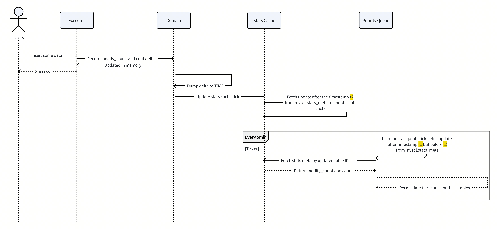

# TiDB Design Documents

- Author(s): [Rustin Liu](http://github.com/Rustin170506), [Lance Tian](http://github.com/lance6716)
- Discussion PR: <https://github.com/pingcap/tidb/pull/55903>
- Tracking Issue: <https://github.com/pingcap/tidb/issues/55906>

## Table of Contents

- [TiDB Design Documents](#tidb-design-documents)
  - [Table of Contents](#table-of-contents)
  - [Introduction](#introduction)
  - [Motivation or Background](#motivation-or-background)
  - [Current Implementation](#current-implementation)
    - [Calculate the score](#calculate-the-score)
  - [Detailed Design](#detailed-design)
    - [Goals](#goals)
    - [Update the priority queue based on DML and DDL changes](#update-the-priority-queue-based-on-dml-and-ddl-changes)
    - [Incremental Update](#incremental-update)
      - [DML](#dml)
      - [DDL](#ddl)
    - [The New Priority Queue - Maintain the heap in memory](#the-new-priority-queue---maintain-the-heap-in-memory)
      - [Information to be stored](#information-to-be-stored)
      - [Basic API](#basic-api)
      - [Reflect on DML Changes](#reflect-on-dml-changes)
      - [Reflect on DDL Changes](#reflect-on-ddl-changes)
        - [Golang-type view from the subscriber](#golang-type-view-from-the-subscriber)
        - [Golang-type view from the publisher](#golang-type-view-from-the-publisher)
        - [Persistence view from publisher](#persistence-view-from-publisher)
        - [Subscribe API behaviors](#subscribe-api-behaviors)
        - [Implementation of subscribing](#implementation-of-subscribing)
        - [Where does it run?](#where-does-it-run)
        - [Future possibility](#future-possibility)
      - [Reflect on Time Change](#reflect-on-time-change)
      - [Failover](#failover)
  - [Test Design](#test-design)
    - [Functional Tests](#functional-tests)
    - [Scenario Tests](#scenario-tests)
    - [Compatibility Tests](#compatibility-tests)
    - [Benchmark Tests](#benchmark-tests)
  - [Impacts \& Risks](#impacts--risks)
  - [Investigation \& Alternatives](#investigation--alternatives)
  - [Unresolved Questions](#unresolved-questions)

## Introduction

This design proposes a new priority queue implementation that maintains a heap in memory to improve performance and reduce the overhead of rebuilding the queue.

## Motivation or Background

Currently, we use a priority queue at TiDB to automatically update statistics. However, we currently maintain this queue by rebuilding it every time. This causes the following problems:

1. After the introduction of information schema version 2, TiDB no longer stores all table information in memory. As a result, the priority queue must retrieve table information from TiKV, which can be slow when dealing with a large number of tables. Therefore, it's important to prevent any operations in the priority queue that require loading all table information.

2. Because we scan it too frequently, we'll spend a lot of CPU on building this queue, since we'll be scanning all the stats cache and the schema cache. See more: <https://github.com/pingcap/tidb/issues/49972>

We can try to keep the priority queue in memory to solve the above issues instead of rebuilding it every time.

## Current Implementation

### Calculate the score

In the current implementation, we use a weighted scoring approach to maintain the queue, which is our current scoring criteria.

Indicators table:

| Name                 | Meaning                                                                                                                                                                                       | Score                                                                                                                                                                                                                                                                                                               | Data Source                  |
| -------------------- | --------------------------------------------------------------------------------------------------------------------------------------------------------------------------------------------- | ------------------------------------------------------------------------------------------------------------------------------------------------------------------------------------------------------------------------------------------------------------------------------------------------------------------- | ---------------------------- |
| Percentage of Change | The percentage of change since the last analysis.                                                                                                                                             | log10(1 + Percentage of Change). [Check the graph](https://www.desmos.com/calculator/gb3i2cropz). <br><br> Note: For unanalyzed tables, we set the percentage of changes to 100%                                                                                                                                            | Stats Cache                  |
| Table Size           | The size is equal to the number of rows multiplied by the number of columns in the table that are subject to analysis. The smaller tables should have a higher priority than the bigger ones. | Applying a logarithmic transformation, namely log10(1 + Table Size), and its 'penalty' is calculated as 1 - log10(1 + Table Size). [Check the graph.](https://www.desmos.com/calculator/x3fq76w8sb)                                                                                                                 | Stats Cache + Table Info     |
| Analysis Interval    | Time since the last analysis execution for the table. The bigger interval should have a higher priority than the smaller interval.                                                            | Applying a logarithmic transformation, namely log10(1 + Analysis Interval). To further compress the rate of growth for larger values, we can consider taking the logarithmic square root of x. The final formula is log10(1 + √Analysis Interval). [Check the graph.](https://www.desmos.com/calculator/plhtkfqhx9) | Stats Cache                  |
| Special Event        | For example, the table has a new index but it hasn't been analyzed yet.                                                                                                                       | HasNewIndexWithoutStats: 2                                                                                                                                                                                                                                                                                          | Table Info (Scan all tables) |

The final score is the weighted sum of the above four indicators.

```go
priority_score = (0.6 * math.Log10(1 + ChangeRatio) +
                  0.1 * (1 - math.Log10(1 + TableSize)) +
                  0.3 * math.Log10(1 + math.Sqrt(AnalysisInterval)) +
                  special_event[event])
```

Currently, we rebuild the priority queue every 3 seconds by scanning all schemas and tables.
For `count` and `modify_count`, the priority queue gets them from the statistics cache.

## Detailed Design

### Goals

1. Avoid scanning the schema cache every time.
2. Reflect the DDL changes to the priority queue.
3. Ensure that DDL events can be received with the correct reliability and order.

### Update the priority queue based on DML and DDL changes

As you can see from the table above, the information we need is divided into two categories, the changes to the table after the DML occurs, and the DDL changes to the table.
For DML, we can get it from the stats cache as we load all table's modify_count and count by default, so we can just recalculate the score when table data changes.
For DDL, we need a reliable way to get the DDL events that have occurred and recalculate the score as a result of the change in the table structure.

### Incremental Update

#### DML

Currently, the stats module maintains the most basic information for all tables (modify_count and count) in the stats cache, and we can maintain the priority queue along the lines of incrementally updating it.

Every time when there are DML changes, we will dump the update details into `mysql.stats_meta` with the new version. The version is the start timestamp of the transaction used to write the record.

1. We start a background worker to call the `statsHandle.Update(do.InfoSchema())` function every 3 seconds(stats lease).
2. In the stats cache struct, we maintain an atomic timestamp called: [maxTblStatsVer](https://github.com/pingcap/tidb/blob/dd1808364a0499640d9d5b941b6083bf021d2cef/pkg/statistics/handle/cache/statscacheinner.go#L56).
3. Whenever we call the `statsHandle.Update(do.InfoSchema())` function, we query the new update from incrementally updating with the current `maxTblStatsVer`.

    ```sql
    SELECT version, table_id, modify_count, count from mysql.stats_meta where version > %? order by version
    ```

4. Once we have all the tables with new updates, we update the statistics cache for them. At the same time, we will update maxTblStatsVer as well.

This way, we don't have to scan the whole mysql.stats_meta, but we can still keep the latest meta information in memory.
We can use the same approach for the priority queue. Every time we find an update from the stats meta table, we know that we should recalculate the score for the table. Because the modify_count and count might have changed.

#### DDL

Similarly, we can apply this mechanism to DDL events. We need an API to query DDLs that happened in the past, and the query interface should be very similar to the way you query for data changes that happened.
Right now, we only have an in-memory channel to send the DDL events to the statistics module from the DDL module. So we need to find a reliable way to store and fetch DDL events.

To ensure that DDL events are processed correctly, DDL module writes them to a physical table with preset primary key in the same transaction of finishing DDL. The stats module reads these events sorted by their primary key, leveraging the fact that DDL events are executed in order, which guarantees that their IDs are also ordered.
We use a large transaction to process the DDL events within the stats module and delete them once processed. This approach eliminates the need for specific checkpoints during failover and guarantees exactly once delivery, as each event is read and processed only once.

### The New Priority Queue - Maintain the heap in memory

Because we are constantly adding, removing, and updating the heap, we need to use a thread-safe heap to store analysis jobs.
The required interfaces look like the following:

| Operation | Time complexity |
| --------- | --------------- |
| Add       | O(log n)        |
| Update    | O(log n)        |
| Delete    | O(log n)        |
| Pop       | O(1)            |
| Get       | O(1)            |

#### Information to be stored

```go
type Indicators struct {
        // ChangePercentage is the percentage of the changed rows.
        // Usually, the more the changed rows, the higher the priority.
        // It is calculated by modifiedCount / last time analysis count.
        ChangePercentage float64
        // TableSize is the table size in rows * len(columns).
        TableSize float64
        // LastAnalysisDuration is the duration from the last analysis to now.
        LastAnalysisDuration time.Duration
}

type AnalysisJob interface {
        // SetWeight sets the weight of the job.
        SetWeight(weight float64)

        // GetWeight gets the weight of the job.
        GetWeight() float64

        // HasNewlyAddedIndex checks whether the job has a newly added index.
        HasNewlyAddedIndex() bool

        // GetIndicators gets the indicators of the job.
        GetIndicators() Indicators
}
```

#### Basic API

```go
// K is the key type of the object. It has to be comparable.
// T is the type of the object.
type Heap[K comparable, T any] interface {
    // Add/Update elements
    Add(obj T) error
    BulkAdd(list []T) error
    AddIfNotPresent(obj T) error
    Update(obj T) error // Same as Add

    // Remove element
    Delete(obj T) error
    DeleteByKey(key K) error

    // View/Pop top element
    Peek() (T, error)
    Pop() (T, error)

    // Query operations
    List() []T
    ListKeys() []K
    Get(obj T) (T, bool, error)
    GetByKey(key K) (T, bool, error)

    // State operations
    Close()
    IsClosed() bool
}

// Constructor
func NewHeap[K comparable, T any](keyFunc KeyFunc[K, T], lessFunc LessFunc[T]) *Heap[K, T]

// Helper function type definitions
type KeyFunc[K comparable, T any] func(T) (K, error)
type LessFunc[T any] func(T, T) bool
```

#### Reflect on DML Changes

We are most interested in `modify_count` and `count` when it comes to changes in the table, so we can still get that information from the stats cache.
But here we need to consider the problem if we are relying on the current update of the stats cache to get a list of tables that need to be recalculated and to calculate the latest scores synchronously. This could potentially block the stats cache from updating properly.
So we decided to maintain a timestamp to track the progress.
In the stats cache, it maintains a timestamp called maxTblStatsVer. In the new priority queue, we maintain another timestamp called nextStatsVersion. The priority queue scans the tables that have changed between nextStatsVersion and maxTblStatsVer to see if we need to rebuild analysis jobs for these tables.



In this sequence diagram, `t2` is `maxTblStatsVer` and `t1` is `nextStatsVersion`. We must guarantee that `t1` is always smaller than or equal to `t2`. Otherwise, the priority queue cannot get the latest `modify_count` and `count` from the stats cache.

#### Reflect on DDL Changes

The priority queue needs to subscribe to DDL changes to update analysis jobs. To ensure that DDL events are processed in order, we require a reliable and ordered mechanism to fetch them. Therefore, we have decided to introduce a new system table `mysql.ddl_notifier` to store the DDL events and a DDLNotifier to fetch and deliver them to the priority queue.

##### Golang-type view from the subscriber

First, we need to define a data structure capable of representing all kinds of module events that can be subscribed to by other modules. From the view of the subscriber:

```go
// SchemaChange stands for a schema change event. DDL will
// generate one SchemaChange or multiple SchemaChange (only
// for multi-schema change DDL). The caller should check the
// the Type field of SchemaChange and call the corresponding getter
// function to retrieve the needed information.
type SchemaChange struct {
    Type      model.ActionType
    // unexported fields
    ...
}

// GetAddPartitioningInfo retrieves information from a
// ActionAddTablePartition type SchemaChange.
func (c *SchemaChange) GetAddPartitioningInfo() (...)
```

The detailed function signatures of getter and setter functions of every type will be decided when we write the code.

##### Golang-type view from the publisher

From the view of the publisher, where the only case is the DDL module:

```go
type SchemaChange struct {
    Type      model.ActionType
    inner *schemaChange4Persist
}

// schemaChange4Persist is used by SchemaChange when needed to
// (un)marshal data, because the Golang JSON library needs every
// fields to be exported but we want to hide the details for
// subscribers so SchemaChange has unexported fields.
type schemaChange4Persist struct {
    Type      model.ActionType
    TableInfo    *model.TableInfo `json:omitempty`
    PartInfo     *model.PartitionInfo `json:omitempty`
    ...
}

// MarshalJSON implements json.Marshaler.
func (c *SchemaChange) MarshalJSON() ([]byte, error) {
    return json.Marshal(c.inner)
}

// UnmarshalJSON implements json.Unmarshaler.
func (c *SchemaChange) UnmarshalJSON(data []byte) error {
    p := &schemaChange4Persist{}
    err := json.Unmarshal(data, &p)
    if err != nil {...}
    c.Type = p.Type
    c.inner = p
    return nil
}

// NewAddPartitioningInfo creates a SchemaChange with type
// ActionAddTablePartition. All arguments can be retrieved by
// GetAddPartitioningInfo.
func NewAddPartitioningInfo(...) *SchemaChange {...}
```

**The main point here is that only the SchemaChange structure knows the implementation details. We shouldn't expose any details to subscribers.**

##### Persistence view from publisher

We need to create a new system table called `mysql.ddl_notifier` to save the data. The definition of the table is as follows:

```sql
CREATE TABLE mysql.ddl_notifier (
    ddl_job_id BIGINT,
    multi_schema_change_id BIGINT COMMENT '-1 if the schema change does not belong to a multi-schema change DDL. 0 or positive numbers representing the sub-job index of a multi-schema change DDL',
    schema_change JSON COMMENT 'SchemaChange at rest',
    processed_by_flag BIGINT UNSIGNED DEFAULT 0 COMMENT 'flag to mark which subscriber has processed the event',
    PRIMARY KEY(ddl_job_id, multi_schema_change_id)
)
```

The DDL component will write the record in the same transaction for finishing the DDL job. Please check the SQL comment to know the meaning of every column. The `processed_by_flag` will be explained in the following section.


##### Subscribe API behaviors

```go
// SchemaChangeHandler function is used by subscribers to
// handle the SchemaChange generated by the DDL module. It
// will be called at least once for every SchemaChange. The
// sctx has already started a pessimistic transaction and
// handler should execute exactly once SQL modification
// logic with it. After the function is returned, subscribing
// framework will commit the whole transaction with internal
// flag modification to provide exactly-once delivery. The
// handler will be called periodically, with no guarantee about
// the latency between the execution time and SchemaChange
// happening time.
//
// The handler function must be registered by RegisterHandler
// before the DDLNotifier is started. If the handler can't
// immediately serve the handling after regsitering, it
// can return nil to tell the DDLNotifier to act like the
// change has been handled, or return ErrNotReadyRetryLater
// to hold the change and re-handle later.
type SchemaChangeHandler func(ctx context.Context, sctx sessionctx.Context, change SchemaChange) error

// ErrNotReadyRetryLater should be used by a registered handler
// that is not ready to process the events.
var ErrNotReadyRetryLater = errors.New(...)

// RegisterHandler must be called with an exclusive and fixed ID
// for each handler to register the handler. Illegal ID will
// panic. RegisterHandler should not be called after the global
// DDLNotifier is started.
func RegisterHandler(id int, handler SchemaChangeHandler) {...}
```

##### Implementation of subscribing

To read DDL events from `mysql.ddl_notifier`, we need to create a background worker to handle it instead of having each subscriber fetch it themselves.
There we can construct a `DDLNotifier` to let other modules register their event handler.

```go
// schemaChangeEvent is the Golang representation of a record
// in mysql.ddl_notifier table.
type schemaChangeEvent struct {
    ddlJobID            int64
    multiSchemaChangeID int
    schemaChange        SchemaChange
    processedByFlag     uint64
}

type DDLNotifier struct {
    sctx         sessionctx.Context
    handlers     map[int]SchemaChangeHandler
    pollInterval time.Duration
}

func NewDDLNotifier(sctx sessionctx.Context, pollInterval time.Duration) *DDLNotifier {
    return &DDLNotifier{
        sctx:         sctx,
        handlers:     make(map[int]SchemaChangeHandler),
        pollInterval: pollInterval,
    }
}

func (n *DDLNotifier) Start(ctx context.Context) error {
    ticker := time.NewTicker(n.pollInterval)
    defer ticker.Stop()
    for {
        select {
        case <-ctx.Done():
            return ctx.Err()
        case <-ticker.C:
            if err := n.processEvents(ctx); err != nil {
                log.Printf("Error processing events: %v", err)
            }
        }
    }
}

func (n *DDLNotifier) processEvents(ctx context.Context) error {
    events, err := n.fetchEvents()
    if err != nil {
        return err
    }

    for _, event := range events {
        for handlerID, handler := range n.handlers {
            if err := n.processEventForHandler(ctx, event, handlerID, handler); err != nil {
                if err != ErrNotReadyRetryLater {
                    log.Printf("Error processing event %d for handler %d: %v", event.JobID, handlerID, err)
                }
                continue
            }
        }
        if n.allHandlersProcessed(event) {
            if err := n.deleteProcessedEvent(event.JobID); err != nil {
                log.Printf("Error deleting processed event %d: %v", event.JobID, err)
            }
        }
    }

    return nil
}

func (n *DDLNotifier) processEventForHandler(ctx context.Context, event DDLEvent, handlerID int, handler SchemaChangeHandler) (err error) {
    if n.hasProcessed(event, handlerID) {
        return nil
    }

    if _, _, err = ExecRows(n.sctx, "BEGIN PESSIMISTIC"); err != nil {
        return err
    }
    defer func() {
        err = finishTransaction(n.sctx, err)
    }()

    // TODO: Should we attach a timeout to this ctx?
    if err := handler(ctx, n.sctx, event.Event); err != nil {
        return err
    }
    if err := n.markProcessed(n.sctx, event.JobID, handlerID); err != nil {
        return err
    }

    event.ProcessedBy |= 1 << uint(handlerID)

    return nil
}
func (n *DDLNotifier) fetchEvents() ([]DDLEvent, error) {
    // ...
    return nil, nil
}

func (n *DDLNotifier) hasProcessed(event DDLEvent, handlerID int) bool {
    return (event.ProcessedBy & (1 << handlerID)) != 0
}

func (n *DDLNotifier) markProcessed(sctx sessionctx.Context, eventID int, handlerID int) error {
    _, err := ExecRows(sctx, "UPDATE mysql.ddl_notifier SET processed_by = processed_by | (1 << ?) WHERE id = ?", handlerID, eventID)
    return err
}

func (n *DDLNotifier) allHandlersProcessed(event DDLEvent) bool {
    return event.ProcessedBy == (1<<len(n.handlers))-1
}

func (n *DDLNotifier) deleteProcessedEvent(sctx sessionctx.Context, eventID int) error {
    _, err := ExecRows(sctx, "DELETE FROM mysql.ddl_notifier WHERE job_id = ?", eventID)
    return err
}

func (n *DDLNotifier) RegisterHandler(id int, handler SchemaChangeHandler) {
    n.handlers[id] = handler
}
```

This notifier is responsible for fetching events from the `mysql.ddl_notifier` table, ordered by job ID. After it calls every handler for each event, it can safely delete handled events.
We use a separate TXN to handle each handler. This would help us reduce the impact between each handler. After all handlers have handled this event, we will delete it.

##### Where does it run?

Since only the stats module is currently subscribed and requires in-memory operations, we will only start it at the stats owner.

##### Future possibility

If we do want other modules to subscribe to the module in the future, we need to avoid it only running in the stats owner node. This is because other modules may also have memory operations that may not occur in the stats owner node.
**A possible solution would be to start DDLNotifier on each TiDB node, with different subscribers on each node. This would allow us to solve the problem.**
However, this solution introduces more complexities, such as how to manage subscribers, and ensuring that an event can be deleted after it has been processed by subscribers on all the different nodes becomes more complicated. Even the granularity of the subscribers needs to be controlled. For example, when the same subscriber logic is used, but they are running on every node, whether we consider it to be a single subscriber or multiple subscribers is something that needs to be discussed.
**Since this issue is already far from our goal this time, I decided to consider it as a future possibility rather than in the pursuit of completing it in this design.**

#### Reflect on Time Change

We need to consider a time factor here because one of the metrics used to calculate our scores is the analysis interval, which is the time interval between the last analysis and the present. Obviously, it changes over time and we need to keep recalculating the analysis interval for these tables.
We can recalculate the last analysis intervals and scores for these tables every 5 minutes using the background worker behind the priority queue.

#### Failover

Currently, there are only two scenarios where failover needs to be handled.

1. the node is restarted and
2. an owner switch occurs.

In these two cases, we need to rebuild the priority queue, that is, to rescan and reconstruct the entire priority queue.
For DML events, we scan the entire stats cache for the latest `modify_count` and `count`.
For DDL events, since all our operations are processed in transactions. So after waiting for the priority queue to be ready, we just let the notifier restart processing.

| Table Count | Time (s)     |
| ----------- | ------------ |
| 69067       | 6.365261488  |
| 97475       | 9.01190247   |
| 173505      | 16.085877084 |
| 271338      | 24.155433689 |
| 332697      | 29.865601857 |

As you can see, gathering all table information from TiKV is quite slow. For 1 million tables, it would take more than one minute. The reason is that since the information schema v2, this SchemaTableInfos API will directly access the TiKV and parse table information.
But for now, we can tolerate this cost because the frequency of the priority queue rebuild is low.

## Test Design

This feature requires a focus on both correctness and performance tests. The primary objective of the correctness tests is to validate the accuracy of priority calculations and the proper handling of both DML and DDL changes. Performance tests aim to ensure that the priority queue's operation doesn't negatively impact system performance.

### Functional Tests

1. Priority Queue Operations:
   - Test basic operations: Add, Update, Delete, Pop, Get
   - Verify thread-safety of operations

2. DML Change Handling:
   - Verify correct score recalculation when `modify_count` and `count` change
   - Test incremental updates from stats cache

3. DDL Change Handling:
   - Test subscription to DDL events
   - Verify correct processing of different types of DDL changes (e.g., add index, exchange partition)
   - Test exactly-once delivery of DDL events

4. Time-based Updates:
   - Verify periodic recalculation of analysis intervals and scores

5. Failover Scenarios:
   - Test priority queue rebuild after node restart
   - Test priority queue rebuild after owner switch

### Scenario Tests

1. Mixed DML and DDL Changes:
   - Simulate real-world scenarios with a mix of DML and DDL operations
   - Verify correct priority calculations and queue updates

2. Large-scale Tests:
   - Test with a large number of tables (e.g., 1 million+)
   - Verify performance and correctness under high load

3. Concurrent Operations:
   - Test multiple concurrent DML and DDL operations
   - Verify queue consistency and correct priority updates

### Compatibility Tests

This change only affects the stats module, so it has no compatibility issues.

### Benchmark Tests

1. Memory Usage:
   - Monitor memory consumption of in-memory priority queue
   - Test memory usage patterns with different table counts and update frequencies
   - Test memory usage with different DDL and DML operation frequencies
2. Performance:
   - Measure the performance of handing a large number of DDL events
   - Measure the performance of rebuilding the priority queue when failing over

## Impacts & Risks

None

## Investigation & Alternatives

None

## Unresolved Questions

1. How does the priority queue look up the IDs of tables that have updates?

In the current design, we would query the `mysql.stats_meta` table, and since the version column is indexed, it shouldn't be too slow. But we could also consider querying that data directly from the stats cache. We maintain the count and modify_count of all the tables in memory, as well as their version, so we can fetch the tables in the cache and do a version check to select the ones that meet the requirement. However, we may need to take a lot of segment locks to get the full amount of data, and we may need to do n times of version comparisons. We are not sure which one is more efficient, we need to do more tests.
