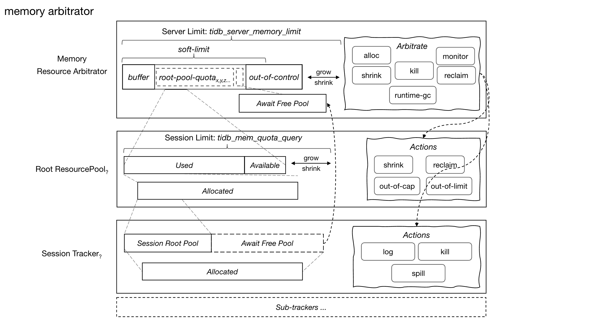
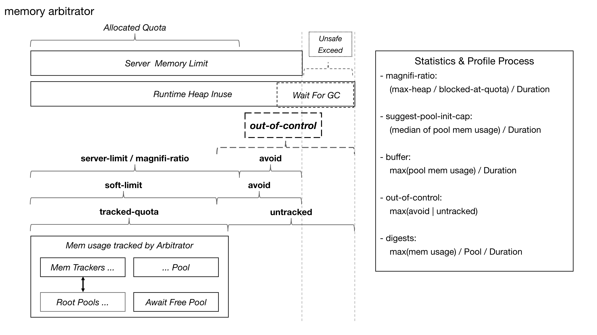

# TiDB Global Memory Arbitrator

- Author: [Zhigao TONG](https://github.com/solotzg)
- Tracking Issue: <https://github.com/pingcap/tidb/issues/58194>

## Table of Contents

- [Introduction](#introduction)
- [Background](#background)
- [Detailed Design](#detailed-design)
- [Test Design](#test-design)
  - [Functional Tests](#functional-tests)
  - [Scenario Tests](#scenario-tests)
  - [Compatibility Tests](#compatibility-tests)
  - [Benchmark Tests](#benchmark-tests)
- [Impacts & Risks](#impacts--risks)
- [Investigation & Alternatives](#investigation--alternatives)
- [Unresolved Questions](#unresolved-questions)

## Introduction

This article proposes a practical TiDB global memory control mechanism.

## Background

According to the introduction in [tidb#58194](https://github.com/pingcap/tidb/issues/58194), there are **`3`** problems with the original memory control mechanism:

- Kill SQL/session Risk
- Heavy Golang GC Impact
- OOM Risk

Severity: `OOM` ≈ `Heavy Golang GC` > `Kill SQL/session`

### Goals

- Avoid OOM
- Avoid performance regression
- Avoid SQL failures (configurable & deterministic behaviors for Kill/Cancel SQL/session)

## Detailed Design

### Overview

Becase TiDB cannot customize physical memory allocation, the core to solve those problems is to avoid the usage of heap (occupied legally / unable to GC) from exceeding [golang runtime soft memory limit](https://pkg.go.dev/runtime/debug#SetMemoryLimit).

Memory is a typical mutually exclusive resource and belongs to the finite `Pool` model. Therefore, `preemptive scheduling` can be performed only if its holder, `Memory Resource Pool`(aka `mem-pool`), is able to release memory.

A centralized global `Memory Resource Arbitrator` (aka `mem-arbitrator` or `arbitrator`) is proposed, which replaces the original optimistic posteriori method with a `pessimistic scheduling` model (`subscription-first-then-allocation`). It quantifies the global memory resources of the TiDB instance into dynamic virtual quotas and identify unsafe / prohibited quota to ensure global memory safety during the arbitration process.

### Functional Specs

The original config [tidb_server_memory_limit](https://docs.pingcap.com/tidb/stable/system-variables/#tidb_server_memory_limit-new-in-v640) is still the most important hard constraint. `arbitrator` introduces config `soft-limit`, which indicates the upper limit of global memory quota.

When facing an `OOM Risk`, the `arbitrator` will use the `KILL` method to protect the memory safety. For other abnormal situations, it only choose the `CANCEL` method.

- `OOM Risk`: actual memory usage reaches the security warning line & global stuck risk occurs.
- `KILL` and `CANCEL` interface can be customized.

`arbitrator` contains self-adaptation tuning mechanism to quantify & store the runtime memory state and dynamically adjust the `soft-limit` to converge `Loop OOM` problems. `arbitrator` provides manual tuning interfaces to handle extreme memory leaks as well: external setting `soft-limit`; pre-subscribe mem quota of a specified size;

- `Loop OOM`: TiDB restarts in a loop due to OOM caused by continuous extreme memory leak load.

There are **2** work modes for `arbitrator` when memory is insufficient:

- `STANDARD` mode: `CANCEL` pending subscription mem pools

- `PRIORITY` mode: `CANCEL` mem pools with lower priority

### User Interface

`mem-priority`: reuse the definition `PRIORITY` of [Resource Group](https://docs.pingcap.com/tidb/stable/information-schema-resource-groups)

- `LOW`
- `MEDIUM`
- `HIGH`

New system variables:

- `tidb_mem_arbitrator_mode`: `global` level
  - `DISABLE` (default): disable mem arbitrator
  - `STANDARD`: set work mode `STANDARD`
  - `PRIORITY`: set work mode `PRIORITY`

- `tidb_mem_arbitrator_soft_limit`: `global` level
  - `0` (default)：`95% server-limit`
  - Integer (bytes): `(1, server-limit]`
  - Float (`ratio * server-limit`): `(0, 1]`
  - `AUTO` (mem-arbitrator self-adaptation adjustment according to runtime state)

- `tidb_mem_arbitrator_query_reserved`: `session` level / `SQL Hint`
  - `0` (default)
  - Integer (bytes): `(1, server-limit]`
    - pre-subscribe a specified amount of mem quota before execution

- `tidb_mem_arbitrator_wait_averse`: `session` level / `SQL Hint`
  - `OFF` (default)
  - `ON`: bind SQL to STANDARD mode and highest memory priority

### System Behavior

- mem-arbitrator is disabled by default and TiDB use the original oom control mechanism
- SQL inherits mem-priority from `Resource Group`, otherwise `MEDIUM`
- SQL can be bound to `wait_averse` property and `HIGH` mem-priority through `tidb_mem_arbitrator_wait_averse`
- Enable mem-arbitrator:
  - Each TiDB instance has a global unique mem-arbitrator.
  - Set the sys var `tidb_mem_arbitrator_mode` to not `DISABLE`, and takes effect immediately for all TiDB nodes.
  - Disable the original OOM control mechanism
  - Disable `memoryLimitTuner`: the expected maximum memory usage of TiDB instance is similar to golang runtime soft memory limit and `server-limit`.
- Enable `STANDARD` mode:
  - All mem quota subscription requests will be executed by FIFO
  - Cancel all queued pools when memory is insufficient
- Switch to `PRIORITY` mode:
  - All mem quota subscription requests will be executed by mem-priority (`HIGH` > `MEDIUM` > `LOW`) then FIFO
  - When memory is insufficient:
    - Cancel all queued pools with `wait_averse` property
    - Cancel pools with lower mem-priority than the current in order (mem-priority from `LOW` to `HIGH`, quota usage from large to small)
- When the tracked memory usage of the session exceeds `tidb_mem_quota_query`, the behavior is the same as the original TiDB, (controlled by sys var `tidb_mem_oom_action`)
- `KILL` mechanism for `OOM Risk`:
  - `mem risk`: when the memory usage of TiDB instance reaches the safety warning line `95% * server-limit`
  - Determine the global stuck risk (`OOM Risk`) if at least one condition is met:
    - heap alloc/free speed less than `100MB/s`
    - heap usage cannot fall below `safety threshold` (`90% * server-limit`) within `5s`
  - Handle the `OOM Risk`: `KILL` pools in order (mem-priority from `LOW` to `HIGH`, quota usage from large to small) until the memory usage falls below safety threshold
- `soft-limit` can be set through sys var `tidb_mem_arbitrator_soft_limit`
  - The smaller the value/percentage, the safer the global memory and the lower the memory resource utilization.
  - `AUTO`: model the runtime state and dynamically adjust the upper limit of global memory resources:
    - local persistence (`JSON` format):
      - `magnif`: current memory stress (workload characteristic), which is the ratio of mem quota to actual heap usage
      - `pool-medium-cap`: medium mem quota of root pools as pool init cap suggestion
      - `last-risk`: `heap` & `quota` state of last `mem risk`
    - When `mem risk` occurs, calculate and locally persist the current state so that it can be restored after each restart.
    - Regularly `30s` check the runtime state, if the memory stress is reduced, gradually reduce the magnifi to increase the mem quota upper limit
- pre-subscribe specific mem quota by `tidb_mem_arbitrator_query_reserved`
  - To deal with SQL-level memory leaks, the larger the value, the better the resource isolation effect, and the safer the global memory
- Dynamically switch mem-arbitrator work mode:
  - mem-arbitrator will detect the current mode before each round of processing tasks, and the mode switch will take effect in the next round
  - switch to `DISABLE` mode:
    - For the mem-pool associated with mem-arbitrator, all memory subscription requests will be satisfied until execution is completed
    - The new SQL will no longer connect to mem-arbitrator
    - The `KILL` mechanism of mem-arbitrator won't take effect
    - Re-enable the original OOM control mechanism

### User Scenarios

General scenarios: users need TiDB system stability to avoid memory security issues

- High concurrency small AP, high stress TP & AP mixed, abnormal memory leak, etc

OLAP scenarios that need to ensure SQL execution (multi-concurrency and large OLAP)

Low latency / non-blocking services (OLTP)

- When the memory resources are insufficient the upper-layer can quickly retry SQL / workload to other TiDB nodes (which can be perceived by TiProxy).

Memory leak or `Loop OOM` scenarios

#### Practice

Deploy a single TiDB node

- Enable the `PRIORITY` mode of mem-arbitrator. Bind important SQL (such as OLTP related) to the resource group with `HIGH` priority.

Deploy multiple TiDB nodes

- **[opt 1]** Enable the `STANDARD` mode of mem-arbitrator, relying on upper-layer to perform SQL retries among multiple nodes. The overall resource utilization of the cluster is high, and the risk of single-point OOM is low.
- Enable the `PRIORITY` mode of mem-arbitrator.
  - **[opt 2]** Bind important SQL with resource group with `HIGH` priority, bind OLAP-related SQL with `MEDIUM` / `LOW` priority. Let upper-layer bind the load of the heavy OLAP to specific TiDB nodes.
  - **[opt 3]** Bind important SQL with the `wait_averse` property and set other settings as needed.
  - **[opt 4]** Reserve enough

  - In the mode of subscription before allocation, compared to canceling other SQL and waiting for resource release (the waiting time is determined by the process of executing cancel), the method of quickly canceling OLTP-related SQL and retrying it to other TiDB nodes by the upper-layer has lower latency.

OOM appears after enabling mem-arbitrator

- **[opt 1]** Set soft-limit to `AUTO` and let mem-arbitrator adaptively adjust the upper limit of global memory resources and gradually converges the OOM problem (multiple OOMs may occur in extreme cases).
- **[opt 2]** Set the soft-limit to a relative small value / percentage, manually set the global memory quota limit, and quickly solve OOM problems
- **[opt 3]** For the known SQL with memory leak problem, make it pre-subscribe a relative large amount of mem quota.

Ensure the successful execution of important SQL

- Bind SQL with mem-priority `HIGH` and ensure that the SQL execution won't be Kill/Cancel
- Make SQL pre-subscribe a sufficient / excessive amount of mem quota
  - Avoid blocking overhead caused by multiple subscriptions during execution
- Under `PRIORITY` mode of mem-arbitrator, SQL can be bound with `wait_averse` property first. If the upper-layer retries multiple times and fails (the overall cluster resources are insufficient), disable `wait_averse` and retry by mem-priority

### Architecture

#### Memory Resource Arbitrator

- The arbitrator controls a set of root memory pools. If any root pool needs to increase its mem quota, it should apply to the arbitrator and wait for responses synchronously.
- The basic properties of  Arbitrator:
  - arbitrator-limit: bytes
    - Hard memory limit of whole TiDB instance(same as tidb_server_memory_limit)
  - allocated: bytes
  - soft-limit(aka arbitrator-capacity): bytes
    - Soft memory limit of arbitrator(maximum memory quota allocation).
  - await-pree-pool: ResourcePool
    - The out-of-cap action of this kind of pool is designed to allocate memory quota from the arbitrator directly.
  - statistics(local persistable)
    - mem-magnification-ratio: float
      - Aka magnifi-ratio, the ratio of real memory usage to logical memory quota allocation.
    - suggest-pool-init-cap: bytes
    - buffer: bytes
      - buffer is a reserved space for memory quota allocation.
    - out-of-control: bytes
      - Dynamic amount of memory not controlled by the attributor.
    - digests
      - SQL or plan digests info provided by TiDB executor statement which can be used to enhance memory resources isolation through mem-reserve.

##### Statistics & Auto Tune

#### ResourcePool

A threadsafe structure that manages a tree set of quota:

- budget: struct
  - capacity: bytes
  - used: bytes
  - upstream-pool: ResourcePool
- limit: bytes
- allocated: bytes
- alloc-align: bytes
  - Make each allocation aligned to a large size in order to reduce small  allocations.
- Actions: functions
  - notification, `out-of-cap`, out-of-limit
- children-pools, parent-pools: ResourcePool

The allocated bytes of pool should not exceed the used quota of its capacity. Pool increases its capacity by allocating from upstream-pool or `out-of-cap` action (if pool is the root).

#### Module Adaptation

##### session / executor

Memory Tracker

- An existing basic structure used to monitor memory usage of bound targets in TiDB. There are more additional parts:
  - Reference of global memory arbitrator
  - root-pool: MemoryPool
    - A memory pool which presents the memory resources of this mem-tracker.
  - await-pree-pool: MemoryPool
    - Reference to the unique await-pree-pool of the global arbitrator.
  - await-pree-cap: bytes
    - The capacity of memory consumption towards the await-pree-pool.
  - mem-reserve: bytes
    - Session pre-reserving quota before executing (optional) which is used to reserve enough quota for the query and reduce the frequency of resource contention.
- When consuming, the mem-tracker should consume from await-pree-pool first. If its maximum memory consumption reaches the await-pree-cap or it fails to allocate memory quota from arbitrator, the mem-tracker will initialize root-pool and start to be controlled by the global arbitrator directly.

Planner / Compiler / Optimizer

- pre-subscribe a fixed mount of mem quota (`4MB`) from await-pree-pool in advance for temporary use

Session

- set sys vars & SQL hints
- prepare context and attach mem-tracker to the global mem-arbitrator

##### TiProxy

- session dispatch machinist modification
- choose the tidb node with minimum limit - pending_alloc size

##### Background task (no session)

- internal SQL (session id is 0)
- DDL
- import / lightning
- analyze

#### Other types of cache

- SQL / plan / chunk / cop cache
- other caches

#### Monitor

Alerting

- TiDB instance has the risk of memory freeze
- TiDB instance appears to KILL SQL

Prometheus / Grafana

- mem arbitrator self
- other modules

### Manageability & Diagnosability

Metrics

- The number of memory subscription tasks in the queue (with different priorities).
- Number of subscription tasks, processing time
- Memory resources: available, unavailable, unsafe, allocated, memory stress value, GC (number of triggers, time spent), memory share limit, SQL memory usage top-3 /median, runtime memory usage speed
- INTERRUPT sql number /reason
- Process OOM risk KILL SQL number

Log

- Memory risk: alarm, global memory freeze risk, runtime memory usage speed, kill SQL behavior
- Cancel SQL: reason, memory state
- Runtime mem profile in timeline

SQL explain results & SQL execution statistics

- Binding arbitrator behavior pattern: STANDARD, PRIORITY
- Memory priority: LOW, MEDIA, HIGH
- Memory subscription task count, processing time (avg, max, min)
- Maximum used memory share, maximum subscribed memory share
- execution summary
- expensivequery

Perf mem profile

- dump tree diagram of global memory state
  - tree diagram pools
  - memory quota by modules
  - runtime memory perf info by modules

## Test Design

- `mem-arbitrator` / `mem-pool` are independent & self-consistent modules. Unit tests can cover most cases.
- session / executor
  - Unit tests: test the adaptation between mem-tracker and mem-arbitrator
  - Integration tests: test the concurrent cases about SQL execution

- session / executor
  - set tidb_server_memory_limit --> affect limit of global mem arbitrator
  - SQL with resource_group / wait_averse / query_reserved profiles
  - SQL with [max_execution_time](https://docs.pingcap.com/tidb/stable/system-variables#max_execution_time)
  - SQL execution summary
- Memory tracker with mem arbitrator
  - global unique mem arbitrator
  - attach to fast alloc pool when quota usage is small
  - reserve root pool quota; auto use digest max historical quota
  - auto increase root pool quota cap
  - RuntimeMemStateRecorder: load / store / persist MemState
  - supports KILL / INTERRRUPT interface of TrackerArbitrateHelper
  - tracker with context: priority / wait_averse / query_reserved / quota limit
  - concurrent op from sub trackers
- Other module with mem arbitrator
  - optimizer: use fast alloc pool
  - other types of cache
- Integration Tests & Benchmark
- Mixed OLAP & OLTP(low latency required) workload
  - arbitrator standard mode
  - arbitrator priority mode
  - TP queries with wait_averse profile
  - single TiDB instance
  - multiple TiDB instances
- Multiple Large AP
- High Concurrency Small AP
- Memory Leak Exception
- Continuous High-pressure Memory Leak
- Heavy stress test

### Functional Tests

It's used to ensure the basic feature function works as expected. Both the integration test and the unit test should be considered.

### Scenario Tests

It's used to ensure this feature works as expected in some common scenarios.

### Compatibility Tests

A checklist to test compatibility:

- Compatibility with other features, like partition table, security & privilege, charset & collation, clustered index, async commit, etc.
- Compatibility with other internal components, like parser, DDL, planner, statistics, executor, etc.
- Compatibility with other external components, like PD, TiKV, TiFlash, BR, TiCDC, Dumpling, TiUP, K8s, etc.
- Upgrade compatibility
- Downgrade compatibility

### Benchmark Tests

The following two parts need to be measured:

- The performance of this feature under different parameters
- The performance influence on the online workload

## Impacts & Risks

Describe the potential impacts & risks of the design on overall performance, security, k8s, and other aspects. List all the risks or unknowns by far.

Please describe impacts and risks in two sections: Impacts could be positive or negative, and intentional. Risks are usually negative, unintentional, and may or may not happen. E.g., for performance, we might expect a new feature to improve latency by 10% (expected impact), there is a risk that latency in scenarios X and Y could degrade by 50%.

## Investigation & Alternatives

How do other systems solve this issue? What other designs have been considered and what is the rationale for not choosing them?

## Unresolved Questions

What parts of the design are still to be determined?

## TODO

Regarding the future prospects, there are mainly two points: first, the wider the coverage of the memory tracker, the more accurate the statistics, and the more effective the Memory Arbitrator model; second, this architecture is suitable for the vast majority of pooled resource management (including but not limited to various caches), and relevant modules can be integrated for unified management.
