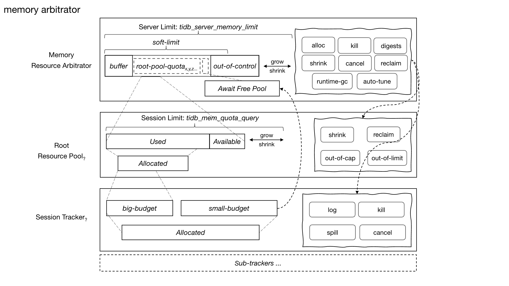
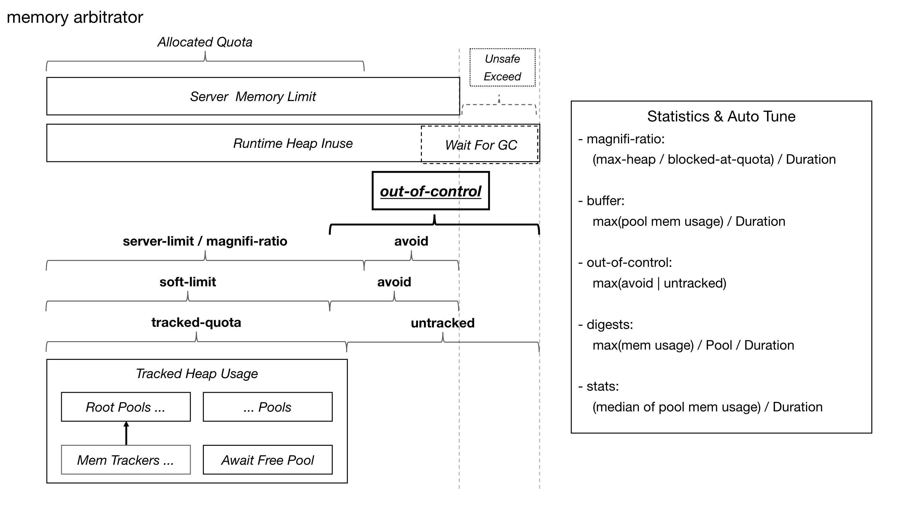

# TiDB Global Memory Arbitrator

- Author: [Zhigao TONG](https://github.com/solotzg)
- Tracking Issue: <https://github.com/pingcap/tidb/issues/58194>

## Table of Contents

- [Introduction](#introduction)
- [Background](#background)
- [Detailed Design](#detailed-design)
- [Test Design](#test-design)
- [Impacts & Risks](#impacts--risks)
- [Investigation & Alternatives](#investigation--alternatives)

## Introduction

This document proposes a practical TiDB global memory control mechanism.

## Background

According to the introduction in [#58194](https://github.com/pingcap/tidb/issues/58194), there are **3** problems with the original memory control mechanism:

- Kill SQL/session Risk
- Heavy Golang GC Impact
- OOM (Out of Memory)

Severity: `OOM` ≈ `Heavy Golang GC` > `Kill SQL/session`

### Goals

- Avoid OOM
- Avoid performance regression
- Avoid SQL random failures
  - require configurable and deterministic behaviors to stop SQL execution

## Detailed Design

### Overview

Because TiDB cannot customize physical memory allocation, the core solution to these problems is to prevent heap usage (either legally occupied or not GC-able) from exceeding [golang runtime soft memory limit](https://pkg.go.dev/runtime/debug#SetMemoryLimit).

Memory is a typical mutually exclusive resource and follows the finite `Pool` model. Therefore, `preemptive scheduling` can be performed only if its holder, [Memory Resource Pool](#memory-resource-pool)(aka `Memory Pool` / `mem-pool`), is able to release memory.

A centralized global [Memory Resource Arbitrator](#memory-resource-arbitrator) (aka `mem-arbitrator` or `arbitrator`) is proposed, which replaces the original optimistic posteriori method with a `pessimistic scheduling` model (`subscription-first-then-allocation`). It quantifies the global memory resources of the TiDB instance into dynamic virtual quotas and identifies unsafe / prohibited quota to ensure global memory safety during the arbitration process.

### Functional Specs

The original config [tidb_server_memory_limit](https://docs.pingcap.com/tidb/stable/system-variables/#tidb_server_memory_limit-new-in-v640) (aka `server-limit`) is still the most important hard constraint. `arbitrator` introduces config `soft-limit`, which indicates the upper limit of global memory quota.

When facing an `OOM Risk`, the `arbitrator` will use the `KILL` method to protect the memory safety. For other abnormal situations, it only chooses the `CANCEL` method. A new executor error will be defined to represent such behaviors from mem- arbitrator.

- `OOM Risk`: actual memory usage reaches the security warning line & global stuck risk occurs.

`arbitrator` contains self-adaptive tuning mechanism to quantify & store the runtime memory state and dynamically adjust the `soft-limit` to resolve `Loop OOM` problem. `arbitrator` provides manual tuning interfaces to handle extreme memory leaks as well: manually set `soft-limit`; pre-subscribe the mem quota of a specified size;

- `Loop OOM`: TiDB restarts in a loop due to OOM caused by continuous extreme memory leak loads.

There are **2** work modes for `arbitrator` when memory is insufficient:

- `STANDARD` mode: `CANCEL` pending subscription mem pools

- `PRIORITY` mode: `CANCEL` mem pools with lower priority

### User Interface

`mem-priority`: reuse the definition `PRIORITY` of [Resource Group](https://docs.pingcap.com/tidb/stable/information-schema-resource-groups)

- `LOW`
- `MEDIUM`
- `HIGH`

New system variables:

- `tidb_mem_arbitrator_mode`: global level
  - `DISABLE` (default): disable mem-arbitrator
  - `STANDARD`
  - `PRIORITY`

- `tidb_mem_arbitrator_soft_limit`: global level
  - `0` (default)：`95% server-limit`
  - Integer (bytes): `(1, server-limit]`
  - Float (`ratio * server-limit`): `(0, 1]`
  - `AUTO`
    - self-adaptive adjustment according to runtime state

- `tidb_mem_arbitrator_query_reserved`: session level
  - `0` (default)
  - Integer (bytes): `(1, server-limit]`
    - pre-subscribe a specified amount of mem quota before execution

- `tidb_mem_arbitrator_wait_averse`: session level
  - `0` (default)
  - `1`: bind SQL to `HIGH` mem-priority; `CANCEL` SQL when memory is insufficient;
  - `nolimit`: make SQL execution out of the control of the mem-arbitrator

### System Behavior

- mem-arbitrator is disabled by default, and TiDB uses the original oom control mechanism
- SQL inherits mem-priority from `Resource Group`, otherwise `MEDIUM`
- Enable mem-arbitrator:
  - Each TiDB instance has a global unique mem-arbitrator.
  - Set the sys var `tidb_mem_arbitrator_mode` to a value other than `DISABLE`, which takes effect immediately for all TiDB nodes.
  - Disable the original OOM control mechanism
  - Disable `memoryLimitTuner`: the expected maximum memory usage of a TiDB instance is similar to the golang runtime soft memory limit and `server-limit`.
- Enable `STANDARD` mode:
  - All mem quota subscription requests will be executed by FIFO
  - Cancel all queued pools when memory is insufficient
- Switch to `PRIORITY` mode:
  - All mem quota subscription requests will be executed by mem-priority (`HIGH` > `MEDIUM` > `LOW`) then FIFO (execution time constraint [max_execution_time](https://docs.pingcap.com/tidb/stable/system-variables/#max_execution_time))
  - When memory is insufficient:
    - Cancel all queued pools with `wait_averse` property
    - Cancel pools with lower mem-priority than the current in order (mem-priority from `LOW` to `HIGH`, quota usage from large to small)
- When the tracked memory usage of the session exceeds `tidb_mem_quota_query`, the behavior is the same as the original TiDB, (controlled by sys var `tidb_mem_oom_action`)
- `KILL` mechanism for `OOM Risk`:
  - `mem risk`: when the memory usage of TiDB instance reaches the safety warning line `95% * server-limit`
  - Determine the global stuck risk (`OOM Risk`) if at least one condition is met:
    - heap alloc/free speed less than `100MB/s`
    - heap usage cannot fall below `safety threshold` (`90% * server-limit`) within `5s`
  - Handle the `OOM Risk`: `KILL` pools in order (mem-priority from `LOW` to `HIGH`, quota usage from large to small) until the memory usage falls below safety threshold
- `soft-limit` can be set through sys var `tidb_mem_arbitrator_soft_limit`
  - A smaller value/percentage results in safer global memory but lower memory resource utilization
  - `AUTO`: model the runtime state and dynamically adjust the upper limit of global memory resources:
    - local persistence (`JSON` format):
      - `magnifi`: current memory stress (workload characteristic), which is the ratio of mem quota to actual heap usage
      - `pool-medium-cap`: medium mem quota of root pools as pool init cap suggestion
      - `last-risk`: `heap` & `quota` state of last `mem risk`
    - When `mem risk` occurs, calculate and locally persist the current state so that it can be restored after each restart.
    - Regularly `30s` check the runtime state, if the memory stress is reduced, gradually reduce the magnifi-ratio to increase the mem quota upper limit
- pre-subscribe specific mem quota by `tidb_mem_arbitrator_query_reserved`
  - To deal with SQL-level memory leaks, the larger the value, the better the resource isolation effect, and the safer the global memory
- Dynamically switch mem-arbitrator work mode:
  - mem-arbitrator will detect the current mode before each round of processing tasks, and the mode switch will take effect in the next round
  - switch to `DISABLE` mode:
    - For the mem-pool associated with mem-arbitrator, all memory subscription requests will be satisfied until execution is completed
    - The new SQL will no longer connect to mem-arbitrator
    - The `KILL` mechanism of mem-arbitrator won't take effect
    - Re-enable the original OOM control mechanism

### User Scenarios

General scenarios: users need TiDB system stability to avoid memory security issues

- High concurrency small AP, high stress TP & AP mixed, etc.

OLAP scenarios that need to ensure SQL execution (multi-concurrency and large OLAP)

Low latency / non-blocking services (OLTP)

- When the memory resources are insufficient the upper-layer can quickly retry SQL on other TiDB nodes (which can be managed by TiProxy).

Memory leak or `Loop OOM` scenarios

#### Practical SOP

Deploy a single TiDB node

- Enable the `PRIORITY` mode of mem-arbitrator. Bind important SQL (such as OLTP related) to the resource group with `HIGH` priority.

Deploy multiple TiDB nodes

- **[opt 1]** Enable the `STANDARD` mode of mem-arbitrator, relying on upper-layer to perform SQL retries among multiple nodes. The overall resource utilization of the cluster is high, and the risk of single-point OOM is low.
- Enable the `PRIORITY` mode of mem-arbitrator.
  - **[opt 2]** Bind important SQL with resource group with `HIGH` priority, bind OLAP-related SQL with `MEDIUM` / `LOW` priority.
    - Make the upper-layer bind the load of the heavy OLAP to specific TiDB nodes.
  - **[opt 3]** Bind important SQL with the `wait_averse` property and set other settings as needed.
    - Compared to canceling other SQL and waiting for resource release (the waiting time is determined by the process of executing cancel), quickly canceling OLTP related SQL and retrying it on other TiDB nodes at the upper layer results in lower latency.

OOM appears after enabling mem-arbitrator

- **[opt 1]** Set soft-limit to `AUTO` and let mem-arbitrator adaptively adjust the upper limit of global memory resources and gradually converge the OOM problem (multiple OOMs may occur in extreme cases).
- **[opt 2]** Set the soft-limit to a relatively small value / percentage, manually set the global memory quota limit, and quickly solve OOM problems
- **[opt 3]** For the known SQL with memory leak problem, make it pre-subscribe a relatively large amount of mem quota.

Ensure the successful execution of important SQL

- Bind the SQL with mem-priority `HIGH` and ensure that the SQL execution won't be Kill/Cancel
- Make the SQL pre-subscribe a sufficient / excessive amount of mem quota
  - Avoid blocking overhead caused by multiple subscriptions during execution
- Under `PRIORITY` mode of mem-arbitrator, SQL can be bound with `wait_averse` property first. If the upper-layer retries multiple times and fails (the overall cluster resources are insufficient), disable `wait_averse` and retry by mem-priority

### Architecture

#### Memory Resource Pool

`mem-pool` is a thread-safe structure which manages a tree-like set of quota, which consists of several cores:

- `budget`:
  - capacity
  - used
  - upstream mem-pool
- limit
- allocated
- `reserved-budget`
- `actions` interface: `notification`, `out-of-cap`, `out-of-limit`

The allocated quota of `mem-pool` should not exceed the used quota of its `budget + reserved-budget`. When the used quota is greater than the capacity, the pool could increase the budget in two ways:

- request from upstream mem-pool
- `out-of-cap` action
  - e.g. the root pool can request from its `mem-arbitrator`

#### Memory Resource Arbitrator

Each TiDB instance will have a single, unique global mem-arbitrator. The arbitrator uses the common TiDB property `server-limit` as the hard limit for physical / logical memory, and sets it as the soft limit of the golang runtime through `debug.SetMemoryLimit`. The arbitrator also uses `95% * server-limit` as the default mode of soft-limit.

The mem quota is separated into **4** parts: `allocated`, `available`, `buffer`, `out-of-control`.

- `allocated`: the quota occupied by mem pools (root `mem-pool` or [await-free-pool](#await-free-pool))
- `available`: the quota available for alloc
- [buffer](#buffer): the quota reserved to resolve [deadlock](#avoid-deadlock) or memory leaks under `PRIORITY` mode
- [out-of-control](#out-of-control): the unsafe / prohibited quota
  - The `soft-limit` takes effect by modifying out-of-control

The arbitrator is a logical abstraction, implemented as an asynchronous worker running in a separate goroutine.

The root pool is required to implement **3** interfaces before attaching to the arbitrator:

- `Stop(reason)`
  - Stop & Release memory resources
  - `reason`: `CANCEL`, `KILL`, etc.
- `Finish`
  - Execute shutdown procedures before destroying the root pool
- `HeapInuse`
  - Count the heap-inuse of the root pool

##### Await Free Pool

The arbitrator contains a unique mem pool called `await-free-pool`, which is able to allocate quota from `available` mem quota directly rather than through the `Arbitration` process.

- Complicated scenarios like `sql-compile`/ `optimize` / recursion, which cannot easily track memory usage
- Too `small` memory usage scenarios: small DML, information/schema query, temporary objects, etc.

##### Memory Tracker

Each session-level memory tracker will try to consume from the `await-free-pool` when its mem usage is `small` (less than `1/1000 * server-limit`). If the tracker fails to consume or its mem usage has exceeded the threshold, it will be bound to a root mem-pool and managed by the global-arbitrator.

The root pool implements the `Cancel` / `Kill` by sending relevant signal to the tracker's sql-killer channel. It also implements `HeapInuse` through the heap usage info reported from the sub-trackers.

After the tracker is detached, the root pool will be reset and its memory usage profile will be reported to the arbitrator for [Auto Tune](#statistics--auto-tune). At the same time, the digests / stats info can be used to predict the quota usage of SQL, thereby reducing the times of allocations and the risk of insufficient resources for the next execution.

##### Arbitration Process

##### Reclaim Heap By GC

The golang runtime GC function is a heavy operation which will stop the whole world. The arbitrator has the ability to sense the whole memory usage profile and can invoke such function only when necessary. These are the designed opportunities to execute golang GC:

- mem-pool killed / canceled
- Under `Runtime Memory Risk` during arbitration process
- Cannot allocate available mem quota during arbitration process

##### Avoid Deadlock

Memory resource contention is a common issue when facing dynamic memory quota allocation. The deadlock problem occurs when all root pools are synchronously requesting memory quota but there is not enough memory resource. To resolve the deadlock problem, there are 2 simple ways:

- Reserve a dynamic amount of `buffer`
- Make the arbitration process never be blocked
  - The arbitrator maintains a unique `privileged` budget which is a logical flag that can be bound to only one root pool until that pool releases it. Any root pool which has occupied this budget can allocate memory quota without limit, which means that in extreme resource contention scenarios, all running pools will be degraded to the `single` concurrency mode.

##### Statistics & Auto Tune

There are **3** key points to ensure the safety of global memory resources:

- quantify unsafe loads (`out-of-control`)
- bind known loads (`digests`)
- predict unknown loads

###### out-of-control

`out-of-control` mainly presents these memory contents:

- Unsafe memory
  - Memory waiting for GC
  - Untracked heap usage
  - Temporary objects
  - Goroutine stacks
- Prohibited memory quota
  - `limit` - `soft-limit`

Dynamic calculation:

- `out-of-control = max(avoid, untracked ... )`

###### buffer

`buffer` only works under `PRIORITY` mode. For blocking scheduling, a larger buffer can bring positive effects to memory safety but also may cause negative effects on memory resource utilization. The default way is to calculate the size of buffer space dynamically by timed interval.

- `buffer = max(pool-mem-usage) / Duration`

###### digests

Sufficient and accurate context can greatly help to enhance memory resource isolation. It requires historical memory profile data for the mem-pool before running.

- `digests = max(mem usage) / Pool / Duration`

For the SQL, an appropriate mem quota value for pre-subscription can be found by the following steps:

- SQL --> Original SQL Hash ID --> Max Mem Usage By ID
- SQL --> SQL Digest Str --> SQL Digest ID --> Max Mem Usage By SQL Digest ID
- SQL --> Plan Digest Str --> Plan Digest ID --> Max Mem Usage By Plan Digest ID

###### stats

To predict the possible maximum quota usage for unknown pools whose mem consumption is NOT `small`, the arbitrator will estimate an appropriate value `suggest-pool-init-cap`. This value will be persisted and can be determined by:

- `suggest-pool-init-cap = (median of pool mem usage) / Duration`

###### magnifi-ratio

If the actual memory usage pattern is really hard to predict, a reasonable model is required to quantify the relationship between logical memory and actual memory.
From the global perspective, this issue can be reduced to computing the scaling ratio of the actual memory to the logical memory over the timeline intervals.

`magnifi-ratio` is a posteriori self-adaptive value which will be persisted by the arbitrator.

- When the arbitrator meets `Runtime Memory Risk`, the magnifi-ratio can be calculated as `(heap / allocated-quota + delta* )`
- For normal status, the magnifi-ratio can be calculated as `(max-heap / blocked-at-quota) / Duration`.
- magnifi-ratio affects the final result of out-of-control. When the workload becomes light, magnifi-ratio is expected to become smaller.

#### Module Adaptation

##### session / executor / memory

Planner / Compiler / Optimizer / Common

- Pre-subscribe a fixed amount of mem quota (`4MB`) from `await-free-pool` in advance for temporary use

Session

- Set the arbitrator relevant profile through sys vars & SQL hints
- Init the arbitrator relevant context for mem-tracker

##### TiProxy

Modify the original session dispatch mechanism

- select the TiDB instance with the minimal value: `allocated mem quota + pending alloc mem quota`

##### Background task

- Internal SQL / tasks
- DDL
- import / lightning
- analyze

#### Cache

- SQL / plan / chunk / cop
- other modules

### Manageability & Diagnosability

Metrics

- Mem quota subscription task: success/fail number by work mode or priority
- Execution time of task
- Memory resources: available, unavailable, unsafe, allocated, magnifi-ratio, GC (number of triggers, time costs), refresh runtime mem stats, soft limit, pool memory usage top-3 / medium, runtime memory alloc/free speed, persist mem profile info
- Mem Risk
- OOM Risk
- KILL: number, priority
- CANCEL: number, work mode, priority
- await free pool: size, task success/fail number  

Log

- Memory Risk: alarm, oom risk, runtime memory alloc/free speed, KILL
- CANCEL
- Runtime mem profile in timeline

SQL execution statistics

- Binding arbitrator behavior pattern: STANDARD, PRIORITY
- Memory priority
- Memory subscription task count, processing time (avg, max, min)
- Maximum used mem quota, maximum subscribed mem quota
- execution summary
- expensivequery

Perf mem profile

- dump tree diagram of global memory state
  - tree diagram pools
  - memory quota by modules
  - runtime memory perf info by modules

## Test Design

Module `mem-arbitrator` / `mem-pool`: Unit tests

Other module adaptation:

- Unit tests / Integration tests: original functions integrated with mem-arbitrator

Scenario Tests

- Mixed OLAP & OLTP(low latency required) workload
  - Arbitrator standard mode
  - Arbitrator priority mode
  - TP queries with wait_averse profile
  - Single TiDB instance
  - Multiple TiDB instances
- Multiple large AP
- High concurrency small AP
- Memory leak exception
- Continuous high stress memory leak

Benchmark

- No performance regression when memory resources are sufficient

## Impacts & Risks

Compared with the original mechanism, the current mechanism may not use up all the memory resources of the instance

Under `PRIORITY` mode of the mem-arbitrator, if all the pools are degraded into the `single` concurrency mode, there will be 2 risks:

- Performance impact
- Global deadlock: there exists some potential logical bugs that block the running pool

## Investigation & Alternatives

Memory Control Mode Summary

- Optimistic & Fallback: mysql, pg, crdb, etc.
  - Memory resources are subscribed first and then allocated. If failed to subscribe, then enter the fallback process and start retrying.
- Pessimistic & Coordination: velox, presto, etc.
  - Memory resources are subscribed first and then allocated. All allocations will be blocked and wait for the unified manager to coordinate.
- Optimistic & Posteriori: TiDB
  - Memory resources are allocated first and then reported. When the global memory reaches the risk threshold, the top SQL will be killed asynchronously.

The mainstream implementation is to use `memory pool` and `subscription first and then allocation`. The difference between the optimistic and pessimistic ways is mainly reflected in the processing after the subscription fails. Small SQL is suitable for optimistic control mode because the cost of retry is low, while large SQL is suitable for pessimistic mode.
